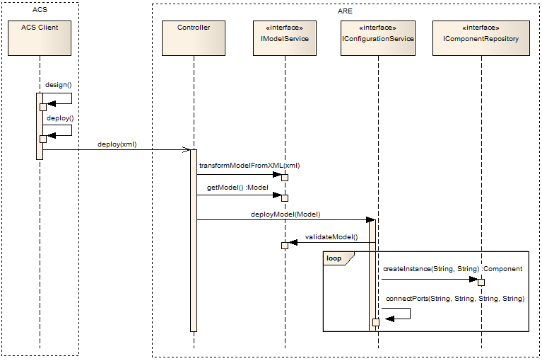
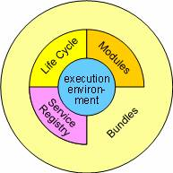
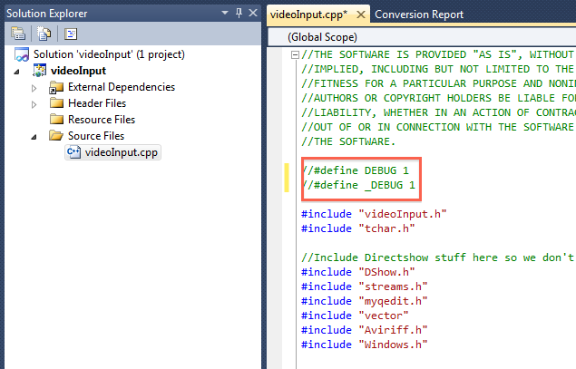

## Into the Deep: Concepts of the ARE middleware
    

The following section describes the ARE architecture for executing system models in more detail. A High-Level view of all system components looks as follows:


**Figure 1: High-level view of the system architecture (deployment model)**

## Runtime Model Concepts
    

The ARE hosts and controls the components that realize the Assistive Technology (AT) applications. As such, it features a component-based approach, where various specialized plug-ins (i.e., sensors, processors and actuators) are interfaced together to realize the desired behavior. The main runtime model concepts in the ARE are the _components (plugins)_, the _ports_, and the _channels_ (also known as _bindings_). These concepts are available for _introspection_ and _reflection_ in runtime (i.e., their properties can be both queried and edited).

It should be noted that these concepts describe merely _types_ of runtime artifacts. For instance, _component_ specifies a special component type that can be instantiated multiple times. In each instantiation, all attributes are static, except the _properties_ that can be edited in runtime. For example, a specialized signal processing _processor_ can be instantiated multiple times, with different property values, and can be connected to different components. While both component instances share the same type, they are individually used and maintained in the ARE.


**Figure 2: Simple view of the runtime model**

These artifacts and their relationships are illustrated in Figure 2. This figure illustrates the relationships between components, ports and bindings. A component consists of one or more ports. A binding, on the other hand connects exactly two components, via two corresponding ports. A more detailed description of the main runtime concepts and their relationships is provided in the following paragraphs.

## Components
    

The _components_ are the main artifacts in the ARE runtime model. As mentioned before, components can serve one of three main roles:

*   _Sensors_: these are components which only feature _output_ ports (i.e., they do not depend on input from any other components). Typical sensors are commonly coupled to underlying hardware sensors to generate their output data (e.g., a face tracking sensor which is coupled to a web-camera), but they can also be completely realized internally (e.g., a signal generator).
    
*   _Processors_: these are components which feature both _input_ and _output_ ports. This is the most common type of components, and provides the foundation for forming applications. The processor components can be either realized completely internally (e.g., an _average_ which keeps track of the last _n_ values of a scalar value and always outputs their average value) or they can be coupled to some external software library or even coupled to a hardware component (e.g., utilize legacy libraries for complex signal processing, or even utilize specialized hardware accelerators for highly demanding computations).
    
*   _Actuators_: these are components which only feature _input_ ports (i.e., they do not produce any output that can be utilized by other components). The main role of actuators is to enable the desired functionality of the applications, and for testing (e.g., a mobile phone actuator allows to place or answer phone calls and to send SMS[1](#sdfootnote1sym) messages, while an oscilloscope actuator allows for viewing, and thus testing or debugging, of signal generators).
    

  
  

### 

**Figure 3: Complex view of runtime model for the component concept**

These concepts are illustrated in Figure 3. A component can be any of three main realizations: _sensor_, _processor_, and _actuator_. On the other hand, a port can be instantiated either as an _input_ or an _output_ port. Sensors have one-or-more output ports only, actuators have one-or-more input ports only, and processors have both one-or-more input ports and one-or-more output ports.

## Ports
    

The ports are the main concepts allowing interfacing between components. Ports are classified as _input_ or _output_ ports, depending on their role. Each port features a buffer where data is accumulated before it is communicated outwards (output ports) or before it is internally consumed (input ports).

Furthermore, each port is associated with a specific data type, indicating the type of the data communicating through the port. Examples of such data types, carrying the representation and semantics as inherited from the Java language, are:

*   Byte: a single byte
    
*   Boolean: “true” or “false”
    
*   String: an array of bytes, representing ASCII characters
    
*   Integer: a 32-bit integer
    
*   Double: a 64-bit double precision scalar
    

The main properties and relationships of the _port_ concept are illustrated in Figure 4.


**Figure 4: Runtime model for the port concept**

The port concept features methods for accessing the _port type_, its _multiplicity_, its _data type_, and also for getting and setting property values. The main subtypes of _port_ are the _OutputPort_ and the _InputPort_.

It should be pointed out that the _input_ port is different from the _output_ port by featuring an additional method for checking whether a binding to the port is mandatory or not. This is needed to check whether a component is resolved or not (i.e., by checking whether all its input ports marked as “_mustBeConnected_” are indeed connected). This is important because it ensures that all the defined components are functional, i.e., appropriately connected, before they are activated.

Finally, it should be noted that special port types will also be defined for event communication. Unlike common ports which communicate a fixed data type, event ports will be able to communicate different events, encoded in a uniform way. Input event port types will be defined with the “mustBeConnected” property set to false by definition. Also, output event ports will allow the formation of multiple channels using the same output port as a common endpoint.

  
  

  
  

## Channels
    

The channel is the main concept used for interfacing components through ports. As such, the channels are defined via a source port in a source component and a target port in a target component. When formed, certain checks are performed to ensure that the data types of the source and the target ports are compatible.


**Figure 5: Runtime model for the binding concept**

A typical binding is illustrated in Figure 5. The binding is associated to two components, and an input and output port, one from each of them.

Typically, a source, i.e., output port might be associated to multiple targets, i.e., input ports. Nevertheless, in this runtime model it is assumed that each binding consists of exactly one source and one target port. One-to-many bindings are also implicitly supported via multiple instances of one-to-one bindings.

Special channels can also be formed between event ports. In this case, both input and output ports can be used to connect multiple channels. Event channels can be formed between EventTriggerer and EventListeners ports. EventTriggerers generate events and EventListeners register to an ARE service for listening to generated events. ARE is responsible for disseminating the generated events to the plugins that have been registered for listening to these events.

## Component Architecture of ARE
    

This subsection describes the internal architecture of the ARE component. Naturally, the main scope of this component is to maintain and realize the deployed model. As such, it features the following sub-components:

*   _Controller_: This component is responsible for coordinating the actions inside the ARE. To achieve this, it uses the other sub-components described below.
    
*   _ModelManager_: The model manager is used to maintain and manage the model (cf. section 8.1.1). As such, it provides methods for transforming the model from and to standard representations (such as XML), for validating its consistency, and for editing the properties of the modeled concepts (i.e., of the components, channels and ports). A special feature of the model manager is that it includes an input event port that allows it to be controlled by the Assistive Technology application for switching between various individual models.
    
*   _Configurator_: The configurator is the component which translates the model into actual components and channels. It is thus responsible for realizing the encoded models and also for coordinating the activation (i.e., _start_) and deactivation (i.e., _pause_ and _stop_) of the corresponding components. Before realizing certain models, the configurator utilizes the validation services of the model manager. Also, in order to access existing ones, or create new instances of components, the configurator uses the services available by the component repository. Finally, it also provides support for forming new channels (or dissolving existing ones) between certain ports.
    


**Figure 6: Internal architecture of the ARE**

*   _ComponentRepository_: The component repository serves two roles. First, it maintains a list with the available component types, which can be changed when new components are installed or existing ones uninstalled. Second, it maintains a repository with the current component instances. New instances can be dynamically created, and existing ones be dissolved.
    
*   _BundleManager_: This component allows for dynamically installing (or uninstalling) software bundles containing one or more components. This is needed to allow for easy updating of ARE instances with new (or updated) component implementations. For this purpose, the OSGi bundle mechanisms will be used. In essence, when a new bundle is installed (or uninstalled), it will be checked whether it contains AsTeRICS components. If it does, the components will be registered (or unregistered) with the component repository by reading appropriate metadata from the bundles.
    

The relationships between the sub-components are illustrated in Figure 6. Also, to illustrate the interaction between these components in use, consider the sequence diagram illustrated in Figure 7.



**Figure 7: Sequence diagram illustrating a typical interaction between ACS and ARE**

In this diagram, an ACS client is used to design an application model (i.e., graphically in an appropriate GUI), which is then deployed in he ARE. For this, the ASAPI protocol is used, which however is not illustrated here to avoid cluttering (for more information on the ASAPI see section 9).

On receiving the _deploy_ message, the Controller (which is the main component of the ARE) uses the model service to transform the model, which is encoded in XML, into its object representation. The resulting model is then _deployed_ using the configuration service. The latter first _validates_ the model, using the model service, and then performs a set of commands which aim at realizing the modeled application. These commands include the _instantiation_ of component instances, via the component repository, and the physical connection of the corresponding ports.

## ARE threading concept for model execution
    

The ARE uses a single threaded approach similar to the one of the Swing Event Dispatch Thread (EDT) in Java for all tasks related to model deployment and execution. This means that the following tasks are all executed within exactly one and the same thread instance:

*   Model lifecycle
    
    *   Model deployment
        
    *   Model start/pause/stop
        
    *   Model setting property
        
*   Model execution
    
    *   Data propagation: Sending data from an output (sendData) port to input ports (receiveData)
        
    *   Event notification: Forwarding events from an event triggerer (raiseEvent) to event listeners (receiveEvent)
        

Figure 8 illustrates a typical model and involved threads. The model is first deployed and started within the ModelExecutor thread.


**Figure 8: Illustration of threading concept for model lifecycle tasks and model execution.**

All methods related to model execution are also executed in the ModelExecutor thread. In case of sensor plugins (e.g. FacetrackerLK, Timer, SignalGenerator, ButtonGrid, …) other threads are involved that generate event or time based data. The FacetrackerLK plugin uses a FrameGrabber thread to grab and forward frames via a callback method. Similarly, the Timer and SignalGenerator plugins use a thread for periodically scheduling events. Finally the ButtonGrid gets informed about button clicks by the Java Swing Event Dispatch Thread (EDT). If a plugin wants to send data to an output port or trigger events to the event triggerer socket by using the respective methods (DefaultRuntimeOutputPort.sendData(…) and DefaultRuntimeEventTriggererPort.raiseEvent(…)) the execution is automatically handed over to the ModelExecutor thread.

The class **AstericsModelExecutionThreadPool** contains the code for the single threaded functionality and provides two types of public methods to be used by developers.

## Asynchronous method execute
    

**public void execute(Runnable r)**

Hands over the given Runnable and adds it to a bounded blocking queue (default size: 500). The Runnable tasks are executed asynchronously in the ModelExecutor thread and rejected if the queue is full. This is especially important if a sensor thread produces too many callbacks and hence Runnables to execute. If the ModelExecutor thread is too slow because of hardware limitations or because it is blocked by another execution, new incoming calls are simply rejected to avoid knocking out the ARE. **The method is meant to be used for data and event notification tasks.**

## Synchronous method execAndWaitOnModelExecutorLifecycleThread
    

**public void execAndWaitOnModelExecutorLifecycleThread(Runnable r) throws InterruptedException, ExecutionException, TimeoutException**

**or**

**public <V> V execAndWaitOnModelExecutorLifecycleThread(Callable<V> c) throws Exception**

Performs a synchronous execution of the given Runnable/Callable in the ModelExecutor thread. If the execution blocks longer than the configured timeout interval (default 20000ms, see 2.5.6) a TimeoutException is thrown. **The method is meant to be used for lifecycle tasks and used by the ARE GUI, the ASAPIServer the RESTServer and other ARE components.**

## Pro and Contra of the single threaded approach
    

Using a single thread brings many advantages like

*   Easier plugin development (no need to consider data integrity and thread synchronization)
    
*   More reliable hardware access (Some libraries require a single threaded access)
    
*   Deterministic (sequential) execution of model data propagation and event notification
    

On the other hand a hanging I/O call, a long lasting method call or a thread deadlock block the whole model execution or lifecycle task. In such a case it wouldn’t even be possible to stop a model. This problem is accomplished by a fallback strategy which is to automatically switch to a new ModelExecutor thread in case of a timeout or a rejected task.

## ASAPI Clients and Serialisation
    

The AsTeRICS Application Programming Interface (ASAPI) is an interface to enable advanced communications between the AsTeRICS Runtime Environment (ARE) and external clients. In principle, ASAPI is a _service_ that is provided by the ARE and can be consumed by different clients deployed on the same (as the ARE) or remote devices.

While the ARE is implemented on top of JAVA/OSGi, ASAPI clients are assumed to be implemented on top of a variety of platforms. For this purpose, the actual interfacing between clients and the ARE is done at a low TCP/UDP/IP level. For this purpose, either a custom TCP/UDP/IP protocol will be developed, or an existing solution such as Google Protocol Buffers, XML RPC, or Apache Thrift could be used.


**Figure 9: Basic architecture of ASAPI**

The basic architecture of ASAPI is illustrated in Figure 9. The “ASAPI Server” is provided by a JAVA based implementation, which utilizes the ARE to provide the specified functionality. On the client side, two interfaces provide the needed functionality: The “ASAPI Client” which extends the “ASAPI Server” with commands for discovering and connecting/disconnecting to the server side, and the “ASAPI Native” which provides specialized functionality for deploying certain components directly in the client, bypassing the ARE. These relationships are illustrated in the above figure.

  
  

The functionality of a full ASAPI Client is defined in deliverable 2.1 – System Specification and Architecture \[1\], section 4.4.

  
  

## ASAPI and ARE Interconnection
    

The following figure shows the ASAPI protocol connection to the ARE and the ASAPI native interface which provides certain functions for PC AT developers aside the ARE ( e.g. mobile phone access or special PC peripherals which will be investigated during WP6). The native interface can provide well defined functions (as sending an SMS) which do not imply signal processing plugins of the ARE, and can thus be accomplished directly on the PC.

As soon as the AsTeRICS Runtime Environment and the embedded platform are involved, the ASAPI command and data protocol can be used to interact with the ARE.

The ASAPI protocol is a platform independent specification per se. To implement an ASAPI client, templates in JAVA (server side) and C# (client side) will be provided as an early outcome of WP4.

  
**Figure** **10****: ASAPI client implementations with/without native functions**

The following diagrams show two possible scenarios for ASAPI / ARE interconnection (1), one for the configuration of the ARE and one for the operation thereof (2).

Usually, these scenarios will involve primary and secondary users of the AsTeRICS system:

*   AT developers use the Configuration Suite to set up the model for the desired AT-configuration, tailored to a specific use case or end user (1),
    
*   End users start the system (power up the embedded platform or start the ARE on PC or netbook) to get their desired AT-configuration (which operated stand alone or in connection with 3rd\-party applications on a PC or netbook (2).
    

## ASAPI and ARE in the configuration process
    

_**Setting up a model  
**_  
  

 **Figure** **11****: AsTeRICS configuration scenario, model setup**

  
  

Figure 11 shows the configuration process of the AsTeRICS Runtime Environment by the AsTeRICS Configuration Suite via ASAPI. The ASAPI client of the ACS connects to the ARE’s ASAPI server. It queries the available plugins and their parameters. (In the above figure, some exemplary plugins are shown for demonstration purpose).

The ACS offers dynamic graphic configuration dialogs to the user, which allows adjustment of all the plugin parameters. Plugins can be graphically connected. This process does not need any functional representation of the plugins, only a description of the plugins’ ports, data types and parameters. All these setup actions are performed via ASAPI control commands. The finalized model can be deployed to the ARE.

_**Monitoring, verifying and adjusting a model:**_

  
  

  
  
  

**Figure** **12****: AsTeRICS configuration scenario, verification and error checking**

  
  

To verify the setup process, a data connection to desired plugins can be opened in the Configuration Suite. Thus, live sensor values and their transformation due to the applied signal processing plugins can be monitored using feedback elements of the ACS like oscilloscope or bar graphs. Parameters of the plugins can be modified using ASAPI control commands until the desired behaviour of the ARE is present.

Additionally to the live data transmission for feedback purpose, status and error information can be queried from the ARE to determine the state of particular plugins.

_**ASAPI and ARE in the runtime system:**_

  
  


  
  

**Figure 13: AsTeRICS runtime scenario**

A fully configured ARE can run as a stand-alone process providing its functionality or communicate with PC AT-software. A connection between ARE and ACS is no longer required at that time.

The above runtime scenario consists of a configured ARE, with connected plugins that interface the external sensors (Enobio, SVM) and actuators (pneumatic gripper, IR gateway).

Third party applications running on the PC can optionally:

*   query or send data by using ASAPI data commands
    
*   use the ASAPI native interface to access supported PC peripherals like mobile phone, 3D mouse
    
*   use ASAPI to connect to the running ARE and send control commands to modify model or plugin settings
    

If the Universal HID actuator USB dongle is used, the PC application can obtain data from the embedded platform via a mouse, joystick or keyboard hook which is provided via the ASAPI native interface (thereby omitting a dedicated TCP/IP connection to the ARE via the ASAPI client).

## Available ASAPI commands
    

  

Method

Description

_**Methods to setup and deploy a model**_

  

String \[\] getAvailableComponentTypes();

  

Returns an array containing all the available (i.e., installed) component types. These are encoded as strings, representing the absolute class name (in Java) of the corresponding implementation.

String getModel();

  

Returns a string encoding the currently deployed model in XML. If there is no model deployed, then an empty one is returned.

String getModelFromFile ();

  

Returns a string encoding of the model defined in the filename passed as argument. If there is no model, an empty string is returned.

void deployModel(String modelInXML) throws AsapiException;

  

Deploys the model encoded in the specified string into the ARE. An exception is thrown if the specified string is either not well-defined XML, or not well defined ASAPI model encoding, or if a validation error occurred after reading the model.

void deployFile(String filename) throws AsapiException;

  

Deploys the model associated to the specified filename. An exception is thrown if the specified filename is not found.

public void newModel() throws AREAsapiException

Deploys a new empty model into the ARE. In essence, this is equivalent to creating an empty model and deploying it. This results to freeing all resources in the ARE (i.e., if a previous model reserved any).

void newModel();

  

Deploys a new empty model into the ARE. In essence, this is equivalent to creating an empty model and deploying it using deployModel(String) above. This results in freeing all resources in the ARE (i.e., if a previous model reserved any).

void runModel() throws [AsapiException](../AppData/Local/AppData/Local/AppData/Local/AppData/Nearchos%20Paspallis/Desktop/AsTeRICS%20@GOOGLE_CODE/trunk/exportToHTML/org/asterics/middleware/asapi/AsapiException.java.html);

  

It starts or resumes the execution of the model. It throws [AsapiException](../AppData/Local/AppData/Local/AppData/Local/AppData/Nearchos%20Paspallis/Desktop/AsTeRICS%20@GOOGLE_CODE/trunk/exportToHTML/org/asterics/middleware/asapi/AsapiException.java.html) if an error occurs while validating and starting the deployed model.

public void pauseModel() throws [AsapiException](../AppData/Local/AppData/Local/AppData/Local/AppData/Nearchos%20Paspallis/Desktop/AsTeRICS%20@GOOGLE_CODE/trunk/exportToHTML/org/asterics/middleware/asapi/AsapiException.java.html);

  

Briefly stops the execution of the model. Its main difference from the stopModel() method is that it does not reset the components (e.g., the buffers are not cleared). It throws an [AsapiException](../AppData/Local/AppData/Local/AppData/Local/AppData/Nearchos%20Paspallis/Desktop/AsTeRICS%20@GOOGLE_CODE/trunk/exportToHTML/org/asterics/middleware/asapi/AsapiException.java.html) if the deployed model is not started already, or if the execution cannot be paused.

public void stopModel() throws [AsapiException](../AppData/Local/AppData/Local/AppData/Local/AppData/Nearchos%20Paspallis/Desktop/AsTeRICS%20@GOOGLE_CODE/trunk/exportToHTML/org/asterics/middleware/asapi/AsapiException.java.html);

  

Stops the execution of the model. Unlike the pauseModel method, this one resets the components, which means that when the model is started again it starts from scratch (i.e., with a new state). It throws [AsapiException](../AppData/Local/AppData/Local/AppData/Local/AppData/Nearchos%20Paspallis/Desktop/AsTeRICS%20@GOOGLE_CODE/trunk/exportToHTML/org/asterics/middleware/asapi/AsapiException.java.html) if the deployed model is not started already, or if the execution cannot be stopped.

public void storeModel(String modelInXML, String filename)

throws AREAsapiException

Stores the XML model specified by the string parameter in the file specified by the filename parameter . Throws an AREAsapiException if the file cannot be created or if the model cannot be stored.

public String\[\] listAllStoredModels() throws AREAsapiException

Returns a list with all stored models. Throws AREAsapiException if the models directory could not be found.

public boolean deleteModelFile (String filename) throws AREAsapiException

Deletes the file of the model specified by the filename parameter. Throws AREAsapiException if the file could not be found or could not be deleted.

public void autostart()

It is called on startup by the middleware in order to autostart

a default model without the need of pressing deploy and start model first.

_**Methods to read and edit the model**_

  
```java
String [] getComponents();
```
  

Returns an array that includes all existing component instances in the model (even multiple instances of the same component type).

String \[\] getChannels(String componentID);

  

Returns an array containing the IDs of all the channels that include the specified component instance either as a source or target.

void insertComponent(String componentID, String componentType)

throws [AsapiException](../AppData/Local/AppData/Local/AppData/Local/AppData/Nearchos%20Paspallis/Desktop/AsTeRICS%20@GOOGLE_CODE/trunk/exportToHTML/org/asterics/middleware/asapi/AsapiException.java.html);

  

Used to create a new instance of the specified component type, with the assigned ID. Throws an exception if the specified component type is not available, or if the specified ID is already defined.

void removeComponent(String componentID) throws [AsapiException](../AppData/Local/AppData/Local/AppData/Local/AppData/Nearchos%20Paspallis/Desktop/AsTeRICS%20@GOOGLE_CODE/trunk/exportToHTML/org/asterics/middleware/asapi/AsapiException.java.html);

Used to delete the instance of the component that is specified by the given ID. Throws an exception if the specified component ID is not defined.

public String \[\] getAllPorts(String componentID) throws [AsapiException](../AppData/Local/AppData/Local/AppData/Local/AppData/Nearchos%20Paspallis/Desktop/AsTeRICS%20@GOOGLE_CODE/trunk/exportToHTML/org/asterics/middleware/asapi/AsapiException.java.html);

  

Returns an array containing the IDs of all the ports (i.e., includes both input and output ones) of the specified component instance. An exception is thrown if the specified component instance is not defined.

public String \[\] getInputPorts(String componentID) throws [AsapiException](../AppData/Local/AppData/Local/AppData/Local/AppData/Nearchos%20Paspallis/Desktop/AsTeRICS%20@GOOGLE_CODE/trunk/exportToHTML/org/asterics/middleware/asapi/AsapiException.java.html);

Returns an array containing the IDs of all the input ports of the specified component instance. An exception is thrown if the specified component instance is not defined.

String \[\] getOutputPorts(String componentID) throws [AsapiException](../AppData/Local/AppData/Local/AppData/Local/AppData/Nearchos%20Paspallis/Desktop/AsTeRICS%20@GOOGLE_CODE/trunk/exportToHTML/org/asterics/middleware/asapi/AsapiException.java.html);

  

Returns an array containing the IDs of all the output ports of the specified component instance. An exception is thrown if the specified component instance is not defined.

void insertChannel(String channelID, String sourceComponentID,String sourcePortID, String targetComponentID,

String targetPortID)throws [AsapiException](../AppData/Local/AppData/Local/AppData/Local/AppData/Nearchos%20Paspallis/Desktop/AsTeRICS%20@GOOGLE_CODE/trunk/exportToHTML/org/asterics/middleware/asapi/AsapiException.java.html);

  

Creates a channel between the specified source and target components and ports. Throws an exception if the specified ID is already defined, or the specified component or port IDs is not found, or if the data types of the ports do not match. Also, an exception is thrown if there is already a channel connected to the specified input port (only one channel is allowed per input port except for event ports that can have multiple event sources).

void removeChannel (String channelID) throws [AsapiException](../AppData/Local/AppData/Local/AppData/Local/AppData/Nearchos%20Paspallis/Desktop/AsTeRICS%20@GOOGLE_CODE/trunk/exportToHTML/org/asterics/middleware/asapi/AsapiException.java.html);

  

Removes an existing channel between the specified source and target components and ports. Throws an exception if the specified channel is not found.

  

**Methods to read and edit properties (even while running)**

  

  

String \[\] getComponentPropertyKeys(String componentID);

Reads the IDs of all properties set for the specified component.

String getComponentProperty (String componentID, String key);

Returns the value of the property with the specified key in the component with the specified ID as a string.

String setComponentProperty (String componentID, String key, String value);

  

Sets the property with the specified key in the component with the specified ID with the given string representation of the value.

String \[\] getPortPropertyKeys(String portID);

Reads the IDs of all properties set for the specified port.

String getPortProperty(String componentID, String portID, String key);

  

Returns the value of the property with the specified key in the component with the specified ID as a string.

String setPortProperty(String componentID, String portID, String key, String value);

Sets the property with the specified key in the port with the specified ID with the given string representation of the value.

String \[\] getChannelPropertyKeys(String channelID);

  

  

Reads the IDs of all properties set for the specified component. Reads the IDs of all properties set for the specified channel.

String getChannelProperty(String channelID, String key);

Returns the value of the property with the specified key in the channel with the specified ID as a string.

String setChannelProperty(

String channelID, String key, String value);

  

Sets the property with the specified key in the channel with the specified ID with the given string representation of the value.

**Methods for status checking**

  

String queryStatus();

  

Queries the status of the ARE system (i.e., OK, FAIL, etc).

public String getLogFile()

Serializes and returns as a string the Log file.

**Table 1: ASAPI server interface**

  
  

  

**Method**

**Description**

**Methods to discover and connect/disconnect to AREs**

InetAddress \[\] searchForAREs();

  

Searches in the local area network (LAN) for available instances of the ARE. The exact protocol for discovery can vary (e.g., it could be based on UPnP, SLP, or a custom protocol).

[ASAPI\_Server](../AppData/Local/AppData/Local/AppData/Local/AppData/Nearchos%20Paspallis/Desktop/AsTeRICS%20@GOOGLE_CODE/trunk/exportToHTML/org/asterics/middleware/asapi/ASAPI_Server.java.html) connect(InetAddress ipAddress);

  

  

Connects to the ARE at the specified IP address. The method returns an instance of the ASAPI Server interface (described above), masking the functionality provided by the target ARE through ASAPI.

void disconnect([ASAPI\_Server](../AppData/Local/AppData/Local/AppData/Local/AppData/Nearchos%20Paspallis/Desktop/AsTeRICS%20@GOOGLE_CODE/trunk/exportToHTML/org/asterics/middleware/asapi/ASAPI_Server.java.html) asapi\_server);

  

Disconnects from the specified instance of the ASAPI Server, invalidating the reference.

**Table 2: ASAPI client interface**

  
  

## Serialisation
    

The serialisation of the data including the calling mechanism is done by Apache Thrift \[14\]. For the reference implementations (ASAPI server for ARE in Java and ASAPI client for ACS in C-Sharp), the version 0.8.0 has been used. The following tutorial shows the way from the interface definition to a working Java client.

## The Thrift definition file
    

In the thrift definition file, all functions which should be serializable have to be defined. The “ASAPI.thrift” file is used by the Thrift compiler to generate the server and client functions

  
  

  
  

## The Thrift Compiler
    

The source code of the Thrift compiler is part of the Thrift bundle, being available at \[14\]. For persons, who like the usage of precompiled programs, a Windows version of the Thrift 0.8.0 compiler is available at [https://dist.apache.org/repos/dist/release/thrift/0.8.0/thrift-0.8.0.exe](https://dist.apache.org/repos/dist/release/thrift/0.8.0/thrift-0.8.0.exe)

The compiler supports several target languages, the most commons are C++, C#, Java and php. The usage is command line based and quite simple. To get the needed Java files, the following command has to be used:

thrift --gen java asapi.thrift

This command generates the folder gen-java containing the files AsapiServer.java and AsapiException.java. For a more detailed description of the Thrift compiler, please see the compiler manual.

## The Thrift Library
    

For the usage of the generated files, a library file must also be generated. The source code of the libraries is also available in the thrift-bundle from \[http://incubator.apache.org/thrift/\]. For all languages, being supported by the compiler, are libraries available. In the source code folders of the libraries is also a language specific instruction – please follow the instruction to generate the library file. In the case of Java, after successfully following the instructions, the file libthrift.jar will be generated.

In the case of Java, the Thrift library needs additional logging libraries. The usage of the Simple Logging Facade for Java (SLF4J) framework \[15\] is recommended. The Thrift 0.8.0 library was successfully tested with version 1.6.0 of SLF4J

## Simple Java Client
    

All preconditions are now fulfilled, the Java client can be created now. Beside the two generated files AsapiServer.java and AsapiException.java, a main file is needed. The key lines concerning the Thrift usage are:

**try** {

TTransport transport = **new** TSocket(10.0.0.1, 9090);

TProtocol protocol = **new** TBinaryProtocol(transport);

AsapiServer.Client client = **new** Calculator.Client(protocol);

transport.open();

  

client.NewModel(); // Example function call

} **catch** (TException x) {

x.printStackTrace();

}

Important: the files libthrift.jar, slf4j-api-1.6.0.jar and slf4j-simple-1.6.0.jar must be included in the build path.

  
  

## ASAPI RESTful API
    

Since version 2.8 a RESTful API is available and can be used instead of the Apache thrift based version. Two implementations exist – a Java client implementation and a Javascript client implementation.

The API is documented in [Documentation/REST\_API.pdf](https://github.com/asterics/AsTeRICS/blob/master/Documentation/REST_API.pdf).

The REST API can only be used if the ARE was started with the –webservice flag (See Error: Reference source not found).

## AsTeRICS Packaging Environment (APE)
    

The APE let's you select a set of AsTeRICS model files and create a downstripped (minimum size) version of the ARE including plugins, configuration files and data files to execute the models. Optionally, the APE allows the creation of native installers for Windows, Linux and Mac OSX using [JavaFX packaging technology](http://docs.oracle.com/javase/8/docs/technotes/guides/deploy/self-contained-packaging.html#BCGIBBCI).

APE consists of two major elements:

*   **APE-copy**: a commandine tool to create a downstripped version of the ARE based on provided model files
    
*   **Build infrastructure for native installers**: a template project directory including an ant build file and a property file (APE.properties) to easily configure the installer creation with JavaFX.
    

Please refer to the [APE documentation](https://github.com/asterics/AsTeRICS/tree/master/bin/APE) and [wiki pages](https://github.com/asterics/AsTeRICS/wiki/AsTeRICS-Packaging-Environment-(APE)) for more details and usage examples.

## Native ASAPI Libraries
    

Native ASAPI is a software development kit for 3rd party developers to help them adapt their application for people with motor disabilities. Native ASAPI will be delivered as a set of DLL libraries for the Microsoft Windows Operating system. Native ASAPI works independently of ARE.

## Phone Library
    

The Phone Library is designed to control mobile phones. The library uses Bluetooth connection to connect to the Phone Library Server Application running on the mobile phone. Currently the Phone Library uses the Microsoft Bluetooth stack; other stacks will be considered. The Library is delivered as a PhoneLibrary.dll file.

Currently the Phone Library Server Application for Windows Mobile operating system has been developed. The Server application works on the phones running Windows Mobile 5.0 and above.

To install Server application (ServerInstall.cab file):

*   On Windows XP install the ActiveSync application.
    
*   Connect the phone to PC using USB cable. On Windows 7, if you connect the Windows Mobile phone for the first time, the Microsoft Windows Mobile Device Center application will be installed automatically.
    
*   Using ActiveSync or Windows Mobile Device Center copy the Server installer to the phone.
    
*   Run the Server installer. The server application will be installed.
    

## Phone Library interface:
    

The library interface is declared in the PhoneLibrary.h file.

Phone library interface functions are declared with the “C” linkage. The Phone Library functions return a positive value if it succeeds. If a function fails, it returns a value lower than 0 and the returned value is the code of the error.

Library functions:

  

**Function**

**Description**

int init(DeviceFound deviceFound, NewSMS newSMS, PhoneStateChanged phoneStateChanged, LPVOID param)

Initializes the Phome Library. The deviceFound, newSMS and phoneStateChanged parameters are pointers to the call-back functions implemented in the Phone Library user application. The param parameter is a parameter defined by the user and passed to the call-back functions.

int close()

Closes the library.

int searchDevices()

Starts searching for devices. For each discovered device the DeviceFound call-back function is called

int connectToDevice(unsigned \_int64 deviceAddress, int port)

Connects to the device defined by the deviceAddress parameter.

int disconnect()

Disconnects the device.

int makePhoneCall (LPWSTR recipientID)

Makes a phone call. The recipientID parameter is the recipient phone ID.

int acceptCall()

Accepts incoming phone calls.

int dropCall()

This function drops an incoming phone call or disconnects phone calls.

int getPhoneState(PhoneState &phoneState)

Gets actual phone state of the mobile phone.

int sendSMS(LPWSTR recipientID, LPWSTR subject)

Sends SMSs. The recipientID parameter is the recipient phone ID, the subject parameter is the message content.

**Table 3: Phone library functions**

Library call-back functions definitions:

  

**Function**

**Description**

typedef void (\_\_stdcall \*DeviceFound) (unsigned \_int64 deviceAddress, LPWSTR deviceName, LPVOID param)

This function is called when a new device is found. The deviceAddress parameter is the address of the discovered device. The deviceName parameter is the name of the device. If the returned deviceAddress parameter is equal to 0, the device search process finishes.

typedef void (\_\_stdcall \*NewSMS) (LPWSTR PhoneID, LPWSTR subject, LPVOID param)

This function is called when there is a new SMS available. The PhoneID parameter is the sender phone ID. The subject parameter is the SMS content.

typedef void (\_\_stdcall \*PhoneStateChanged) (PhoneState phoneState, LPWSTR phoneID , LPVOID param)

This function is called when the phone state is changed. The phoneState parameter defines current state of the phone. The phoneID is the remote phone ID.

**Table 4: Phone library call-back functions**

Error codes returned by functions: (declared in the PhoneLibraryErrors.h file):

  

**Code**

**Description**

\-1

Default error.

\-2

Library is not initialized.

\-3

Library is initialized.

\-4

Library initialization error.

\-5

No respond from remote device.

\-20

Library is searching for the devices now.

\-21

Device is not found.

\-31

Device is connected.

\-32

Error during connecting to the device.

\-33

Device is not connected.

\-34

Default port error.

\-50

Phone ID or SMS content is empty

\-1001

Remote device default error.

\-1011

Bluetooth initialization error on the remote device.

\-1015

Packet error.

\-1031

Messenger module initialization error on the remote device.

\-1032

Messenger module is not initialized on the remote device.

\-1033

Message send error on the remote device.

\-1051

Phone module initialization error on the remote device.

\-1052

Phone module is not initialized on the remote device.

\-1053

Phone accept the call error on the remote device.

\-1054

Phone drop the call error on the remote device.

\-1055

Phone make the call error on the remote device.

\-1072

Messenger module and Phone module is not initialized on the remote device.

**Table 5: Phone library error codes**

  
  

Other Phone Library interface data:

  

**Data**

**Description**

enum PhoneState

{

PS\_IDLE=1,

PS\_RING,

PS\_CONNECTED

};

Indicates current phone state.

#define Default\_port -1

Indicates the default port number, which can be used in the connectToDevice method.

**Table 6: Other Phone library interface data**

## Example of use
    

Call-back functions definitions:

  

void \_\_stdcall newSMS (LPWSTR PhoneID, LPWSTR subject, LPVOID param)

{

//get incoming SMS:

getSMS(PhoneID, subject);

}

  

void \_\_stdcall phoneStateChanged (PhoneState phoneState, LPWSTR phoneID , LPVOID param)

{

//auto answer on incoming phone call:

if(phoneState==PS\_RING)

{

acceptCall();

}

}

  
  

Initialization of the library and connect to the phone:

int InitLib (unsigned \_int64 deviceAddress)

{

int result;

result = init(deviceFound, newSMS, phoneStateChanged, NULL);

if(result < 0)

{

return 0;

}

result=connectToDevice(deviceAddress,-1);

if(result<0)

{

return 0;

}

}

  

  
  

  
  

Send SMS:

int SendSMS(LPWSTR recipientID, LPWSTR subject)

{

return sendSMS(recipientID, subject);

}

  

  
  

Make phone call:

int MakePhoneCall(LPWSTR recipientID)

{

return makePhoneCall(recipientID);

}

  
  

Disconnect the phone and close the library:

int CloseLib()

{

disconnect();

return close();

}

  
  

## GSM Modem Library
    

The GSM Model Library interfaces the GSM modem devices connected to the platform. It can be used to send and receive SMS.

## GSM Modem Library interface:
    

The library interface is declared in the GSMModemLibrary.h file:

Library functions:

  

**Function**

**Description**

int init(LPWSTR com, NewSMSAvailable newSMSAvailable,ErrorCallback errorCallback, LPWSTR pin, LPWSTR smsCenterNumber ,LPVOID param)

Initializes the library. The com parameter defines the modem serial port. The newSMSAvailable and errorCallback parameters are pointers to the call-back functions implemented in the user application. The pin parameter is the PIN code. If the PIN code is not required, this parameter should be empty. The smsCenterNumber parameter contains the user SMS center number. If the number of SMS center is not required this parameter should be empty.The param parameter is a parameter defined by the user and passed to the call-back functions.

int close()

Closes the library.

int sendSMS(LPWSTR recipientID, LPWSTR subject)

Sends SMSs. The recipientID parameter is the recipient phone ID, the subject parameter is the message content.

Int getModemPortNumber(ModemSearchResult modemSearchResult,LPVOID param)

Starts to search modems. For each modem found, the modemSearchResult call-back function is called. The param parameter is passed to the modemSearchResult call-back function.

**Table 7: GSM Modem library functions**

  
  

GSM Mode Library functions are declared with the “C” linkage. A function returns a positive value if it succeeds. If the function fails, it returns a value lower than 0 and the returned value is the code of the error.

Library call-back functions definitions:

  

**Function**

**Description**

typedef void (\_\_stdcall \*NewSMSAvailable) (LPCWSTR phoneID, LPCWSTR subject, LPVOID param)

This function is called when there is a new SMS available. The PhoneID parameter is the sender phone ID. The subject parameter is the SMS content. The param parameter it is parameter defined by user.

typedef void (\_\_stdcall \*ErrorCallback) (int result, LPVOID param)

This function is called when en error is found. The result parameter is the error code. The param parameter it is parameter defined by user.

typedef void (\_\_stdcall \*ModemSearchResult) (LPCWSTR port,LPCWSTR modemName, LPVOID param)

This function is called when the modem is found. The port parameter contains the modem port. The modemName parameter contains the modem name. The param parameter it is parameter defined by user.

**Table 8: GSM Modem library call-back functions**

  
  

Error codes returned by functions: (The error codes are declared in the Errors.h file)

  

**Code**

**Description**

\-1

Default error.

\-2

Library is not initialized.

\-3

Library is initialized.

\-4

Library initialization error.

\-5

Library is during initialization

\-10

COMM initialize false

\-11

No respond on the AT command

\-12

Cannot register to the GSM network

\-13

Modem initialize false

\-14

Write to the modem port error

\-15

Read from the mode port error

\-16

Not enough space in a buffer

\-17

No modem answer

\-19

The AT command failed

\-20

SMS read error

\-21

SMS send error

\-22

Phone ID is empty

\-23

Message content is empty

\-24

Error respond from the modem

\-25

Undefined modem answer

\-26

The string is not a number

\-100

SMS was not sent

2

Library is initialized correctly

**Table 9: GSM Modem library errors**

  
  

  
  

  
  

  
  

## Example of use
    

Call-back functions definitions:

  
  

void \_\_stdcall modemSearchResult (LPCWSTR port,LPCWSTR modemName, LPVOID param){

if((wcslen(port)>0)&&( wcslen(modemName)>0))

{

//get the port for the connection with modem

getPort(port);

}

}

void \_\_stdcall newSMS (LPWSTR PhoneID, LPWSTR subject, LPVOID param)

{

//get incoming SMS:

getSMS(PhoneID, subject);

}

void \_\_stdcall errorCallback (int result, LPVOID param)

{

If(result==2)

{

LibraryIsInitialized=true;

}

}

  

  
  

Find the modem, Initialize the library and send SMS:

int InitLib ()

{

int result=0;

result=getModemPortNumber(modemSearchResult,NULL);

//wait for call-back function:

...

result= init(serialPort, newSMS, errorCallback,””,””,NULL);

//wait for initialize of the library

...

Result= sendSMS(phoneNumber,”Test SMS”);

}

  

  
  

## 3D-Mouse Library
    

The 3D Mouse Library is designed to help in adapting 3Dconnexion 3D Mouse devices for people with motor disabilities. It works with the 3D Mice connected to PC via USB such as: SpacePilot Pro, SpaceExplorer and SpaceNavigator.

## 3D-Mouse Library interface
    

The library interface is declared in the Mouse3DLibrary.h file.

Library functions:

  

**Function**

**Description**

int init ()

Initializes the 3D Mouse Library

int close ()

Closes the Library

int get3DMouseState(long \*x, long \*y, long \*z, long \*Rx, long \*Ry, long \*Rz, long\* buttons)

Gets the actual state of the 3D mouse. Parameters are axis, axis rotation and button state.

**Table 10: 3D Mouse Library functions**

  
  

3D Mouse library interface functions are declared with the “C” linkage. The 3D Mouse Library function returns a positive value if it succeeds. If the function fails, it returns a value lower than 0 and the returned value is the code of the error.

Error codes returned by functions:

The error codes are declared in the Mouse3DLibraryErrors.h file.

  

**Number**

**Description**

\-1

Default error.

\-2

Library is not initialized.

\-3

Library is initialized.

\-4

Library initialization error

\-5

The 3D Mouse device not found.

\-6

Data acquire error.

**Table 11: 3D Mouse Library errors**

  
  

## Example of use
    

Getting 3D Mouse state:

int getState(long \*x, long \*y, long \*z, long \*Rx, long \*Ry, long \*Rz, long\* buttons)

{

int nResult = init()

if(nResult<0)

{

return nResult;

}

result = get3DMouseState(x, y, z, Rx, Ry, Rz, buttons);

if(nResult<0)

{

return nResult;

}

result =close();

if(nResult<0)

{

return nResult;

}

return 1;

}

  

  
  

## Keyboard Library
    

The Keyboard Library is designed for developers who need to adapt the computer keyboard for the specialized needs of motor disabled people. For example if the application has to use standard keyboard input for the scanning and send the keys in different way. Developers using this library will be able to get information about all system key events and send key events to other applications. The library uses Low Level Keyboard Hook.

## Keyboard Library interface
    

Library functions:

The library interface is declared in the KeyboardLibrary.h file.

  

**Function**

**Description**

KEYBOARDLIBRARY\_API int \_\_stdcall init(HookCallBack hookCallBack, LPVOID param)

Initializes the library. The hookCallBack parameter is a pointer to the call-back function. The param parameter is a parameter defined by user.

KEYBOARDLIBRARY\_API int \_\_stdcall close()

Closes the library.

KEYBOARDLIBRARY\_API int \_\_stdcall startHook()

Starts key events hooking

KEYBOARDLIBRARY\_API int \_\_stdcall stopHook()

Stops key events hooking.

KEYBOARDLIBRARY\_API int \_\_stdcall sendKeyByScanCode(int scanCode, SendKeyFlags flags)

Simulates a key event using a key scan code.

KEYBOARDLIBRARY\_API int \_\_stdcall sendKeyByVirtualCode(int virtualCode, SendKeyFlags flags)

Simulates a key event using a virtual key code.

KEYBOARDLIBRARY\_API int \_\_stdcall sendText(LPWSTR text)

Simulates text being typed in, defined by the text parameter.

KEYBOARDLIBRARY\_API int \_\_stdcall blockKeys(BlockOptions blockOptions)

Blocks or Passes key events. The blockOptions parameter defines the function's behaviour.

**Table 12: Keyboard Library functions**

  
  

Keyboard library interface functions are declared with the “C” linkage. The Keyboard Library function returns a positive value if it succeeds. If the function fails, it returns a value lower than 0 and the returned value is the code of the error.

  
  

Call-back function:

  

**Function**

**Description**

typedef int (\_\_stdcall \*HookCallBack) (int scanCode, int virtualCode,HookMessage message, HookFlags flags, LPVOID param);

This function is called if there is a new key event. The scanCode parameter defines the scan code of the key, the virtualCode parameter defines the virtual key code, the message defines message type, the flags parameter defines additional information about the key event, the param parameter is a parameter passed by the user. If the returned vaule is lest than 0, the library will block the event, if the returned value is greather than 0 the library will pass the event. If the returned value is 0 the library will block or pass the event according to the BlockKeys function.

**Table 13: Keyboard Library call-back functions**

  
  

Error codes returned by functions:

The error codes are declared in the KeyboardLibraryErrors.h file.

  

**Number**

**Description**

\-1

Default error.

\-2

Library is not initialized.

\-3

Library is initialized.

\-4

Library initialization error.

\-5

Hook in not initialized.

\-6

Hook is initialized.

\-7

Hook initialization error.

\-8

Hook stopping error.

\-9

Error during key send.

**Table 14: Keyboard Library errors**

Others:

  

**Data**

**Description**

enum HookFlags

{

HF\_None=0,

HF\_ExtendedKey=1,

HF\_InjectedKey=2,

HF\_AltKeyPressed=4,

HF\_KeyPress=8,

HF\_SentFromLibrary =0x10

};

Flags which defines additional information about the event: HF\_ExtendedKey - the extended key is sent, HF\_InjectedKey - the key event is sent by application not by the keyboard, HF\_AltKeyPressed - the Alt key is pressed, HF\_KeyPress – the key is pressed down, HF\_SentFromLibrary – the key is sent from the library.

enum HookMessage

{

HM\_None=0,

HM\_KEYDOWN=1,

HM\_KEYUP,

HM\_SYSKEYDOWN,

HM\_SYSKEYUP

};

Defines message type: key event down, key event up, system key event up or system key event up

enum SendKeyFlags

{

SKF\_KeyDown=1,

SKF\_KeyUP=2,

SKF\_KeyPress=3,

SKF\_KeyExtended=4,

};

Used in the SendKeyByScanCode and SendKeyByVirtualCode functions. These flags defines the event type: key event up, key event down, extended key sent. The SKF\_KeyPress flag is defindes as SKF\_KeyPress=SKF\_KeyDown|SKF\_KeyUP.

enum BlockOptions

{

BO\_BlockAll=1,

BO\_PassSentFromLibrary=2,

BO\_PassAll=3

};

Used in the BlockKeys function. It defines the function's behaviour. It can take the following values: BO\_PassAll, BO\_PassSentFromLibrary, BO\_BlockAll. If it takes the BO\_PassSentFromLibrary value, the function passes keyboard events generated by SendKeyByScanCode, SendKeyByVirtualCode and SendText functions and blocks all other keyboard events.

**Table 15: Other Keyboard Library interface data**

  
  

## Example of use
    

The call-back function will block or pass the event according to the blockKeys function:

int \_\_stdcall hookCallBack (int scanCode, int virtualCode,HookMessage message, HookFlags flags, LPVOID param)

{

return 0;

}

  
  

Initialization of the library: starting hook, setting library to pass event generated by the library and block all other key events:

void initKeyboardLibrary()

{

int result =init(hookCallBack,0);

if(result>0)

{

startHook();

blockKeys(BO\_PassSentFromLibrary);

}

}

  
  

Sending Ctrl-V key combination from the library:

#define Vkey 0x56

#define LeftCtrlkey 0xA2

void sendCtrlV()

{

sendKeyByVirtualCode(LeftCtrlkey,SKF\_KeyDown);

sendKeyByVirtualCode(Vkey,SKF\_KeyDown);

sendKeyByVirtualCode(Vkey,SKF\_KeyUP);

sendKeyByVirtualCode(LeftCtrlkey,SKF\_KeyUP);

}

  

  
  

Stopping hook and closing the library:

void closeLibrary()

{

stopHook();

close();

}

  
  

## Appendix A: OSGI-related Information
    
    ## The OSGi framework and it’s layers
        

The core component of its specification is the OSGi framework. The Framework provides a standardized environment to applications (called bundles) and is divided in a number of layers.

L0: Execution environment

L1: Modules

L2: Life Cycle management

L3: Service registry

A ubiquitous security system is deeply intertwined with all the layers.



**Figure 14: OSGi layers (from http://www.osgi.org/About/Technology)**

The L0 Execution environment is the specification of the Java environment. Java 2 Configurations and Profiles, like J2SE, CDC, CLDC, MIDP, etc are all valid execution environments. The OSGi platform has also standardized an execution environment based on Foundation Profile and a smaller variation that specifies the minimum requirements on an execution environment to be useful for OSGi bundles.

The L1 Modules layer defines the class loading policies. The OSGi Framework is a powerful and rigidly specified class-loading model. It is based on top of Java but adds modularization. In Java, there is normally a single classpath that contains all the classes and resources. The OSGi Modules layer adds private classes for a module as well as controlled linking between modules. The module layer is fully integrated with the security architecture, enabling the option to deploy closed systems, walled gardens, or completely user managed systems at the discretion of the manufacturer.

The L2 Life Cycle layer adds bundles that can be dynamically _installed_, _started_, _stopped_, _updated_ and _uninstalled_. Bundles rely on the module layer for class loading but add an API to manage the modules in run time. The lifecycle layer introduces dynamics that are normally not part of an application. Extensive dependency mechanisms are used to assure the correct operation of the environment.

The L3 layer adds a Service Registry. The service registry provides a cooperation model for bundles that takes the dynamics into account. Bundles can cooperate via traditional class sharing. However, class sharing is not very compatible with dynamically installing and uninstalling code. The service registry provides a comprehensive model to share objects between bundles. A number of events are defined to handle the coming and going of services. Services are just Java objects that can represent anything. Many services are server-like objects, like an HTTP server, while other services represent an object in the real world, for example a Bluetooth phone that is nearby. The service model is fully security instrumented. The service security model provides an elegant way to secure the communication between bundles passes.

## Modularization in OSGi
    

One of the most useful features of OSGi is that it allows for modularization of bundles. In principle, the developer is allowed to specify exactly which classes should be _imported_ and which ones _exported_ (at a _package level_).

As outlined in 4.2.3, each bundle specifies a manifest file (placed in a JAR file at “/META-INF/MANIFEST.MF”) where it can specify this kind of details. For example, the main AsTeRICS middleware bundle could specify the following manifest file:

  

Manifest-Version: 1.0

Bundle-ManifestVersion: 2

Bundle-Name: asterics.middleware

Bundle-SymbolicName: org.asterics.mw

Bundle-Version: 0.1.0

Bundle-Activator: org.asterics.mw.Main

DynamicImport-Package: \*

Export-Package: org.asterics.mw.component

  

  
  

The two last lines indicate that the required packages should be _dynamically imported_ as needed, while the “org.asterics.mw.component” package should be made available for use by other bundles deployed within the same OSGi environment.

For further information about OSGI please refer to \[9\].

## Using OSGi in AsTeRICS
    

The OSGi is an ideal framework for realizing some of the AsTeRICS components. In particular, OSGi is intended to provide the underlying framework for the AsTeRICS Runtime Environment (ARE) as well as the several pluggable components (i.e., sensors, processors and actuators).

The ARE middleware is realized as a collection of modules which provide bundle discovery, lifecycle management, communications, the server-side of the ASAPI communication system, etc. Furthermore, OSGi is used to manage the different components as individual bundles.

After the ARE has been started, the OSGi commands can be used to monitor bundles and manage their lifecycle:

  

_Double-click on “start.bat”..._

  

C:\\test-deployment>java -Djava.util.logging.con

fig.file=logging.properties -jar org.eclipse.osgi\_3.6.0.v20100517.jar -configura

tion profile -console

  

osgi> ss

  

Framework is launched.

  

id State Bundle

0 ACTIVE org.eclipse.osgi\_3.6.0.v20100517

1 ACTIVE org.asterics.middleware\_0.1.0

  

osgi> install file:asterics.sensor.webcamera.jar

Bundle id is 2

  

osgi> start 2

  

osgi> install file:asterics.processor.averager.jar

Bundle id is 3

  

osgi> start 3

  

osgi> install file:asterics.actuator.mouse.jar

Bundle id is 4

  

osgi> start 4

  

osgi> ss

  

  

id State Bundle

0 ACTIVE org.eclipse.osgi\_3.6.0.v20100517

1 ACTIVE org.asterics.middleware\_0.1.0

2 ACTIVE org.asterics.webcamera\_0.1.0

3 ACTIVE eu.asterics.component.processor.averager\_0.1.0

4 ACTIVE eu.asterics.component.actuator.mouse\_0.1.0

  

osgi>

  

  
  
  

  
  

## Appendix B: Building the ACS
    
    ## Setup of the Development environment
        

The following steps are necessary to build the ACS from it’s SVN sources:

  
  

**1\. Install Visual Studio**

The ACS buildflow is testet with VS 2010, the usage of VS 2010 \[10\] is recommended. Using the free VS2010 express version is possible (with some restriction – for example no editor for GUI creation).

**2\. Install SVN plugin for Visual Studio  
**If the subversion repository should be accessed within VisualStudio, please install a SVN-extension for VS. The plugin “AnkhSvn” is recommended \[11\], it can be downloaded at:

[http://ankhsvn.open.collab.net/](http://ankhsvn.open.collab.net/)

**3\. Install Microsoft Ribbon Library**

The Microsoft Ribbon Library \[12\] has to be installed.

The Ribbon Library used for the compilation of the ACS is version v4.0.0.11019.1 It can be downloaded at:

http://www.microsoft.com/download/en/details.aspx?id=11877

**4\. Install the ResXFileCodeGenerator**

For making the Resource file (for language support) also available in the .xaml format, a new code generator has to be installed. This is not required for the building process of the ACS, but it helps when developing/editing the XAML-Files. Downlaod the CodeGenerator for the Homepage ([http://www.codeproject.com/KB/dotnet/ResXFileCodeGeneratorEx.aspx](http://www.codeproject.com/KB/dotnet/ResXFileCodeGeneratorEx.aspx)  
) and install it.

If you are using VS2010, also add the “ResXFileCodeGeneratorEx.reg” to your Windows-registry by double clicking it. This file can be found in the “HowTo” subfolder of the SVN.

More on this code generator can be found at \[13\]

## Update Process of the Schemata
    

The XML Schemata describes the structure of plugin (input and output ports, events, properties, GUI, …) as well as the model itself. See section 4.2.1 The Bundle Descriptors and section 4.2.2 The Deployment Descriptor for further details. Reading and writing these xml files will be done using generated classes. The _xsd.exe_ compiler from the Microsoft Visual Studio (e.g. located at “C:\\Program Files (x86)\\Microsoft SDKs\\Windows\\ v7.0A\\Bin\\xsd.exe”) will be used, fulfilling these tasks. The commands

xsd.exe bundle\_model.xsd /c /l:cs

xsd.exe deployment\_model.xsd /c /l:cs

creates the files bundle\_model.cs and deployment\_model.cs, being used in the ACS. See the ACS sourcecode for more information about the files.

  
  
  

## Appendix C: Guidelines for Building Vision-Plugins
    

These notes want to provide a quick help to compile and link the computer vision supported plugins. As of the day of the release of this document there are two principal plugins: facetrackerLK and facetrackerCLM. They both depends on several C/C++ third parties libraries that the developers need to configure correctly in order to complete with success the building process. Here’s a list of the required libraries for each plugin:

  
  

*   **facetrackerLK:**
    
    *   OpenCv (recommended version > 2.3.x).
        
    *   videoInput (latest available).
        

  
  

*   **facetrackerCLM:**
    
    *   OpenCv (recommended version 2.3.x).
        
    *   videoInput (latest available).
        
    *   Boost Library (recommended version > 1.47).
        
    *   Facetracker , based on the source code by Jason Siragih[2](#sdfootnote2sym).
        

  
  

OpenCv and Boost library sources are easily available respective on the official maintainer’s sites. This is not completely true instead for what concerns videoInput and FaceTracker for which specific instruction will be given separately.

As a brief disclaimer it is important to take into consideration that this guide is for developers that have a proper knowledge of the basics of application building on a Windows system. The base tools on which we base this section are Visual Express 2010 and Eclipse.

Let’s get started then.

## OpenCV
    

The best way to achieve our goal is to download the original packages available from the WillowGarage webpage[3](#sdfootnote3sym) and read thoroughly the install guide[4](#sdfootnote4sym) therefore in this section we will give only a brief overview of the building process.

For the impatient, at the time of the writing of this section OpenCV distributes an installer that extracts in a folder both the sources and the prebuilt binaries. Once the installer completes copying the files what we need to do is to move headers and libraries into a location where the preconfigured Visual Express projects expect to find them.

In our case this folder is _AsTeRICS\\ARE\\components\\libraries\\3rdparty\\opencv_, as we can see in Figure 16. The folders that should be moved into it are the includes and the libraries. The user can choose whether to link against the static or a dynamic version of the binaries. Figure 16 shows the content of the _build_ folder as installed by the original opencv installer.


**Figure 15: Folder structure created by the OpenCV installer**

If the choice is to use the dynamic libraries then also the “_bin“_ folder should be added to the PATH system variable. This is not needed if the static version is used (just rename the name of the folder to “lib“ when copying.


**Figure 16: AsTeRics third party folder structure**

  
  

As a final remark, please note that the opencv now uses the Threading Building Blocks[5](#sdfootnote5sym) (TBB) from Intel (instead of OpenMP) to provide where possible parallelisation of the heavy computations often required by algorithms. The TBB runtime library is shipped in the same package as the opencv-2.3.1 under the “common” folder.

## Boost Library
    

The Boost libraries[6](#sdfootnote6sym) are required only for the facetrackerCLM plugin. As the opencv, boost has a rich “Getting Started” section which we invite developers to read. Boost uses BJam as building tool. Once downloaded the source should be unpacked in a local directory. The first step consists in building of the bjam executable. It is sufficient to execute the “bootstrap.bat” batch file in the boost root directory. Now open a console Terminal and change directory and issue the following command:

bjam toolset=msvc variant=release link=static threading=multi runtime-link=static install

  

This command tells the build manager to build a release, static and multithreaded version of the boost libraries which links statically to the microsoft runtime.

  

The build process will start, taking some time. It’s time to take a break. The command will create and install the boost libraries into the C:\\Boost directory (this behaviour can be changed by specifying a different directory with the option –prefix=<PREFIX> in the command line).

  

The VC projects which uses the boost libraries look for the required includes and libraries specified by two environment variables: BOOST\_INCLUDES and BOOST\_LIBS. It is therefore necessary to set both accodingly to where the boost libraries were installed. In our case the environment variables will be set to the values as in Figure 17 and Figure 18.

  
  


**Figure 17: Boost include path**

  
  


**Figure 18 - Boost library path.**

  
As a final note please keep in mind that the boost libraries use the autolinking feature that allows the linker to figure out which will be the required libraries during linking time.

  
  

## VideoInput
    

Although videoInput is available on the internet as a precompiled static library we need to setup a custom project because the distributed package will not run in a multithreaded environment such as AsTeRICS.The suggested version to download is the one available on the gameoverhack github repository[7](#sdfootnote7sym). Download the zipped package[8](#sdfootnote8sym) and unpack it on the hard drive. For our purposes VideoInput also requires the Microsoft Windows SDK 7.1 (or the latest available). The SDK, available from the Microsoft website[9](#sdfootnote9sym). The SDK will provide all required DirectShow headers and libraries as explained in the following steps. Be sure to include also the “Samples” in the installation process.

Although VideoInput source also include DirectShow headers and libraries as well as DirectX libraries we will not use any of them because the building process could be quite problematic. Following these instructions instead will lead to a cleaner building process. To avoid every problem the suggestion is to remove all .lib files inside the folder.

Our starting point is the Visual Express solution _videoInput.sln_ located in the folder “VC-2008-videoInputcompileAsLib”, see Figure 19.

  
  


**Figure 19 - videoInput solution.**

When VC10 has finished conversion of the project, it will open as a _Debug_ target but for efficiency we will switch from _Debug_ to _Release_.

In order all actions that have to be taken:

**1) Change reference SDK**: switch Platform Toolset from v100 to Windows7.1SDK, see Figure 20


**Figure 20 - Switching Platform Toolset**

  
  

**2) Additional Include** directory for the DirectShow and modify the path to _“extra”_ folder as in Figure 21


**Figure 21 - Setting the DirectShow include path.**

  
  

**3) Remove redundant library settings**. Leave only “strmiids.lib“, Figure 22


**Figure 22 –Library settings.**

  
  

**4) Comment out** DEBUG and \_DEBUG pre-processing definitions in _videoInput.cpp:_



**Figure 23 - Remove troubling defines when targeting Release targets.**

  
  

**5) Uncomment** VI\_COM\_MULTI\_THREADED define statement in _videoInput.h_:


**Figure 24 - Enable COM multithreading.**

**6) Build!** Just wait.

**7) Post-Build**: when the building process ends we’ll find (hopefully) the compiled static library in the Release folder in the same folder as the solution. Finally we are ready to compile and link the videoInput library and use it inside the plugins’ projects. In order to do that it is necessary to move videoInput headers and libraries to the third party folder in the ARE\\components directory. Figure 25 shows the contents of the videoInput folder inside the _ARE\\components\\libraries\\3rdparty_ folder, _videoInput.h_ and _myqedit.h_ should go into “include” and _videoInput.lib_ goes into “lib”.


**Figure 25 - videoInput final installation.**

  
  

## Building facetrackerLK
    

Once the Opencv 2.3.1 and VideoInput are in place, the building process of the facetrackerLK plugin is straightforward. The “webcam.sln” solution is configured with three targets: Relase (VI), Release (cv231) and Release (cv097).

The Relase (VI) target will use VideoInput to acquire from the webcam and OpenCV-2.3.1 for processing, while Release (cv231) will use OpenCV-2.3.1 for both tasks. Lastly the target Release (cv097) will use VideoInput for image acquisition and an old version of the OpenCV for processing. If we want to opt for the VideoInput based video capturing then we will proceed as in Figure 26.


**Figure 26 - Specifying the build target.**

  
  

If all goes well during the building process then we will get the facetrackerLK.dll ready to be bundled in the usual jar archive that will be executed in the ARE framework.

A warning is due, the current project is configured to link against a custom build of the opencv library which requires a set of additional libraries (_libjpeg, libpng, libtiff, zlib_ etc) as well as the _tbb.lib_. When not required it is possible that the linker will throw an error. In this case it is necessary to edit the header “_opencv\_includes.h_” which contains a set of pragma directives targeting those libs.

Before doing so we should pay attention if the Java code that invokes the DLLs and the MANIFEST file are properly set. In case we want to choose the recommended solution based on the most recent opencv-2.3.1 then make sure that the lines in the class _Bride.java_ look like in Figure 27. Otherwise uncomment the lines (above) that loads the opencv-0.97 DLLs and comment the line (below) that loads the TBB dynamic library.


**Figure 27 - Loading the right dependencies in _Bridge.java_ for the facetrackerLK plugin.**

  
  

Lastly it is sufficient to make sure that the actual _MANIFEST.MF_ file matches the _MANIFEST\_videoinput.MF_ that is distributed with the release.

  
  

## FaceTracker Library
    

At the time of writing we decided not to include the static library built upon the original sources made available by the author to the consortium. As soon as a decision will be made a mechanism for building the plugins, which depend on the FaceTracker library, will be put in place. This is not a problem anyway for the runtime distribution as the FaceTracker is compiled statically to the distributed plugins.

  
  

## References and Resources
    

1.  AsTeRICS Deliverable D2.1 – “System Specification and Architecture” - [https://bscw.integriert-studieren.jku.at/bscw/bscw.cgi/40517](https://bscw.integriert-studieren.jku.at/bscw/bscw.cgi/40517)
    
2.  AsTeRICS Deliverable D2.3 – “Report on API-specification for sensors to be integrated into the AsTeRICS Personal Platform” - [https://bscw.integriert-studieren.jku.at/bscw/bscw.cgi/43571](https://bscw.integriert-studieren.jku.at/bscw/bscw.cgi/43571)
    
3.  Open Service Gateway initiative (OSGi) - open specification - [http://www.osgi.org](http://www.osgi.org/)
    
4.  Tortoise SVN client for Windows: [http://tortoisesvn.tigris.org/](http://tortoisesvn.tigris.org/)
    
5.  Java Development Kit 6 (JDK 6): [http://www.oracle.com/technetwork/java/javase/downloads/index.html](http://www.oracle.com/technetwork/java/javase/downloads/index.html)
    
6.  Eclipse Integrated Development Environment: [http://www.eclipse.org/downloads/](http://www.eclipse.org/downloads/)
    
7.  Subclipse SVN plugin for Eclipse: [http://subclipse.tigris.org/servlets/ProjectProcess?pageID=p4wYuA](http://subclipse.tigris.org/servlets/ProjectProcess?pageID=p4wYuA)
    
8.  Apache ANT - commandline based build tool for Java applications: [http://www.ant.apache.org](http://www.ant.apache.org/)
    
9.  OSGi – Tutorial by Nearchos Paspallis:  
    [http://nearchos.blogspot.com/2008/12/starting-with-osgi-tutorial-1.html](http://nearchos.blogspot.com/2008/12/starting-with-osgi-tutorial-1.html)
    
10.  Microsoft Visual Studio 2010 - [http://www.microsoft.com/visualstudio/en-us/products/2010-editions](http://www.microsoft.com/visualstudio/en-us/products/2010-editions)
    
11.  AnkSVN – SVN support plugin for Visual Studio - [http://ankhsvn.open.collab.net/](http://ankhsvn.open.collab.net/)
    
12.  The Microsoft Ribbon Library - [http://www.microsoft.com/downloads/en/details.aspx?FamilyID=2bfc3187-74aa-4154-a670-76ef8bc2a0b4](http://www.microsoft.com/downloads/en/details.aspx?FamilyID=2bfc3187-74aa-4154-a670-76ef8bc2a0b4)
    
13.  The ResXFileCodeGenerator - [http://www.codeproject.com/KB/dotnet/ResXFileCodeGeneratorEx.aspx](http://www.codeproject.com/KB/dotnet/ResXFileCodeGeneratorEx.aspx)
    
14.  Apache Thrift - http://thrift.apache.org/
    
15.  Simple Logging Facade for Java (SLF4J) framework - [http://www.slf4j.org/index.html](http://www.slf4j.org/index.html)
    

  
  

  
  

[1](#sdfootnote1anc) Short Text Message

[2](#sdfootnote2anc) http://web.mac.com/jsaragih/FaceTracker/FaceTracker.html

[3](#sdfootnote3anc)  http://opencv.willowgarage.com/wiki/

[4](#sdfootnote4anc)  http://opencv.willowgarage.com/wiki/InstallGuide

[5](#sdfootnote5anc)  http://threadingbuildingblocks.org/

[6](#sdfootnote6anc)  http://www.boost.org/

[7](#sdfootnote7anc)  https://github.com/gameoverhack/videoInput

[8](#sdfootnote8anc)  https://github.com/gameoverhack/videoInput/zipball/master

[9](#sdfootnote9anc)  http://www.microsoft.com/download/en/details.aspx?id=8442

