  
  

  
  

  
  

  
  

  
  

  
  

  
  

  
  

  
  

  
  

  
  

  
  

User Manual

  
  

  
  

  
  

Table of Contents

  
  

[1 Introduction 5](#__RefHeading___Toc500948688)

[1.1 AsTeRICS System Overview 5](#__RefHeading___Toc500948689)

[1.2 Intended Audience 7](#__RefHeading___Toc500948690)

[1.3 Software Installation 7](#__RefHeading___Toc500948691)

[1.4 Starting ARE and ACS 9](#__RefHeading___Toc500948692)

[1.4.1 Define autostart model per command line 10](#__RefHeading___Toc500948693)

[1.4.2 ARE webserver (including REST API, websocket) 10](#__RefHeading___Toc500948694)

[1.4.3 ARE global hotkeys 11](#__RefHeading___Toc500948695)

[1.4.4 Starting ARE on Linux and Mac OS X operating systems 11](#__RefHeading___Toc500948696)

[1.5 Possible Applications: An Outlook 11](#__RefHeading___Toc500948697)

[2 First steps with the AsTeRICS Software 13](#__RefHeading___Toc500948698)

[2.1 ARE – The AsTeRICS Runtime Environment 13](#__RefHeading___Toc500948699)

[2.2 ACS (WebACS) – The AsTeRICS Configuration Suite 14](#__RefHeading___Toc500948700)

[2.2.1 WebACS – Webbased AsTeRICS Configuration Suite 14](#__RefHeading___Toc500948701)

[2.2.2 Basic model creation concepts 14](#__RefHeading___Toc500948702)

[2.2.3 ACS Basic Functions 15](#__RefHeading___Toc500948703)

[2.2.4 Create and Edit a Model 15](#__RefHeading___Toc500948704)

[2.2.4.1 Model Manipulation via Mouse 16](#__RefHeading___Toc500948705)

[2.2.4.2 Model Manipulation via Keyboard 17](#__RefHeading___Toc500948706)

[2.2.5 Tooltips 17](#__RefHeading___Toc500948707)

[2.2.6 Open and Save Models 18](#__RefHeading___Toc500948708)

[2.2.7 Connecting the ARE and Managing Models 19](#__RefHeading___Toc500948709)

[2.2.8 Connection Modes 20](#__RefHeading___Toc500948710)

[2.2.9 The Edit Tab 21](#__RefHeading___Toc500948711)

[2.2.10 Component Context Menu 23](#__RefHeading___Toc500948712)

[2.2.11 Ports, Channels and Data Types 23](#__RefHeading___Toc500948713)

[2.2.12 Events 24](#__RefHeading___Toc500948714)

[2.2.13 Adjusting Properties of a Component 25](#__RefHeading___Toc500948715)

[2.2.13.1 Dynamic Properties and their Use 25](#__RefHeading___Toc500948716)

[2.2.13.2 Synchronization of Input Ports 26](#__RefHeading___Toc500948717)

[2.2.14 Action Strings 27](#__RefHeading___Toc500948718)

[2.2.15 Grouping and Ungrouping Elements 28](#__RefHeading___Toc500948719)

[2.2.16 The GUI Designer 29](#__RefHeading___Toc500948720)

[2.2.17 Status Reporting and Error Logging 30](#__RefHeading___Toc500948721)

[2.2.18 Component Collection Manager 30](#__RefHeading___Toc500948722)

[2.2.19 Further ACS Options 31](#__RefHeading___Toc500948723)

[3 Plugins: The Elements of AsTeRICS Models 32](#__RefHeading___Toc500948724)

[4 Step-by-Step Guide to AsTeRICS Model Creation 34](#__RefHeading___Toc500948725)

[4.1 Making a first Model: Using Ports, Events and Properties 34](#__RefHeading___Toc500948726)

[4.1.1 A note about Mouse emulation and UAC settings 38](#__RefHeading___Toc500948727)

[4.2 A Model for Mouse-Control by Head Movements 39](#__RefHeading___Toc500948728)

[4.2.1 Extending the Head-Mouse: Add Dwell Clicking 40](#__RefHeading___Toc133_1068198720)

[4.2.2 Extending the Head-Mouse: Adjustable Parameters via GUI elements 42](#__RefHeading___Toc500948730)

[4.3 Using Standard Input Devices 47](#__RefHeading___Toc500948731)

[4.3.1 Mouse-Click Alternatives via Buttons of a Gamepad 47](#__RefHeading___Toc500948732)

[4.3.2 Joystick-based Mouse replacement 48](#__RefHeading___Toc500948733)

[4.4 Game Control and Making Games Accessible 49](#__RefHeading___Toc500948734)

[4.4.1 PC Input Emulation for Games using Keyboard 50](#__RefHeading___Toc500948735)

[4.4.2 PlayStation 3 Control and HID Device Emulation 51](#__RefHeading___Toc500948736)

[4.5 Environmental Control with OSKA and Infrared Remotes 52](#__RefHeading___Toc500948737)

[4.6 Mobile Phone Control 55](#__RefHeading___Toc135_1068198720)

[4.6.1 Controlling a Windows Mobile 6.5 phone 55](#__RefHeading___Toc500948739)

[4.6.2 Controlling an Android Phone 55](#__RefHeading___Toc500948740)

[4.7 Working with Bioelectric Signals: the Enobio BNCI Recording Unit 58](#__RefHeading___Toc500948741)

[4.7.1 Display Enobio Signals and Verify the Signal Quality 59](#__RefHeading___Toc500948742)

[4.7.2 Blink Detection to create Mouse Clicks 60](#__RefHeading___Toc500948743)

[4.8 Other interesting models and system capabilities 61](#__RefHeading___Toc500948744)

[5 OSKA – The On-Screen Keyboard Application 62](#__RefHeading___Toc500948745)

[5.1.1 OSKA Keyboard 62](#__RefHeading___Toc500948746)

[5.1.2 The OSKA Editor 63](#__RefHeading___Toc500948747)

[5.1.3 The OSKA Settings editor 64](#__RefHeading___Toc500948748)

[5.1.4 Using Word Prediction and the Communicator Line 65](#__RefHeading___Toc500948749)

[5.2 Using OSKA Keyboard together with the ARE 66](#__RefHeading___Toc500948750)

[5.2.1 Sending Action Strings to the ARE 67](#__RefHeading___Toc500948751)

[5.2.2 Customizing OSKA Keyboard Templates 68](#__RefHeading___Toc500948752)

[6 AsTeRICS Hardware 69](#__RefHeading___Toc137_1068198720)

[6.1 The AsTeRICS Personal Platform 69](#__RefHeading___Toc500948754)

[6.2 Custom Interface Modules and Sensors 71](#__RefHeading___Toc139_1068198720)

[6.2.1 Display options for the Personal Platform 72](#__RefHeading___Toc500948756)

[6.2.2 The Universal HID Actuator 72](#__RefHeading___Toc500948757)

[6.2.3 Eye Tracking Support 73](#__RefHeading___Toc500948758)

[6.3 Supported “Off-The-Shelf” Devices and Standards 75](#__RefHeading___Toc500948759)

[6.4 Application Scenarios using AsTeRICS hardware 76](#__RefHeading___Toc500948760)

[6.4.1 Sensor Scenarios 76](#__RefHeading___Toc500948761)

[6.4.2 Actuator Scenarios 77](#__RefHeading___Toc500948762)

[6.5 Featured Models and Applications 77](#__RefHeading___Toc500948763)

[6.5.1 Accelerometer-Controlled Mouse 77](#__RefHeading___Toc500948764)

[6.5.2 Five-Switch Mouse with Voice Feedback 78](#__RefHeading___Toc500948765)

[6.5.3 Blow-Sensor Controlled Mouse 78](#__RefHeading___Toc500948766)

[6.5.4 Flex-Sensor Controlled Mouse 78](#__RefHeading___Toc500948767)

[6.5.5 Enobio based Brain Computer Interface for OSKA Control 79](#__RefHeading___Toc500948768)

[7 Additional Tools and Software 80](#__RefHeading___Toc141_1068198720)

[7.1 Windows-7 On-Screen keyboard 80](#__RefHeading___Toc500948770)

[7.2 Point-N-Click 81](#__RefHeading___Toc500948771)

[7.3 Crosshair 1.1 81](#__RefHeading___Toc500948772)

[8 Troubleshooting and Solving Problems 82](#__RefHeading___Toc500948773)

[8.1 Community Support and Bug Tracking: The User Forum 83](#__RefHeading___Toc500948774)

[Appendix A: Summary of available Plugins 84](#__RefHeading___Toc500948775)

[A.1 AsTeRICS Sensor Plugins 84](#__RefHeading___Toc143_1068198720)

[A.2 AsTeRICS Processor Plugins 86](#__RefHeading___Toc145_1068198720)

[A.3 AsTeRICS Actuator Plugins 88](#__RefHeading___Toc500948778)

[Appendix B: Summary of supported Action Strings 90](#__RefHeading___Toc500948779)

[Appendix C: Special Keys supported by Keyboard plugins 91](#__RefHeading___Toc500948780)

[Appendix D: The AsTeRICS Consortium 93](#__RefHeading___Toc500948781)

  
  

1.  **Introduction**
    

The “Assistive Technology Rapid Integration and Construction Set” (AsTeRICS) offers a flexible framework for Assistive Technologies (AT), which can be adapted to the motor abilities of users. AsTeRICS is intended to ease access to different devices such as personal computers, cell phones and smart home devices via one single platform which offers many different input methods. One input method that works well for a user may be used in different contexts – e.g. the same method for accessing the computer mouse function may be used to operate the home stereo.

The various capabilities of the AsTeRICS system include PC input device emulation, game control, environmental control applications and utilization of embedded devices.

AsTeRICS provides an affordable system for developing user driven AT by combining emerging sensor techniques like Brain-Computer Interfaces (BNCI) and computer vision with basic actuators (like switches, sip/puff sensors, special mice/joysticks, etc.).

This manual covers the user aspects of AsTeRICS and is dedicated to people who want to understand and use the provided systems components. The covered topics include:

*   An overview of the system and possible applications
    
*   Installation and first start of ARE and ACS
    
*   Sensors and Actuators
    
*   Running and adjusting existing system models via the ACS
    
*   Step-by-Step Guides to AsTeRICS model creation, including:
    
    *   Webcam-controlled mouse cursor
        
    *   Game Control via keystroke- or joystick emulation
        
    *   Using OSKA – the On Screen Keyboard Application – for Environmental Control
        
*   AsTeRICS hardware, supported devices and application scenarios
    

  
  

1.  **AsTeRICS System Overview**
    

The AsTeRICS system consists of a software framework and optional hardware components.

_Software components_ of the AsTeRICS system include the **AsTeRICS Configuration Suite (ACS)** and the **AsTeRICS Runtime Environment (ARE).** The ACS is a PC-software for graphical configuration of AsTeRICS _models_. This means: the ACS is a comfortable editor which lets you setup your desired functionality without the need for programming the computer on a low level. It allows the selection of desired plugins and the adjustment of important parameters.

The ARE is the environment where the created AsTeRICS models actually _run_: It provides the assistive functions like the sensor- and actuator plugins according to system model which has been defined in the ACS. Sensor values are acquired, processed and utilized to control actuators according to the AsTeRICS model. Thus, many different assistive applications can be established.

  
  

**T he interplay of AsTeRICS Configuration Suite (ACS)  
and AsTeRICS Runtime Environment (ARE):**

  
  

  
  

  
  

  
  

  
  

  
  

ACS and ARE communicate over a network connection and the so-called “ASAPI protocol”. ACS and ARE can run on the same computer or on different computers which are connected to a local area network or via the internet. This allows remote configuration of the ARE, for example an expert can use the ACS to change parameters of a particular model which runs on a computer at a user’s home or on a computer in a care institution.

All necessary software components of the AsTeRICS framework are available as open source, making it possible to design and use novel, highly individualized AT solutions for a very affordable price. The cost of a particular system configuration is defined only by the desired hardware modules. Although certain system models work without additional hardware modules (for example if they use a built-in webcam of a notebook computer), the AsTeRICS system supports a wide range of hardware modules including customized I/O devices and standard peripherals for personal computers.

The supported _AsTeRICS hardware components_ include:

*   Sensor- and actuator modules which are needed to establish the desired interaction of a user with the environment, for example simple switches, bioelectric signal acquisition devices or an infrared remote control device.
    

  
  

*   A computing platform to run the AsTeRICS software and process sensors and actuators. Although a standard PC, Laptop, Netbook or Tablet computer with Windows operating system can be used, a dedicated embedded computing hardware has been developed: the “AsTeRICS Personal Platform”, which fits the requirements of a flexible AT device. For more Information about the Personal Platform, please refer to the hardware chapter (6).
    

  
  

*   The Communication Interface Modules (CIMs) which provide the necessary interfaces to connect the sensors and actuators to the computing platform.
    

  
  

The following figure illustrates how the AsTeRICS hardware and software components establish alternative interfaces between users and their environment/devices/services:

  
  

**AsTeRICS hardware components, interfacing the user with environment and services**

  
  

If desired, a complete AsTeRICS setup (including hardware, software and desired application models) can be packaged and tailored by selected AsTeRICS distributors (please refer to the AsTeRICS homepage for details).

2.  **Intended Audience**
    

Due to the vast possibilities of the AsTeRICS framework, different target groups are addressed: The spectrum ranges from end-users who utilize one or several pre-configured system setups for their needs, over caretakers and therapists who work with the ACS software to adjust parameters of those system setups individually for a person, to AT-professionals and IT-developers who modify or extend the AsTeRICS system software or hardware by using the provided developer documentation:

  
  

  
  

  
  

3.  **Software Installation**
    

The AsTeRICS provides installer for Windows, Linux and Mac OSX, but only on Windows the full AsTeRICS suite is supported. For detailed platform-specific installation instructions, please refer to the [release documentation](https://github.com/asterics/AsTeRICS/releases).

The following steps describe how the AsTeRICS software framework can be installed on a PC with Windows operating system.

*   Download the AsTeRICS setup executable from the [github releases section](https://github.com/asterics/AsTeRICS/releases).  
      
    
*   Start the setup executable – you will be guided through a number of dialogs which allow specifying the destination path and Start-Menu entries.  
      
      
    
*   The setup software automatically installs needed prerequisites on your system. These include the .NET 4.0 framework by Microsoft, the Microsoft Redistributable package for VS2010 and the Java Runtime Environment (JRE) Version 7.  
      
      
    

  
If desired, the installation of the JRE can be disabled. This is useful if a JRE (>= Version 7 (32-bit) is already installed on your computer.

Please note that the 32-bit version of JRE is recommended also if you have a computer running the 64-bit version of Windows. You may install the 32-bit version using the AsTeRICS installer in this case (it is only copied to a local folder and does not influence other JRE installations).

  
  

If you have problems with the installation, please refer to the Quick-Start guide: [http://www.asterics.eu/download/QuickStart.pdf](http://www.asterics.eu/download/QuickStart.pdf)

  
  

4.  **Starting ARE and ACS**
    

A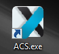  fter the AsTeRICS setup has finished, icons for starting the Configuration Suite (ACS) and the Runtime Environment (ARE) have been created on the desktop. Start the ARE by double-clicking “ARE.exe” in the ARE folder. When your operating system’s firewall asks if the TCP Port connection should be allowed, grant the rights for connection. If the ARE’s startup screen does not come up as shown in Figure 1, make sure that you have a Java Runtime Environment installed.

  
  

**Figure 1: Start screen of ARE containing several demo models to choose from.**

Now try to start the ACS by double clicking “ACS.exe” (the initial startup may take a while). Figure 2 shows the ACS window after startup:

**Figure 2: ACS startup screen.**

**What’s next?**

The ARE autostart model features some small model demos which work without special hardware. You could also browse the provided model demos using the ACS: Open a model from the folder “ACS/models”, connect to the ARE, upload the model and start it. These steps will be described in the following chapter. Refer to the ACS help (press F1 in the ACS application) for detailed descriptions of the sensor- processor- and actuator plugins.

Most of the functional models need additional sensor- and actuator hardware (see application scenarios in chapter 6.4. A model’s purpose and hardware requirements can be provided in the Model Description Dialog (ACS main menu → Edit → Show Model Description) – although it depends on the author of a particular model if this description is available.

1.  **Define autostart model per command line**
    

By starting the ARE with the name of a model as first command line parameter a model that should be started automatically can be defined. The model must exist in the sub-folder “models”.

ARE.exe CameraMouse.acs

or

start.bat CameraMouse.acs

2.  **ARE webserver (including REST API, websocket)**
    

The ARE contains a service that creates several web-based services. These include

*   a webserver with document root _ARE/web_ and URL: [http://localhost:8081/](http://localhost:8081/)
    

*   a websocket at URL [http://localhost:8082/ws/astericsData](http://localhost:8082/ws/astericsData)
    
*   a REST API at URL [http://localhost:8081/rest](http://localhost:8081/rest)
    
*   a javascript REST API client implementation example at [http://localhost:8081/](http://localhost:8081/)
    

3.  **ARE global hotkeys**
    

By default the ARE supports 3 hotkeys to start, pause or stop a model by a key press. The keys are

F5: Start model

F6: Pause model

F7: Stop model

F8: Edit model: Opens the URL of the WebACS in the system default browser and automatically downloads the currently deployed model for editing.

The default keys can be changed in the file areProperties of the ARE start folder by changing the values of the keys

ARE.hotKey.startModel=VC\_F5

ARE.hotKey.pauseModel=VC\_F6

ARE.hotKey.stopModel=VC\_F7

ARE.hotKey.editModel=VC\_F8

to the respective values of choice. For the key strings use the prefix VC\_ and append the key name of choice. So, for a function key this is e.g. VC\_F3. You can find a full list of supported keys in the the source code of the used library: [https://github.com/kwhat/jnativehook/blob/master/src/java/org/jnativehook/keyboard/NativeKeyEvent.java](https://github.com/kwhat/jnativehook/blob/master/src/java/org/jnativehook/keyboard/NativeKeyEvent.java)

4.  **Starting ARE on Linux and Mac OS X operating systems**
    

The ARE can also be run on Linux including ARM-based operating systems like Raspbian for the Raspberry Pi and Mac OS X. Not all plugins are supported yet but the number will increase, currently these are

*   CIM-based plugins: Lipmouse, Digital-In/Out, Analog-In, HID-Actuator,…
    
*   Pure Java plugins: GUI-based plugins, SignalGenerator,…
    
*   Computer Vision: XFacetrackerLK
    
*   KeyBoard/KeyCapture
    
*   FS20Sender/FS20Receiver
    

The ARE can be started using the provided start scripts

start.sh

Or

start\_debug.sh

Depending on the used OS it may be necessary to configure the serial devices with the correct udev rules, see README-linux.txt for further information.

5.  **Possible Applications: An Outlook**
    

Combined with the necessary hardware modules, the AsTeRICS system provides a wide range of possible use cases, including the following applications:

*   Alternative User Interface creation and device emulation
    
    *   Emulation of mouse- or keyboard input by desired sensor configurations
        
    *   Camera-based input for face- eye- and feature tracking
        
    *   Gaze estimation via eye tracking and head pose analysis
        
    *   Brain Computer Interfaces and support of bioelectric signal acquisition
        
    *   Sensor data fusion and feature selection
        
    *   On-Screen Keyboard for writing with word prediction or customized selection grids  
          
          
        
*   Environmental Control
    
    *   Easy interfacing with KNX (Konnex)
        
    *   Support of Infrared Remote Control code recording and replay
        
    *   FS20 support for affordable home automation
        
    *   Smart phone accessibility for Android and Windows-Phone devices  
          
          
        
*   Control of mechanic actuators or external appliances
    
    *   Pneumatic Gripper actuator for mouthsticks
        
    *   Generic control via control voltages or Relais
        
    *   Door-Opener control (e.g. the Abotic door opener)  
          
          
        
*   Voice Interaction
    
    *   Speech control for selection of functions and home automation
        
    *   Synthetic voice feedback  
          
          
        
*   Game control & Creativity support:
    
    *   PC-game control via local input emulation or HID device/joystick emulation
        
    *   PlayStation3 game control via PS3-controller emulation
        
    *   Custom button remapping of game controllers
        
    *   Control of IR-controlled toys (e.g. the RoboSapien toy robot)
        
    *   Sensor controlled musical instruments (via Midi) and drawing
        

  
  

In fact, there is no defined limit what AsTeRICS can do, because the system can be extended very easily by adding plugins for new sensors, processors or actuators which will allow completely new applications. For a detailed description how to build system models, please refer to section 4.

  
  

  
  

  
  

2.  **First steps with the AsTeRICS Software**
    
    1.  **ARE – The AsTeRICS Runtime Environment**
        

The AsTeRICS Runtime Environment is the basic software framework for all AsTeRICS applications and use-cases. AsTeRICS applications (so called “models” or “configurations”) consist of functional plugins which provide different functionalities. The ARE hosts these plugins, starts and stops their operation, allows them to run in parallel and takes care for their data exchange.

The ARE provides a main panel (the “ARE Desktop”) for plugins to display information or to interact with the user, for example via buttons, text-boxes or graphical displays. The positioning of these elements can be defined inside the ACS using a visual editor. The ARE Window size and position can be defined per-model, using the ACS GUI editor as well. There, it can also be defined if the ARE Window uses Window/Frame decorations or not, and if it stays on top of other windows or goes to the system tray. (These options are explained in detail in the following chapter).

  
  

  
  

 

  
  

The control panel of the ARE window provides quick access to model management actions:

*   Deploy: allows selection of a local model and loading it into the ARE.
    
*   Edit: allow to edit the currently deployed model in the WebACS.
    
*   Start: runs a currently deployed model, starts data-flow between plugins.
    
*   Pause: stops the data flow of a currently running model preserving the state of model.
    
*   Stop: causes a currently running model to be stopped and the plugins will be deactivated.
    
*   Options: opens a dialog with ARE parameters (e.g. background color) and “About” infos.
    
*   Open ARE webpage: Opens the start page ([http://localhost:8081/](http://localhost:8081/)) of the ARE webserver.
    
*   Quit: stops a running model and shuts down / closes the ARE.
    
*   Status/log display: opens a window showing recent logging/error messages
    

2.  **ACS (WebACS) – The AsTeRICS Configuration Suite**
    

The AsTeRICS Configuration Suite (ACS) allows to design models (configurations) for the ARE. Additonally, the ACS allows model download and upload to the ARE as well as starting and stopping deployed models inside the ARE. Furthermore, status reports, failure messages and logging from the ARE can be displayed. The ACS might run on the same computer as ARE, or on another computer system.

1.  **WebACS – Webbased AsTeRICS Configuration Suite**
    

Since AsTeRICS 3.0, the ARE has an integrated webbased version of the ACS, which can be started by opening [http://localhost:8081/webapps/WebACS/index.html](http://localhost:8081/webapps/WebACS/index.html) if the ARE is running.

The webbased ACS is implemented in Javascript and should run on all platforms with Firefox or Chrome.

2.  **Basic model creation concepts**
    

For creating AsTeRICS models, some basic concepts need to be well understood. Thus some important terms will be explained in the following:

  

*   **Model** - is a set of components and their interconnection, defining the operation of the AsTeRICS Runtime Environment. The model includes information on how to react to signals from sensors, and how to perform actions using the connected actuators.   
    A less technical explanation would be: a model is a definition of the way to translate data from sensors (like switches, cameras, a mouse, joystick etc.) to actuators (door openers, TV remote control, computer cursor movements etc.).  
    A model representation in the ACS consists of graphical elements identifying the components and their connections (channels).
    

  
  

*   **Components (a.k.a Plugins)** are pieces of software that perform calculations or communicate with hardware devices. For example: to use a simple on-off switch in a model, the ARE needs an appropriate plugin. To display data on screen another plugin is needed. To eliminate unwanted tremor from a mouse movement a plugin is needed, too.
    

  
  

*   **Components** can be of four types:
    
    *   sensors - used as an interface with sensor devices - thus logically are the source of data flow in an AsTeRICS model,
        
    *   processors - used as a way to manipulate data from sensors or other processors; processors typically need input data and can output that data to other processors or actuators,
        
    *   actuators - used as an interface with actuator devices - the devices that execute action wanted by an AsTeRICS user - must be driven directly or indirectly by data from sensors,
        
    *   specials - this type is not used at the moment
        

  
  

*   P**orts** are used to connect the components. Ports deliver data between various components. There are four types of ports: input, output and event listener and event trigger ports. 
    

  
  

*   **Channels** are the connections from an output port of a component to an input port of another one). **Eventchannels** allow the connection of event triggers to event listeners. See the following sections for detailed descriptions of channels and events.
    

  
  

  
  

3.  **ACS Basic Functions**
    

The figure below shows the main panel of the AsTeRICS Configuration Suite after the application has started. The screen is divided in three main areas, the menu area (1), the deployment area (2) (where the drawing will be done), the GUI drawing area (3), switchable with the deployment area and the properties area (4), where the settings of the components can be adapted.

  

  

 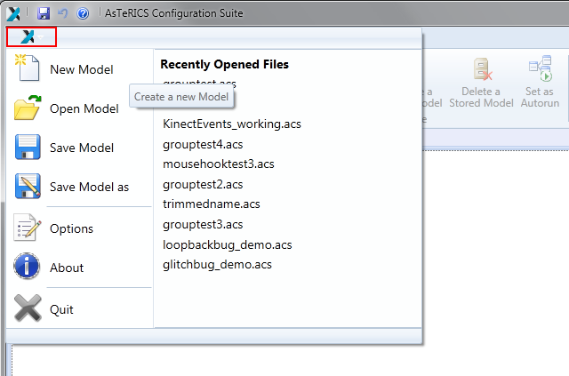

  
  

Additionally, the main menu will open, if the AsTeRICS-Button is pressed in the menu bar - see figure below. All functions of the main menu are also reachable via buttons in the tabs, providing you with System-tab, Components-tab, Edit-tab and Misc.-tab. The About button is an exception, not producing a tab, but a dialog. This dialog shows general information about the ACS and the AsTeRICS project.

  

4.  **Create and Edit a Model**
    

T o create a new model, add one or several components. To do so, select the tab “Components”, and from the sub-menu select a group of components, depending on what is supposed to be added. The four component groups are Sensors, Processors, Actuators and Saved Groups. Now, this added component can be manipulated in the drawing area. This can be done with the functions in the Edit-tab or directly by using the mouse or the keyboard.

  

  

1.  **Model Manipulation via Mouse**
    

After a component has been added to the drawing field, it can be moved by using the drag and drop functionality. Several elements (components, channels, eventchannels) can be selected by drawing a selection rectangle (just press the left mouse button and move the mouse) or by pressing the Ctrl-Key and clicking on each element.

  

All the selected elements can be also moved using drag and drop. All selected components are marked with a blue rectangle in the background, the component, which has the keyboard focus (and displayed in the property editor), is surrounded with a blue border.

Channels can be drawn by pressing the mouse button over an output port and dragging the channel to an input port. Connecting event channels is similar to the channels.

  

The selection of a component is shown in the figure below.

The properties of the selected component can be seen in the Property-window on the right. This windows show the individual settings of the selected plugins, and allows to change those settings:

  

  
  

2.  **Model Manipulation via Keyboard**
    

All elements within the drawing area can be set on focus, using the Tab-key or the arrow-keys. To select an element, the Space-key has to be used, to select several elements, use Ctrl- and Space-Keys at the same time. The App-Key opens the context menu. More information about the usage of the keyboard within the ACS can be found in the section Component Context Menu.

5.  **Tooltips**
    

Tooltips are used to provide context information when editing the model. They can be found when hovering over an item of interest.

The following items provide tooltips:

*   **Deployment** (drawing) area, when hovering
    
    *   a component
        
    *   an input port of a component
        
    *   an output port of a component
        
    *   the event listener item of a component
        
    *   the event trigger item of a component
        
    *   an event channel line  
          
          
        
*   Property **editor**, when hovering
    
    *   a property key  
          
          
        
*   Input **port** editor, when hovering
    
    *   a property key  
          
          
        
*   Output port editor, when hovering
    
    *   a property key  
          
          
        
*   Event **channel** editor, when hovering
    
    *   the column heading of event trigger or event listener
        
    *   an entry of an event trigger or event listener  
          
          
        
*   **Components** menu, when hovering
    
    *   a menu item  
          
          
        
*   **Components** search, when hovering
    
    *   a search result item  
          
          
        

6.  **O pen and Save Models**
    

In the “System” tab, models can be saved on the local file system (Save Model, Save Model as), or loaded from the local file system (Open Model). New Model cleans up the drawing field, preparing everything for a new model.

7.  **Connecting the ARE and Managing Models**
    

In the ”System” tab, the group “ARE” handles the functionalities for connecting to and communicating with the ARE. The connection to the ARE is handled by the AsTeRICS Application Programming Interface (ASAPI):

  

The functions of the “System” tab:

*   “Connect to ARE” connects the ACS with the ARE. The “Connect to ARE” dialog appears, asking for the connection data. The host name (IP-address of the host) can be found in the ARE configuration, the default port should be 9090.
    

  

  
  

*   Beside this connection dialog, also auto connection can be used, see the section Options / General Settings. When the connection has been established, two special cases can occur:
    
    *   An active model (deployment) has been detected on the ARE. The user will be asked to download this model or to proceed without downloading it.
        
    *   An active model (deployment) has been detected and is running on the ARE. The user will be asked to download this model and switch the ACS to running mode or to proceed without downloading it.
        

  

*   “Disconnect from ARE” closes the connection to the ARE.
    

  
  

*   “Upload Model” transmits the model in the drawing from the ACS to the ARE. The model on the ARE will be overwritten. Uploading the model to the ARE does not start the model on the ARE.
    

  
  

*   “Download Model” transmits the active model from the ARE to the ACS. The model on the ACS drawing area will be overwritten.
    

  
  

*   “Download Component Collection” loads the component collection (the description of all available components) from the ARE to the ACS and uses these component collection. Different component collections are useful for working with different AREs. They can be created and selected via the “Component Collection Manager” (see 2.2.18)
    

  
  

*   The group “ARE Storage” deals with the storage on the ARE. The storage is an area within the ARE where models can be stored and also activated using the ARE interface.
    

  
  

*   “Store Model on ARE” transmits the model in the drawing from the ACS to the ARE storage. A dialog appears to set the filename.
    

  
  

*   “Load Model from Storage” transmits a model from the ARE storage to the ACS. The model on the ACS drawing area will be overwritten. A dialog appears to select the filename of the model.
    

  
  

*   “Activate a Stored Model”: A dialog appears to select the filename of a model in the storage. This model will be set active in the ARE and also will be started. Furthermore, the model on the ACS drawing area will be overwritten with the selected model and the ACS switches to run-mode.
    

  
  

*   “Delete a Stored Model” deletes a model from the ARE storage using a file dialog.
    

  
  

*   “Set as Autorun” sets the model as autorun model. This model will be started automatically when the ARE starts.
    

Starting and stopping a model can be done with the buttons in the group “Model”.

The functions of this group are described as follows:  
  

*   “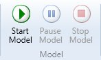 Start Model” starts the model on the ARE and switches the ACS into run-mode. This means that now no components, channels and event channels can be added, edited or deleted.  
    The drawing area is greyed out.
    
*   “Pause Model” pauses the model on the ARE.
    
*   “Stop Model” stops the model on the ARE and ends the run-mode.
    

  
  

8.  **Connection Modes**
    

The ACS can enter several different modes, depending on the status of the connected ARE. The connection status is displayed at the bottom left corner of the ACS. Possible ACS modes are:  
  

*   Disconnected
    
*   Connected
    
*   Synchronized
    
*   Running
    
*   Pause
    

The following table describes the operating modes of the ARE:

  

**ACS - Mode**

**Description**

  

Disconnected

This is the standard mode after the ACS has been started. The drawing area is enabled, new components can be added and channels between the components can be established. Models cannot be uploaded or downloaded and also the ARE storage is not accessible, due to the fact that there is no ARE connected.

  

  

Connected

This mode is reached after the ACS has been connected to the ARE. The drawing area is enabled, new components can be added and channels between the components can be established. Models can be uploaded or downloaded, also the ARE storage is accessible. The status and the logging file can be requested from the ARE.

  

  

Synchronized

After a model has been uploaded or downloaded, the ARE is synchronized with the ACS. The model can now be started on the ARE, using the Start Model button. Adding or removing components and editing channels or event channels will cause a switch back to the mode connected. Changing properties of the components will not change the mode, as these changes are transmitted to the ARE in the background. Also the status and the logging file can be requested from the ARE.

  

  

Running

After the Start Model button has been pressed, the ACS is in the running mode. Within this mode, the drawing area is disabled (indicated by a grey background) and the buttons in the components tab and the edit tab are disabled, so elements can only be selected or moved. The following figure shows a screenshot of the ACS in running mode.

  

  

Pause

This mode is similar to the running mode, with the difference, that the model on the ARE is not running but in a pause state.

  

  

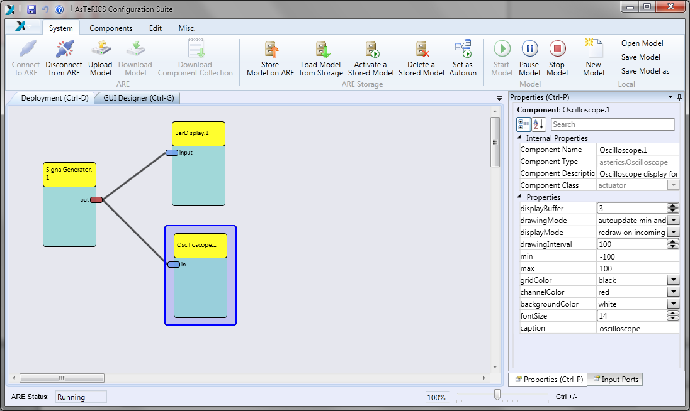

**The ACS in Running Mode**

  

9.  **The Edit Tab**
    

The “Edit” tab is used for manipulating properties of the components and their interconnections. The list below provides a detailed description of the available operations found on the “Edit” tab as shown in the figure.

Description of the _Model Properties_ Group:

  

*   “Edit Model ID” edits the unique model ID. This ID is generated automatically and is used by the ARE to store model based information belonging to the editing model.
    
*   “Show Model Description” shows the model description dialog. A Short Description, Model Requirements and Detailed Description can be edited. These descriptions are saved with the model and are available in the ARE as a help for the user.
    

  

Description of the _Edit Components_ Group:

  

*   “Move Component” enables the move mode of a component. Now the component can be moved around the drawing board using the arrow keys. Using the Enter-key or tabbing to another component ends the move mode.
    
*   “Component Properties” shows the properties of the component.
    

  
  

Description of the _Edit_ Group:

  
  

*   “New Channel” indicates that a channel is about to be drawn. To start drawing a channel, click on an output port or use the context menu.
    
*   “New Eventchannel” indicates that an event channel is about to be drawn. To start drawing an event channel, click on an event trigger port or use the context menu.
    
*   “Cut” cuts out the selected elements and stores the cut elements in the clipboard.
    
*   “Copy” copies the selected elements to the clipboard.
    
*   “Paste” copies the elements from the clipboard to the drawing field.
    
*   “Delete Selection” deletes the selected elements. This can also be done with the delete-key.
    
*   “Undo” cancels the last editing action like move a component, add/delete a component or also the channel and event channel operations. Setting properties and events (things done in the property window) are excluded from undo.
    
*   “Redo” repeats the last editing action that has been undone with Undo. Setting properties and events (things done in the property window) are excluded from redo.
    
*   “Group” groups the selected components to one component. Only ports and eventports, being connected to components outside the group will be shown as ports and eventports of the new group.
    
*   “Ungroup” ungroups a selected group and shows all components within the group.
    
*   “Save Group” saves a selected group. The selected groups can be reused in the same or any other model, being listed in the “Components” tab in the section “Saved Groups”
    

After at least two components have been added to the model, they can be connected to each other. A connection always has to start at one output port (right hand side of a component) and connects to an input port (left side of another component). One output port can be connected to several input ports, but an input port can only receive data from one output port. Additionally, the data types of the ports must match in order to be able to connect them, see the section on Channels.

10.  **Component Context Menu**
    

A ll editing functions, which require usage of a mouse, can also be done with keyboard, using the context menu of the component. The context menu (which appears when the right mouse button is used to click on a component icon) can also be activated by using the space key or the application key. The screenshot an the left shows a component with opened context menu:

  

  

  
  

11.  **Ports, Channels and Data Types**
    

Channels are the main way to transmit data from one component to another. A channel always transmits information from the output port to the input port.

The components of the AsTeRICS platform process one or several of the following data types, represented by the ports of the components:

  

*   Boolean: can be true or false
    
*   Byte: numbers from -128 to 127
    
*   Char: one character
    
*   Integer: numbers from approx. -2 billion to +2 billion
    
*   Double: positive and negative floating point numbers (with a fractional part)
    
*   String: a sequence of characters (short words, but also one or more long sentences)
    

  
  

  
  

The ports can be connected to ports with any data type. If the data types of output port and input port don’t match, the following conversion rules are applied:

*   Conversions without information loss:
    
    *   A smaller data type to a bigger one
        
    *   An integer data type (Byte, Char, Integer) to a floating point data type (Double)
        
    *   Any data type to String
        
*   Conversions with information loss:
    
    *   A bigger data type to a smaller data type
        
    *   A floating point data type (Double) to an integer data type (Byte, Char, Integer) or Boolean data type
        
*   Conversion from String:
    
    *   If the string contains a numeric value, otherwise ignored
        
*   Conversion to Boolean:
    
    *   0 or “false” is converted to false
        
    *   \> 0 or “true” is converted to true
        

12.  **Events**
    

The AsTeRICS platform knows two concepts of connecting two components to each other. The first one is channels, where data is transported from one component to another. The second one is the events-concept.

Events are single or continuous happenings, which should trigger an action at the receiver. After an event channel has been established between a trigger and a listener, the events have to be set in the events tab (which appears in the property area - by default on the right side of the ACS). In this event tab, there is a table with two columns: the left column lists the event listeners, the right column the event triggers.

So, with the selection box on the right side (second column), the triggering event for the listener will be set. One component can send and receive events from several other components.

The following figure shows the setting of events:

  

13.  **Adjusting Properties of a Component**
    

The component properties define the behaviour of the component and can be adjusted with the ACS property editor. There are properties for the main functions of a component and properties for the input- and output ports (for example time-synchronization of incoming data).

The usage of the properties and their effects can be found in the documentation of each component in the ACS help system. The following figure shows the property editor in the ACS. By default, the property area is on the right hand side of the ACS and it adapts context-sensitively to the currently selected component (here the “Comparator” component is selected):

  

  

  
  
  

The Property editor offers several tabs. The most important settings can be defined in the “Properties” tab and in the “Input Ports” tab (the properties of event trigger-, event listener- and output ports are informal and cannot be changed).

1.  **Dynamic Properties and their Use**
    

Usually, the properties of a component can be adjusted by entering a numeric value (e.g. a range- or gain value) or a string (e.g. a text field caption). Some properties can be defined by selection of a suggested element from a combo-box (like “condition”, “outputMode” and “eventMode” in the above example).

Dynamic Properties are an extension of that concept, where a list of valid property values can be obtained from the ARE. This is especially useful when reasonable values depend on the system environment of the ARE and cannot be known by the ACS or the model designer (for example installed devices or available sound files in the ARE file system). If ACS and ARE are connected and the model is uploaded to the ARE (synchronized connection mode, see chapter 2.2.8) dynamic property suggestions are displayed in form of a combox. The following figures show the dynamic property “filename” of the WavefilePlayer component.

  
  

In the first figure, ACS and ARE are not connected, the filename property can be edited normally (by entering the filename of a sound file which should be played by the component into the empty field):

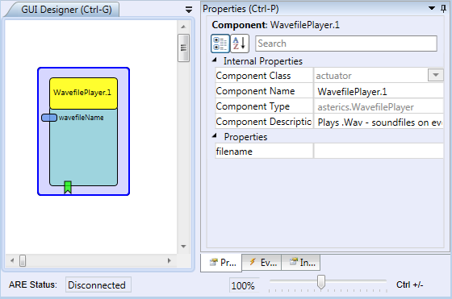

When ACS and ARE have been connected and the model has been uploaded, the filename property offers reasonable selections of available sound files in the ARE filesystem via a combobox:

Not all components support dynamic properties – it depends on the pluing developers if they support this feature. Please refer to the ACS help section of a particular component for more details.

2.  **Synchronization of Input Ports**
    

An inherent problem of the data exchange between components is the question when a plugin should perform its activities or calculations. Consider for example the comparator component which can compare two values that are received at two different input ports (inA and inB). The Comparator can perform the comparison every time a new value is received at either port, or it could wait until both values have been received and then compare them and process its own output activities.

  
  

The desired behaviour depends on the signal characteristics and the model itself: If both input ports get new values at the same speed, it would be better to wait for two associated values. If the second input port receives values only occasionally, the component should perform its activity every time the first port gets a new value. On the other hand, in certain situations such behaviour would lead to false intermediate results at the output ports of processing plugins.

To address this problem, several plugins support synchronized data processing: If multiple input ports are marked as “synchronized” via the Input Ports tab of the property editor, the component waits until all these input ports have received one new value – then the plugin processes all input values at once. The following figure shows the Comparator plugin, where data synchronization has been selected for the inA and inB input ports:

  
  

  
  

Other examples of components which support synchronization are the Mouse actuator or the MathEvaluator processor. Please consult the ACS help section to find out if a particular plugin supports input port synchronization.

14.  **Action Strings**
    

Action Strings can be used to send commands to plugins which have an “action” input port or type “string”. This increases the flexibility of the system, because action strings can also contain parameters (for example and address or value which is dedicated to a plugin). Action strings start with a plugin identifier: @MOUSE, @KNX, @IRTRANS etc.

  

There are currently a number of plugins (mostly actuator plugins) which support action strings, including the Mouse plugin, the Konnex home automation plugin or the IRTrans Infrared remote control plugin. The OSKA on-screen keyboard can send action strings to connected plugins when a key is selected (see 5.2.1). For a complete list of action strings currently supported by ARE plugins and their application please refer to Appendix B.

  
  

15.  **Grouping and Ungrouping Elements**
    

If many components are used in a model, the complexity can get very high and it becomes difficult to find out what functionality is created by which parts of the model design. Furthermore, it is difficult to re-use parts of a model which represent an autonomous functionality. To address these problems, the ACS offers the “Group” feature, which allows fusing a number of plugins together with their channel interconnections into a single component.

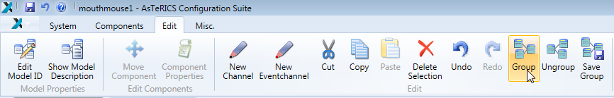

Groups can be assigned with a new name, and offer new input- and output ports (according to the channels which enter or leave the group) that also can be renamed according to their function in the element group. The following example shows a quite complex model (on the left) which represents a lip-controlled mouse solution, where 4 force sensors connected to an Arduino board enable mouse-cursor control via lip movements and several extra functions. On the right side, all “internal” components of this model have been grouped together into a fused element called “LipMouse” (shown in orange), so that only one slider component for speed adjustment, a buttongrid component which provides On/Off buttons and the target mouse component remain visible:

  
  

 

  
  

Groups can be saved under a filename and may be imported into other model designs. Available groups appear in the Component menu under the “Group” selection. A Group can also be “un-grouped” which will display all the contained components and channels again.

16.  **The GUI Designer**
    

The ACS GUI Designer is a graphical editor which allows arranging the GUI Elements of the current model. These GUI Elements are shown in the ARE GUI Designer window and can be freely positioned / resized. All GUI elements will be drawn and deleted automatically as soon as a component with GUI will be added or deleted in the ACS model.

In the GUI Designer, the size of the ARE window and it’s position on the computer desktop can be specified. Moreover, it is possible to define the visibility of the control panel and the window decorations for this particular ARE model.

3rd\-party windows (e.g. the OSKA window or the window of a live camera picture) are visible in blue color and can be freely positioned on the whole desktop – not depending on the ARE window’s position or size. A grid function eases the alignment of GUI Elements (using the “EnableGrid” function, so that elements will snap to the grid). To visualize the grid, select “ShowGrid”. There are four “GridSteps” (small, medium, large and huge) to choose from.

Thus, The ARE GUI editor provides complete design freedom for the graphical interface of an AsTeRICS model and how it will appear on the user’s computer screen – ranging from a small selection window without any decorations to a fullscreen interface with many graphical interaction elements. The following figure shows the GUI Designer window:

  

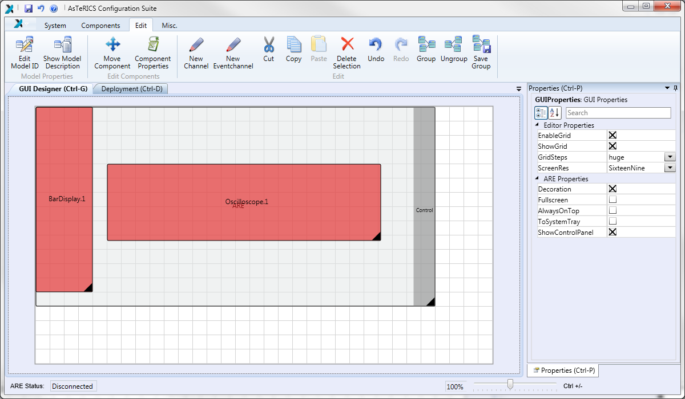 

The white panel symbols the whole screen/desktop.

The light grey panel symbols the ARE window

The red panel symbols the GUI elements.

The grey panel symbols the control panel

  

  
  

  
  

  
  

17.  **Status Reporting and Error Logging**
    

Within the tab “Miscellaneous (Misc.)”, status information and error logging can be requested from the ARE (if an active connection to the ARE is available):  
  

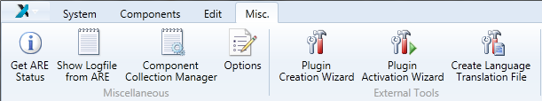

*   “Get ARE Status” opens a window, showing status messages from the components within the ARE. These messages can be copied to the clipboard or saved to a file.
    
*   “Show Logfile from ARE” shows the ARE-logging file, containing status and error messages.
    
*   Beside this general information, the status of each component can be requested using the Show Component Status in the context menu of each component.
    

18.  **Component Collection Manager**
    

An AsTeRICS installation includes a component library ready to use in ACS. New plugins can be imported to an existing library from a connected ARE and the new component library can be saved.  The Component Collection Manager is a small tool in which component collections (the description of the available plugins within the AsTeRICS Runtime Environment) can be saved and administered. Within the component collection manager, the following functionalities are provided:

  

*   Use Default sets the default ACS component collection as active component collection
    
*   Set as Autostart sets the active component collection as autostart component collection, which will be loaded at ACS startup.
    
*   Save Component Collection saves the active component collection (e.g. a downloaded component collection from the ARE) into the ACS folder.
    
*   The Saved Component Collections list shows all saved component collections. A component collection can be selected and set active.
    

  

19.  **Further ACS Options**
    

Within the “Miscellaneous” tab, the “Options” dialog offers adjustment of General Settings, Dialog- and Colour Settings:

  

G

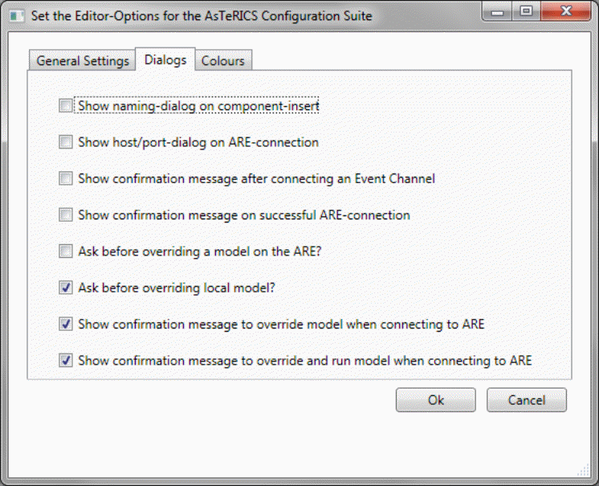

eneral Settings:  
  

*   “Reset Window Arrangement” resets all layout settings to default values.
    
*   “Language” selects the ACS language between English, German, Spanish and Polish. The properties of the components will not be affected by this.
    
*   “Connection Data” is responsible for the connection of the ACS with the ARE. The IP address of the ARE can be entered manually or the ACS can try to detect the ARE automatically in the local network.
    
*   “Connection Timeout” is the time period the ACS waits for the ARE to respond to a connection request for auto-detection.
    
*   “ARE Status Update” enables or disables an automatic update of the ARE status. The Update Frequency sets the time between two status updates (in milliseconds).
    
*   If “Automatic backup files” is selected, the ACS creates a backup file each time a model is saved (the backup file gets the extension “.acs.backup” and contains the last version of the model).
    

Dialog Settings:

Within this options tab, dialogs can be activated or deactivated. In the ACS, several dialogs have the option Show this dialog every time. If a dialog has been deactivated there, it can be reactivated in the options dialog.

  

Colour Settings:

Within the Colours tab, the colours of the different parts of a component can be changed. The colour chooser not only allows changing the colour, but also the transparency.

  

  

  

3.  **Plugins: The Elements of AsTeRICS Models**
    

Every functional AsTeRICS model consists of interconnected components (a.k.a. “plugins”). The plugins are the key to the flexibility of the AsTeRICS system. Every plugin serves a special purpose, the combination of different plugins defines the model’s functionality and use-case.

There are 3 types of plugins:

*   S ensors:  
    These plugins provide information to other components. This information can be generated by the plugin in software (like a simulated signal of a sinewave-generator plugin or the interaction information of a Graphical User Interface element on the computer screen) or it could be real measurements done by a hardware modules. Sensors usually have no input ports but output ports where the information is available. Examples for sensors:  
      
      
    
    *   A Slider GUI element, which delivers current slider value to other plugins.
        
    *   A JoystickCapture component, which informs other plugins of button  
        presses or the current joystick position.
        
    *   A plugin which provides bioelectric signals from a signal recoding unit.
        

  
  

*   Processors:  
    Processing plugins usually have input- and output ports. They perform calculations or feature extraction tasks on input signals and provide the results at their output ports, so that other plugins can use them. Examples:  
      
      
    
    *   An Averager plugin, providing the arithmetic mean value of a number of samples
        
    *   A plugin which creates events if an incoming word (strings) is recognized.
        
    *   A BlinkDetection plugin which finds out the moment when a person’s eye  
        blinks from a recording of muscle movements.
        

  
  

*   Actuators  
    The Actuator plugins transform incoming signal or events to actions, either in pure software or – via hardware modules – in the environment. Examples of actuators include:
    

  
  

*   Graphical User elements: Displays, Bargraph, Oscilloscope etc.
    
*   Environmental control systems: Infrared Remote Control, home automation etc.
    
*   Input Device emulation: physical mouse / keyboard / joystick replacements
    

In Appendix A, an overview on the currently available AsTeRICS plugins and a short description of their capabilities is given. For detailed information about the plugins, their ports and properties please refer to the dedicated ACS-help sections (press F1 in the ACS).

4.  **Step-by-Step Guide to AsTeRICS Model Creation**
    

The following sections describe the basics of AsTeRICS model creation: How to connect the sensor-, processor- and actuator plugins in the ACS to achieve the desired system behaviour.

The first model creation tutorial shows how to work with ports, events and properties. The resulting model will not fulfil a useful assistive purpose, but it helps to understand the signal flow in an AsTeRICS model and how to use plugins in the system design.

Then, a functional alternative mouse-cursor control model will be developed in several steps, which allows using a computer mouse via head movements. The only hardware needed for this model is a standard webcam (which is already included in most laptop / notebook computers).

The next model creation demo shows how to use standard computer input devices like gamepads or the Wii Controller in AsTeRICS models.

Subsequently, more sophisticated system models are being developed and explained, supporting different sensors and actuators. The interface to OSKA (the On-Screen Keyboard Application) will be introduced, making it possible create on-screen keyboards for writing or graphical menus for selection of commands or functions. This reveals the potential of the system for different use cases like environmental control or mobile phone access.

1.  **Making a first Model: Using Ports, Events and Properties**
    

For the creation of a very simple AsTeRICS model, we do not need external hardware components. The only requirements are the ACS and the ARE software applications.

Every AsTeRICS model is constructed by adding and connecting system components (plugins) in the ACS and adjusting the parameters of these components. The first model example will generate a sine-wave signal and display the signal waveform in an oscilloscope window.

The “Signal Generator” demo:Model file available: **ARE/models/tutorial/1\_SignalGenerator.acs**

*   Start the ACS (by double clicking ACS.exe in the ACS folder)
    
*   Select “Components” in the main menu
    
*   Choose Sensors → Simulation → SignalGenerator
    
*   Choose Actuators → GraphicalUserInterface → Oscilloscope
    
*   Move the Oscilloscope icon to the right by dragging it with the mouse. Please note that all design activities utilizing the mouse can also be accomplished be only using the keyboard (see the ACS-help by pressing F1 in the ACS).
    
*   Connect the “out” port of the SignalGenerator to the “in” port of the Oscilloscope by dragging the connection from “out” to “in”. This connection creates a data flow from the SignalGenerator to the Oscilloscope component. The result comes into effect when the model is started in the ARE. The result should look similar to the following screenshot:  
      
      
    

  
  

*   By clicking a component’s icon, the component properties and port descriptions become visible in the Property-editor (can be seen on the right). Here, important settings for every component can be defined and modified.
    
*   Now start the ARE (by double-clicking “ARE.exe”)
    
*   Connect ACS and ARE by choosing System → Connect to ARE in the main menu  
    If the connection does not work, please have a look at the connection setup as described in section 2.2.7
    
*   Click “Upload Model” and then “Start model”  
    If notification dialogs during connection establishment come up, you can decide if you want to see these dialogs next time or the connection and upload is performed silently
    
*   The running model in the ARE window should look similar to this:
    

  
  

  
  
  

The sine wave which is generated in the SignalGenerator element is sent to the Oscilloscope element which displays the signal as intended 

  
  

*   Now switch back to the ACS window and change the “frequency” property of the SignalGenerator component from “2” Hz to “0.2” Hz – You can do this during the model is running. After pressing Enter, the result becomes immediately visible in the ARE window:
    

  
  

  
  

In the same manner, other parameters can be changed, for example the colours of the Oscilloscope – just try it, and have a look at the purpose of each component-property in the ACS help !  
  
  

*   Certain modifications of the model (like port connections or addition of new elements) cannot be done in a running model. For these operations, the model must be stopped.
    
*   Press “Stop Model” in the ACS menu and add a “Threshold” component from the submenu  
    Components → Processors → BasicMath
    
*   Connect the output of the SignalGenerator to the input of the Threshold component
    
*   Add an EventVisualizer from Components → Actuators → GraphicalUserInterface
    
*   Create an event channel by connecting the event trigger port of the Threshold component (purple) to the event listener port of the EventVisualizer (green)
    
*   Click the event channel and select “eventPosEdge” and “eventNegEdge” from the pull-down menu of “Threshold.1” in the property editor, which should look like:  
      
      
    

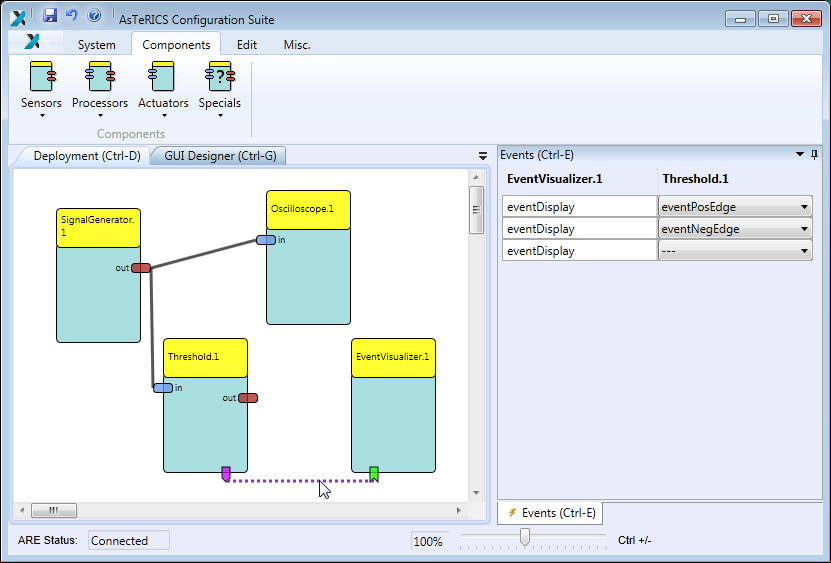

  
  

*   Events represent sporadic information like pressing/releasing a button or a signal reaching a certain level. In contrast to the input ports for signals (where only one connection is accepted by an input port), several event channels can be connected to an event listener port. In the above example, event triggers will be generated by the Threshold component every time the signal value passes the levels given in the component’s properties.
    
*   Now activate the “GUI Designer” view in the ACS window. Here you can specify the desired area for the graphical output of every particular GUI component which is part of the model
    
*   Drag the GUI area of the EventVisualizer below the area of the Oscilloscope, so that these two components do not overlap their graphical output. Adjust the size and position of the components as desired:
    

  
  

  
  

*   Switch back to the Deployment window and change the gridColor or backgroundColor properties as you like.
    
*   Upload and Start the model and have a look at the ARE window:
    

  
  

  
  

*   The EventVisualizer shows an Event from the Threshold component every time the signal passed the set threshold level from below to above. Try to switch back to the ACS window and modify the “eventCondition” parameter of the Threshold component to “both”. This should lead to events being generated also when the signal passes from above to below.
    
*   Finally, try to save the model (System → Save Model as), create a new model, load the model again, store it on the ARE (System → Store Model on ARE; this saves a copy of the model locally in the ARE) or set the model autostart when the ARE starts (System → Set as Autorun).
    

This example has already introduced the most important tasks to create AsTeRICS models:

*   Adding components to a deployment model
    
*   Connection input and output ports for streaming data
    
*   Uploading and starting models in the ARE
    
*   Adjusting component properties
    
*   Using the GUI designer window to define GUI areas of components
    
*   Connecting Event channels and selection event triggers
    

  
  

1.  **A note about Mouse emulation and UAC settings**
    

The mouse emulation component uses software calls to modify the mouse position and click activities. Certain applications do not accept certain of these software-generated mouse commands. (this problem has been reported on Windows 7 and newer). One solution might be to run the ARE with administrator rights. It might also be helpful to due switch off the Windows User Access Control settings (UAC) by changing the level to “Never notify”’ (see Figure 3 and [http://windows.microsoft.com/en-au/windows/turn-user-account-control-on-off#1TC=windows-7](http://windows.microsoft.com/en-au/windows/turn-user-account-control-on-off#1TC=windows-7) )

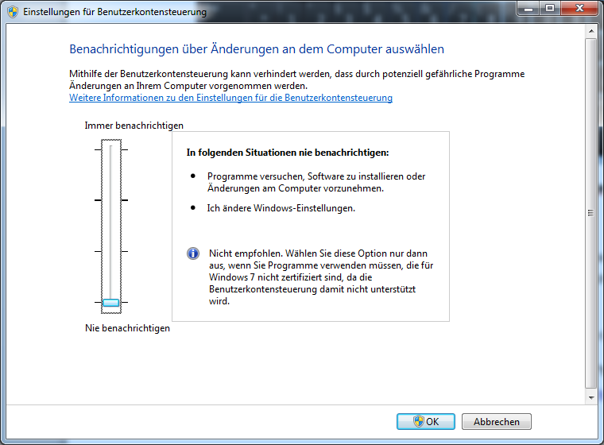

**Figure 3: Turn off User Account Control – Set to “Never notify”**

  
  

2.  **A Model for Mouse-Control by Head Movements**
    

The models described in the following section provide headtracking-controlled mouse alternatives for computer-input.

  

**Model Description**

**Requirements**

**Remarks & considerations**

  

  

The x- and y- position of the local mouse are controlled by the user’s head movement.

  

The “FacetrackerLK” sensor plugin is used to perform the head tracking. This plugin utilizes the Lukas Kanade optical flow algorithm to track the face features. This method is fast but not 100% stable (drifting of the tracking point can occur).

  
The “FacetrackerCLM” component is a possible alternative, it uses a different algorithm which is slower but delivers more features as eyebrow and eye lid states.

  

A webcam (built in or connected to an USB port of the computer):  
  

  

A high quality webcam is recommended, e.g. Logitech Webcam Pro 9000 shown above.

  
  

  

  

The first model example creates a basic mouse replacement solution. Mouse clicks are not supported and have to be added via an external Software tool (e.g. Point’n’click)

In the subsequent examples, clicking alternatives and adjustable acceleration will be added to this model.

  

For an optimal result, it is important to place the camera directly in front of the user (on top of the monitor of the target computer, in a distance about 70cm-120cm). No other person’s face should be in the field-of-view of the camera.

  

**Table 1: Description of the camera mouse model**

  
  

Creating a basic “head-controlled-mouse” model:Model file available: **ARE/models/tutorial/2\_CameraMouse\_basic.acs**

*   Create a new model in the ACS (System → New Model)
    
*   Insert the FacetrackerLK sensor component (Components → Sensors → ComputerVision)  
    This component captures life-images from a connected webcam and tracks the position of a user’s face. The relative movement of nose and chin from last previous image frame to the current image frame are available at the component’s output ports in x and y values. We will use these for the mouse cursor positioning.
    
*   Insert the “Mouse” actuator (Components → Actuators → Input Device Emulation) and connect to ports “noseX” to “mouseX” and “noseY” to “mouseY”
    
*   In the properties of the Mouse component,
    
    *   adjust xMax and yMax to the desired values (enter 0 for xMax and yMax to enable automatic detection of the screen resolution if desired)
        
    *   deselect “absolutePosition”. This defines that the X and Y input values are relative changes (for example -2/3) – which fits the output of the FacetrackerLK component.
        
    *   Note that “enableMouse” could be deactivated if it is desired to test the model without real cursor movement.
        
    *   Select the “**Synchronize Inputs**” option in the InputPorts rider for both input ports (mouseX and mouseY). This will wait for both input coordinates (x and y) to arrive before the mouse position is updated.
        
*   Upload the model to the ARE. Before starting the model, be aware that you will lose control of your mouse cursor is something is not working properly. You can stop the model by activating the ACS window (Alt+TAB) and using the ACS hotkey (F7). You can still use the normal mouse buttons for clicking.
    
*   Save the model under a suitable name
    

  
  

  
  

  
  

If the connection to the webcamera cannot be opened, the FacetrackerLK component will be colored in red – indicating a problem in this component. In this case check the operation / driver of your cam.

  
  

  
  

  
  

1.  **Extending the Head-Mouse: Add Dwell Clicking**
    

The following example builds upon the simple camera-mouse model of the previous chapter. To make this model really useable, several features will be added. To support left mouse clicks, several options are possible, for example using an external switch which is connected via a DigitalIn hardware module or via the Arduino microcontroller. Presses of a connected switch will create event triggers which can be connected to the event listener ports of the Mouse component (e.g. Leftclick or Rightclick) to perform the desired actions.

To avoid dependencies on any hardware – we will build a “dwell-clicking” function into the camera-mouse model. “Dwell clicking” automatically performs a mouse button click when the mouse is not moved for a longer time.

Camera Mouse with automatic dwell-clicking  
Model file available: **ARE/models/tutorial/3\_CameraMouse\_dwell.acs**

  
  

*   Load the basic “2\_CameraMouse\_basic” model or build it as described above.
    
*   Add the processing component “Processors → Signal Shaping→ Deadzone” and connect the noseX/noseY outputs of the FacetrackerLK component to the inX/inY input ports of the Deadzone component. The Deadzone component can fade out x/y signal values in an adjustable range and it can generate event triggers if the x/y values are inside or outside this range. We will use this component to define a desired movement level to start or stop the timing for the dwell click. The parameter “radius” defines this range – in our case the amount of nose movement. We can leave it at the default value 10. Thus, the movement range is set to 10 pixels from previous to current nose position.
    
*   In the Input Port rider of the Deadzone plugin, select “Synchronize Inputs” for inX and inY.
    
*   Insert a time sensor component “Sensors → Simulation → Timer”.  
    This component can measure time, generate events if a time period has passed, and perform timing-loops. We will use it to define the time period of low movement which will generate a dwell click. The default time-period of 2000 milliseconds could be adjusted to 1000 (which gives 1 second dwell time) in the component parameters if desired.
    
*   Connect the event trigger port of the Deadzone component (purple) to the event listener port of the Timer component (green) and click the event channel. Select the “enterZone” event of the Deadzone component for the “start” function of the Timer component, and select the “exitZone” event for the “stop” and “reset” functions:  
      
      
    

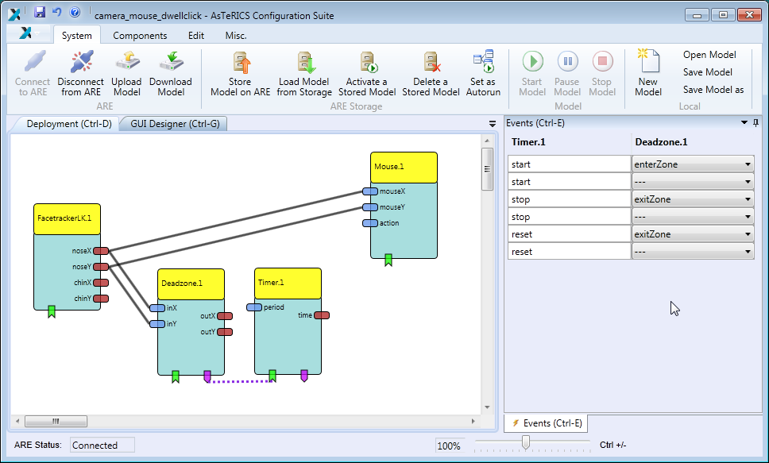

  
  
  

These event connections control the Timer component via the defined movement levels: if the nose movement stays below the selected level 10 pixels, the Timer is started; else, the Timer is reset to 0 and stopped. If the movement stays low for the full time period, the Timer will generate it’s “periodFinished” event.

  
  

*   Draw a channel from the Timer’s event trigger port to the event listener port of the Mouse.  
    Assign the “periodFinished” event to the “leftClick” function:  
      
      
    

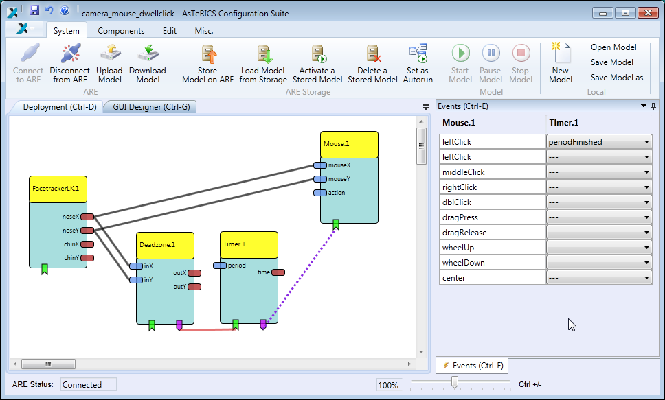

This completes the dwell-click generation for our camera-mouse model.  
Upload, start, test and save the model !.

Try to change the dwell-radius (range) and the dwell-time to adapt the model to your own needs and preferences. Like in every other model creation, it helps very much to display intermediate signals and events in the ARE, using the GUI-actuators (Oscilloscope, BarDisplay, EventVisualizer, …).  
Experiment by connecting these components to your signals and events!

2.  **Extending the Head-Mouse: Adjustable Parameters via GUI elements**
    

Although extended camera-mouse model is already useable and provides left-click functionality, there could be a lot of additional improvements. For example, it would be desirable to adjust the mouse acceleration and the dwell timing to the user’s needs. Furthermore, different click-actions like right- or drag-clicks should be supported. Now we will add GUI-support to your model which will provide these extensions.

  
  

  
  

Camera Mouse model with GUI support  
Model file available: **ARE/models/tutorial/4\_CameraMouse\_GUI.acs**

*   Load the “3\_CameraMouse\_dwell.acs” model or build it as described above
    
*   Add a Slider component (Components → Sensors → Graphical User Interface)  
    which will be used to make the mouse speed adjustable. In the Slider’s Properties, the range of value can be defined. We can leave this at (0-100) but have to be aware of this range.
    
*   Set the Slider’s caption to “Mouse Speed” – indicating it’s desired function in the ARE GUI
    
*   Set the Slider’s minorTickSpacing to “10” – this defines that the slider will snap to steps of 10 values which makes it easier to use it with single clicks.
    
*   To modify the x/y mouse speed, we use a MathEvaluator processing component (Components → Processors → BasicMath). We will need one for the X-signal and one for the Y-signal. Let us first modify the X-direction:
    
*   Delete the port connection from noseX to mouseX.
    
*   Draw a new port connection from the “value” (Slider component) to “inA” (MathEvaluator)
    
*   Draw a new connection from noseX (FacetrackerLK) to “inB” (MathEvaluator).
    
*   Adjust the “expression” property of the MathEvaluator as desired. The “expression” property defines how the values of the input ports will be combined to generate the output value of the MathEvaluator component. For our example it seems reasonable to multiply the nose movement value (inB) with the current Slider value (inA). Furthermore, we should divide the Slider value (which can range from 1 – 100 as defined in the Slider’s properties) by 50. This means that Slider positions < 50 will slow down the mouse speed, while values >50 will increase the mouse speed up to the double of the original value.  
    So for the “expression” property we enter “a/50\*b”.
    
*   Do not select the “Synchronize Input” option in the Input ports rider of the MathEvalutator component. This would wait for new value to arrive at “inA” and “inB” before a calculation, but in this case inA comes from the slider and is only updated when the silder is moved via the GUI.
    
*   Connect the output port of the MathEvaluator to the “mouseX” input port of the Mouse.  
    Now the model looks like it can be seen in following figure.´:  
      
      
      
    

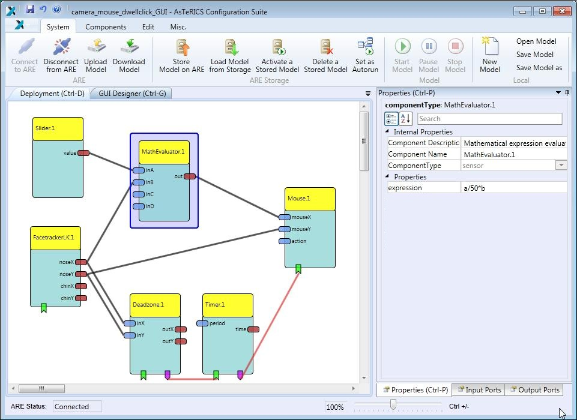

  
  

*   Copy and Paste the MathEvaluator to create a second one for the Y – direction. Connect the second MathEvaluator to the slider and to the noseY-output of the Facetracker plugin - as we did it for the X-direction. Upload and test the model.  
      
      
    

An additional useful feature would be to enable different mouse click activities. This could be done easily by attaching a switch for right clicks via the DigitalIn hardware module (see section 6), but we can also provide flexible clicking actions via the GUI.

For this purpose, we will add a ButtonGrid to select the next click type and inform the mouse element about the next desired click type by sending a proper “action string” to the Mouse element. Action strings contain commands which are understood by a number of specialized actuator elements (Mouse, Konnex, IRTrans ,…). These strings contain the addressed component and the desired command (e.g. “@MOUSE:nextclick,right”).  
For details please refer to the help files of the respective components, or Appendix B .

To enable different click-types:

*   Add a ButtonGrid component (Sensors → Graphical User Interface → ButtonGrid)
    
*   Set the “buttonCaption” properties of button 1, 2 and 3 to  
    “RightClick”, “DoubleClick” and “DragClick”
    
*   Choose “horizontalOrientation” for the ButtonGrid and set a desired caption:
    

  
  
  
  
  

*   Define a desired position for the ButtonGrid component in the “GUI Designer” view.
    
*   Now add the a StringDispatcher component (Processors → Event and String Processing)  
    This component can be used to translate incoming events into outgoing strings. We will use it to generate desired action strings for the Mouse component if buttons are pressed on the GUI.
    
*   Connect the event trigger port of the ButtonGrid component to the event listener port of the StringDispatcher
    
*   Click the event channel and attach “button1” to “dispatchSlot1”, “button2” to “dispatchSlot2” and “button3” to “dispatchSlot3”
    
*   Now define the strings for slot1 – slot3 in the properties of the StringDispatcher:  
    slot1 (button1): “@MOUSE:nextclick,right”,  
    slot2 (button2): “@MOUSE:nextclick,double”,  
    slot3 (button3): “@MOUSE:nextclick,drag”
    
*   Connect the output port of the StringDispatcher to the “action” input port of the Mouse.
    

  
  

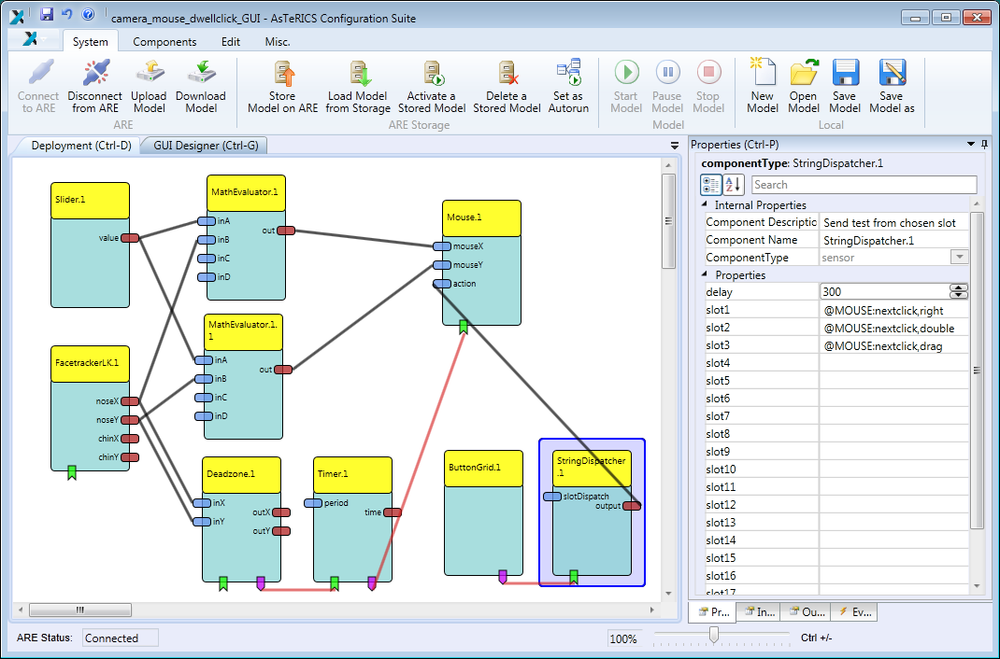  
  
  

This resulting model provides a fully functional mouse replacement with left / right / double and drag click support using a webcamera for head tracking and a GUI for mouse click selection and mouse acceleration adjustment. Save the model as “camera\_mouse\_dwellclick\_GUI.acs”, upload it to the ARE and start it. Depending on how you arranged the GUI elements in the designer window, the ARE window could look as follows:

Of course, several other features could be added to improve the model. For example, the facetracking could be re-initialised if the face position got lost (via an event trigger of the FacetrackerLK component and a button or external switch). Or different modes or presets could be provided, like a Joystick-mode for the mouse, where head movement translates into the speed of the mouse cursor, not into the absolute position. Such extensions are provided in the AsTeRICS model collection.

3.  **Using Standard Input Devices**
    

Off-the-shelf game controllers for personal computers are available in every hardware store, they provide a lot of buttons for digital input, several analog inputs (commonly two 2-dimensional joysticks) and are affordable. With the success of gesture input and movement based controllers (like the Nintendo Wii), additional modalities like acceleration or angle velocity can be measured by several game control devices.

Depending on the physical capabilities of a person, game controllers can be interesting input devices. The AsTeRICS system allows using standard PC gaming pads or the Nintendo WiiMote (optionally with the Nunchuk extension) as input devices for AsTeRICS models.

The pictures below show a HID-compatible PC gamepad (price about 10 Euros) and the wireless Wiimote with Nunchuk-extension (price about 35 Euros).

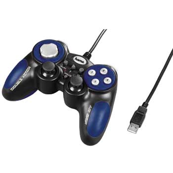 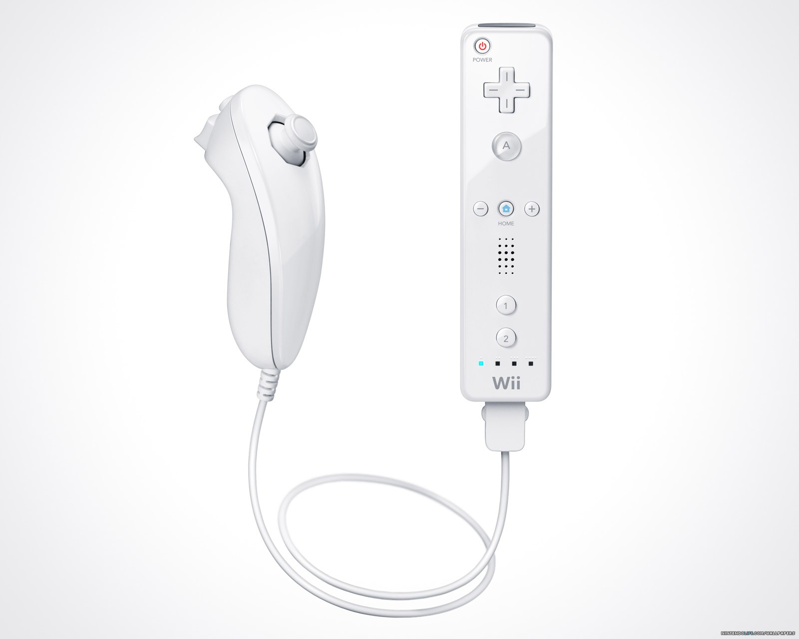

  
  

1.  **Mouse-Click Alternatives via Buttons of a Gamepad**
    

The following example shows a model to create right- and double mouse clicks with two desired buttons of a PC gamepad / joystick. This could be useful for a person who uses a sufficient mouse-replacement solution but has problems with the efficiency of right- or double clicks.

Emulate Mouse clicks via Gamepad/Joystick buttons  
Model file available: **ARE/models/tutorial/5\_Gamepad\_Click.acs**

*   Create a new model in the ACS
    
*   Add the JoystickCapture sensor plugin (Components → Sensors → Standard Input Devices)
    
*   Add the Mouse actuator plugin (Components → Actuators → Input Device Emulation)
    
*   Connect the event trigger port of the JoystickCapture plugin to the event listener port of the Mouse plugin
    
*   Click the event channel and assign the “pressedButton1” trigger to the “rightClick” listener, then assign the “pressedButton2” trigger to the “doubleClick” listener. Of course, also other buttons could be used – choose the best buttons for the physical capabilities of the user
    

  
  
  

*   Start the ARE (if not already running) and connect the PC gamepad to a USB port
    
*   Press “Connect”, “Upload” and “Start Model” to run the model and test its functionality
    

2.  **Joystick-based Mouse replacement**
    

Using the input capabilities of a gamepad or joystick, many different use-cases could be created with the AsTeRICS system. The next example will extend the mouse-click alternative to a fully functional mouse replacement via one joystick and desired buttons of a gamepad.

Complete Mouse Emulation via Gamepad/Joystick  
Model file available: **ARE/models/tutorial/6\_Gamepad\_MouseEmulation**

*   Load the “5\_Gamepad\_Click.acs” model or create it as shown in the previous example
    
*   Add two Oscilloscope plugins (Components → Actuators → Graphical User Interface) and connect the output ports “x” and “y” of the JoystickCapture plugin to Oscilloscope1 and Oscilloscope2. This will show the x and y values of the left joystick.
    
*   Arrange the areas of the oscilloscopes in the GUI Designer window so that both are visible.
    
*   Upload and start the model to view the incoming values in the oscilloscope displays when you are moving the joystick. The values should range from 0 to 255.
    
*   Stop the model, select the JoystickCapture component in the ACS and modify the “updatePeriod” property from 100 to 20 milliseconds. This will increase the speed of joystick measurements to 50 values per second. Verify this by uploading and starting the model.
    
*   Stop the model again, and add a “MathEvaluator” component. This component can be used to calculate mathematical expressions containing up to 4 input signals.
    
*   Select the MathEvaluator and enter “(a-127)/10” in the property “expression”. This will subtract 127 from the joystick value and then divide by 10, which will modify the range of values from 0-255 to about -12.7 to 12.8; When the joystick is not touched, the value will be zero. This can be used to create a mouse speed out of the joystick value.
    
*   Duplicate the MathEvaluator plugin (Ctrl+C, Ctrl+V)
    
*   Connect the output ports “x” and “y” to “inA” of the two MathEvaluators
    
*   Connect the output ports of the MathEvaluator plugins to the input ports “mouseX” and “mouseY” of the Mouse component
    
*   In the Mouse plugin properties, select “Synchronize Inputs” (in the Input Ports rider)for both input ports, this will wait for x and y coordinate to arrive before the mouse cursor position is set. Then, deselect “absolutePostion” which is necessary to treat the incoming values a mouse speed and not as mouse position values.
    
*   Set the “xMax” and “yMax” properties to the desired area for mouse move (probably your screen size in pixels)
    
*   Click the event channel and assign “pressedButton3” to the event “dragPress” and assign “releasedButton3” to the event “dragRelease”. This effectively maps button 3 of the gamepad to the left mouse button, allowing single click, double click and drag.
    
*   Save, upload and test the model.  
      
      
    

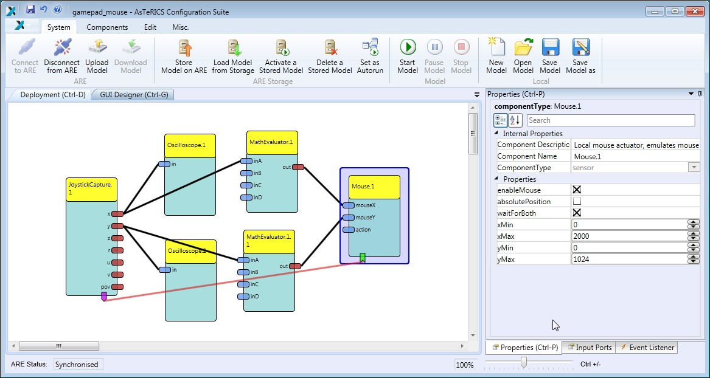

  
This relatively simple model creates a full mouse replacement via the gamepad joystick and desired buttons. A useful recapitulation and extension of this model would be to add adjustable mouse acceleration by a slider GUI element (as shown in 4.2.2).

  
  

4.  **Game Control and Making Games Accessible**
    

Gameplay is a very good way to raise motivation for training and can result in surprisingly good interaction results also for people with severe motor conditions. An example of creative input mapping is the PC gameplay of “gaming kitsune” - [http://www.youtube.com/watch?v=-y0-0f\_bZ6w](http://www.youtube.com/watch?v=-y0-0f_bZ6w)  
See also the “Custom Button Remapping Initiative” by Chuck Bittner: [http://www.askacapper.com/](http://www.askacapper.com/)

1.  **PC Input Emulation for Games using Keyboard**
    

Many games (especially new PC-games) need certain keyboard- or game controller interactions which cannot be considered as “accessible”. Here, we can try to create AsTeRICS models which generate the needed keyboard actions (e.g. key press, -hold, -release) or mouse inputs by desired sensors, or a model which remaps the game controller buttons according to the needs of a user.

In the next example the buttons of a standard PC gamepad are used to create keyboard input on the local keyboard. 4 buttons will be used to generate cursor keys (up, down , left, right) another button will be used to generate the “Enter” key. This model will be evaluated by a game of BubbleBobble on the free C64 emulator software.

Generate Keystrokes for the Cursors Keys  
Model file available: **ARE/models/tutorial/7\_CursorKey\_Emulation.acs**

*   Create a new model in the ACS
    
*   Add the “JoystickCapture” plugin (Components → Sensors → Standard Input Devices)
    
*   Add five “Keyboard” plugins (Components → Actuators → Input Device Emulation)
    
*   In the property “keyCodeString” of Keyboard 1,2,3,4 and 5 enter the desired Key-Codes, for example: “{UP}”, “{DOWN}”, “{LEFT}”, “{RIGHT}” and “{ENTER}”.  
    Please note that the “keyCodeString” could also contain letters and other special keys, for example “Hello {CTRL}a” or “{ALT}{TAB}” etc. A full list of supported Keys is supplied in Appendix C…
    
*   Now connect the event trigger port of JoystickCapture to the event listener ports of all five Keyboard components.
    
*   For every event channel: Assign the “pressedButton” event of the desired button to the “holdKey” event of the Keyboard plugin, then assign the “releasedButton” event to the “releaseKey” event. In the figure below, Button 7 of the gamepad is assigned to “hold” and “release” of one Keyboard plugin.
    

*   This mapping will generate and hold a key press when the gamepad button is pressed.  
    The key is released when the button is released.
    

*   If you are unsure which button number your desired button has, you could use an EventVisualizer plugin to view the events which are generated as you press the buttons. Alternatively, you can test the button numbers in the property window of the game controller in the windows device manager.
    

The resulting model and the game window (here the classic “BubbleBobble”, played on the free CCS64 emulator via the AsTeRICS model) can be seen in the following pictures:

**Figure 4: Joystick-based key emulation model, and a game of “BubbleBobble”:**  
**  
**

  
  

2.  **PlayStation 3 Control and HID Device Emulation**
    

The Sony PlayStation 3 (PS3, see http://uk.playstation.com/ps3/) can be controlled by the AsTeRICS platform via a special piece of hardware – the so-called “HID-Actuator”. The HID-Actuator allows emulation of a standard Human Interface Devices (HIDs) like for example the PS3 USB game controller, to give people with disabilities options to control this gaming console via desired sensors. The HID actuator looks like a USB stick but behaves like a mouse, keyboard or joystick when plugged into a target computer. A wireless HID actuator is commercially available from AsTeRICS partner IMA (see chapter 6), a Do-It-Yourself building guide for electronics-hobbyists is available in the DIY-section of the AsTeRICS homepage (please refer to http://www.asterics.eu/index.php?id=73).

5.  **Environmental Control with OSKA and Infrared Remotes**
    

In the following model example, a universal infrared remote control is utilized to control a music center/CD-player. The user can select desired functions of the music center by choosing graphical symbols in an on-screen keyboard. There are some hardware and software requirements for this model, which are described in the table below:

  

**Model Description**

**Requirements**

**Remarks & considerations**

  

This model enables Infrared remote control of a music player. The IR-commands are learned from the original remote-control using the IR Trans GUIClient software tool.

  

These infrared commands are triggered via an on-screen keyboard grid which sends a number of pre-defined command names when the according cells have been selected.

  

For the Infrared code learning and playback, the IrTrans device has to be available and installed.

See [http://www.irtrans.de](http://www.irtrans.de/)

  

  
Some standard on-screen keyboard grids which are delivered with the AsTeRICS package can be used for free.

For creating custom grids, the OSKA editor must be purchased from

[http://www.clarosoftware.com/index.php?cPath=365](http://www.clarosoftware.com/index.php?cPath=365)

  

  

This model provides mouse or touch screen interaction. Scanning or webcamera / headtracking-based selection of keys/symbols could be added if desired.

  

The infrared remote control commands of the desired music player or home entertainment device can be learned as described in the IRTrans manual.

  

**Table 2: A model for On-Screen Keyboard controlled Infrared Remotes**

The IRTrans universal infrared controller can learn and replay arbitrary IR commands. It connects to a PC or to the AsTeRICS Personal Platform via USB, LAN or WLan (depending on the model). Using the IRTrans “GUIClient” tool, IR-commands of a desired remote control can be recorded and stored under a desired command name. The following figures show the IRTans module (LAN version) and the GUIClient software tool:

 

To learn new IR-codes, the following steps are performed in the IRTrans “GUI client” tool:

*   A Command is recorded from an individual IR remote control
    
*   Remote control- and command name are be assigned, multiple remotes are possible
    
*   Commands are stored in a database and can be flashed into the IRTrans device
    

To replay recorded commands within the AsTeRICS system, the IRTrans actuator plugin accepts command names which have been learned with the IRTrans GUI client at its “action” input port.

For a convenient selection of the desired infrared remote command, OSKA (the On-Screen Keyboard Application) is used. The free OSKA player is part of the AsTeRICS framework. (For a detailed description of the OSKA features please have a look at chapter 5).

In the AsTeRICS model, the OSKA plugin is configured to display an on-screen keyboard grid named “aat\_hifi.xml” which is available in the subfolder “OSKA/keyboards/homeControl”. The grid has several keys (cells) which correspond to the function of the music player:

When the user selects a cell, OSKA sends suitable action strings to the OSKA plugin. These actions strings can be defined in the OSKA editor and comply to the following format:  
“@IRTRANS: snd <remotename>,<commandname>”, where <remotename> and <commandname> correspond to the learned infrared commands. When a cell has been selected, the action string is emitted by the “action” output port of the OSKA plugin. This port is connected to the “action” input port of the IRTrans plugin, so that the action strings are transferred to the IRTrans module, which sends the associated infrared code.

The “aat\_hifi” keyboard grid is pre-configured to send the following action strings:

  

**Key caption**

**Function**

**Action string**

On/OFF

Switch to/from standby

<@IRTRANS:snd asterics,rc\_operate>

select MP3/CD/Radio/External

Change mode of operation

<@IRTRANS:snd asterics,rc\_function>

increase volume

Change Volume

<@IRTRANS:snd asterics,rc\_volume\_up>

reduce Volume

Change Volume

<@IRTRANS:snd asterics,rc\_volume\_down>

Previous

Change track

<@IRTRANS:snd asterics,rc\_previous>

Next

Change track

<@IRTRANS:snd asterics,rc\_next>

Pause

Play/pause

<@IRTRANS:snd asterics,rc\_play>

Play

Play/pause

<@IRTRANS:snd asterics,rc\_play>

Stop

Stop

<@IRTRANS:snd asterics,rc\_stop>

Back to main Menu

Change the grid

<ChooseGrid:aat\_homecontrol>

  
  

Thus, the “aat\_hifi.xml” keyboard grid can be used without any change if a remote control named “asterics” and the command names given in the above table have been learned and stored into the IRTrans device using the “GUI client” software tool.

Alternatively, the action strings can be modified to different remote control- and command-names as shown in 5.2.2

Using the OSKA On-Screen Keyboard and the IRTrans for Infrared control  
Model file available: **ARE/models/tutorial/8\_OSKA\_InfraredRemote.acs**:

*   Create a new model in the ACS and add the “OSKAExternalScanning2d” plugin  
    (Components → Processors → OSKA)
    
*   Enter the grid name “keyboards\\homeControl\\aat\_hifi.xml” into the property “keyboardPath”. If the ARE is connected and the model is uploaded (synchronized) you can choose the keyboard name from a pull-down list of available keyboards
    
*   Add the IrTrans Plugin (Components → Actuators → Home Control)
    
*   Connect the “action” output port of the OSKA plugin to the “action” input port of IrTrans
    
*   If you have the USB version of IrTrans, enter “localhost” into the “hostname” property of the IrTrans component and start the IRTrans server tray; If you have the Lan- or WiFi version, enter the IP-address of the IrTrans module.
    

**Figure 5: OSKA Keyboard layout and ACS model design for the IR-control application**

  
If alternative sensor input is desired to switch and select keys, the event inputs of the OSKA plugin can be used.

  
  

6.  **M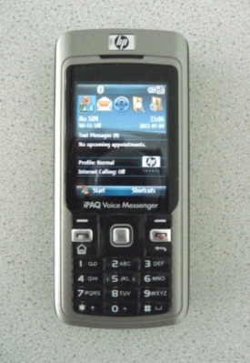 obile Phone Control** 
    

Currently, AsTeRICS is able to interface with mobile phones running Windows Mobile (5.0 and above), Android Phones (2.1 and above) and GSM modems. Dedicated AsTeRICS plugins allow making phone calls, accepting and disconnecting phone calls and sending and receiving SMS.

The connection between AsTeRICS and the phone is established using Bluetooth or WiFi and a special server application which is installed on the phone (part of the AsTeRICS package). The figure on the right side shows a mobile phone with the AsTeRICS phone server application running.

  
  

1.  **Controlling a Windows Mobile 6.5 phone**
    

For connecting a Windows Mobile Phone to the ARE, a Bluetooth device must be available and the Phone Library Server Application has to be installed on the phone (ServerInstall.cab file provided in the AsTeRICS release package), as outlined in the following steps:

*   If you are using Windows XP install the ActiveSync application.
    
*   Connect the phone to PC using a USB cable. On Windows 7, if you connect the Windows Mobile phone for the first time, the Microsoft Windows Mobile Device Center application will be installed automatically.
    
*   Using ActiveSync or Windows Mobile Device Center, copy the Server installer to the phone and run it.
    

After Installation of the Server Application, switch on Bluetooth on your phone and make it visible, then run the Server Application.  After that, the PhoneControl plugin (Actuators → PhoneInterface → PhoneControl) can be used to connect the phone and control the SMS and Call functions:

*   Enter the phone's Bluetooth name, which can be read from the Bluetooth settings of the phone, into the “bluetoothPhoneName” property.
    
*   Enter the phone number you want to call into the “defaultPhoneID” property, using +<country code><phone number> notation.
    
*   Connect the Event Listener ports of the PhoneControl plugin to desired event triggers which should activate the respective functions. Please refer to the ACS help for the PhoneControl plugin for details.
    
*   A nice GUI is helpful for using the phone functions. The next example shows how to use the OSKA On-Screen Keyboard for that purpose.
    

  
  

  
  

2.  **Controlling an Android Phone**
    

Mobile phones running Android 2.1 and above can be integrated with the ARE. For this, the AsTeRICSPhoneServer application must run on the phone, which communicates with the AndroidPhoneControl plugin. The connection between the phone and the plugin is done via the TCP protocol. In most cases the connection is established through WIFI technology.

The AsTeRICSPhoneServer application is part of the AsTeRICS runtime distribution and can be found in the folder /Android. Install the AsTeRICSPhoneServer.apk file by copying it to the Android phone (via USB, email, etc.) and running it on the phone, e.g. by using a file system browser app.  
The figures below show the running PhoneServer on the Android phone (left) and the properties of the ARE AndroidPhoneServer plugin (right).

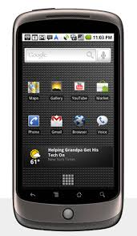    
  
  

If the AndroidPhoneServer plugin is configured to act as “server”, the AsTeRICSPhoneServer app running on the Android device must be configured to act as “client” and vice versa. If the connection is done via public network, the device with the public IP should act as server. If both devices are on the same local network, it does not matter which device acts as the server.

For the device which acts as client, the server IP address must be provided (ARE plugin: in the IP property , AsTeRICSPhoneServer App : in the Server IP property). Then, set the same port number for both devices (default port number is 21111).  
Choose “EnableServer” in the App and run the ARE model. Wait for a connection between ARE and Phone.

**Features of the AndroidPhoneServer plugin:**

The phone number of the remote receiver can be set using the defaultPhoneID property or via the PhoneID input port. The SMS message text can be set using the SMSContent input port. If the phone is connected, it can be controlled by several event listener ports which accept incoming events.

A demo model file is available here: **ARE/models/tutorial/9\_AndroidPhone\_Control**.**acs**

  
  

Phone function control via Event Listener ports of the AndroidPhoneServer plugin:

• MakePhoneCall – Makes a call to the remote receiver.  
• AcceptPhoneCall – Accepts incoming phone calls. Remark: The accept call function may not  
work for Androd 4.1 (Jelly Bean) phones, if the wired headset is not used.  
• DropPhoneCall – Drops incoming phone calls or finishes phone calls.  
• Send SMS – Sends the SMS.

The phone state is provided by the Event Trigger ports of the plugin:

• idleState – The phone is in the idle state.  
• ringState – The phone is calling. Caller number is given by the RemotePhoneID output port.  
• connectedState – The phone is connected.  
• newSMS – There is a new SMS. The message is given by the ReceivedSMS output port  
• Error – An error occurred. The error number is given by the ErrorNumber output port.

The phone can be also controlled by text commands (actions strings) sent to the “action” input port:

• @PHONE: CALL: Phone\_ID – Calls to the Phone\_ID number  
• @PHONE: CALL – Makes a call to the phone number which was set earlier.  
• @PHONE: ACCEPT – Accepts incoming phone calls  
• @PHONE: DROP – Drops incoming phone calls or ends calls.  
• @PHONE: SET\_ID: Phone\_ID – Sets the phone number.  
• @PHONE: SET\_SMS: "Message\_content" – Sets the SMS message.  
• @PHONE: SMS:Phone\_ID, "Message\_content" – Sends Message\_Content to the Phone\_ID  
• @PHONE: SMS – Sends the SMS message.

This allows an easy combination with OSKA grids that send the appropriate action strings to the plugin when a cell in the OSKA grid is selected. The screenshot below shows the example grid **OSKA/keyboards/phoneControl/phone\_android\_menu.xml**:  
  
  

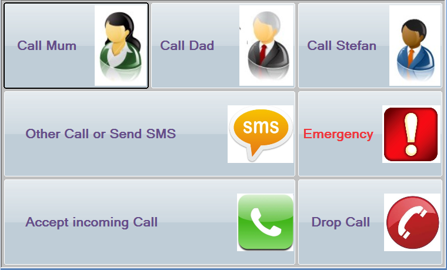  
  
  

For functional operation it is sufficient to select this grid in the OSKA plugin and connect the “action” output port of the OSKA plugin to the AndroidPhoneServer plugin’s “action” input port.

7.  **Working with Bioelectric Signals: the Enobio BNCI Recording Unit**
    

The Enobio Device is a wireless Biosignal acquisition unit for Brain and Neural Computer Interfaces developed by the AsTeRICS partner company Starlab Living Science (Barcelona). Enobio provides 4 channels of bioelectrical signals - for example EEG, EMG EOG or ECG. The Enobio sensor component interfaces the Enobio device to the ARE, so that signals recorded by Enobio are available to be processed by other plugins running in the ARE.

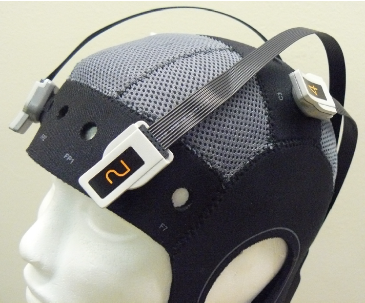 

**Figure 6: Starlab Enobio**

For a detailed explanation of the Enobio features, price information, software support and guidelines how to charge or attach the device please have a look at: [http://starlab.es/products/enobio](http://starlab.es/products/enobio)

  

**Model Description**

**Requirements**

**Remarks & considerations**

  

The following model descriptions provide an interface to the Enobio unit for blink detection. The eye-blinks are used to create single or double clicks of the left mouse button.

  

Such models could be combined with the camera-mouse model or used together with OSKA to perform eye-blink controlled scanning.

  

Other possible applications are the modification of model- parameters or model switching by double-eye-blinks.

  

An Enobio unit must be available and installed on the computer. The internal battery is charged, and the operation of the hardware has been verified using the Enobio software which is delivered with the product.

  
  

  

There are various ways how Enobio could be used in the AsTeRICS framework, including EOG, EMG and EEG applications.

The major Brain-Computer-Interface (BCI) paradigms which allow computer control by brainwaves, for example P300, SSVEP and movement imagination can be interfaced via the OpenVibe bridge plugin.

  

Additionally, dedicated AsTeRICS plugins are available for SSVEP based BCI setups.

  

**Table 3: Description of the Enobio eye-blink detection**

1.  **Display Enobio Signals and Verify the Signal Quality**
    

This basic model will display the Enobio signals to check electrode connections and verify the signal quality. (As a requirement, the Enobio hardware has to be available and the drivers for the correct system architecture need to be installed – please refer to the Enobio documentation.)

  
  

*   Create a new model in the ACS
    
*   Add the Enobio sensor (Components → Sensors → Bioelectric Measurement)
    
*   Add the EnobioDisplay actuator (Components → Actuators → Graphical User Interface)
    
*   Place the components next to each other and connect all channels:
    

  
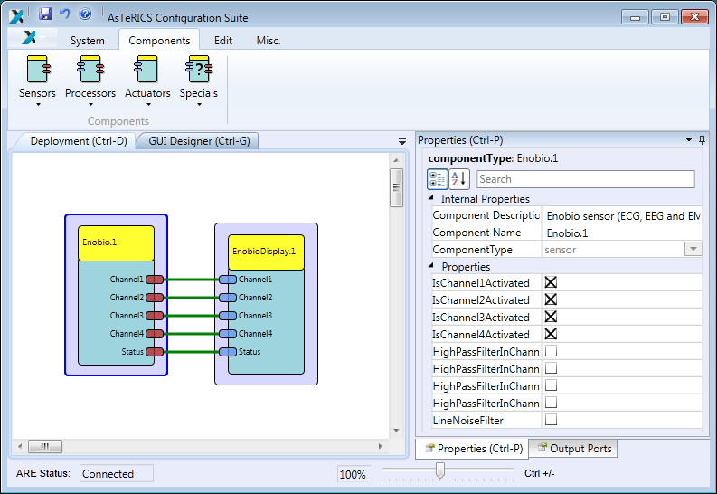

  
  

*   Connect the Enobio System and switch it on (red power led active)
    
*   Set up the electrode cap and connect the ear clip (with contact gel)
    
*   Start the ARE, upload and start the above model
    
*   Verify the signal quality of the traces seen in the EnobioDisplay window:  
    all channels should turn green after a settling time of about 1-2 minutes as can be seen above
    

  
  

2.  **Blink Detection to create Mouse Clicks**
    

Model file available: **ARE/models/tutorial/A\_Enobio\_BlinkDetection.acs**:

*   Create a new model in the ACS
    
*   Add the Enobio sensor (Components → Sensors → Bioelectric Measurement)
    
*   Add a Mouse actuator (Components → Actuators → Input Device Emulation)
    
*   Add a BlinkDetection processor (Components → Processors → DSP and Feature Detection)
    
*   Connect “Channel1” of the Enobio component to “input” of the BlinkDetector
    
*   Connect the event trigger port of the BlinkDetector to the event listener port of the Mouse component, attach “BlinkDetected” to “leftClick” and “DoubleblinkDetected” to “dblClick”:
    

  
  

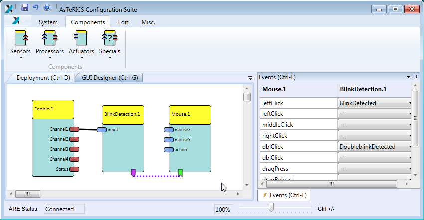

The above model creates left and double clicks by eye blinking. Of course, this configuration could be added to the camera\_mouse model, replacing the automatic dwell-clicking if desired.

  
  

8.  **Other interesting models and system capabilities**
    

The model creation examples in this chapter could only give a first impression what is possible with the AsTeRICS plugins - just a small portion of the available plugins could be covered. Additional demo models can be found in the ACS subfolder “**ARE/models/useCaseDemos**”):

*   Voice recognition and synthesis in various languages via the SpeechProcessor plugin
    
*   Home Automation and smart home control via the KNX and FS20 plugins
    
*   A DIY-gaze tracking solution featuring eye-tracking with head-pose correction - described in the DIY-guides and supported by dedicated models
    
*   Several TCP-based bridges provide interfaces to other frameworks  
    including major BCI projects like OpenVibe ([http://openvibe.inria.fr/](http://openvibe.inria.fr/))
    

or Tobi ([http://www.tobi-project.org/](http://www.tobi-project.org/))

*   The GestureFollower system for online gesture recognition can be integrated ([http://ftm.ircam.fr/index.php/Gesture\_Follower](http://ftm.ircam.fr/index.php/Gesture_Follower))
    
*   The ARDrone quadcopter and the Ladybird quadcopter have been interfaced with AsTeRICS using WiFi and PPM-based radio links
    
*   A pneumatic mouthstick gripper and a 4-Degrees-Of-Freedom mouth-joystick
    
*   A force-sensor based lip-mouse solution with sip/puff click selection
    

  
  

Please note that many of these models depend on additional hardware or software and will not work “out-of-the-box” on a standard PC or Laptop. If you have questions or problems please contact the AsTeRICS Team via the homepage or consult the user forum.

  
  

5.  **OSKA – The On-Screen Keyboard Application**
    

The OSKA Suite is a commercial Assistive Technology software collection by the company ClaroSoftware ([http://www.clarointerfaces.com](http://www.clarointerfaces.com/))

OSKA Suite provides a configurable On-Screen Keyboard with various features like keyboard grid editor, support of different input devices, scanning and word prediction. (_Scanning_ is a special input method where keys are automatically highlighted and can be selected by e.g. a single switch input. Several scanning techniques exist, e.g. Row/Column scan, User-triggered scan etc.)

Furthermore, several assistive tools for alternative mouse input are part of the OSKA Suite, including TenKey Mouse, OneSwitch Mouse, ScrollWheel Scanning and others. For detailed information please visit:

[http://www.clarointerfaces.com/products/oska-suite.php](http://www.clarointerfaces.com/products/oska-suite.php)

The core product of OSKA Suite is an on-screen keyboard application, which can be interfaced to the AsTeRICS system. The OSKA on-screen keyboard has 3 main components, delivered as stand-alone software applications for Windows (compatible with Windows 7, Vista and XP):

*   OSKA Editor, to create Keyboard grids and define ARE action commands
    
*   OSKA Keyboard, the actual on-screen keyboard application
    
*   The OSKA Settings Editor, to select input method and options
    

For the AsTeRICS project, the OSKA Keyboard is provided as freeware, and it is included in the “AsTeRICS-Runtime” download package. OSKA Keyboard serves as a primary Graphical User Interface for various AsTeRICS use cases. Due to a dedicated OSKA plugin for the ARE it becomes possible to influence selections in the on-screen keyboard grid with desired sensors, or to control desired parameters or actuators in the AsTeRICS model via OSKA and a touchscreen.

1.  **OSKA Keyboard**
    

OSKA provides a wealth of features specifically designed for users who cannot easily use common input devices:

*   Text entry into all standard Windows applications, just like using a standard keyboard
    
*   Includes a range of keyboard templates including Mouth Stick and Head Pointer Keyboard
    
*   Offers a range of keyboards in different languages
    
*   Keyboard templates can be edited or designed from scratch for full customization
    
*   Support of existing pointing devices or switch systems
    
*   Supports Full Switch/Scanning Operation
    
*   Macros and User Definable Keys, Menu Shortcuts
    
*   Word Prediction
    
*   Fully supports touch technology such as touch screen laptops and PCs
    
*   Can be seamlessly integrated with AsTeRICS sensors and actuators
    

The following screenshots show two examples of OSKA Keyboard grids which are used together with the AsTeRICS framework for environmental control applications. The first screenshot shows an OSKA-grid to control a TV-set via infrared remote control (via the IRTrans infrared device):

The second screenshot shows control of rooms lights via the Konnex home automation network (interfaces via the Konnex plugin and a KNX/IP router):

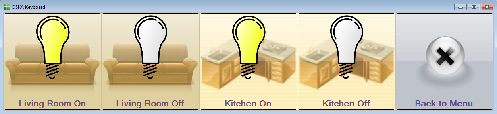

Of course, also “classical” on-screen keyboard layouts providing alphanumerical characters for alternative keyboard input in software applications is possible. The keyboard grid layout and functionality is defined using the OSKA Editor.

2.  **The OSKA Editor**
    

The OSKA Editor allows keyboards to be adapted to specific requirements. All the keyboards in OSKA are fully customisable, allowing the keyboard to be edited to suit the requirements of each user and task. The features of the OSKA Editor allow to:

Define the Keyboard Layout: Select the number of buttons on the keyboard. The number of columns and rows required and the size of the buttons in the Current Grid Setting can also be specified; Enter the text to be displayed on the button

*   Modify Grid Settings: Enables the size, the number of columns and rows, and the gaps between the buttons to be edited.
    
*   Adjust Button Settings: The style and appearance of individual buttons can be edited. This is also where labels or descriptions of the button and background images can be added.
    
*   Change Colours and Appearance, select Background Images and Fonts
    

  
  

*   Define Special Actions for Keys/Buttons:
    
    *   Play a sound or speak a text
        
    *   Start an Application
        
    *   Change the current keyboard grid
        
    *   Influence the scanning speed
        
    *   Control the mouse cursor position and clicking
        
    *   Control the on-screen keyboard position
        

The following screenshot shows the OSKA Editor in operation. The user interface is multi-lingual, here the German version of the user interface is shown.

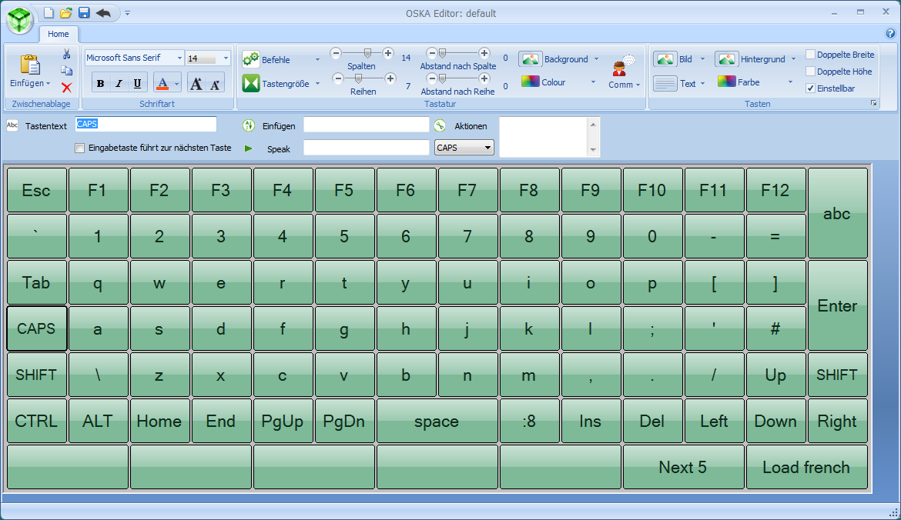

  
  

3.  **T he OSKA Settings editor**
    

After a keyboard is created in the OSKA Editor, the input methods can be defined and customised. In addition, certain keys can be further defined, giving further capability. The OSKA Settings Editor is designed to allow the setup of the input methods of keyboards that have been created in the OSKA Editor.

There are five input methods to choose from. Depending on the individual capabilities of a user, these can be set to allow the best control method of the keyboard.

  
  

  
OSKA Input Methods:

*   Keyboard Input: offers the choice of using either the cursor keys and the enter button or the numerical keypad and keypad enter button to move and select keys on the OSKA keyboard
    
*   Mouse Input:
    

  
  

*   “Point and Click” - standard mouse movements control the mouse cursor. Clicking the mouse button will perform a left click
    
*   “Point and Hover” - standard mouse movements control cursor movement. After hovering over an item for a predetermined amount of time the item is selected (when cursor is stationary). The time it takes to automatically select an item can be edited  
      
      
    

*   Gamepad Input:
    
    *   “Map to Keyboard“ uses the analogue gamepad joystick to move the selector around the keyboard. One of the gamepad buttons is then used to select the key
        
    *   “Map to grid” is designed to be used on square keyboard layouts with sides of 5, 8 or 9 buttons. This allows for selections based on two gamepad directional inputs  
          
          
        
*   Scanning Input: Scanning input cycles through the keys using a switch/scanning method. The scanning input can be controlled by clicking the mouse, pressing a joystick button or pressing a key switch to select.
    

  
  

*   Mouse/Touchpad Grid Input
    
    *   “Mouse X & Y” - highlights an individual key. Very small movements on the touchpad (or by a mouse) will cause the highlight to move in the direction of the keys
        
    *   “Mouse Wheel, Mouse X and Mouse Y” - works in a similar manner to two switch scanning. Move the mouse wheel (or finger/mouse horizontally/vertically) and the row/column will be scanned. Then click either the mouse wheel or one of the 'checked' mouse buttons. Individual keys will now be scanned by moving the mouse. Click to select a key.
        

4.  **Using Word Prediction and the Communicator Line**
    

OSKA offers some interesting features beyond the on-screen keyboard functions, for example word prediction and a communicator line. The word prediction offers up to 5 suggestions which can be placed on desired keys. Using the prediction editor, dictionaries can be created from word documents, text files or separate words. Dictionaries for multiple languages are available. A dictionary is selected using the settings editor, where also the “learn new words” functions can be activated – so that the dictionary is extended during typing.  
The Communicator line allows composition of a longer input sequence / sentence, which can then be sent to the ARE (e.g. to send an SMS) or spoken by the speech synthesizer.  
  
  

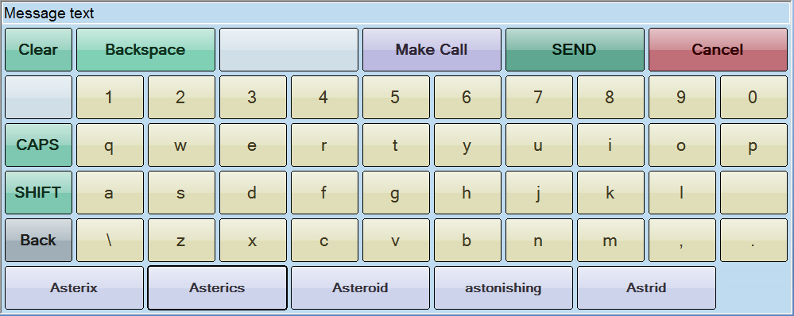

  
  

2.  **Using OSKA Keyboard together with the ARE**
    

OSKA Keyboard is part of the OSKA Suite by ClaroSoftware, it displays functional on-screen keyboards which have been created using the OSKA Editor. Together with the OSKA plugins for the ARE, OSKA Keyboard offers a powerful user interface front end for AsTeRICS. There are three OSKA plugins, specialized for different scanning variants: internal scanning (automatically done in the OSKA applications) and external scanning (via sensor information from the ARE)

These Plugins feature the following functions to interact with the OSKA Keyboard application:

*   The OSKA plugins can start the OSKA Keyboard application, to display the on-screen keyboard when a system model is started.
    
*   The OSKA plugins can shut down the OSKA Keyboard application when a model is stopped.
    
*   OSKAExternalScanning1D and OSKAExternalScanning2D haves input ports to accept cell coordinates and event ports for cell selection
    
*   The OSKAInternalScanning plugin starts OSKA in internal scanning mode and has event ports for cell selection
    
*   Action Strings can be sent from OSKA Player to the ARE plugins to control actuators, influence model parameters (for example sensitivity of a sensor) or switch to another model
    

The OSKA Player and the ARE plugins are connected via TCP/IP, which means that OSKA Keyboard could run on a different computer than the ARE if desired. In most of the use-cases OSKA runs on the same machine. The following figure illustrates the flexibility of the OSKA-ARE connection:

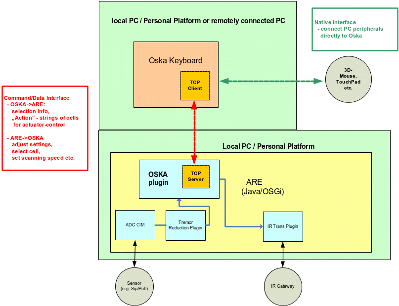

  
As can be seen in the above scheme, OSKA Keyboard could use the “internal” support for input devices and at the same time be connected to an OSKA plugin to activate home appliances or actuators. Alternatively, OSKA could be fully controlled by the ARE and only serve as a graphical display.

1.  **Sending Action Strings to the ARE**
    

The OSKA Editor provides the possibility to assign action strings to every particular cell of the on-screen keyboard. If a cell is selected in the OSKA keyboard which has an action string assigned, “action” output port of the OSKA plugin transfers the action string value to all connected components. If a connected plugin supports the action string, it can react.

The following screenshot of the OSKA Editor shows how to assign an action string to a cell. Right-click the “Actions”-listbox and choose “TCP” to see a list of suggestions. For a complete list of action strings supported by the ARE plugins, please refer to Appendix B.

  
  
  

  
In the above keyboard grid, the action string „@IRTRANS:snd asterics,rc\_play” is assigned to the “Play”-button of the keyboard. This action is understood by the IRTrans-plugin which sends the command “rc\_play” to the remote “asterics” on reception of that string, given that the IR-commands have been learned by the IRTrans module before as shown in the next chapter. The action strings are transferred every time the corresponding key is pressed.

2.  **Customizing OSKA Keyboard Templates**
    

The OSKA Editor (which is not part of the free AsTeRICS software distribution) is needed to change the layout of OSKA grids. Nevertheless, if a key has the “user-editable” property enabled, it’s button description and action string can be modified with the free OSKA Keyboard application, by right-clicking the key and selecting “Edit Key”. Several template grids are provided with the AsTeRICS-Runtime package which can be customized using this method. Below, the “custom4x4.xml” grid is shown:

 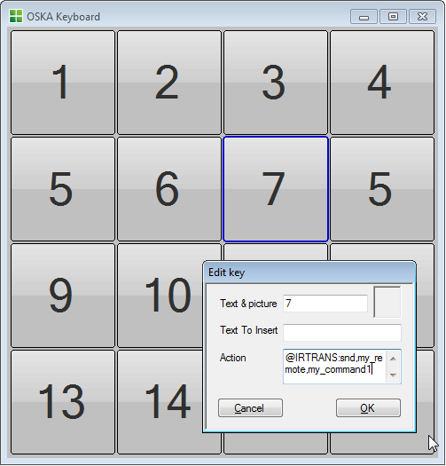

6.  **AsTeRICS Hardware**
    

A wide range of standard input devices and commercial off-the-shelf AT products can be used together with the AsTeRICS software framework. Additionally, a set of custom sensor- and actuator-hardware has been developed in course of the AsTeRICS project, to offer flexible and affordable interaction solutions for different kinds of motor abilities. This chapter describes the supported hardware modules and outlines possible use-case scenarios for particular sensors and actuators.

  

1.  **The AsTeRICS Personal Platform**
    

The AsTeRICS Personal Platform is a mobile computing system, developed by AsTeRICS parner IMA, with dedicated extensions for AT interfaces. It could be considered as a mobile Mini-PC with Windows Embedded Standard-7 operating system, which has additional capabilities for sensor- and actuator connections and an integrated LC-Display with touchscreen to select desired models. The Personal Platform core module provides 3 connectors for digital switches, 2 analog input connectors, 2 control output connectors, 6 USB ports, Ethernet/LAN, WiFi, Bluetooth 2.0, a DVI connector and Analog Audio (in/out).

**Figure 7: Personal Platform (front–top view)**

A Kontron nanoETXexpress-SP single board computer with Intel Atom CPU is the core computing module in the Personal Platform. The CPU runs at 1,6 GHz, the on-board RAM is 2GB. A built-in SSD provides 64GB of memory for operating system, drivers and the ARE.

  
  

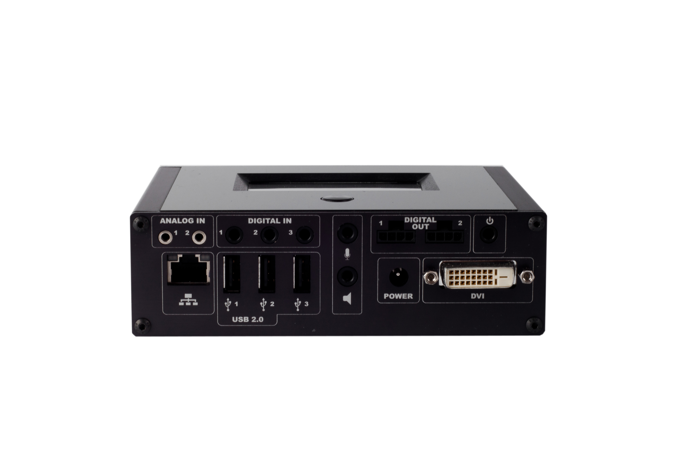

**Figure 8: Personal Platform (rear view with interface connectors)**

Certain types of sensors and actuators can be directly interfaced to Personal Platform (without an additional CIM module):

*   3 x Digital Input
    
    *   for connection of digital switches for example standard AT input switches
        
    *   3.5 mm Jack connector
        
    *   0 to 3V input range (threshold=1.65V)
        
    *   Programmable 3 V pull-up resistor and wake-up function for Personal Platform
        
    *   Represented in the ARE by the “PlatformDigitalIn” sensor plugin
        

  
  

*   2 x Analog Input
    
    *   to connect analog sensors like a strain gauge or pressure sensor
        
    *   universal voltage or resistive input
        
    *   Voltage input range 0 – 5 V
        
    *   Resistive input range 10 Ohm - 1.5 MOhm
        
    *   2.5 mm stereo Jacks connectors
        
    *   Represented in the ARE by the “PlatformAnalogIn” sensor plugin  
          
          
        
*   2 x Digital Outputs
    
    *   to control external loads or appliances
        
    *   Open Collector, approx. 500 mA current limit
        
    *   3-pin connector
        
    *   Represented in the ARE by the “PlatformDigitalOut” actuator plugin  
          
          
        
*   Power supply options
    
    *   AC/DC (230 VAC to 7,2 – 16 VDC) supply adapter
        
    *   Internal accumulator for approx. 20 min. operation; recharged when en external power source is connected; additional external battery or accumulator can be connected  
          
          
        
*   Power ON/OFF switch which also acts as Power Stand-by Button. A 3,5mm jack plug connects parallel to the Power ON/OFF switch for external connection of a button.
    

  
  

2.  **Custom Interface Modules and Sensors**
    

A set of Communication Interface Modules (CIMs) is available to interface digital and analogue sensors and actuators with the AsTeRICS system. These CIMs can be connected to a standard PC, Laptop or Netbook computer via a USB mini connector (Type-B), or they can be inserted into the CIM expansion container of the Personal Platform. The CIMs have a (3D-printed) plastic case. The CIM size is 110 x 35 x 15 mm.

  

**Hardware Module**

**Purpose**

**Features**

**Interface**

DigitalIn CIM

Connect simple switches, standard AT-switches etc.

6 channel input via 3.5 mm mono Jacks  
“DigitalIn” sensor plugin

  

USB/CIM Container

AnalogIn CIM

Connect sensors (bend, strain gauge, pressure sensor etc.)

Voltage input range 0 – 5 V  
Resistive input range 10 Ohm - 1.5MOhm

2.5 mm stereo Jacks connectors

“AnalogIn” sensor plugin

USB/

CIM Container

DigitalOut CIM

Control simple actuators and devices

2 x relay output 3x Open Collector (OC) outputs with _2,5mm 3-pin connector_

configurable 3V pull-up, 5V and 12V fixed-voltage;

“DigitalOut” actuator plugin

USB/

CIM Container

ZigBee CIM

Connect wireless ZigBee devices

coordinator for ZigBee peripherals developed in AsTeRICS project (Wireless DigitalIn/Out and accelerometer)

USB/

CIM Container

Enobio CIM

Connect the Enobio EEG/EMG/EOG device

Delivers 4 channels of bioelectrical data

USB/

CIM Container

Acceleration Sensor

Detect movements

Delivers 3-axis acceleration data

ZigBee CIM

  
  

The Personal Platform core module can be extended with an attachable container for Communication Interface Modules. The CIM container features 3 slots for desired CIM Modules. This makes it possible to use the Personal Platform in two variants:

*   Light Personal Platform variant without the expansion slots as a small compact option which is sufficient for many use cases
    
*   Full Personal Platform variant with the expansion slots for additional input/output capabilities
    

Thus, up to 21 digital input switches could be connected to the Personal Platform. The connection of the CIM expansion container is accomplished via 3 standard “Type-A” USB ports at the side of the CIM container and the Personal Platform respectively (this occupies 3 of the 6 free USB ports of the platform). The mechanical connection gets mechanically stable due to 4 screws.

**Figure 9: Personal Platform, full variant (with container and 3 external CIMs)**

  
  

1.  **Display options for the Personal Platform**
    

Depending on the desired application, one of the following display options can be used for the Personal Platform:

*   No Display, which could be the choice for certain types of applications, for example if just an electro-mechanical gripper module is controlled and no graphical user interaction is needed. In this case the Personal Platform is configured to auto-start the model and no display is attached which saves battery power.
    

  
  

*   DVI display or computer monitor attached. This variant could be useful if the Personal Platform is used as a full computer replacement (e.g. to use the web-browser or a word processing software directly on the platform) and a big screen is desired.
    

  
  

*   A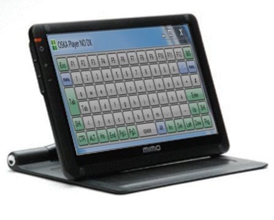 ttachable USB display with touchscreen. This option is useful for a mobile operation of the platform where touchscreen interaction is desired or mandatory. The MIMO 720s USB LC-Display with touchscreen is supported by the Personal Platform and features a Vesa-compatible mounting option. The MIMO 720s is shown in the following figure:
    

  

  

  

  
  

  
  

2.  **The Universal HID Actuator**
    

The Universal HID Actuator module is a USB dongle which acts as mouse-, keyboard- and joystick devices on a remote system. Thus, no driver software is needed on Mac/Linux or Windows computers to allow control of these standard input devices. The control information (for example x/y mouse cursor position and clicking commands) are sent from the ARE (running on the Personal Platform or on a Laptop/Netbook computer) to the HID actuator dongle via a Bluetooth wireless connection or via a USB cable.

The HID Actuator is of special interest if for gaming use cases because it allows to completely replace a PS3 “sixaxis” controller for the PlayStation 3 gaming console. Thus, dedicated system models can be generated which use desired sensors to control PS3 games via the HID actuator.

The following figure shows the connection of the HID actuator to the remote (“host”) system:  
  
  

**Figure 10: Universal HID Actuator (wireless version, with and without casing)**

  
  

**Figure 11: block diagram showing application of the Universal HID Actuator**

The HID Actuator is based upon a low-cost 8-bit AVR microcontroller. The firmware of the HID Actuator is available as Open Source and part of the AsTeRICS source code distribution. A Do-It-Yourself building guide for a wired version of the HID-Actuator is available in the DIY-section of the AsTeRICS homepage(please refer to http://www.asterics.eu/index.php?id=73).

3.  **Eye Tracking Support**
    

An affordable eye-tracking and gaze-estimation solution has been developed by the AsTeRICS consortium: the headmounted Smart Vision Module (SVM). The CAD files for the 3D-printed parts, the PCB design for the needed Sensorboard PCB are available as open hardware, the needed software tools are part of the AsTeRICS open source distribution.

The AsTeRICS eye tracker offers different mounting options and tracking solutions, based upon low-cost cameras and IR- or visible light based tracking algorithms. The 3D-model below shows the three main components of the head mounted tracking solution: The eye-tracking camera (using IR-supported dark pupil tracking) (1), the optical sensor for tracking remote IR-LEDs in the scene (for head pose correction) (2), the Sensorboard PCB containing a microcontroller for sensor fusion and a 9 degrees-of-freedom Inertial Measurement Unit (IMU) (3).

**  
Figure 12: The AsTeRICS eye/gaze-tracking unit (a.k.a “headmounted SVM”)**

  
  

Detailed building instructions and descriptions of the dedicated AsTeRICS plugins are available as a separate document in the DIY-section of the AsTeRICS homepage (please refer to [http://www.asterics.eu/index.php?id=73](http://www.asterics.eu/index.php?id=73)).

  
  

For further details about customized AsTeRICS hardware including price information, order procedure and included service, please refer to the AsTeRICS homepage.

  
  

3.  **Supported “Off-The-Shelf” Devices and Standards**
    

*   Any joystick, keyboard or mouse, special AT devices being a joystick, keyboard or mouse
    
*   The Nintendo Wiimote controller (+ Nunchuk extension) can be used as input devices
    
*   The Microsoft Kinect 3d-sensor can be used as input device
    
*   The MIMO USB LCD with touchscreen
    
*   The Arduino microcontroller for analog input and digital input and output
    
*   Webcams for head-tracking, modified webcams for eye-tracking/ gaze estimation
    
*   The Razor 9-degree-of-freedom Inertial Measurement Unit by Sparkfun
    
*   The ID Innovations RFID reader
    
*   The Starlab Enobio wireless BNCI system
    
*   The OpenEEG biosignal acquisition system
    
*   The 3Dconnexion SpaceNavigator 3d mouse products
    
*   Home automation standards KNX and FS20
    
*   The IrTrans universal infrared remote control module
    
*   Windows Mobile and Android phone control
    
*   Wav- and Midi Audio playback
    

  
  

Note: Depending on the hardware modules you want to use, it may be necessary to install additional drivers.

  
  

**Figure 13: Supported “off-the-shelf” sensors/actuators for AsTeRICS**

  
  

4.  **Application Scenarios using AsTeRICS hardware**
    

In this section, some use-case scenarios are described which utilize the AsTeRICS hardware modules.

1.  **Sensor Scenarios**
    

  

**Sensor Type**

**Sensor values**

**Suggested usage scenario**

**Intended Target Group**

  

Digital Switches

  

Digital (0 or 1),

  

connected to DigitalIn CIM via 3,5mm Jack plug or to Arduino microcontroller

  

  

Selection of OSKA cells (scanning)

  
Mouse Clicks (left / right / drag),

  
Direct selection of actions  
(switch grid / make phone call ...)

  

  

People who can intentionally press one of the available switches

  

Mechano-resistive sensors ,  
Flex-Sensor, Bend Sensor

  

  

Resistive values

  
Connected to AnalogIn CIM via jack plug  
or to Arduino microcontroller  
  

  

Application in textiles e.g. clipped to a bandage

  
Choosing active OSKA cell

Mouse Click (left / right / drag)

  

People who can intentionally bend body parts like finger / toe / elbow / knee /shoulder / foot etc.

  

Sip/Puff Sensor

(pressure sensor)

  

Voltages (0-5V)  
depending on pressure input

  

Connected to AnalogIn CIM or to Arduino microcontroller

  

  

Choosing active OSKA cell or

control scanning speed

  
Mouse Click (left / right / drag)

  

People who have active control of breath / mouth muscles

  

9-DOF-Razor Inertial Measurement Unit (IMU)

  

3 axis orientation values (pitch, yaw and roll)  
from 0 to 180 / 360

  

Connected to USB

  

Choosing active OSKA cell

  

Mouse Click (left / right / drag)

Direct mouse control (with restrictions)

  

People who can intentionally move body parts (shake / stomp / wiggle etc.) to extract binary information

  

Webcamera for Head Tracking or SVM for eye tracking

  

  

x/y movement of nose and chin

  
Eye movements

  

Mouse movement

Mouse Click (left / right / drag)  
  
Direct selection of OSKA cell

  

  

People with fine motor control of the head

or conscious eye movements or control of eye blinks

  

Enobio

for blink detection

  

  

  

Up to 4 channels of EMG/EEG /EOG transmitted wirelessly via ZigBee and a USB receiver module

  

Clicking /Selection by EMG (facial muscles, eyebrows, blink detection)

  

  

People how can intentionally move their eyebrows and/or blink.  
  

  

3dconnexion

SpaceNavigator Mouse

  

  

6 degrees of freedom (analogue values),

2 buttons

  

Direct mouse control or OSKA control  
  

  

  

People with fine motor control (of hand in particular)

  

Microphone for Voice input

  

Voice data

  

Connected via Bluetooth (via BT-USB dongle)

  

Direct actuator control, select mouse click type, switch models

  

People who can speak

**Table 4: Sensor scenario suggestions**

2.  **Actuator Scenarios**
    

  

**Actuator Type**

**Connection and prerequisites**

**Suggested usage scenario**

  
RemoteMouse  
RemoteKeyboard  
RemoteJoystick

  
AsTeRICS HID-actuator (USB-dongle) connected to the remote computer

  
Mouse, Keyboard and Joystick devices can be emulated in hardware (without needing additional drivers on the remote machine) just by plugging in the USB dongle.

  

PlayStation 3 controller emulation for game control  
  

Mouse

Keyboard

(local versions)

  
none

  

Local input device replacement for computer- and application control

  
IrTrans universal infrared remote

  
IrTans device connected via USB, LAN or WiFi

  
Control of home appliances and entertainment devices (TV, DVD, music player, ..) via desired sensors, on-screen-keyboard or touchscreen.  
  

Toy control of infrared enabled toys (e.g. RoboSapien)  
  

  
Konnex home automation gateway  
  

  
KNX infrastructure with KNX/IP router

  
Control of lighting, heating, ventilation, window-blends, etc.

  
Generic Digital Control Output  
  

  
DigitalOut CIM with Relais output (available 10/2010) or Arduino microcontroller  
  

  
Control external appliances (e.g. Door Opener)

  
Mobile Phone interface  
  

  

Windows mobile phone connected via Bluetooth

  
Send SMS, Make Calls via on-screen keyboard and scanning interface

**Table 5: Actuator scenario suggestions**

  
  

5.  **Featured Models and Applications**
    

This section describes some of the models which are part of the AsTeRICS package:

1.  **Accelerometer-Controlled Mouse**
    

  

**Accelerometer-controlled  
Mouse**

**Requirements**

**Remarks & considerations**

  

A mouse control application using the acceleration sensor.

  

This model is supposed to provide mouse cursor control by tilting and turning the acceleration sensor (which can be mounted to a proper place on the arm for example via a velcro strip).

  

Acceleration CIM connected to USB port

  

  

  

  

Fine motor control is necessary to use the accelerometer module for direct mouse control.

  
HID actuator dongle connected to target PC

  
  

2.  **Five-Switch Mouse with Voice Feedback**
    

  

**5-switch mouse with Voice Feedback**

**Requirements**

**Remarks & considerations**

  

This Model allows mouse control of the remote computer via the HID actuator and 5 digital switches/buttons.

  

4 Switches are used to control the mouse cursor position (up/down/left/right) and one button is used for clicking.

  

The mouse movement starts slow but gets faster as longer a button is pressed. This allows fine control but also fast navigation

  

A user interface on the MIMO screen provides adjustment of the acceleration / speed, separately for x- and y- direction.

  

The 5th button is used for clicking. A short press issues a left click. Longer presses issue double-, right-, or drag clicks which is indicated by voice feedback: to activate a click different from left click, the button has to be released after the words “double”, “right”, or “drag” are heard.

  

  

DigitalIn CIM with

5 digital switches:

  
Switch 1: up

Switch 2: down

Switch 3: left

Switch 4: right  
Switch 5: click

  

  

  

  

This setup can be useful when a user can work efficiently with many buttons.

  

Maybe a digital Joystick is better than 5 individual buttons in certain cases.

  

Customized mounting for digital switches (e.g. microswitches) can be most effective because also small movement can be supported,

  

  

  
  
HID actuator dongle connected to the target PC

  

  
  

3.  **Blow-Sensor Controlled Mouse**
    

  

**Blow-Sensor controlled  
Mouse**

**Requirements**

**Remarks & considerations**

  

This Model allows mouse control of the remote computer only via the analogue sip/puff sensor.

  

The sip/puff strength is translated to changing the mouse cursor position.

  

The switching of horizontal to vertical cursor movement and vice versa is done via a defined time period of sip/puff inactivity (set to 500 ms).

  

A left click is performed when no sip/puff activity is detected for 1500 ms.

  

The time periods can currently be set only in the ACS. (Please give feedback if other time values are desired)

  

  

  

AnalogIn CIM connected to USB port

  

Sip/Puff sensor connected to AnalogIn CIM

  
  

  

  

  

  

  

This is an experimental setup which is oriented on the “1-switch-mouse” idea.

  

The difference is that the mouse cursor can be moved very fast via great sip / puff strength, but also very slow via sensitive sip/puff actuation.

  

The sequential adjustment of x and y position is not easy and needs training – but may be an interesting alternative if 2-dimensional control does not fit the users’ capabilities.

  

  
HID actuator dongle connected to target PC

  
  

4.  **Flex-Sensor Controlled Mouse**
    

  

**Flex-Sensor controlled  
Mouse**

**Requirements**

**Remarks & considerations**

  

This Model allows mouse control of the remote computer only via the flex sensor.

  

The flex strength is translated to changing the mouse cursor position. The maximum flex strength is mapped to maximum x/y position on screen – the system calibrates automatically to the user’s greatest flex strength.

  

The switching of horizontal to vertical cursor movement and vice versa is done via a defined time period of inactivity (set to 500 ms).

  

A left click is performed when switching from y position back to x-position.

  

  

  

AnalogIn CIM connected to USB port

  

Flex sensor connected to AnanlogIn CIM

  

  

  

  

  

This is an experimental setup which is oriented on the “1-switch-mouse” idea.

  

The difference is that the mouse cursor can be moved very fast via great flex strength, but also very slow via sensitive flex actuation.

  

The sequential adjustment of x and y position is not easy and needs training – but may be an interesting alternative if 2-dimensional control does not fit the users’ capabilities.

  
HID actuator dongle connected to target PC

  

  

5.  **Enobio based Brain Computer Interface for OSKA Control**
    

  

**Enobio-based BCI with OSKA**

**Requirements**

**Remarks & considerations**

  

This Model enables keyboard input for a remote target computer via Enobio SSVEP BCI, OSKA and the HID actuator.

  

SSVEP BCI uses light stimulation to distinguish one of several desired control actions.

  

4 SSVEP light stimulation panels are set up on top, left, right and bottom of the computer screen and emit flickering light of different frequencies.

  

The user concentrates on one of the panels to move the OSKA selection in the desired direction.

  

  

Enobio connected USB port

  

  

  

Make sure to have proper electrode contact with the Enobio device.

  

The SSVEP light stimulation panels have to be set up with proper frequencies and light intensities.

HID actuator dongle connected to target PC

  
SSVEP panels connected to USB port

  
  

7.  **Additional Tools and Software**
    

In the following sections, some 3rd party tools will be shortly described which can be useful to extend the capabilities of AsTeRICS models. These tools include the Windows-7 On-Screen keyboard, the Point-N-Click utility and the “Input Benchmark” tool for evaluation of mouse and keyboard interaction efficiency.

1.  **Windows-7 On-Screen keyboard**
    

The Win-7 On-Screen Keyboard improved a lot compared to prior Windows versions, it can be resized and provides adjustable acoustic feedback for clicking and dwelling. The Keyboard is part of the “Ease of Access Center” of Win-7, which can be displayed via the HotKey Win-U.

Depending on the given task, the keyboard can be operated via direct clicking, hover and dwelling, or scanning. These options can be controlled via the “Options” special key.

**Figure 14: Windows-7 On Screen Keyboard (here: german version)**

  
  

**Please Note**: When using an emulated mouse cursor for dragging the window’s position, the Windows-7 or Windows-8 (an probably later) On-Screen Keyboards prevent certain mouse operation like drag-clicks or closing the application by clicking the “close” icon. This can be fixed by

*   Starting the ARE.exe with administrator rights (by right clicking the ARE.exe icon and selecting “run as administrator)
    
*   It may also help to turn off the User Account Control (UAC) settings, see 4.1.1
    

2.  **Point-N-Click**
    

T he Point-N-Click freeware tool ([http://www.polital.com/pnc/](http://www.polital.com/pnc/)) that works with Windows operating system, provides various kinds of mouse clicking support, for example emulation of special clicks (like double, triple, drag, right click, etc.) via just left clicks. Pint-N-Click can be configured with a separate application. The screenshot below shows a very minimalistic setup of Point-N-Click which is suitable for most desktop mouse tasks.

Point-N-Click is recommended as an assistive tool for all AsTeRICS configurations which do not support all desired mouse clicking functions.

3.  **Crosshair 1.1**
    

The Crosshair tool enables a full-screen crosshair indication for the current mouse pointer position. This is very practical especially for models which control the mouse x- and y-position sequentially (like the flex\_mouse or blow\_mouse models). It is also helpful for displaying the local mouse on the MIMO screen.

The Crosshair tool is available at the homepage of the author: [http://www.mlin.net/CrossHair.shtml](http://www.mlin.net/CrossHair.shtml)

Several parameters can be selected, like autostart, crosshair opacity, line thickness and colour and the hotkeys to activate and deactivate the crosshair.

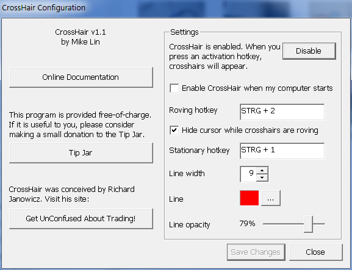 

  

8.  **Troubleshooting and Solving Problems**
    

*   The correct Hardware modules are connected but the model/configuration does not work
    
    *   Maybe a newly connected Module has not been registered by the ARE Port manager. Try to restart the ARE
        
    *   If you are using a module with a fixed COM port (like the RazorIMU) make sure that the COM port number matches the COM port number in the plugin properties.
        
*   The ARE is not responding at startup
    
    *   This indicates a blocked COM port problem. Close the ARE window, plug off all modules from the USB ports, then reconnect the modules and restart the ARE.
        
    *   If Bluetooth is enabled on your computer this may cause problems at COM port detection. Add your BT-Com Ports (see device manager) to the “ignore\_ports.txt” file in the ARE folder
        
*   OSKA does not operate in automatic scanning mode - which is needed for the intended model
    
    *   Check if the correct settings file is specified in the OSKA plugin properties
        
*   I connected the ARE platform via Ethernet cable but the ACS cannot connect to the ARE
    
    *   Verify that both computers have set static IP addresses in the same network range  
        (for example 192.168.1.1 and 192.168.1.2)
        
    *   Verify that the correct IP address of the ARE (see ARE window title) is set in the ACS options or auto-detection is enabled
        
*   The Logitech Webcam Pro 9000 does not work correctly
    
    *   Use the online installer the download the correct driver (use “custom install” and deselect all additional software, except the driver)  
        [http://www.logitech.com/435/5867?section=downloads&wt.ac=sc|downloads||dd](http://www.logitech.com/435/5867?section=downloads&wt.ac=sc%7Cdownloads%7C%7Cdd)
        
    *   Check and – if necessary – modify the camera settings (system tray)
        
*   MIMO touch screen does not work (mouse pointer does not react on touching with finger / stylus)
    
    *   The supplied version of the MIMO touch screen driver (which can be downloaded from the homepage) is not the latest one, see:  
        [http://www.touch-base.com/documentation/mimotouchdevice.htm](http://www.touch-base.com/documentation/mimotouchdevice.htm)  [http://www.touch-base.com/documentation/WindowsPlatformNotes.htm](http://www.touch-base.com/documentation/WindowsPlatformNotes.htm)
        
    *   Install the newest driver from  
        [http://touch-base.com/downloads/production/mimo/setup.exe](http://touch-base.com/downloads/production/mimo/setup.exe)
        

  

  

1.  **Community Support and Bug Tracking: The User Forum**
    

The AsTeRICS user forum provides an online resource for different topics related to the AsTeRICS project. It is hosted by the AsTeRICS developers who provide support for technical questions and try to solve discovered bugs.

  

The user forum is the primary resource for information and should be the first address if you require help with models or your AsTeRICS hardware setup.

  

  
  

The AsTeRICS user forum is online at:

http://www.asterics.eu/phpbb/

**Appendix A: Summary of available Plugins**

**A.1 AsTeRICS Sensor Plugins**

  

**Subcategory**

**Name**

**Description**

**Hardware / Driver Requirements**

Bioelectric Measurement

Enobio

Provides 4-channels of bioelectric signals (EEG, EOG, ECG, of EMG) measured with the Enobio wireless biosignal acquisition unit by Starlab.

Enobio device, drivers installed  
[http://starlab.es/products/enobio](http://starlab.es/products/enobio)

OpenVibe

Interface to the OpenVibe BCI framework vie an OSC-/UDP-bridge  
(Open Sound Control protocol)

[http://openvibe.inria.fr/](http://openvibe.inria.fr/)

  

P2Parser

Interface to the OpenEEG P2 packet format (ModularEEG)

[http://openeeg.sf.net](http://openeeg.sf.net/)

TobiTic

Interface to the Tobi (Toolf for Brain-Computer Interraction) TiC message format vie a TCP bridge

[http://openvibe.inria.fr/](http://openvibe.inria.fr/)

  

Communication

OscServer

Open Sound Control protocol server which accepts OSC messages and provides the transferred data for other plugins

[http://opensoundcontrol.org/](http://opensoundcontrol.org/)

  

Computer Vision

EyeTracker

Allows blob tracking, pupil tracking and gaze estimation on the screen

Sensorboard, head mounted SVM

FaceTrackerCLM

Active-Shape model based head tracking algorithm which delivers face landmark positions which are extracted from live images of a webcam.

High quality webcam, drivers installed

FaceTrackerLK

Very fast head tracking computer vision algorithm, outputs nose and chin coordinates. Drift of the tracking points may occur.

High quality webcam, drivers installed

Kinect

Provides angles and limb orientation data of the Kinect 3d-sensor

Microsoft Kinect sensor

Generic Control Input

AnalogIn

Delivers 2 channels of voltage- or resistance values from devices connected to the Analog-to-Digital converter module (AnalogIn CIM)

AnalogIn CIM by AsTeRICS partner IMA;

DigitalIn

Delivers 5 channels of digital values of switches connected via standard jack-plugs to the DigitalIn CIM

DigitalIn CIM by AsTeRICS partner IMA;

  

Graphical User Interface

ButtonGrid

A selectable number of Buttons for user interaction

None

Cellboard

A scanable grid with free captions (or image) and selectable events

None

Slider

A Slider with adjustable range, to set parameters of a model

None

EditBox

Edit Box for text input, could be used to e.g. generate speech

None

TextFieldReader

Edit Box with recognition of up to 7 command strings.  
A possible application is an interface with Voice Recognition Software

None

HomeControl

FS20Receiver

Receiver for FS20 command messages

FS20 sensor modules

  
  

**AsTeRICS Sensor** Plugins (continued):

  

**Subcategory**

**Name**

**Description**

**Hardware / Driver Requirements**

Inertial Measurement

Acceleration

3-axis acceleration sensor with wireless ZigBee interface;  
Delivers x/y/z axis acceleration data.

Wireless Acceleration Sensor by IMA;

  

RazorIMU

9 Degree-of-Freedom inertial measurement unit;  
Delivers pitch, yaw and roll orientation data.

[http://www.sparkfun.com/products/9623](http://www.sparkfun.com/products/9623)

  

PlatformDigitalIn

Internal digital input of switches with standard jack-plug connectors which are connected to the AsTeRICS Personal Platform.

AsTeRICS Personal Platform by IMA;

  

SensorModules

RFIDReader

Can read RFID tags and recognize defined tag-IDs.

ID-Innovation RFID-Reader [http://www.sparkfun.com/products/8628](http://www.sparkfun.com/products/8628)

Sensorboard

Sensor-support board for Eye- and Gaze-Tracking. Consists of a 9DOF Inertial Measurement Unit, an IR-point tracking camera interface.

GazeTracker support board by FHTW;  
(build instructions available)

Simulation

AutostartEvent

Creates an event a defined time after model startup

None

EventGenerator

Creates periodic events

None

SignalGenerator

Generates simulated signals (sine, rectangle,..) of adjustable amplitude.

None

SignalShaper

Creates a signal composed of linear parts

None

Timer

Measures time and creates periodic events.

None

Standard Input Devices

JoystickCapture

Captures Joystick movement and button activities of a local gamepad.

Standard (HID) PC-Joystick or Gamepad

KeyboardCapture

Captures keyboard input and provides key codes to other plugins.

Standard PC-Keyboard

MouseCapture

Provides movement and button data of the local mouse cursor.

Standard PC-Mouse

SpaceNavigator  
3DMouse

Provides data of the 6-Degree-of-Freedom SpaceNavigator Mouse.

3dConnexion Spacenavigator mouse

[http://www.3dconnexion.com](http://www.3dconnexion.com/)

WiiMote

Provides movement, IR-camera and button data of the Nintendo WiiMote.

Nintendo Wiimote + Bluetooth connection

  
  

**A.2 AsTeRICS Processor Plugins**

  

**Subcategory**

**Name**

**Description**

Audio and Voice

AudioSelector

Selects one of the available files in the ARE sound folder

SpeechProcessor

Provides speech synthesis and recognition of speech commands in multiple languages

Basic Math

Amplifier

Amplify or attenuate the incoming signal (Gain)

Averager

Calculate the average (arithmetic middle value) of a selectable number of samples

Benchmark

Counts incoming samples or events in a given time period

Comparator

Compare two signals or one signal with a constant, trigger event on changes

ConstantDispatcher

Delivers one of several constant values to other plugins, values can be selected via events

Decimation

Reduces the sampling rate of the incoming signal

Derivative

Calculates the derivative of the incoming signal

Differentiate

Subtracts the last from the current value of the signal

Integrate

Calculates a running sum of incoming signals, upper and lower limits can be given

MathEvaluator

Calculates a given expressing containing values of up to 4 signals and standard mathematical functions

MinMax

Remembers Minimum and Maximum of the connected signal and puts out updates to these

Quantizer

The value of the output signal is the input value rounded to the nearest multiple of the quantizationStep

RelativeMoveSampler

Sums up incoming relative positions for three coordinates and sends them according to sampling rate

SampleAndHold

Remembers the values of up to 4 connected input signals and provides them at the outputs

Sample

Samples an incoming signal with a given sample rate

Threshold

Compares the input signal with lower and upper threshold values, creates events when threshold passed

Data Converters

DoubleToString

Converts a double precision floating point value into a string

IntToString

Converts an integer value into a string

StringToDouble

Converts a string into a double precision floating point value

StringToInt

Converts a string into an integer value

DSP and Feature Extraction

BlinkDetector

Detects Eye-Blinks in Enobio channels of electrophysiological data

BlinkDetectorTrainer

Calculates user-specific values to increase the detection rate of the BlinkDetector plugin

ComputeBandpower

Computers the activity in selectable frequency bands

Dissimilarity

Compares two signals and outputs their dissimilarity coefficient

Filter

Customisable FIR filter with signal and magnitude outputs

NeuralNetworkLoader

Load a neural network classifier compatible to the Encog framework with up to 32 input and output ports

OscGestureFollower

Interface to the GestureFollower algorithm by IRCAM via an OSC brigde

ProtocolSSVEPTrain

SSVEP training protocol generator

SSVEPDetect

SSVEP detection classifier with output event trigger port for detected frequencies

  
  

AsTeRICS Processor Plugins (continued):

  

**Subcategory**

**Name**

**Description**

Event and String Processing

EventBlock

Can pass or block events from the input event listener port

EventCascade

Creates a series of events with selectable delays

EventCounter

Counts incoming events and puts out the current number (increase / decrease is possible)

EventDelay

Delays incoming events for a specified time

EventDispatcher

Translates incoming strings (text commands) into events

EventFlipFlop

Creates two alternating outgoing events from one incoming event

EventRouter

Allows selection of 1 out of 8 event trigger ports for incoming events

EventStateMachine

Tests if a sequence of events is received in correct order and timing

OneEventManyActions

Internal scanning mechanisms for distribution of on event source to multiple event targets

RegularExpression

Match strings with a pattern or replace string parts which match the pattern

StringDispatcher

Translates incoming events into strings (10 selectable text commands)

StringExpander

Adds pre- and post strings to an incoming string

TextSender

Sends a string on incoming events

HomeControl

FS20CommandInterpreter

Processes FS20 commands and fires respective events on command recognition

Microcontroller Interface

Arduino

Interfaces to the Arduino UNO microcontroller and provides digital input/output and analog input functions  
(Arduino hardware with firmware required)

OSKA

OSKAEventScanning

Interfaces to OSKA Keyboard; key selection in OSKA can be done by incoming events

OSKAExternalScanning

Interfaces to OSKA Keyboard; key selection in OSKA can be done by input ports (position values)

OSKAInternalScanning

Interfaces to OSKA Keyboard; automatic scanning in OSKA is activated

PhoneInterface

Yaak

Interface to the YAAK on-screen keyboard for Android Smart Phones

Signal Pathways

MultiSource

Mixes several numeric input ports to one output port

MultiSourceString

Mixes several alphanumeric input ports to one output port

PathMultiplexer

Routes one of up to 4 incoming signals to one output port, selected by events

PathSelector

Routes the incoming signal to one of up to 4 output ports, selected by events

StringPathMultiplexer

Routes one of up to 4 incoming strings to one output port, selected by events

StringPathSelector

Routes the incoming string to one of up to 4 output ports, selected by events

Signal Shaping

AdjustmentCurve

Allows to draw a mapping from input- to output signal in realtime and load/save this mapping curve

BasicTRAlgorithms

Adjustable Tremor Reduction of the input signal

SignalTranslation

Maps the range of an incoming signal to a selectable output range

Deadzone

Cuts off or attenuates a 1 or 2-dimensional input around a given centre

**A.3 AsTeRICS Actuator Plugins**

  

**Subcategory**

**Name**

**Description**

**Hardware / Driver Requirements**

Audio and Voice

Synthetic Voice

Generates speech output of incoming text (string).

Microsoft SAPI

MidiPlayer

Generates midi tones, midi instrument and tone scale can be selected via a GUI.

None

WavfilePlayer

Plays a selectable wav file on incoming event.

None

BrainComputer Interface

FlickeringLightStimulator

Control Interface to the external SSVEP light stimulation panels, stimulation frequencies and colors of the LED panels can be set

SSVEP light stimulation panels  
(by FHTW and Starlab)

SSVEPFileWriter

Writes to a text file the 4 EEG channels along with a software trigger

None

SSVEPStimulator

SW-based SSVEP stimulator using 2 images (on and off image)

None

Communication

GSMModem

Sends SMS via a connected GSM modem

GSM modem with SMS function

NetConnection

Can send and receive data via a TCP connection

None

OscOutClient

Sends numeric and alphanumeric data to an OSC server (OpenSoundControl)

None

File System

ApplicationLauncher

Can start defined software applications on incoming events (the path to the executable file is given in the plugin properties).

None

FileWriter

Writes incoming signal values to a text file.

Nonw

ModelSwitcher

Can change to a different AsTeRICS model on incoming event.

None

Generic Control Output

Digitalout

Interfaces to the DigitalOut CIM which provides 2 open collector and 3 relais outputs to connect external devices.

AnalogIn CIM by AsTeRICS partner IMA

SerialSender

can be used to communicate with Serial devices

Device with serial (RS232/Uart) interface

Graphical User Interface

BarDisplay

Displays a bar-graph of the incoming signal in the ARE GUI.

None

DotMeter

Displays a 2-dimensional oscilloscope in the ARE GUI

None

EnobioDisplay

Displays up to 4 biosignal channels of the Enobio device.

Enobio device, drivers installed  
[http://starlab.es/products/enobio](http://starlab.es/products/enobio)

EventVisualizer

Displays the incoming events in a text box in the ARE GUI.

None

ImageBox

Displays an image in the ARE GUI

None

Oscilloscope

Displays the connected incoming signal in an oscilloscope view in the ARE GUI.

None

TextDisplay

Displays an incoming string in a text box in the ARE GUI.

None

Home Control

FS20Sender

Sends control commands to connected FS20 actuators

FS20 device(s)

IrTrans

Interfaces to the IrTrans Universal Infrared remote control unit, which can emit learned IR codes of generic devices like TV, CD player, etc.

IrTrans Device  
[http://www.irtrans.de/en/](http://www.irtrans.de/en/)

Konnex

Interfaces to a Konnex network for home automation.

KNX actuators/network with KNX/IP

**AsTeRICS Actuator** Plugins (continued):

  

**Subcategory**

**Name**

**Description**

**Hardware / Driver Requirements**

Input Device Emulation

Keyboard

Generates simulated keyboard input (key codes) on the local computer.

None

Mouse

Generates simulated mouse input (x/y position, clicking) on the local computer.

None

MouseCursorIcon

Can change the standard mouse cursor on incoming events

None

RemoteJoystick

Generates joystick activity on a remote computer via the HID Actuator dongle. Can also be used to emulate the Sixaxis controller of the PS3 game console.

AsTeRICS HID Actuator USB dongle by IMA

RemoteKeyboard

Generates keyboard activity on a remote computer via the HID Actuator dongle.

AsTeRICS HID Actuator USB dongle by IMA

RemoteMouse

Generates mouse activity on a remote computer via the HID Actuator dongle.

AsTeRICS HID Actuator USB dongle by IMA

RemoteTablet

Generates mouse activity (absolute cursor positions) on a remote computer via the HID Actuator dongle.

AsTeRICS HID Actuator USB dongle by IMA

Personal Platform

PlatformDigitalOut

Controls the open collector output of the Personal Platform to connect external devices.

AsTeRICS Personal Platform by IMA;

PlatformLCD

Allows to display messages and to change selections on the Personal Platform LCD with touchscreen.

AsTeRICS Personal Platform by IMA;

PhoneInterface

AndroidPhoneControl

Interfaces to an Android mobile phone via TCP to send/receive SMS messages and calls.

Android Phone and AsTeRICS Android PhoneServer application

PhoneControl

Interfaces to a Windows mobile phone via Bluetooth to send/receive SMS messages and calls.

Mobile Phone with Windows Mobile 6.5 and AsTeRICS PhoneServer application

**Appendix B: Summary of supported Action Strings**

The following table comprises the action strings supported by the different plugins / components:

  

**Component(s)**

**Action String**

**Effect**

  
Mouse and

RemoteMouse

@MOUSE:nextclick,right

The next left click event trigger will generate a right click

@MOUSE:nextclick,double

The next left click event trigger will generate a double click

@MOUSE:nextclick,drag

The next left click event trigger will generate a drag click

@MOUSE:nextclick,middle

The next left click event trigger will generate a middle click

@MOUSE:nextclick,release

The next left click event trigger will release the mouse button

@MOUSE:action,enable

Will enable the mouse emulation

@MOUSE:action,disable

Will disable the mouse emulation

@MOUSE:action,toggle

Will toggle the mouse emulation

  

IRTrans

@IRTRANS: snd <remotename>,<commandname>

  
Example:  
@IRTRANS:snd my\_remote,volume\_up

Sends the given command to the given remote.

The remote control name and command have to be stored in the database of the IRTrans device.

FS20

@FS20:housecode\_address\_action

Example:  
@FS20:11111111, 1234, 0

Sends the given action number to the FS20 housecode/address

AndroidPhone-Control

@PHONE:SMS,<number>,<text>

  
Example:  
@PHONE:SMS,067623864,”hi”

Sends an SMS of given text to given phone number

@PHONE:CALL,<number>

Makes a phone call to given number

@PHONE:ACCEPT

Accepts an incoming call

@PHONE:DROP

Drops the active call

@PHONE:SET\_SMS,<text>

Sets the text for the next SMS

@PHONE:SET\_ID,<number>

Sets the phone number for the next SMS

  

Konnex

@KNX:<group\_address>,  
<data\_type>, <data\_value>

  
Example:  
@KNX:1/1/0#boolean#0

The given data value is sent to the group address in the KNX network or the KNX/IP router. Note that also the hash-charater (#) can be used for separation of group address, type and value.

OSKA  
  

(These action strings are sent from the OSKA Keyboard application to the OSKA plugin)

@KBD: <keycodes>

  
Example:  
@KBD:{SHIFT}Hello

The OSKA plugin extracts the keycode from the action string and sends it via its “keycodes” output port. (The Keyboard plugins have keycode input ports; a list of Keycodes is given in the next chapter)

@OSKA:event,<nr>

The OSKA plugin fires an event (1-5)

@ARE:startmodel <modelname>

  
Example:  
@ARE:startmodel cammouse.acs

The OSKA plugin instructs the ARE to deploy and start the given model

DigitalOut and

PlatformDigitalOut  
  

@DIGITALOUT:set,<nr>

Switches the given output channel <nr> to 1

@DIGITALOUT:clear,<nr>

Switches the given output channel <nr> to 0

@DIGITALOUT:toggle,<nr>

Changes the output state of channel <nr>

@DIGITALOUT:press,<nr>

Switches channel <nr>on and after one second off again

**Appendix C: Special Keys supported by Keyboard plugins**

The following table shows the currently supported special keys for the RemoteKeyboard actuator and for the Keyboard actuator plugins. Please note that the remote RemoteKeyboard actuator needs the HID Actuator USB dongle (hardware) being plugged into the target computer, and that the local Keyboard actuator uses software emulated keystroke generation on the local system. Although these two plugins look similar and provide widely the same function, the underlying mechanisms (like the used key code values and special key / modifier handling) are different.

Both plugins understand standard alphanumerical characters (“a-z”, “A-Z”, “0-9”) and several special characters (“-“, “+”, “?”, etc.) in the key code string.

Special keys (which cannot be typed) are defined in text files named “HID\_keycodes.txt” for the remote version and “keycodes.txt” for the local version. Special keys are identified in a key code string by using the { .. } parentheses around the key name. For example, the key-combination “<Control> + a” can be generated via the following key code string: “{CTRL}a”

The special key code files are expected in the folders “/data/actuator.RemoteKeyboard“ and “/data/actuator.Keyboard” respectively. They are loaded and parsed by the keyboard plugins at ARE startup. New special keys can be inserted on demand into these files.

  
  

  

**Key Identifier**

**Hex Code  
for remote HIDKeyboard plugin**

**Virtual Key Code (decimal)  
local Keyboard plugin**

{LEFTCTRL}

0x0100

\---

{LEFTSHIFT}

0x0200

\---

{LEFTALT}

0x0400

164

{ALT}

0x0400

164

{MENU}

\---

164

{LEFTGUI}

0x0800

\---

{WINDOWS}

\---

157

{WIN}

0x0800

\---

{LWIN}

\---

91

{RWIN}

\---

92

{RIGHTCTRL}

0x1000

\---

{CTRL}

0x1000

17

{RIGHTSHIFT}

0x2000

\---

{SHIFT}

0x2000

16

{RIGHTALT}

0x4000

18

{ALTGR}

0x4000

18

{RIGHTGUI}

0x8000

\---

{WAIT}

0x0fff

1

{F1}

0x003a

112

{F2}

0x003b

113

{F3}

0x003c

114

{F4}

0x003d

115

{F5}

0x003e

116

{F6}

0x003f

117

{F7}

0x0040

118

{F8}

0x0041

119

{F9}

0x0042

120

{F10}

0x0043

121

{F11}

0x0044

122

{F12}

0x0044

123

{RETURN}

0x0028

10

{ENTER}

0x0028

13

{ESCAPE}

0x0029

27

{BACKSPACE}

0x002a

8

{TAB}

0x002b

9

{PRINT}

0x0046

154

{PRINTSCREEN}

0x0046

154

{PAUSE}

0x0048

19

{INSERT}

0x0049

155

{INS}

0x0049

155

{HOME}

0x004a

36

{POS1}

0x004a

36

{END}

0x004d

35

{DEL}

0x004c

46

{DELETE}

0x004c

127

{PAGEUP}

0x004b

33

{PAGEDOWN}

0x004e

34

{RIGHT}

0x004f

39

{RIGHTARROW}

0x004f

39

{LEFT}

0x0050

37

{LEFTARROW}

0x0050

37

{DOWN}

0x0051

40

{DOWNARROW}

0x0051

40

{UP}

0x0052

38

{UPARROW}

0x0052

38

**Table 6: Special Key code definitions for RemoteKeyboard and Keyboard plugins**

  
  

  
  

**Appendix D: The AsTeRICS Consortium**

The AsTeRICS project gathers expertise from different fields (social, research, industry) for the development of the AT construction set - AsTeRICS. The aim of AsTeRICS is to develop innovative user driven AT by combining emerging sensor techniques, like Brain-Computer Interfaces and computer vision, with basic actuators to control a computer system. To reach this aim it is important to clearly identify the needs of users with disabilities and to use that knowledge to inform the development of the AsTeRICS system.

Therefore the development of AsTeRICS needs experts in the fields of user involvement, disability, Assistive Technology, hardware and software development.

The AsTeRICS consortium gathers partners from seven European countries into a multi-disciplinary team with the varied competences to realise the aspirations of AsTeRICS.

  

  

  

  

**The AsTeRICS Consortium**

  
  

  

  

  

The AsTeRICS project is partially funded by the European Commission under the Seventh Framework Programme for Research and Technological Development (FP7 - 2007-2013). G.A.No. 247730

  
  

  
  

  
  

  
  

  

  

**KI-I (Austria): Project Coordination**

  

The aim of the KI-I is to improve life situations of people with disabilities and aged people by using ICT. The KI-I can be seen as a turntable and innovation stock exchange in this area. The KI-I builds a bridge between fundamental research, application and teaching. It offers institutions and companies support in executing projects in the area of ICT to support the social and professional integration of people with disabilities. The KI-I is involved in and coordinator of different research projects on regional, national and European level. The network structure of KI-I ensures access to a wide range of knowledge, know how and expertise. KI-I is an independent institution that was funded in 2003. It‘s personnel has long-time experience in technology for people with disabilities, furthermore KI-I employs also researchers with disabilities.

  

**Contribution to AsTeRICS:**

*   Coordination of the AsTeRICS project
    
*   User needs analysis
    
*   Accessible Human Computer Interface design
    
*   Contribution to design and implementation of user interface prototypes
    
*   Research and development of AT solutions for mobility and manipulation
    
*   Environmental control and Smart Environments
    
*   Dissemination on scientific conferences and in relevant journals
    

  
  

  
  

**FHTW (Austria):  
Software and Technical Coordination**

The Department of Embedded Systems at the University of Applied Sciences Technikum Wien was founded in 1999 to build a bridge across the common, well known disciplines of Electronics on one hand side and Computer Science on the other hand side. The topics of expertise include embedded systems software design, dependable systems and real-time systems, distributed systems, embedded networking and fieldbus systems, real-time operating systems, CPLD/FPGA and ASIC design, PCB design, ESL design, hardware/software co-design, system test and verification as well as formal verification. The staff of the Department of Embedded Systems consists of lecturers and research engineers, all of them having a strong background in Electronics, Computer Science and Embedded Systems Technology. The contributions to the scientific community include memberships and active work in several national and international scientific committees and advisory boards.

  

A number of finished and ongoing projects show the ongoing interest of the Department of Embedded Systems in various areas of research and development with partners from both academia and the industry, including component based software, clock synchronization for embedded systems, debugging of real time systems and hardware/software co-design. Since 2008, Embedded Systems R&D is one of the strategic R&D areas of the University of Applied Sciences Technikum Wien.

  

**Contribution to AsTeRICS:**

*   Development of the system architecture, functional clustering
    
*   Specification and design of hardware platform, sensor / actuator modules (together with CEDO)
    
*   Evaluation and application of development environment
    
*   Firmware development for the hardware modules, adaptation and integration of sensors / actuators, interfacing of existing AT-modules
    
*   System integration, evaluation and tests
    
*   Software development for the AsTeRICS Personal Platform, hardware near programming and operating system issues, driver development
    

  
  

  

  

**UCY (Cyprus): Software Architecture**

  
The University of Cyprus was officially founded in 1989. It has five faculties: Pure and Applied Sciences, Economics and Management, Humanities and Social Sciences, Letters and the recently formed Faculty of Engineering.

The Department of Computer Science, belonging to the Faculty of Pure and Applied Sciences, is one of the most active Departments of the University. The Department has 19 regular members of the staff, out of which 12 have a tenured rank. There are also a number of postgraduate and research students as well as a number of Research Associates.

The Department is very active in the areas of information technology and communications. Its research falls under the broad areas of Artificial Intelligence and Intelligent Systems, Parallel and Distributed Systems, Software Engineering, Internet and Mobile Technologies, e-Health, e-Government, e-Learning and Open and Distance Learning. The Department is highly research oriented with an overall rate of more than 100 publications per year, including a number of books.

The Department has also been very active in attracting funding and since Cyprus joined the EU it has participated in over 150 projects funded by various frameworks of the European Union (FP-IST, EUMEDIS, INCO-DC, SOCRATES, LEONARDO DA VINCI, INTERREG, MED, etc.) as well as other local and international sources. The overall funding is currently at the level of about EUR 30M.

  

**Contribution to AsTeRICS:**

The University of Cyprus will contribute to AsTeRICS mainly by designing and implementing the architecture of the software system. UCY has considerable expertise in design and development of OSGi-based context middleware systems (IST-MUSIC project), UCY aims to develop a modular architecture that will build the required basis for successfully deploying the AsTeRICS assistive system.

  

  
  

  

  

**IMA (Czech Republic): Hardware Development**

  
IMA (www.ima.cz) is a limited private company (SME) located in Praha and Pardubice (CZ). Current headcount of 65 employees - mostly university graduated. Being on the market since 1992, IMA is well established in the smart card business and follow up micro technologies bridging towards nano.

IMA deals with electronic identification and utilizes smart cards, RFID/NFC, sensing, biometrics and ICT like ZigBee technology. Within health/social sector IMA runs on contractual base NETC@RDS server for the Czech Republic. Beside NETC@RDS, IMA is since years collaborating with key players in health care card domain: Sesam-Vitale, Gematik, ZZZS (Slovenia) and other smart cards issuers (At, Fi, It, Es..).

For two years IMA was chairing WG cards of EFMI (European Federation for Medical Informatics). Currently IMA represents CZ in ISO and CEN groups for standards in health care domain.

  

**Contribution to AsTeRICS:**

IMA contributes to the AsTeRICS project by using its expertise in co-design of system hardware and software on Printed Circuit Board for sensors, actuators and vision system. Furthermore, IMA will conduct prototyping and of testing hardware/software for wireless sensor networks

  

  
  

  
  

  
  

  

  

**UPMC (France): Computer Vision**

  
UPMC is one of the leading teaching and research institutions in Europe, and the largest scientific and medical university in France. Recently the National Centre for Healthy Aging has been opened at the UPMC and Charles Foix hospital. New technologies development for autonomous living and accessible technologies is one of the challenges of this Centre. ISIR (the Institute of Intelligent Systems and Robotics) will actively participate in this technological research.

ISIR is associated with CNRS (Centre National de Recherche Scientifique), Department of Sciences and Technology for Information and Engineering (STII). ISIR was created in 2007 by fusion of three UPMC's entities: LRP (Laboratoire de Robotique de Paris), LISIF PARC research group (Perception and Neural Networks) and LIP6 Animat group (engineering mimicking of biological animals). ISIR is involved in fundamental and applicative multidisciplinary research (signal-image-vision processing, computer science, automatics, mechanics, cognitive science (multimodality: tactile, haptic, vision, balance)). ISIR investigates various aspects related to man-machine-world interactions of any age (modelling simulation, design and prototyping of complex and/or teleoperated systems for human vision, posture, gesture).

For more than 20 years, the laboratory has been involved in more than 200 national and international research projects, including a vision system for unmanned autonomous vehicle (RobVolInt), a modelling of human visuo-tactile perception and action (HuPer) and an assistance for walking of visually impaired (IGS). For a detailed list of activities and publications please refer to: [www.isir.fr](http://www.isir.fr/)

ISIR participates in EU-supported workshop series for young researchers on Assistive Technologies and Rehabilitation Engineering (CVHI, Conference on Visual and Hearing Impairment).

  

**Contribution to AsTeRICS:**

*   Concept development for a tailored computer vision system to support AT-applications with motion and/or gaze tracking
    
*   Development of a hardware / software prototype for the vision system, meeting the constraints of the AsTeRICS embedded computing platform
    
*   Firmware development for digital signal processing to extract features from live video images and to transmit those features to the AsTeRICS platform
    
*   Integration of the vision system into the AsTeRICS hardware and software framework as a sensor module
    

  

  
  

  
  

  

  

**Starlab Living Science (Spain):  
Brain & Neural Computer Interfaces**

  
Starlab established in 2000, is a science and technology oriented SME with expertise managing projects, as well as with EU's Framework Programmes and European Spatial Agency. It has expertise in the development of innovative sensors and systems both in space and applied neuroscience, signal processing algorithms, data analysis based on computational intelligence and machine learning methodologies, with a strong specialisation in electrophysiology related techniques, software and hardware. Starlab's mission is to transform science into technologies with a profound and positive impact on society. We achieve this first by identifying social needs and the market opportunities they create. Then we reach to science and engineering to provide technical solutions, products and services for governments, Industry and downstream markets. Starlab Research carries out interdisciplinary R&D focusing on two main areas: Space and Applied Neuroscience. The Starlab team (now more than 25 on staff) includes 5 nationalities spanning knowledge in physics, engineering, oceanography, computer science, neuroscience and economics. Our applied Neuroscience R&D targets new sensors and systems to interface with the human brain and body. We develop sensors such as Enobio (wireless EEG system using advanced electronics) and applications such as fatigue, sleep and alertness monitoring, health, biometry and brain-machine interfaces. Recent EU projects include: SENSATION FP6 IP (Technical managers; electrophysiology sensors and algorithms), Humabio FP6 STREP (EEG/ECG biometry system), the ACTIBIO FP7 STREP (EEG/ECG ambient intelligence biometric authentication), and HIVE FET FP7 STREP (Coordinators; non-invasive brain stimulation technologies for brain-computer interface).

  

**Contribution to AsTeRICS:**

Further automation of acquisition and communication capabilities of wireless recording unit Enobio within BCI applications; software toolkit for the completion of BCI based on machine learning and computational intelligence techniques; user authentication based on EEG/ECG for automate BCI system configuration; software toolkit for affect and emotional user monitoring.

  

  
  

  
  

  
  

 **HARPO**

**Harpo (Poland):  
User Involvement and Dissemination**

  
HARPO - a limited liability company established in 1985 - have been delivering solutions for visually and print impaired since 1988.

Harpo has been bringing products from developed countries to Polish customers. Also, have been making research using own resources and by appointment and financed by Polish Ministry of Science. Thanks to own research Harpo were able to develop many successful products for blind people and people with profound disabilities. These products are now sold in Poland and all over the world.

Harpo employs about twenty nine people. Eight of them are in research and development. Most of yearly income is reinvested in development of new products every year.

At present Harpo Sp. z o. o. (Ltd) are a leader on the market of electronic and computer equipment for people with disabilities in Poland.

Harpo introduced several products to Polish and international markets. One of them is BraillePen/BraillePen 12 Wireless Braille Keyboard/Terminal known all over the world (an OEM version is known under the name “EasyLink”).

  

  

**Contribution to AsTeRICS:**

*   Conduct user requirements and needs survey, evaluation and analysis, user tests
    
*   Do the main part of dissemination and exploitation by communicating the market
    
*   Contribute by exploring new user interfaces (Computer, Assistive Environments) for people with reduced motor capabilities
    
*   Take care of programming in the virtual keyboard and mouse input
    

  
  

  
  

  
  

  
  

  

  

**Sensory Software (United Kingdom):  
Non-Classical User Interfaces**

  

Sensory Software established in 1997 is a small company that designs, develops and then licences software for a range of people with disabilities.

The disability areas of interest are: Blind and Low Vision People; children and adults with profound and multiple disabilities; and people with quite severe multiple disabilities.

Common themes in all of the software activities are to make the software simple and straightforward to use by ordinary people. Over the years it has developed: the Narrator screenreader for Microsoft, the first screenreader to come "in the box"; the Thunder screenreader, which is now free; and a wide range of educational software for very young children.

Most recently it has been focusing more on novel interaction systems for people with physical disabilities who have poor gross motor control but good control of a small range of movement. In addition, it occasionally undertakes consultancy work for other companies in the Assistive Technology arena.

  

**Contribution to AsTeRICS:**

*   Input into:
    
    *   User requirements
        
    *   Design and specification of hardware and software systems
        
    *   Integration of systems
        
*   Development of Windows-based onscreen keyboard and mouse control systems that utilise the novel hardware built in this project
    
*   Exploration of existing (commercially available) hardware that may be of use for people with physical disabilities controlling a mouse or onscreen keyboard
    

  
  

  
  

  

  

**Ingema (Spain): User Involvement**

  

Ingema Foundation is a research institute part of the Matia Group, with a wide expertise on ageing- and disability-related research and with close contact with elderly population. Ingema aims at being the best qualified care provider and at proving services of the highest quality. Multidisciplinary-approached research is at the core of Ingema‘s projects and activities, which are founded on state-of-the-art in socio-sanitary and psycho-social models of attention.

INGEMA provides a broad range of services, including residential settings for older adults (6 nursing homes), day care centres (4 centres), residential settings for people with physical disabilities (1 specialised centre attending 50 people, setting of the present project), as well as the regular hospital (palliative and geriatric medicine, neurology, long hospitalised stays, functional rehabilitation, psycho-geriatrics, clinical psychology, and social attention).

INGEMA holds long-term experience in both national and international projects, especially European-funded research initiatives regarding elderly people and people with disabilities. For instance, Hebe, Soprano, Iward, Vital, CompanionAble, i2home, Hermes, Tecforlife are some of the EC-funded projects within the FP6 and FP7.

The validation of the AsTeRICS system will be conducted in the Centre for Specialised Residential Care IZA which is part of the MATIA Group. The resource centre is specialised to achieve a better quality of life for persons with disabilities as well as their family members which include the support and/or improvement of their independence, functional abilities, wellbeing, satisfaction, integration and support of their social and family relationships. The service that provides to each resident, mainly young, people is personalised and adapted to their needs because additional to physical disabilities sometimes they also suffer from cognitive impairments. The user profile is young people with severe physical disabilities, people with diverse pathologies, Spinal Cord Injury, Traumatic Brian Injury, etc.

  

**Contribution to AsTeRICS:**

*   User requirements: Broad knowledge and extensive experience regarding the elderly people and people with disabilities
    
*   Direct contact with elderly people and people with severe physical disabilities: users in nursing homes and day care centres, as well as elderly people and people with disabilities who live in socio sanitary centres
    
*   Different scenarios in which to carry out evaluation tests
    
*   Extensive experience in aspects related to data privacy and ethics, through its Ethics and Research Committees.
    

  
  

AsTeRICS User Manual Page 4