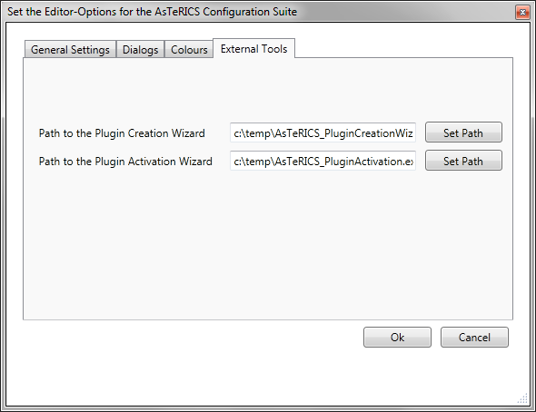

##

## External Tools Options

# External Tools Settings

  
Options Dialog, External Tools Settings

- _Path to the Plugin Creation Wizard_ sets the path to the plugin creation wizard.
- _Path to the Plugin Activation Wizard_ sets the path to the plugin activation wizard.

More information about the external tools can be found at the section _External Tools_.
