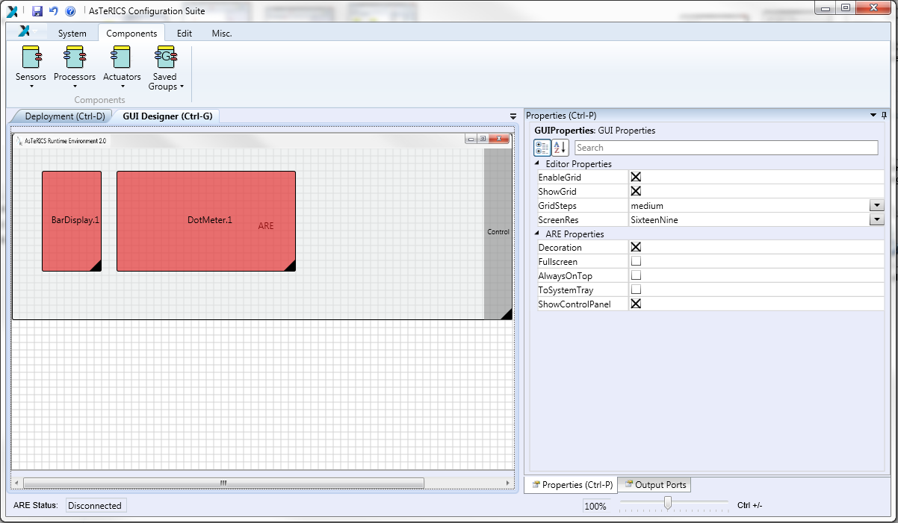

# GUI Designer

The GUI Designer allows to arrange the GUI Elements of components with a graphical user interface. These GUI Elements will then be shown on the ARE GUI. All GUI elements will be drawn and deleted automatically, if a component with a GUI is added or deleted. Within the GUI Designer, the size and the position of the GUI Elements can be changed.

  
The GUI Designer
