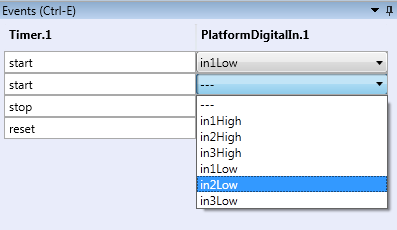

##

## Keyboard Control

# Keyboard Control

The AsTeRICS Configuration Suite is fully accessible by keyboard. The following sections describe the usage in the different parts of the ACS.

## Menus

The whole ACS is fully accessible by keyboard. The menu items of the ACS menus can be acessed pressing the _Alt_\-key, followed by the keys, being displayed. Screenshot 1 shows the menu after pressing _Alt_, Screenshot 2 shows the System menu after pressing _Alt_ folowed by pressing _Y_.

  
Screenshot: The menu after pressing _Alt_

  
Screenshot: The menu after pressing _Alt_ followed by pressing _Y_

## The Drawing Area

The drawing area can be reached, pressing _Ctrl_+_D_, the focus will be on the first element. The focus between the elements can be changed using the _Tab_ key or the Arrow keys. Elements can be selected using the _Space_ Key, multiple elements can be selected, pressing _Ctrl_+_Space_. Pressing the _App_ Key (also called Context Menu key) opens the context menu. Screenshot 3 shows a selected component with the opend context menu.

  
Screenshot: Component with opend context menu

### The Context Menu

- _Add Channel_ creates a new channel. An output port must be selected to initiate a new channel.
- _Connect Channel_ sets the end point of the new channel. Select an empty input port to finish the channel
- _Drop Channel_ deletes an initiated but unfinished channel

- _Add Event Channel_ creates a new event channel. An event trigger must be selected to initiate a new event channel.
- _Connect Event Channel_ sets the end point of the new event channel. Select an event listener to finish the event channel. Afterwards, the events must be set in the Event Editor
- _Drop Event Channel_ deletes an initiated but unfinished event channel

- _Move Selection_ moves the selected elements on the drawing area by using the arrow keys. The move operation can be stopped by pressing _Enter_.
- _Delete Selection_ deletes the selected components, channels and event channels.
- _Properties_ sets the focus to the Property Editor
- _Show Component Status_ displays a component status window.
- _Remove Conflict Marker_ removes the marker, indicating a version conflict between the component collection of the ARE and the ACS.

## The GUI Editor

Accessing the GUI Editor is quite similar to the Drawing area. Using the _Ctrl_+_G_ key combination sets the focus on the first element. The _App_ Key (also called Context Menu key) opens the context menu, offering the options of:

- _Resize_ chnages the width and hight of the GUI element by using the arrow keys.
- _Stop Resize_ stops the resize operation. This function will automatically be called if the focus is set to any other element (e.g by pressing the _Tab_ or the _App_ key).

- _Move_ moves the GUI element on the GUI area by using the arrow keys.
- _Stop Move_ stops the move operation. This function will automatically be called if the focus is set to any other element (e.g by pressing the _Tab_ or the _App_ key).

## Property and Port Editor

_Ctrl_+_G_ sets the focus to the property editor tab. Using the _Tab_ key sets the focus to the property editor, using the arrow keys allows to navigate to the other tabs (input and output ports, event triggers and listeners). Within the property editor, navigation will be handled using the _Tab_ key to select and edit the different properties. Within the input and output ports, the list of ports can be navigated using the arrow keys (so shown in screenshot 4).

  
Screenshot: Port Editor with opend and closed output ports

## Event Editor

With the Event Editor (reachable with the shortcut _Ctrl_+_E_), events within an event channel will be set. Once again, the navigation will be handled using the _Tab_ key. When a combobox is in focus, the value can be changed using the up an down arrow keys. Furthermore, the combobox can be opend using the _Enter_ key. Screenshot 5 shows the event editor with an opend combo box.

  
Screenshot: Event Editor with opend combobox

## Keyboard Shortcuts

Keyboard Shortcuts

Key

Command

F1

Open Help window

F5

Start the model

F6

Pause the model

F7

Stop the model

Ctrl + A

Select all elements in the drawing area

Ctrl + C

Copy all selected elements to the clipboard

Ctrl + X

Cut out all selected elements and copy them to the clipboard

Ctrl + V

Paste the elements from the clipcoard to the drawing area

Ctrl + Z

Undo last operation

Ctrl + Y

Redo last operation (after Undo)

Ctrl + S

Save the drawing

Del

Delete the selected elements

Ctrl + +

Zoom in

Ctrl + -

Zoom out

Ctrl + D

Set focus on the drawing area

Ctrl + G

Set focus on the GUI area

Ctrl + P

Set focus on the Property editor

Ctrl + E

Set focus on the Event editor

Alt

Display keyboard shortcuts of the menu elements

Tab

Navigate to the next element (in several areas)

Arrow Keys

Move Focus in several areas, also move in scroll areas

Alt + F4

Close the ACS
