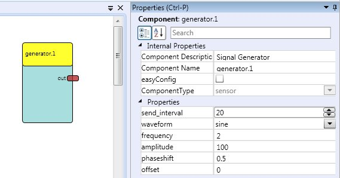

# Setting the Properties

Each component has 0 to several properties, by means of which the behaviour of the component can be adapted or functions can be enabled. These properties are not limited to the component itself. Also the ports (input and output, but not the event ports) can have properties. The usage of the properties and their effects can be found in the documentation of the components. The following figure shows the property editor editing the characteristics of the component "generator". By default, the property area is on the right hand side of the ACS.

  
The Property Tab showing a Component's Properties

## Dynamic Properties

Beside the standard properties, components can also have dynamic properties. This means, properties in the property editor can become values from the component on the ARE. This feature might be useful in several cases, as example if a plugin is hardware dependent (selecting a soundcard or a midi player), or depending on files on the target system, like several sound files.

If a plugin is implementing a dynamic property, the values will be requested from the ARE, as soon as the ACS is synchronised with the ARE. Then, the received values can be selected in a combobox within the property editor (as shown in the figure below).

  
Plugin with Dynamic Property
