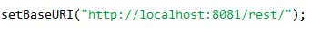
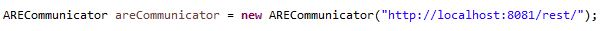

 Standard             @page { margin-left: 0.98in; margin-right: 0.98in; margin-top: 0.59in; margin-bottom: 0.28in } @page:first { margin-top: 0.98in; margin-bottom: 0.98in } p { margin-bottom: 0.1in; direction: ltr; line-height: 115%; text-align: left; orphans: 2; widows: 2 } p.western { font-family: "Calibri", serif; font-size: 12pt; so-language: de-DE } p.cjk { font-size: 12pt; so-language: de-DE } p.ctl { font-size: 12pt } h1 { margin-left: 0.59in; text-indent: -0.59in; margin-top: 0.08in; margin-bottom: 0.17in; direction: ltr; color: #657f1a; line-height: 120%; text-align: left; orphans: 2; widows: 2; background: #ffffff; page-break-before: always } h1.western { font-family: "Verdana", serif; font-size: 14pt; so-language: de-DE } h1.cjk { font-size: 14pt; so-language: de-DE } h1.ctl { font-size: 12pt; font-weight: normal } h2 { margin-top: 0.25in; margin-bottom: 0in; direction: ltr; line-height: 120%; text-align: left; orphans: 2; widows: 2 } h2.western { font-family: "Verdana", serif; font-size: 14pt; so-language: de-DE; font-weight: normal } h2.cjk { font-family: "Times New Roman"; font-size: 14pt; so-language: de-DE; font-weight: normal } h2.ctl { font-family: "Times New Roman"; font-size: 12pt; font-weight: normal } h3 { margin-top: 0.25in; margin-bottom: 0in; direction: ltr; line-height: 120%; text-align: left; orphans: 2; widows: 2 } h3.western { font-family: "Verdana", serif; font-size: 12pt; so-language: de-DE } h3.cjk { font-family: "Times New Roman"; font-size: 12pt; so-language: de-DE } h3.ctl { font-family: "Times New Roman"; font-size: 12pt; font-weight: normal } a:link { color: #0000ff } 

Ecosystem infrastructure for smart and personalised inclusion  
and PROSPERITY for ALL stakeholders

  

**ARE REST API**

  

  

Project Acronym

  

**Prosperity4All**

Grant Agreement number

**FP7-610510**

  

  

Deliverable number

**Work conducted for D203.1, D202.1**

Work package number

**WP203, WP202**

Work package title

**T203.3 Runtime Environment**

**T202.5: Real-Time User Monitoring Modules**

Authors

**Marios Komodromos, Christos Mettouris**

Status

**Final**

Dissemination Level

**Public/Consortium**

Number of Pages

**13**

  

  

Table of Contents

**[Executive Summary 3](#__RefHeading___Toc2469_2024674011)**

**[1 REST API 4](#__RefHeading___Toc2471_2024674011)**

[1.1 REST API Functions 5](#__RefHeading___Toc2473_2024674011)

[1.2 Path parameter encoding 10](#__RefHeading___Toc2475_2024674011)

[1.3 Event Types 11](#__RefHeading___Toc2477_2024674011)

[1.4 Port Datatypes 12](#__RefHeading___Toc2479_2024674011)

**[2 REST API Client libraries 13](#__RefHeading___Toc2481_2024674011)**

[2.1 JavaScript Client library 13](#__RefHeading___Toc2483_2024674011)

[2.1.1 JavaScript Library Functions 15](#__RefHeading___Toc2485_2024674011)

[2.1.2 JSON OBJECTS 18](#__RefHeading___Toc2487_2024674011)

[2.2 Java Client library (currently not up-to-date) 21](#__RefHeading___Toc2489_2024674011)

[2.2.1 Java Library Methods 23](#__RefHeading___Toc2491_2024674011)

**List of Tables**

[Table 1: REST API functions 9](#Table!1|sequence)

[Table 2: Event Types 11](#Table!2|sequence)

[Table 3: Port datatypes 12](#Table!0|sequence)

[Table 4: JavaScript Client Functions 16](#Table!4|sequence)

[Table 5: JSON objects 20](#Table!3|sequence)

[Table 6: Java Client Functions 24](#Table!6|sequence)

**List of Figures**

  
  

Executive Summary
=================

This document describes the usage of the ARE REST API developed by UCY in the context of Task 203.3 of WP203, T202.5 of WP202 Prosperity4All project.

1.  REST API
    ========
    

To allow remote communication with the AsTeRICS Runtime Environment, the ARE REST API was developed. It allows manipulation of resources through a set of HTTP methods such as GET, POST, PUT and DELETE.

Apart from the regular REST functions, an event mechanism is provided (SSE). With this mechanism, ARE can broadcast messages to anyone who subscribes and inform when an event occurs.

The API uses HTTP status codes to declare an error in a call. Specifically, when an error occurs, the response will contain a 500 HTTP status code (Internal Server Error) with an ARE-produced error message inside the HTTP response body.

The table in the next page (table 1) describes these methods and provides the necessary information in order to call them.

  

  

  

1.  REST API Functions
    ------------------
    

  

  

**HTTP Method**

**Resource**

**Parameters**

**Consumes**

**Produces**

**Description**

GET

/runtime/model

\-

\-

XML

Retrieves the currently deployed model in XML

PUT

/runtime/model

modelInXML

(in body)

XML

TEXT

Deploys the model given as a parameter

PUT

/runtime/model/{filename}

filename

\-

TEXT

Deploys the model contained in the given filename

PUT

/runtime/model/state/{state}

state

\-

TEXT

Changes the state of the deployed model to STARTED, PAUSED, STOPPED

GET

/runtime/model/state

\-

\-

TEXT

Returns the state of the deployed model

GET

/runtime/model/name

\-

\-

TEXT

Returns the name (ID) of the deployed model

PUT

/runtime/model/autorun/

{filename}

filename

\-

TEXT

Deploys and starts the model in the given filename

GET

/runtime/model/components

/ids

\-

\-

JSON

Returns the component ids contained in the currently deployed model

GET

/runtime/model/components/ {componentId}

componentId

\-

JSON

Returns all property keys of the specified runtime component

GET

/runtime/model/components/

{componentId}/{componentKey}

componentId,

componentKey

\-

TEXT

Returns the a property value of the runtime component

PUT

/runtime/model/components/

{componentId}/{componentKey}

componentId,

componentKey,

value (in body)

TEXT

TEXT

Changes a property value of a runtime component

PUT

/runtime/model/components/

properties

propertyMap (in body)

JSON

TEXT

Changes multiple property value(s) of a runtime component(s) (propertyMap – see JSON objects)

GET

/runtime/model/components/

{componentId}/ports/input/ids

componentId

\-

JSON

Returns the input port ids of the specified component

GET

/runtime/model/components/

{componentId}/ports/output/ids

componentId

\-

JSON

Returns the output port ids of the specified component

GET

/runtime/model/components/

{componentId}/ports/{portId}/

datatype

componentId,

portId

\-

TEXT

Returns the datatype of the specified port

PUT

{componentId}/ports/{portId}/

data

componentId,

portId,

value (in body)

TEXT

TEXT

Sends data to a specific port of a component in the running model

PUT

{componentId}/events/{eventPortId}

componentId,

eventPortId,

\-

TEXT

Triggers an event on the given component/port

GET

runtime/model/component

/{componentId}/eventChannels

/ids

componentId

\-

JSON

Returns the event channel ids of the specified component

GET

runtime/model/component/

{componentId}/dataChannels/ids

componentId

\-

JSON

Returns the data channel ids of the specified component

GET

runtime/model/channels/event

/ids

\-

\-

JSON

Returns the event channel ids of the current model

GET

runtime/model/channels/event

/{channelId}/source

dataChannelId

\-

JSON

Returns the source (channel edge – se JSON objects) of a specific event channel

GET

runtime/model/channels/event

/{channelId}/target

dataChannelId

\-

JSON

Returns the target (channel edge – see JSON objects) of a specific event channel

GET

runtime/model/channels/data

/ids

\-

\-

JSON

Returns the data channel ids of the current model

GET

runtime/model/channels/data

/{channelId}/source

dataChannelId

\-

JSON

Returns the source (channel edge – se JSON objects) of a specific data channel

GET

runtime/model/channels/data

/{channelId}/target

dataChannelId

\-

JSON

Returns the target (channel edge – se JSON objects) of a specific data channel

GET

/storage/models/{filename}

filename

\-

XML

Returns an xml representation of a model in a specific file

POST

/storage/models/{ filepath }

filepath,

modelInXML

(in body)

XML

TEXT

Stores a model in the given filepath

POST

/storage/data/{filepath}

filepath,

data  
(in body)

TEXT

TEXT

Stores data to a given filepath in the ARE/data folder

DELETE

/storage/models/{filename}

filename

\-

TEXT

Deletes the model with the given filename

GET

/storage/models/names

\-

\-

JSON

Retrieves the model names that are saved in the ARE repository

GET

/storage/components/

descriptors/xml

\-

\-

XML

Returns an xml string containing the descriptors of the created components with some modifications in order to be used by the webACS

GET

/storage/components/descriptors

/json

\-

\-

JSON

Retrieves the exact content of the component descriptors contained in the ARE repository

POST

/storage/webapps/{webappName}/{filepath}

webappName,

filepath,

data  
(in body)

TEXT

TEXT

Stores data for a specific webapp.

GET

/storage/webapps/{webappName}/{filepath}

webappName,

filepath

\-

TEXT

Returns saved data for a webapp

GET

/restfunctions

  

  

\-

\-

JSON

Returns a list with all the available rest functions

GET

/runtime/deployment/listener

\-

\-

TEXT

Opens a persistent connection with ARE and listens for model deployment events (SSE).

GET

/runtime/model/state/listener

\-

\-

TEXT

Opens a persistent connection with ARE and listens for model state change events (SSE).

  

GET

  

/runtime/model/channels/event

/listener

  

\-

  

\-

  

JSON

  

Opens a persistent connection with ARE and listens for event channel transmissions (SSE).

GET

/runtime/model/channels/data {channelId}/listener

channelId

\-

JSON

Opens a persistent connection with ARE and listens for data channel transmissions (SSE). Mind that data channel subscriptions are initialized on every model deployment.

GET

/runtime/model/components/ properties/listener

\-

\-

JSON

Opens a persistent connection with ARE and listens for component property changes (SSE).

**Table 1: REST API functions**

  

--------------------------------------

  

2.  Path parameter encoding
    -----------------------
    

As seen in table 1, there are some functions that expect parameters in the URI, the **path parameters**. It can be observed that the path parameters are part of the URI and are wrapped with curly brackets (for example, the “filename” in “/runtime/model/{filename}”). Caution: do not confuse **query parameters** with path parameters.

Before the function call, these parameters should be encoded based on the UTF-16 encoding table. Every character of the parameter should be replaced with the corresponding **decimal value** of the UTF-16 table, and every encoded character should be separated from the other characters with an un-encoded dash (“-”) character.

  

For a better understanding check the example below:

  

PUT

/runtime/model/{filename}

filename

\-

TEXT

Deploys the model contained in the given filename

**REST function call:**

**Un-encoded URI:**  [http://localhost:8081/runtime/model/foobar](http://localhost:8081/runtime/model/foobar)

**Encoded URI:**  [http://localhost:8081/runtime/model/_102-111-111-98-97-114_](http://localhost:8081/runtime/model/102-111-111-98-97-114)

  

  

3.  Event Types
    -----------
    

As said before, the API allows subscription to specific ARE event types. To consume SSE events, the client must be able to achieve communication using SSE technology. SSE library implementations are available for almost any well-known programming language (java, C#, JavaScript etc).

A subscription can be conducted per event type. Each event received by a client, will contain a message from a pre-defined set. The client should check this message in order to retrieve details regarding the event. The event types and their corresponding messages can be found in table 2.

  

**Event type**

**Event messages**

**Description**

model\_changed

pre\_deploy\_event

post\_deploy\_event

Notifies the subscribers that a new model was deployed or is going to be deployed

model\_state\_changed

pre\_start\_event

post\_start\_event

pre\_stop\_event

post\_stop\_event

pre\_pause\_event

post\_pause\_event

pre\_resume\_event

post\_resume\_event

Notifies the subscribers that an event occurred, which has affected or is going to affect the runtime model state

eventChannel\_transmission

see JSON objects section - EventChannel SSE

Notifies the subscribers that an ARE runtime model event was triggered through a specific eventChannel

dataChannel\_transmission

see JSON objects section - DataChannel SSE

Notifies the subscribers that an ARE runtime model event was triggered through a specific dataChannel

property\_change

see JSON objects section – PropertyChange SSE

Notifies the subscribers that a property value of a component has been changed

**Table 2: Event Types**

  

  

4.  Port Datatypes
    --------------
    

Every **component port** in an AsTeRICS model can transmit data of some specific type. A REST client is able to register a listener for a port and receive data being sent from this port. Below you can find the available port datatype and the corresponding string representaions.

  

  

**Datatype type**

**Datatype string value**

STRING

string

DOUBLE

double

INTEGER

integer

CHAR

char

BYTE

byte

BOOLEAN

boolean

UNKNOWN

unknown

  

  

  

  

  

**Table 3: Port datatypes**

  

The port datatype can be obtained using this rest call

  

GET

/runtime/model/components/

{componentId}/ports/{portId}/

datatype

componentId,

portId

\-

TEXT

Returns the datatype of the specified port

and the expected return value is one of the fields in the “Datatype string value“ column of Table 3.

  

  

  

  

  

2.  REST API Client libraries
    =========================
    

  

To enable easier REST API accessibility, communication libraries were created that simplify the whole procedure.

1.  JavaScript Client library
    -------------------------
    

To install the JavaScript library in a webpage these steps have to be followed:

1.  Import the ‘ARECommunicator.js’ file in the html page.
    
2.  Import ‘JSmap.js’ file in the html page.
    
3.  Import a script that provides jQuery functionality.
    

(i.e. “[http://ajax.googleapis.com/ajax/libs/jquery/1.7.1/jquery.min.js](http://ajax.googleapis.com/ajax/libs/jquery/1.7.1/jquery.min.js)”)

  

(For testing purposes, a simple implementation of a JavaScript client was created and it can be found here: [https://github.com/asterics/AsTeRICS/tree/master/ARE\_RestAPIlibraries/clientExample/client.html](https://github.com/asterics/AsTeRICS/tree/master/ARE_RestAPIlibraries/clientExample/client.html) )

  

Before calling ARE functions, the baseURI has to be set. This is the URI where ARE runs at. For example:

To call any REST function, we have to provide two callback functions: a successCallback and an errorCallback such as the example below

  

  

  

  

  

  

  

  

Furthermore, the ‘subscribe’ function is opening a persistent connection with ARE. Using an event mechanism based on Server Sent Events (SSE) specifications, it listens to the connection for broadcasted messages. Additionally, the event type (Table 2) name must be provided, to specify what type of events to listen for. The concept still remains the same, as a success-Callback function and an error-Callback function must be provided. The unsubscribe function does not use any rest calls since it closes the connection from the browser’s side.

In the next page, Table 4 describes each method provided by the library.

  

1.  ### JavaScript Library Functions
    

  

**Function Signature**

**Description**

downloadDeployedModel(**sCB1****,** eCB)

Retrieves the currently deployed model in XML

uploadModel(**sCB1****,** eCB**,** modelinXML)

Deploys the model given as a parameter

deployModelFromFile(**sCB1****,** eCB**,** filename)

Deploys the model contained in the given filename

startModel(**sCB1****,** eCB)

stopModel(**sCB1****,** eCB)

pauseMolel(**sCB1****,** eCB)

Changes the state of the deployed model to STARTED, PAUSED, STOPPED

getModelState( **sCB1****,** eCB)

Returns the state of the deployed model

getModelName( **sCB1****,** eCB)

Returns the name (ID) of the deployed model

autorun(**CB1****,** eCB**,** filename)

Deploys and starts the model in the given filename

getRuntimeComponentIds(**sCB1****,** eCB)

Retrieves all the component ids contained in the currently deployed model (as JSON array)

getRuntimeComponentPropertyKeys(**sCB2****,** eCB**,** componentId)

Returns all property keys of the component with the given componentId in the currently deployed model (as JSON array)

getRuntimeComponentProperty(**sCB1****,** eCB**,** componentId, componentKey)

Retrieves a property value of a specific component, in the currently deployed model

setRuntimeComponentProperty(**sCB1****,** eCB**,** componentId, componentKey, value)

Changes a property value of a specific component, in the currently deployed model

setRuntimeComponentProperties(**sCB1****,** eCB**,** propertyMap)

Changes multiple property values of a runtime component(s) (propertyMap – see JSON objects section)

getComponentInputPortIds(**sCB1****,** eCB, componentId)

Returns the input port ids of the specified component

getComponentOutputPortIds(**sCB1****,** eCB, componentId

Returns the output port ids of the specified component

getPortDatatype(**sCB1****,** eCB, componentId, portId)

Returns the datatype of the specified port

sendDataToInputPort(**sCB1****,** eCB, componentId, portId, value)

Sends data (“value”) to a specific port of a component in the running model. Returns “success” or an error message.

triggerEvent(**sCB1****,** eCB, componentId, eventPortId)

Triggers an event on the given component/port

getEventChannelsIds(**sCB1**, eCB)

Returns all the event channel ids of the current model (as JSON array)

getEventChannelSource(**sCB1**, eCB, channelId) **\*3**

Returns the source (channel edge object) of a specific event channel

getEventChannelTarget(**sCB1**, eCB, channelId) **\*3**

Returns the target (channel edge object) of a specific event channel

getComponentEventChannelsIds(**sCB1**, eCB, componentId)

Returns the event channel ids of the given component

getDataChannelsIds(**sCB1**, eCB)

Returns all the data channel ids of the current model (as JSON array)

getDataChannelSource(**sCB1**, eCB, channelId) **\*3**

Returns the source (channel edge object) of a specific data channel

getDataChannelTarget(**sCB1**, eCB, channelId) **\*3**

Returns the target (channel edge object) of a specific data channel

getComponentDataChannelsIds(**sCB1**, eCB, componentId)

Returns the data channel ids of the given component

downloadModelFromFile(**sCB1****,** eCB**,** filename)

Returns an xml representation of a model in a specific file

storeModel(**sCB1****,** eCB**,** filename**,** modelinXML)

Stores a model in the given filename

storeData(**sCB1****,** eCB**,** filepath**,** modelinXML)

Stores data to a given filepath in the ARE/data folder

storeWebappData(**sCB1****,** eCB**,** webappId, filepath**,** data)

Stores data for a specific webapp to webapps/<webappId>/data

getWebappData(**sCB1****,** eCB**,** webappId, filepath)

Gets saved data of a specific webapp

deleteModelFromFile(**sCB1****,** eCB**,** filename)

Deletes the model with the given filename

listStoredModels(**sCB2****,** eCB)

  

Retrieves the model names that are saved in the ARE repository (as JSON array)

getComponentDescriptorsAsXml(**sCB2****,** eCB)

Returns an xml string containing the descriptors of the created components with some modifications in order to be used by the webACS

getComponentDescriptorsAsJSON(**sCB2****,** eCB) **\*1**

Retrieves the exact content of the component descriptors contained in the ARE repository (as JSON array)

getRestFunctions(**sCB2****,** eCB) **\*2**

Retrieves the information for all the available rest functions provided by the Restful API (as JSON array with Function objects)

subscribe(**sCB1,** eCB, eventType)

Opens a persistent connection with ARE and listens for Server Sent Events. The ‘eventType’ parameter is a string and accepts the values defined in Table 2, ‘Event Type’ column.

unsubscribe(eventType)

Closes the connection for Server Sent Events. Returns true if the unsubscription was successful and false otherwise. The ‘eventType’ parameter is a string and accepts the values defined in Table 2, ‘Event Type’ column.

**Table 4: JavaScript Client Functions**

  

  

  

  

 

**sCB1**: successCallback(textData, HTTPstatus)

**sCB2**: successCallback(array, HTTPstatus)

eCB: errorCallback(HTTPstatus, AREerrorMessage)

\*1: Component object (see JSON objects section)

\*2: Function object (see JSON objects section)

\*3: Channel edge object (see JSON objects section)

  

  

  

  

  

  

  

  

  

  

 

_**Keep in mind:**_

_A browser limits the number of persistent connections to 4-6 (varies from browser to browser), so use your SSEs wisely!_

  

  

2.  ### JSON OBJECTS
    

  

  

**Object Name**

**Example**

  

**Function**

{

"path": "/runtime/model",

"description": "Retrieves the currently deployed model in XML",

"httpRequestType": "GET",

"bodyParameter": "",

"consumes": "",

"produces": "text/xml"

}

  

**Component**

{

"canonicalName":"eu.asterics.component.processor….",

"type":"PROCESSOR",

"id":"asterics.StringDispatcher",

"description":"Send text from chosen slot",

"singleton":false,

"inputPorts":\[

{

"type":"INPUT",

"multiplicity":null,

"description":"Send the string from the slot defined by the incoming value",

"portID":"slotDispatch",

"dataType":"INTEGER",

"propertyNames":null

}

\],

"outputPorts":\[

{

"type":"OUTPUT",

"description":"Output text",

"portID":"output",

"dataType":"STRING",

"propertyNames":null

}

\],

"eventTriggererPorts":\[

  

\],

"ports":\[

{

"type":"INPUT",

"multiplicity":null,

"description":"Send the string from the slot defined by the incoming value",

"portID":"slotDispatch",

"dataType":"INTEGER",

"propertyNames":null

},

{

"type":"OUTPUT",

"description":"Output text",

"portID":"output",

"dataType":"STRING",

"propertyNames":null

}

\],

"eventPorts":\[

{

"id":"dispatchSlot1",

"description":"Send text from slot 1"

}

\],

"eventListenerPorts":\[

{

"id":"dispatchSlot1",

"description":"Send text from slot 1"

}

\],

"propertyNames":\[

"delay",

"slot1"

\]

}

**Channel edge**

{

"component": "Timer.1",

"eventPort", "start"

}

**EventChannel SSE**

{

"channelId":"enterZone\_start",

"targetComponentId":"Timer.1"

}

**DataChannel SSE**

{

"channelId":"binding.11",

"data":"100.0"

}

**PropertyChange SSE**

{

"newValue":"5",

"componentKey":"textColor",

"componentId":"CellBoard.1"

}

**Property map**

{

"Component\_id\_1":{

"key\_1\_1":"val\_1\_1",

"key\_1\_2":"val\_1\_2"

},

"Component\_id\_2":{

"key\_2\_1":"val\_2\_1",

"key\_2\_2":"val\_2\_2"

}

}

**Table 5: JSON objects**

  

  

  

  

  

  

  

2.  Java Client library (currently not up-to-date)
    ----------------------------------------------
    

  

Environment specs:

1.  **Recommended IDE:** eclipse
    
2.  **Recommended Java version**: 7
    

  

  

To import, test or modify the Java library in an IDE, follow these steps:

1.  Create a simple java project in your IDE.
    
2.  Navigate to the destination where the Java library is located and copy the 'lib' and 'models' folders to the root of your project.
    
3.  Copy the contents of ‘src’ folder to the ‘src’ folder of your project.
    
4.  Add all the jar files which are located inside 'lib' folder to your project build path.
    
5.  Run 'JavaClient.java' class located inside the ‘tester’ package to test that everything works as expected.
    

  

To use the Java library in our own project, follow these steps:

1.  Add ‘ARECommunicator.jar’ file to the build path of our project.
    
2.  Add the jar files contained in the ‘lib’ folder to the build path of our project.
    

  

When installation is completed, the procedure of communicating with ARE is reduced to plain calls of Java methods of an object.

A s with JavaScript library, the baseURI has to be set:

and when this is done, you are able to call any method you desire:

  

  

Furthermore, the ‘subscribe’ function is opening a persistent connection with the ARE. Using an event mechanism based on Server Sent Events (SSE) specifications, it listens to the connection for broadcasted messages. Additionally, the eventType name must be provided, to specify what type of events to listen for. To achieve this functionality, the [Jersey SSE java library](https://jersey.java.net/documentation/latest/sse.html) was used.

In the next page, Table 5 describes each method provided by the library.

  

1.  ### Java Library Methods
    

  

**Function Signature**

**Description**

**String** downloadDeployedModel()

Retrieves the currently deployed model in XML

**String** uploadModel(**String**  modelinXML)

Deploys the model given as a parameter

**String** deployModelFromFile(**String** filename)

Deploys the model contained in the given filename

**String** startModel()

**String** stopModel()

**String** pauseModel(**)**

Changes the state of the deployed model to STARTED, PAUSED, STOPPED

**String** getModelState()

Retrieves the state of the deployed model

**String** getModelName()

Returns the name (ID) of the deployed model

**String** autorun(**String** filename)

Deploys and starts the model in the given filename

**String\[\]** getRuntimeComponentIds()

Retrieves all the components contained in the currently deployed model

**String\[\]**  getRuntimeComponentPropertyKeys(**String** componentId)

Retrieves all property keys of the component with the given componentId in the currently deployed model

**String** getRuntimeComponentProperty(**String** componentId, **String** componentKey)

Retrieves property value of a specific component, in the currently deployed model

**String** setRuntimeComponentProperty(**String** componentId, **String** componentKey, **String** value)

Changes a property value of a specific component, in the currently deployed model

**String** sendDataToInputPort**(String** componentId**, String** portId**, String** value**)**

Sends data to a port of a component in the currently deployed model

**String** triggerEvent**(String** componentId**, String** eventPortId**)**

Triggers an event on the given component/port

**String** downloadModelFromFile(**String** filename)

Retrieves an xml representation of a model in a specific file

**String** storeModel(**String** filename**, String** modelinXML)

Stores a model in the given filename

**String** storeData(**String** filepath**, String** data)

Stores data to a given filepath in the ARE/data folder

**String** storeWebappData(**String** webappId**, String** filepath**, String** data)

Stores webapp data to ARE/web/webapps/<webappId>/data

**String** getWebappData(**String** webappId**, String** filepath)

Gets stored webapp data

**String** deleteModelFromFile(**String** filename)

Deletes the model with the given filename

**String\[\]** listStoredModels()

  

Retrieves a list with all the model that are saved in the ARE repository

**String** getComponentDescriptorsAsXml()

Returns an xml string containing the descriptors of the created components with some modifications in order to be used by the webACS

**List<String>** getComponentDescriptorsAsJSON()

Retrieves the exact content of the component descriptors contained in the ARE repository (as JSON array)

**ArrayList<RestFunction>** functions()

Retrieves a list with all the available rest functions

subscribe(**String** eventType)

Subscribes the IP that sent the request to the event mechanism

unsubscribe(**String** eventType)

Unsubscribes the IP that sent the request to the event mechanism

**Table 6: Java Client Functions**