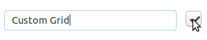
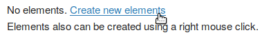
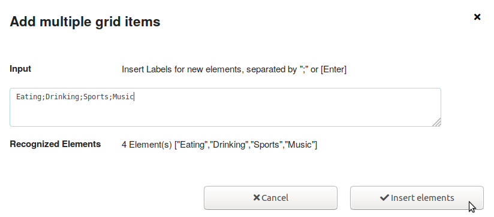
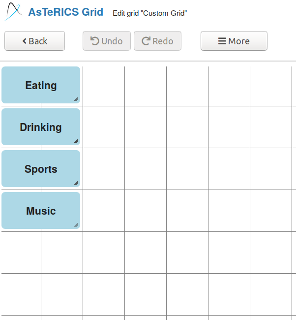
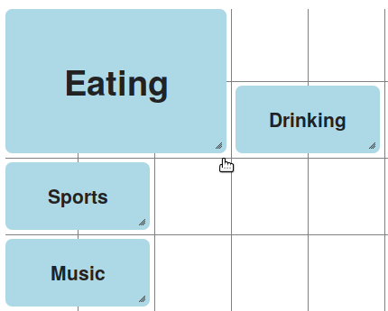
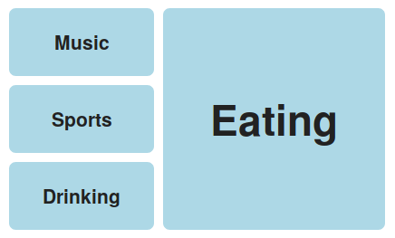

# Grid Creation

In this tutorial you will learn how to create a simple grid.

## AsTeRICS Grid web application

AsTeRICS Grid is the web application to run and manage grids for AAC.

If you open the link [https://grid.asterics.eu](https://grid.asterics.eu), the default grid is opened in your browser and saved locally on your device in the browser cache. All modifications are also saved to your local version of the grid from now on.

## Create New grid

To create a new grid do the following steps

1. Click on ```Manage grids```
2. Click on ```New Grid```
3. Enter the name of the new grid at the bottom of the page and click on the check mark button.


The new grid is added to the bottom of the list of ```Saved Grids```.

## Add cells

Now you must add cells to the newly created grid. You can do this by the following steps:

1. Clicking on the ```Edit``` button of the new grid.
2. Click on the ```Create new elements``` link.

3. Enter the labels of multiple cells in the textfield

4. Click on ```Insert elements```

Finally the grid should look like in the picture below.



## Adapt layout

Now you can change the size and layout of the cells.

### Change size

To change the size of the cell, click on the right bottom corner and drag it until the target size is reached.


### Change position

To change the position of a cell, click on it and drag it to the new target position.

### More options

There are many more options to add or delete cells or to do automatic layout. The options can be found by clicking on the ```More``` button.

### Close Edit mode

After you have finished all changes, you must close the edit mode for being able to use the grid. You can do this by clicking on the button ```Back``` in the top menu.

## Conclusion

Now you know how to create a new grid it should look like in the picture below.

