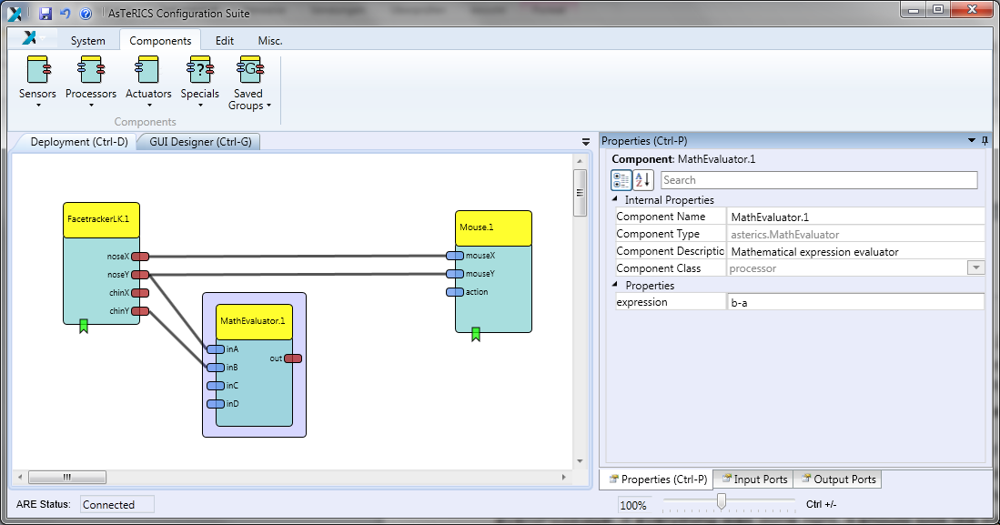

# Model Customization

## Camera Mouse Simple

A model is a collection of 1 to n components, where a component represents a plugin
of the ARE. These components are connected via cannels (for data connections) and
event channels (representing events). The following example will illustrate the
creation of a simple webcam mouse, using the position of the nose to control the
cursor and opening the mouth to trigger a mouse click. This model requires a
connected and installed webcam.

### Add Facetracking

In a first step, start the ACS and the ARE using the ACS.exe and ARE.exe short cuts.
In the ACS window select the tab **Components**, then **Sensors** and within the
sensors the menu item **Computer Vision**. There select the component
FacetrackerLK. The component is now on the drawing area and, if the component is
selected, properties can be set (or changed) in the rightmost part of the ACS window.

### Add Mouse

The next needed component is the **Mouse**, it can be found by selecting **Actuators** -
**Input Device Emulation**. After the insert, select the Mouse component and adapt
the properties. Deactivate absolutePosition and set the `xMax` and `yMax` to your
screen resolution.

In the next step, connect the noseX and the noseY outputs of the **FacetrackerLKd**
with the mouseX and mouseY inputs of the Mouse. Finally, it should look like the
screenshot below.

### Add Mouse Click

The model now would be able to use the coordinates of the nose to control the
mouse cursor, but the mouse click is still missing.
For the mouse clicking functionality, we first need the **MathEvaluatord** (**Processorsd** -
**Basic Mathd**) plugin. We connect the noseY output of the **FacetrackerLKd** the with
the inA input of the **MathEvaluatord** and likewise the chinY with inB. In the properties
of the **MathEvaluatord**, we set the property expression to **b-ad**.

We will **Differentiate** (**Processorsd** -> **Basic Mathd**) the out value to react on a fast
change of the nose to chin distance.

This processed value will then be forwarded to a **Threshold** (**Processors** -> **Basic
Math**) component. Set the thresholdLow and thresholdHigh values to 30.

As a final step, connect the event trigger output of the **Threshold** with the event
listener input of the **Mouse** – the event triggers and listeners are at the bottom of the
components. After the connection has been made, set the leftClick to eventPosEdge
in the property editor at the right. If everything was done right, it should look like the
following screenshot:

### Test Model

Now, upload the model to the ARE and press the **Start Model** button. A window with
the camera screen will appear, marking with a green and yellow circle - the position
of nose and chin. Press the **Stop Model** button or press F7 to stop the model and
get the control of the mouse back. Below is a screenshot of the system, when
running.

Congratulations, your first AsTeRICS model is running!

### Reducing Tremor

You might have noticed that the mouse pointer has a tremor, because the head is
always in movement to a certain extent. To reduce this tremor, an **Averager**
(**Processors** -> **Basic Math**) will be used to smoothen the X coordinates and
another **Averager** for the Y coordinates between the **FacetrackerLK** and the
**Mouse**. The bufferSize in the properties will be set to 5.

That's all, just upload the model and start it now.

### Adjusting the Webcam

If you don't like the position of the webcam after starting the model, you can set a
different start position. Select the **GUI Designer** tab above the drawing area and
move the webcam window to an area, which is comfortable to you. Also the size of
the window can be adjusted.

Upload and start the model to work with the changes.

## Camera Mouse Advanced

If your first model works, try this more [advanced step-by-step tutorial](https://github.com/asterics/AsTeRICS/blob/master/Documentation/AsTeRICS_CameraMouseCreation_StepbyStep_Tutorial.pdf) based on slides.