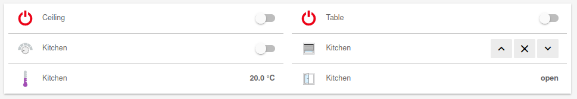
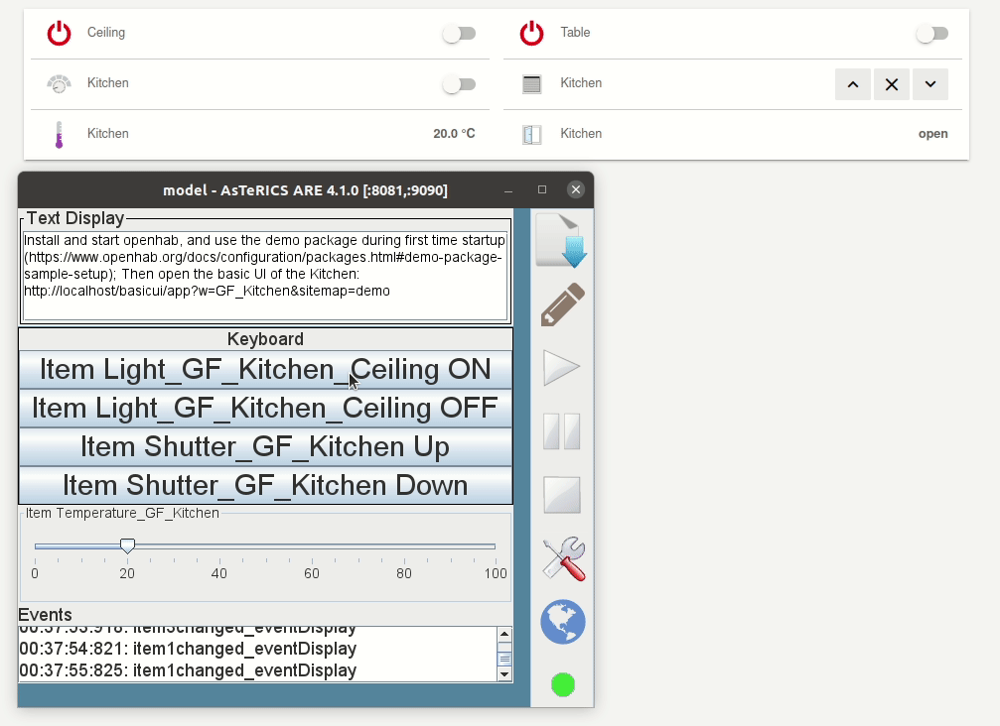

# Environmental Control

AsTeRICS has many plugins for environmental control like **KNX**, **EnOcean**, **IrTrans**, **Phillips Hue** or **OpenHAB**. Check the [Plugins](/plugins/) page and filter by ```Home Control```.

On this page you will find some tutorials of how to use such plugins to control your environment and how to create and accessible user interface for it.

## OpenHAB

OpenHAB is an Open Source Home Automation SW that let's you control light, heating and other appliances of your Smart Home. Such appliances or devices are called **things** which are represented as **items** in a user interface. OpenHAB provides several user interfaces and means of voice control.

<!-- ") -->

::: tip Accessible User Interface
This tutorial explains how to control an OpenHAB instance and it's configured items by an AsTeRICS model and how to create an **accessible user interface** for it using AsTeRICS Grid.
:::

::: warning
This tutorial is based on OpenHAB v2.5. It is not compatible with OpenHAB v3
:::

1. Read the [OpenHAB concept page](https://v2.openhab.org/v2.5/docs/concepts/)
2. [Install OpenHAB](https://v2.openhab.org/download/)
3. Start openHab
4. [Create demo package](https://v2.openhab.org/v2.5/docs/configuration/packages.html#demo-package-sample-setup) at first time startup
5. Open the model [ARE/models/componentTests/processors/openHAB_simple_test.acs](http://webacs.asterics.eu/?areBaseURI=https://127.0.0.1:8083&openFile=https://raw.githubusercontent.com/asterics/AsTeRICS/master/bin/ARE/models/componentTests/processors/openHAB_simple_test.acs)
6. Upload/Start model
7. Open [Basic UI of the Kitchen](http://localhost:8080/basicui/app?w=GF_Kitchen&sitemap=demo)
<!--  -->
9. In the ARE GUI: Click on ```Item Light_GF_Kitchen_Ceiling ON``` or ```Item Light_GF_Kitchen_Ceiling OFF```. You should see the switching of the item in the basic UI accordingly.
    
10. Change a value in the basic UI, you should get an event in the event visualizer of the ARE GUI.

### Accessible UI

You can use AsTeRICS Grid to create an accessible UI for controlling your Smart Home using OpenHAB.

1. Open [AsTeRICS Grid](https://grid.asterics.eu)
2. See [AsTeRICS Action](../../manuals/asterics-grid/05_actions.html#asterics-action): To know how to execute an action of an AsTeRICS model in a running ARE instance.
3. Click ```Download from ARE```
4. In ```Component```, select ```openHAB.1_c```
5. In ```Send data```
   1. Select ```actionString```
   2. Set item name and state value, e.g. ```@OPENHAB:Light_GF_Kitchen_Ceiling,ON``` or ```Light_GF_Kitchen_Ceiling,ON``` ([See plugin documentation](../../plugins/processors/OpenHAB.html#input-port-description))
6. Test action by clicking on ```Test Action```
7. Click ```OK``` to save the action.

<!--
## KNX

## Enocean

## IrTrans

-->
