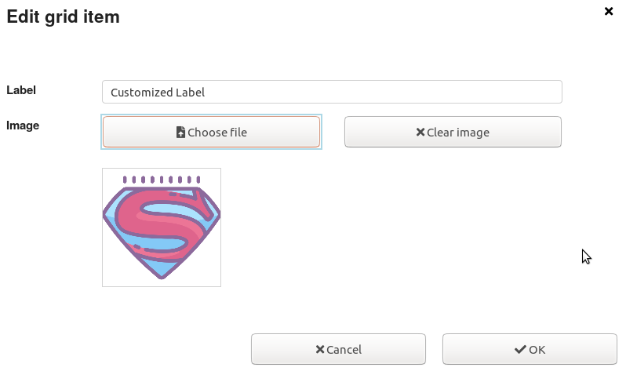
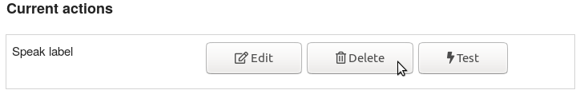
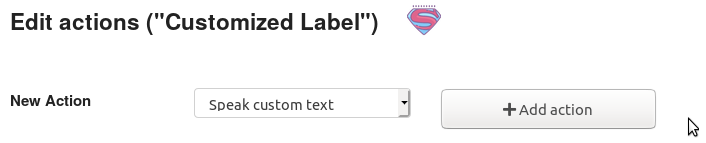
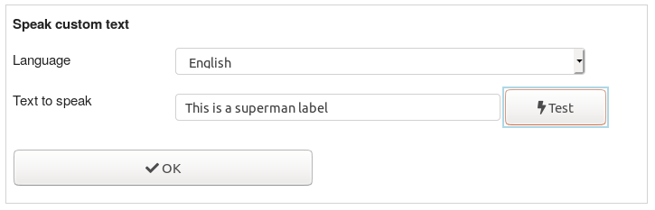

# Grid Customization

In this tutorial you will learn how to do simple modifications to a grid like changing the cell text or image.

::: tip Note
In case you need more detailed information, please check the **[AsTeRICS Grid user manual](https://www.asterics.eu/manuals/asterics-grid/)**.
:::

## AsTeRICS Grid web application

AsTeRICS Grid is the web application to run and manage grids for AAC.

If you open the link [https://grid.asterics.eu](https://grid.asterics.eu), the default grid is opened in your browser and saved locally on your device in the browser cache. All modifications are also saved to your local version of the grid from now on.

## Open grid

First you have to open the grid you want to change.

### Saved Grids

If you click the button ```Manage Grids```, you can open other grids from the list of ```Saved Grids``` by clicking on the ```Edit``` button.

1. 
2. 

### Import Grid file

You can also import and open a grid from a file. To do so, click on ```More/Import grid(s) from file```.

## Change cell

You can change the cell text, image and spoken text of a cell. In order for that you must change to the edit mode of the grid by clicking on ```Edit grid```.

### Cell text and image

1. Move the mouse cursor to the cell you want to edit and click the right mouse button.
2. Select the menu entry ```Edit```
3. Now you can change the label in the text field and select a new image by clicking on ```Choose file```. To clear the image click on ```Clear image```.



### Spoken text

You can also change the spoken text of a grid by the following steps

1. Move the mouse cursor to the cell you want to edit and click the right mouse button.
2. Select the menu entry ```Actions```
3. Delete ```Speak label``` action

4. Add ```Speak custom text``` action
5. Enter text and click on ```Test```
6. Finally, save the custom text by clicking on ```OK```




### Close Edit mode

After you have finished all changes, you must close the edit mode for being able to use the grid. You can do this by clicking on the button ```Back``` in the top menu.

## Conclusion

Now you know how to change a cell text, image or spoken text, to learn how to create a new grid, try the [grid creation tutorial](./Grid-Creation).
