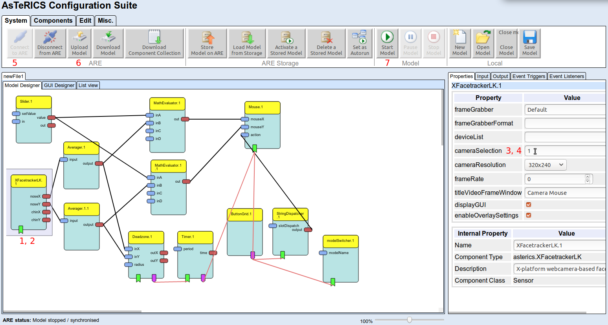

# Model Customization

In this tutorial you will learn how to do simple modifications to a model like changing a plugin property. This can be useful if you want to change the camera device to be used or want to change the key triggering a user action.

## Open model

First you have to open the model. There are two ways to do this:

### Model of Solutions

If you want to customize a model of the [solutions](/solutions/) page, click the ```Edit``` button of it. This opens the WebACS with the given model in a new browser tab.

### Deployed Model

If the ARE is running, you can press ```F8``` or click the  button in the control panel. This opens the WebACS with the given model in a new browser tab.

## Change Plugin Property

As soon as the model is opened, you can click onto a plugin to change it's property values. A property is a configuration item to modify the behaviour of that plugin.



### Change Property Value

1. Click on plugin symbol
2. Press ```F1``` to read about supported properties and their values
3. Click into the property editor (right panel)
4. Change value

### Test Change

5. Connect to ARE
6. Upload Model
7. Start Model

## Conclusion

Now you know how to change a property value of a plugin, to learn how to create a new model, try the [model creation tutorials](./Model-Creation). If you want to know more about the WebACS or ACS, check the respective [manuals](/manuals/).