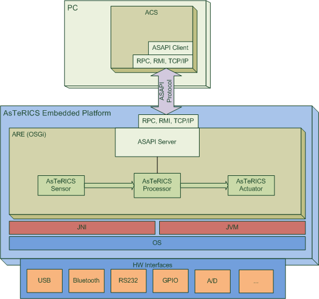

# ARE Development Overview

## The AsTeRICS Runtime Environment
    

The AsTeRICS Runtime environment (ARE) is an OSGi-based middleware \[3\] which allows software plugins to run in parallel. The plugins usually represent a sensor or an actuator and are implemented as independent OSGi bundles. The runtime environment identifies AsTeRICS plugins from other OSGi bundles based on metadata defined inside the plugins.

The ARE expects from plugin-developers to define the structure of their plugins (properties, inputs, outputs and event ports) in XML files. Based on these XMLs, the middleware constructs a runtime representation of each installed AsTeRICS plugin.

Furthermore, the ARE expects a runtime model (system model) which usually comes from the AsTeRICS Configuration Suite (ACS). The ACS is running on a Windows Personal Computer (.net 4.0 required) and mainly used to graphically design the layout of the system as a network of interconnected components. The system model is another XML file that defines the components participating in a specific application, connections between them, events and other properties. Based on this file, ARE knows which plugins to activate and how to define the data flow between them. Since the system model represents the main communication means between the ACS and the ARE, it is expected to be a serialisable object, easy to transfer and translate. ARE and ACS communicate through an appropriate TCP/IP-based communication protocol named ASAPI.

  

  
  

The ARE also provides “services” to plugin developers (for example communication support for COM ports) and it allows reporting errors on the runtime environment, registering event listeners and interacting with its graphical user interface (ARE GUI).

The ARE GUI is a simple graphical environment developed to allow end-users to interact directly with the runtime environment. It may be used to modify runtime parameters of a model via buttons or sliders, and to monitor live signals and events of the running model.

  
  

## ARE Components
    

The ARE consist of the following main parts:

*   The ARE middleware
    
*   ARE plugins (also referred to as “components”) – sensor, processor and actuator modules which provide functional building blocks for assistive functionalities
    
*   A service layer which provides infrastructure to the ARE components,  
    for example COM port and communication management for connection of the Communication Interface Modules (CIMs)
    

  
The ARE is commonly deployed on an embedded device, running an appropriate operating system (OS), typically an embedded variant of Windows. On top of the OS, an appropriate Java Virtual Machine (JVM) is used to host the OSGi component framework which provides support for modularity and dynamic loading/unloading of components.

All the core components of the framework (described in detail later) are defined as OSGi modules. Certain components that need to access legacy code (e.g., written in C or C++) are also deployed on top of OSGi, and are interfaced to the native code using Java Native Interface (JNI) as needed. In this regard, and with the exception of the pluggable components that use native code interfaces with platform-specific JNI bindings, the ARE middleware is expected to be _platform independent_.

The implementation requires basically JAVA 1.7 (JDK/JRE 7) and an OSGi framework (which is part of the source code downloads).

## About OSGi
    

The Open Service Gateway initiative (OSGi) is an open specification that enables the modular assembly of software built with the Java technology \[3\]. The OSGi Service Platform facilitates the componentization of software modules and applications and assures interoperability of applications and services over a variety of networked devices.

OSGi technology is the dynamic module system for Java™. Java provides the portability that is required to support products on many different platforms. The OSGi technology provides the standardized primitives that allow applications to be constructed from small, reusable and collaborative components. These components can be composed into an application and deployed; The OSGi Service Platform provides a service-oriented architecture that enables these components to dynamically discover each other for collaboration, and thereby forms the optimal basis for the AsTeRICS middleware.