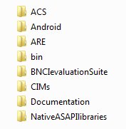
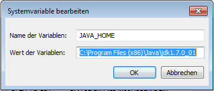
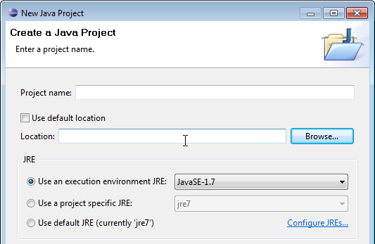
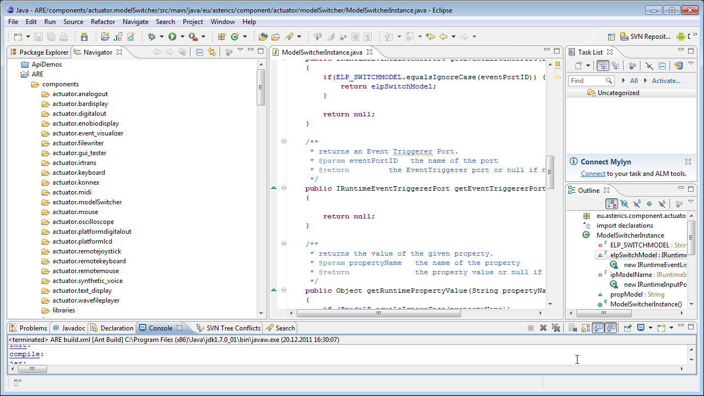
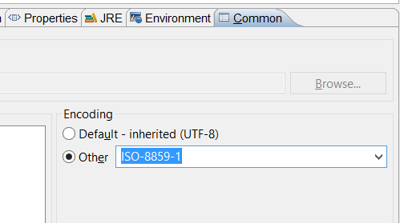
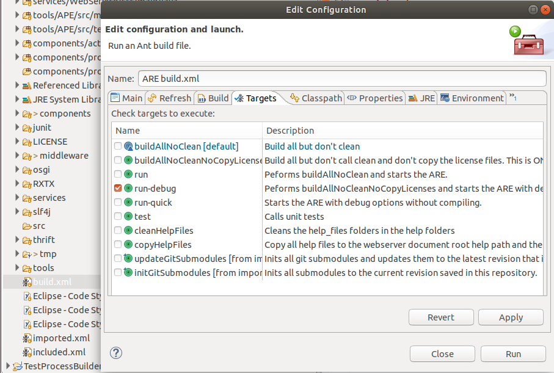

# Development Environment

## Repository Overview

The source code repository is organised in the following subfolders:



The _**ACS**_ folder contains the AsTeRICS Configuration Suite source code.

The _**Android**_ folder contains a server application for Android phones which allows interfacing with the AsTeRICS Android plugin to use phone functions in AsTeRICS models.

The _**ARE**_ folder contains the middleware and service layers and ARE components.

The _**bin**_ folder contains subfolders where ARE and ACS executable files are placed during the build flow. These folders contain additional configuration files or dependencies, for example the config.ini and loader.ini files which specify the modules which are loaded by the ARE at startup.

Additionally, the bin folder contains several resources which are useful, e.g. a pre-built ACS with demo models (in the ACS\\models folder) and the OSKA application.

The _**BNCIevaluationSuite**_ is a collection of matlab files for analysis and comparison of algorithms for Brain Computer Interfaces (contributed by Starlab).

The _**CIM**_ folder contains firmware for the microcontroller modules used to interface the system to the environment (maintained by IMA and FHTW).

The _**Documentation**_ folder contains the User- and the Developer Manual, and OSKA manual and the licence information for the developed and all utilized source code and libraries.

The _**NativeASAPI**_ folder contains C++ libraries for mobile-phone and GSM modem access, 3d-mouse and tremor reduction from own C++ projects.

## Clone Repository

Install a [git](https://git-scm.com/downloads) command line client and clone the [repository](https://github.com/asterics/AsTeRICS.git) by entering:

```bash
git clone https://github.com/asterics/AsTeRICS.git
```

## Prerequisites

You need:

1. [Java Development Kit 8](http://www.oracle.com/technetwork/java/javase/downloads/jdk8-downloads-2133151.html).
2. [apache ant build framework (version >= 1.9.1)](http://ant.apache.org/bindownload.cgi).
3. Set [Environment Variables](#environment-variables).

### Environment Variables

* Ensure to set ```JAVA_HOME``` to the folder where you installed the Java JDK and add the JDK bin path to the  Environment Variable ```Path```.
* Ensure to set ```ANT_HOME``` to the folder where you installed ant and add the ant bin path to the Environment Variable ```Path```.

See below an example of how to set the environment variable ```JAVA_HOME``` on Windows 7.



## Build

AsTeRICS uses the build system ```ant```.
You can simply build the framework from the command line:

```bash
ant
```

To **build** and **start** the ARE, enter:

```bash
ant run
```

For other build targets and their meaning, enter:

```bash
ant -projecthelp
```

### Building ARE Middleware, Services and Plugins

In the ```ARE``` subfolder the source code of the ARE middleware (```ARE/middleware```), ARE services (```ARE/services```) and plugins (```ARE/components```) can be found.

The middleware, the services and the components have separate ant build files (```build.xml```). The middleware and services are required for building the plugins (components). To build everything, a top-level build script is available in the ```ARE``` folder.
Alternatively, individual services or components can be built by selecting their associated ```build.xml``` script from the corresponding subfolders.

To **build** the ARE (plugins, services), enter:
```bash
ant
```

To **build** and **start** the ARE, enter:
```bash
ant run
```

To **build** and **start** the ARE with **remote debugging enabled**, enter:
```bash
ant run-debug
```

For other build targets and their meaning, enter:

```bash
ant -projecthelp
```

## Eclipse Setup

The AsTeRICS framework is not bound to a specific IDE, but [Eclipse IDE for Enterprise Java Developers](https://www.eclipse.org/downloads/packages/) is recommended. This will provide editing support for diverse file types (java, html, Js, CSS, xml). Alternately you can install _Eclipse IDE for Java Developers_ and later install addons for web development.

### Java Project

You must create a ```Java Project``` first:

Choose _File -> New -> JavaProject_ in the Eclipse main menu, disable the option _“Use default location”_ and browse to the _ARE_ subfolder: 



Then you should see something like this:


Eclipse provides different views (_Window -> Show View_), where the _Navigator_ and the _Package Explorer_ are most useful for Java source code development.

Note that the “_Refresh_” command (_F5_) synchronizes the Navigator view with changes in the local file system.

### Character encoding

Incorrect character encoding settings can cause problems with ANT-based builds in eclipse, especially if special characters like ö, ä, etc. are used in the source code. Be sure to use ISO-8859-1 as character encoding in _Configuations and Lauch_ settings (in the _Common_ tab) as shown in the screenshot (note that this is not the default setting in some versions of eclipse):



### Editing Model Files (windows-only)

You can configure the Eclipse editor to open the _ACS_ editor for AsTeRICS model files (```.acs```).

1. Right click on a model file, select ```Open with/Other```
2. Check ```External programs``` and browse to ```C:\Program Files (x86)\AsTeRICS\ACS\ACS.bat``` (Note: **ACS.bat**)
3. Check ```Use it for all `*.acs file```
4. Click onto ```Ok```

### Ant within Eclipse

You can run the _ant_ targets of the AsTeRICS build system from within Eclipse.

#### Run default target 

1. Right click onto file ```build.xml```
2. Select ```Run As/Ant Build``` (first entry)

#### Run selected targets

1. Right click onto file ```build.xml```
2. Select ```Run As/Ant Build...``` (second entry)
3. Click onto targets to run
4. Select order of execution at the bottom
5. Click onto ```Apply``` and ```Run```

The screenshot below shows the dialog for build target selection:

