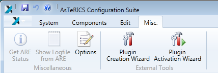
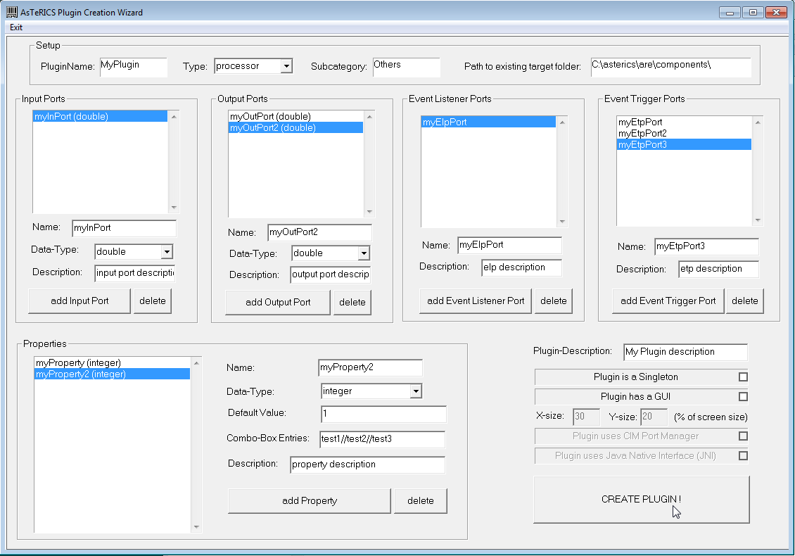
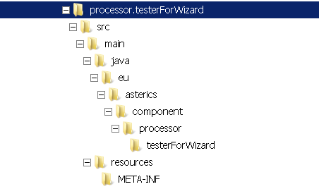
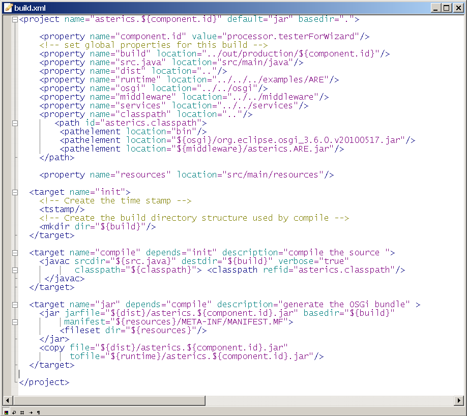
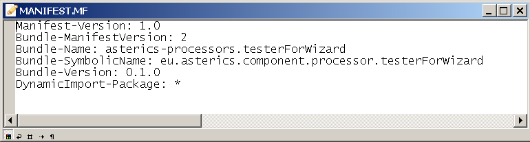
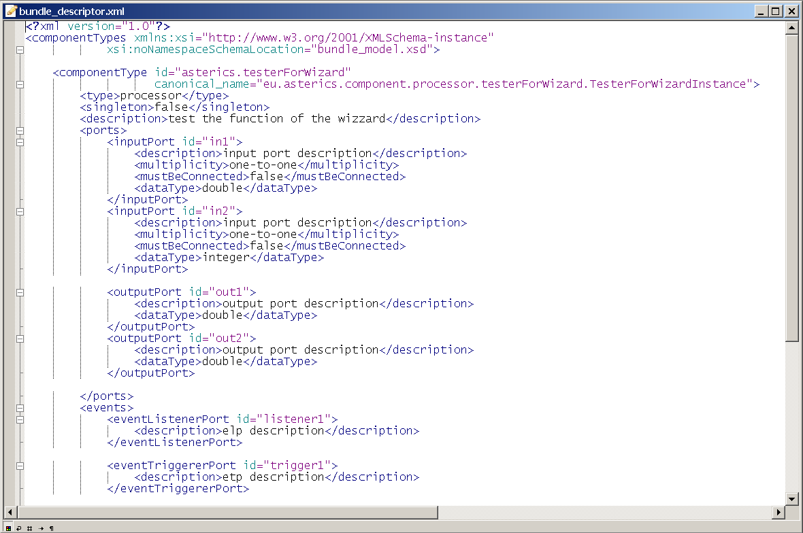
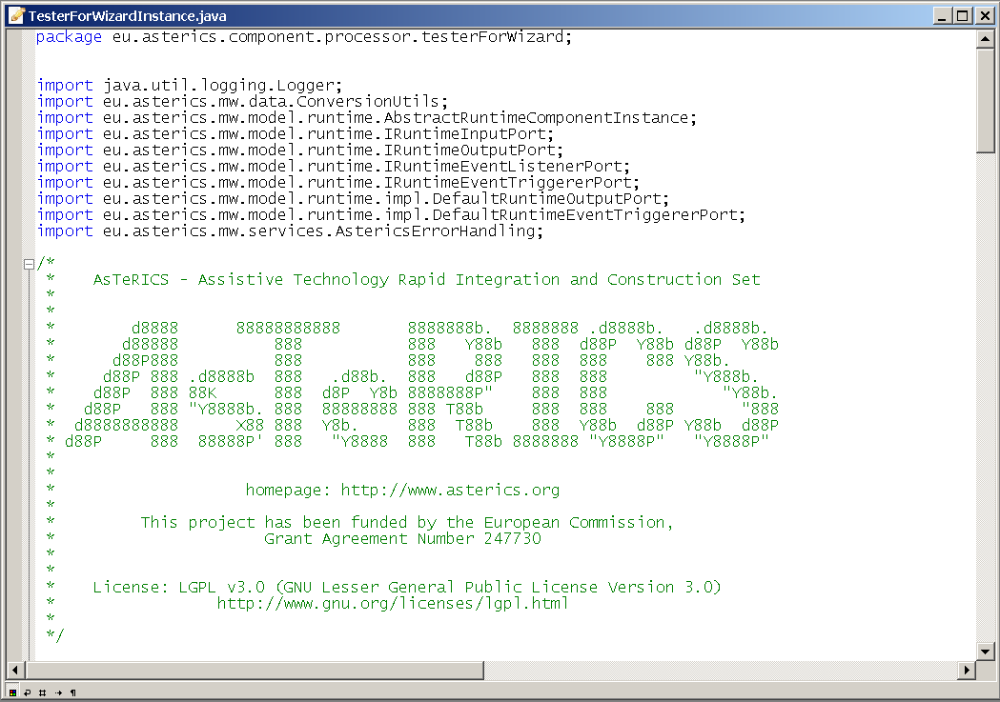
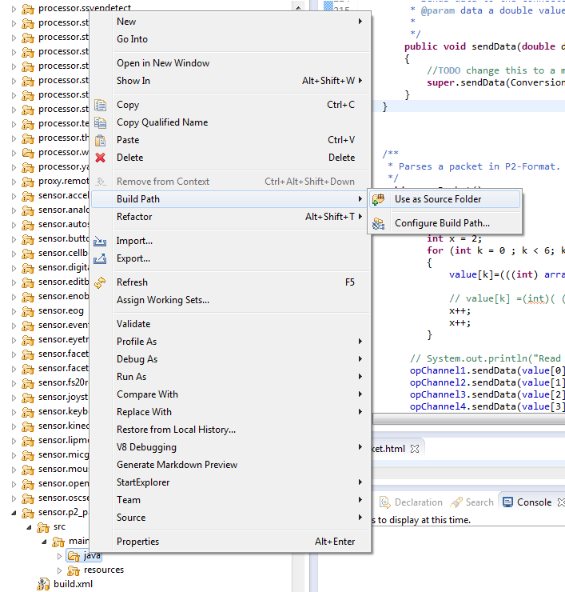
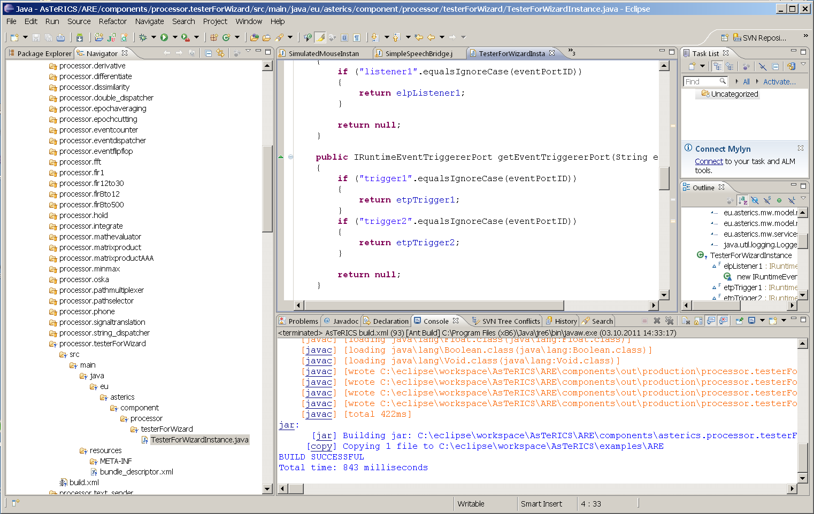

# Plugin Introduction

## A Quick Guide to AsTeRICS Plugin Development
    

This section describes the AsTeRICS Plugin-Creation tool and the plugin-activation process. These tools make it easy to create new plugins and make them available in ACS and ARE. They can be started manually from their location in the **AsTeRICS\_runtime.zip** package (folder: “ACS/tools”) – or they can be launched from the “Misc.” – Tab in the main menu of the ACS:

  
  

The creation of a new AsTeRICS plugin for the runtime environment involves several steps:

*   creating the folder structure to store the plugin files
    
*   creating the ANT build script file
    
*   creating the manifest file
    
*   creating the bundle-descriptor, which specifies the ports and properties of the plugin
    
*   creating the source code file of the JavaInstance
    
    *   defining the ports and properties and implementing the get- and set-methods for input-, output-, eventListener- and evenTrigger ports
        
    *   implementing the get- and set- methods for property values and the input ports receive handlers
        
*   creating the license files for the plugin and third-party libraries in the **LICENSE** subfolder
    

This process is similar for each plugin, and involves much work and sources of errors, especially for people who work with the AsTeRICS framework for the first time.

Usually, you look for a plugin with similar specifications, copy its folder structure and then rename and change the files as desired. But also this process needs some effort and errors/typos can be introduced very easily.

The purpose of the AsTeRICS Plugin Creation Tools is to make it easy to create new plugins, by providing the necessary folder structure, the bundle descriptor and a template for the JAVA source code.

  
  

## The Plugin Creation Wizard
    

The plugin Creation wizard allows definition of characteristics of a new plugin and creates the needed folders and files for the Eclipse build flow, including the JAVA source code skeleton and the plugin’s bundle descriptor.

  
  

As can be seen in the above figure, desired input- and output ports, data types, properties and plugin-features are simply selected and added to list boxes on the screen.

Important Notes:

*   the path to the target folder has to exist in the local file system, and must point to the ARE/components directory where all plugin source files are located, e.g.: “C:\\asterics\\bin\\components\\”.
    
*   The plugin name must be specified in CamelCase letters (capital first letter), e.g. “MyPlugin”. Type and Subcategory have to be specified - they define the location where the plugin will appear in the ACS Components menu.
    
*   It is possible to create a list of possible text-selections in a combo-box in the ACS property editor. The data type for this property must be integer, the property gets the number of the selected item. Text-captions for the combo-box entries must be separated with double slash, e.g: “Mode 1//Mode 2//Mode 3”.
    

## Created files and folders
    

After “Create Plugin!” has been pressed and the plugin creation was completed successfully, following sub-folders and files are begin created:

  
  

The root folder contains the build script, which can be executed inside Eclipse to compile and build the plugin (.jar) file:

  
  

The META-INF folder contains the manifest file

The “resources” folder contains the bundle descriptor (bundle\_descriptor.xml):

  
  

The source code folder `src/main/java/eu/asterics/component/<pluginType>/<pluginName>` contains a template for the plugin source code in JAVA, including the definitions of the selected ports and properties and the needed get- and set- methods for ports and property values. The code skeleton complies to the AsTeRICS coding guidelines and contains the AsTeRICS source file header (only a small portion is shown in the following screenshot).

After the Eclipse IDE has been opened, Eclipse must be pushed to refresh the folder structure by pushing F5. Furthermore, the path `src/main/java` must be configured as source folder.

  
  

The plugin code can be built using the provided build script (right-click build.xml -> RunAs -> Ant Build in the plugin’s folder)

  
To see the plugin in the ACS editor window and/or start it inside the runtime environment, the Plugin Activation Tool can be used (see section 3).

  
  

## Plugin Activation in ACS and ARE
    

To use a new AsTeRICS plugin which has been built using the Eclipse build flow and exists as executable .jar file/OSGI bundle, one step is necessary:

1.  The Plugin has to be **announced to the ACS** – so that it gets visible in the graphical editor and can be used for the creation of deployment models. This is done by adding the bundle descriptor of the new plugin to a component-collection file (extension “.abd”) in the ACS-folder. These component collections contain all bundle-descriptors of components which can be used in the ACS. The new plugin section can be added either manually or can be downloaded from the running ARE via the ACS’ Component-Collection Manager (recommended, see 3.2.1). Using the Component Collection Manger, the downloaded collection can be stored as “default Component Collection” for the ACS, so that all components will be available when the ACS is started next time.
    

  
  

Subsequently, the plugin can be selected in the “components” menu of the ACS, and the ARE will activate the plugin at startup.

  
  

## Component-Collection Management in the ACS
    

The ACS provides a function for downloading the bundle descriptions of all active plugins directly from a running ARE and creating a component collection file from this information. (“System”- tab, Button “Download Component Collection”):

The component collection will be stored as “.abd” – file in the ACS folder, subfolder “componentcollections”. The new component collection can be used right after download, but will not be available after an ACS restart.

Within the ACS Component-Collection Manager (in the “Miscellaneous” tab), component collections can be selected or set as default collection for the ACS startup. For details see the User Manual, ACS section.

Please note that the “loader.ini” – file has to be updated manually in the ARE’s “profile” subfolder, by addition of the new .jar filename. After restart of the ARE and connection to the ACS, the component collection can be downloaded.

## Plugin License Declaration
    

Since AsTeRICS version 2.8 the licenses (including licenses of third-party libraries) of a plugin must be provided as .txt files in the LICENSE subfolder. The filenames must follow a defined naming convention, which is:

A contributor must add the respective license file for the component (either **LICENSE\_MITOrGPLv3WithException.txt** or one of the two dual license options) to the component/LICENSE folder. Furthermore, for each thirdparty library used, the license file must be added with the following naming convention (Please use CamelCase notation for the library and license names):

**THIRDPARTY\_NameOfLibrary\_LicenseNameInclVersionInfo.txt**
