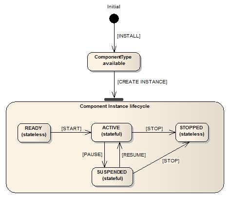

# Plugin Development Advanced

In this manual some advanced topics of plugin development are listed.

## Port Naming Conventions
    

Variables of port instances should be named with a prefix indicating what kind of port it is. The rest of the port name should indicate the port’s use and adhere to the standard Java variable naming conventions. The available prefixes are:

*   ip: indicates that the port is an instance of IRuntimeInputPort
    
*   op: indicates that the port is an instance of IRuntimeOutputPort
    
*   elp: indicates that the port is an instance of IRuntimeEventListenerPort
    
*   etp: indicates that the port is an instance of IRuntimeEventTriggererPort
    

A variable holding an event listener port could therefore be named _elpKeyPressed_.

  
  

## Property Naming Conventions
    

Plugin properties should be directly mapped to a variable in the plugin code. The variable’s should be prepended with the prefix _prop_ and adhere to standard Java naming conventions. Thus a property could be named _InputGainValue_ and the corresponding variable should be named _propInputGainValue_.

## Bundle Descriptor Naming Conventions
    

The bundle descriptor should serve as an abstraction layer between the user who creates models in the ACS and the developer. Thus the names for plugins, ports and properties in the bundle descriptor should be as intuitive as possible. Names in the bundle descriptor should not include prefixes because the added information is also conveyed in the presentation of plugins in the ACS.

The bundle descriptor can translate intuitive names (e.g. input.switch) to the canonical names of plugins (e.g. GpioInputInstance) allowing coexistence of a user and a developer language. This method of name translation can be applied for plugin names, port names and property names.

## AsTeRICS ARE, service and plugin source file header
    

Each source file of ARE, of ARE services, ARE plugins and tools which will be released as open source should have the following header:

```java
/*
 *    AsTeRICS - Assistive Technology Rapid Integration and Construction Set
 * 
 * 
 *        d8888      88888888888       8888888b.  8888888 .d8888b.   .d8888b. 
 *       d88888          888           888   Y88b   888  d88P  Y88b d88P  Y88b
 *      d88P888          888           888    888   888  888    888 Y88b.     
 *     d88P 888 .d8888b  888   .d88b.  888   d88P   888  888         "Y888b.  
 *    d88P  888 88K      888  d8P  Y8b 8888888P"    888  888            "Y88b.
 *   d88P   888 "Y8888b. 888  88888888 888 T88b     888  888    888       "888
 *  d8888888888      X88 888  Y8b.     888  T88b    888  Y88b  d88P Y88b  d88P
 * d88P     888  88888P' 888   "Y8888  888   T88b 8888888 "Y8888P"   "Y8888P" 
 *
 *
 *                    homepage: http://www.asterics.org 
 *
 *    This project has been partly funded by the European Commission, 
 *                      Grant Agreement Number 247730
 *  
 *  
 *         Dual License: MIT or GPL v3.0 with "CLASSPATH" exception
 *         (please refer to the folder LICENSE)
 * 
 */
```

## JavaDoc compatible comments
    

JavaDoc compatible comments should be used to indicate the author of a source file, and to describe the purpose of a function/method/class and the respective parameters and return values.

  

Example for a source file header info:
```java
/**
 * Bardisplayinstance.java
 * Purpose of this module:
 *   Implements the Bardisplay actuator plugin
 *  
 * @author Chris Veigl [veigl@technikum-wien.at]
 *         Date: Mar 7, 2011
 */
```
  

Example for a method of a class:
```java
/**
* Returns the value of the given property
* @param propertyName   the name of the property
* @return               the property value
*/
   public Object getRuntimePropertyValue(String propertyName)
```

## Implementing AsTeRICS components
    

This section describes the basic steps required for implementing an AsTeRICS component including a brief introduction to OSGi. To illustrate the implementation steps, we take a walk-through with the implementation of a simple processor component.

The AsTeRICS schemata of the XML descriptors include two concepts: the _bundle descriptors_ and the _deployment descriptors_.

## The Bundle Descriptors
    

Bundle descriptors are used to describe the content of an individual bundle (typically encapsulating one or more components). As such, they contain information about the included _components_, their _ports_, their customizable _properties_ and optionally their GUI.

The following shows a bundle descriptor of a simple processor-plugin (subtype for the ACS components menu is “Basic Math”). The plugin provides an averaging function for n values (property “buffer-size”) and has one input port and one output port for integer values:
```xml
<?xml version="1.0"?>
<componentTypes xmlns:xsi="http://www.w3.org/2001/XMLSchema-instance"
            xsi:noNamespaceSchemaLocation="bundle_model.xsd">
    <componentType
      id="asterics.averager"
      canonical_name="eu.asterics.component.processor.averager.AveragerComponent">
        <type subtype="Basic Math">processor</type>
        <description>Linked list-based averager</description>
        <ports>
            <inputPort id="in_1">
                <description>Input port of averager</description>
                <multiplicity>one-to-one</multiplicity>
                <mustBeConnected>true</mustBeConnected>
                <dataType>integer</dataType>
            </inputPort>
            <outputPort id="out_1">
                <description>Output port of averager</description>
                <dataType>integer</dataType>
            </outputPort>
        </ports>
        <properties>
            <property name="buffer-size"
                      type="integer"
                      value="50"
                      description="The size of the averager's buffer"/>
        </properties>
    </componentType>
</componentTypes>
```
## The Deployment Descriptor
    

Deployment descriptors instruct the ARE of the desired application deployment structure. The deployment descriptor is typically composed in the AsTeRICS Configuration Suite (ACS) but can also be written with a text editor (as the bundle descriptor). Basically the deployment descriptor contains several component descriptions (copied from the corresponding bundle descriptors), actual property values and the channel connection between input- and output ports of the components.

::: tip
The _type\_id_ argument of the _component_ element in the deployment descriptor must match the _id_ argument of the _componentType_ element on the bundle descriptor. This is how the ARE detects the referred plugin type in the deployment model.
:::

The following demo deployment descriptor describes a simple model containing two plugins and one channel:

  
```xml
<?xml version="1.0" encoding="UTF-8"?>
<model xmlns:xsi="http://www.w3.org/2001/XMLSchema-instance"
       xsi:noNamespaceSchemaLocation="deployment_model.xsd">

    <components>

        <component type_id="sensor.SignalSource" id="sensor.SignalSource.1">
            <description>A Source of two signal cahnnels </description>
            <ports>
                <outputPort portTypeID="outport1"/>
                <outputPort portTypeID="outport2"/>
            </ports>
            <properties>
            </properties>
        </component>

        <component type_id="actuator.SignalTarget" id="actuator.SignalTarget.1">
            <description>A Signal Target</description>
            <ports>
                <inputPort portTypeID="in_x"/>
                <inputPort portTypeID="in_y"/>
            </ports>
        </component>
    </components>

    <channels>
        <channel id="channel.1">
            <description>Connects SignalSource.1 (outport 1) 
                          to SignalTarget.1 (in_x)</description>
            <source>
                <component id="sensor.SignalSource.1"/>
                <port id="outport1"/>
            </source>
            <target>
                <component id="actuator.SignalTarget.1"/>
                <port id="in_x"/>
            </target>
        </channel>
    </channels>
</model>
```
## The Manifest file
    

The Manifest file tells the bundle name and other informations like import packages and .dlls to the OSGi. A typical Manifest looks as follows:

  
``` {7}
Manifest-Version: 1.0
Bundle-ManifestVersion: 2
Bundle-Name: asterics-processors.averager
Bundle-SymbolicName: eu.asterics.component.processor.averager
Bundle-Version: 0.1.0
DynamicImport-Package: *

```
  
::: tip
The empty line at the end of the Manifest file. It seems that OSGi needs that empty line in order to work properly.
:::

## Structure of OSGi bundles containing ARE components
    

As a common OSGi bundle, an AsTeRICS component must be packaged in a JAR file, containing the class files (object code) and the Manifest file. In addition to these, the AsTeRICS middleware expects the _bundle descriptor_. At this point, it should be noted that it is possible to include _multiple_ AsTeRICS components in a single OSGi bundle, as long as the bundle descriptor describes all of them.

Overall, the file structure in a typical AsTeRICS bundle looks as follows:
```
/
+- eu/
    +- asterics/
       +- component/
          +- ...
+- lib/
    +- native/
       +- my_library.dll
+- META-INF/
   +- MANIFEST.MF
+- bundle_descriptor.xml
```
  

  
  

The Java object code is included in the corresponding folders representing the package structure (e.g., “/eu/asterics/component/...” etc). Optionally, if libraries are needed - native or not-, then they are included in the “/lib” folder. The Manifest is included in the “META-INF” folder as per the standard Java/OSGi practice. Finally, the AsTeRICS bundle descriptor is included directly in the root of the JAR file (i.e. “/”).

  
  

  
  

  
  

## Component lifecyle
    

An ARE component implementation needs to realise the actual component with its lifecycle (i.e., ways to access its ports and properties, and methods realizing its lifecycle). This is illustrated in the following code:

  
```java
package eu.asterics.mw.model.runtime;

public interface IRuntimeComponentInstance
{
    // ------------------ Lifecycle support methods ------------------------- //

    public void start();
    public void pause();
    public void resume();
    public void stop();

    // ------------------ Component support methods ------------------------- //

    public IRuntimeInputPort getInputPort(final String portID);
    public IRuntimeOutputPort getOutputPort(final String portID);
    public IRuntimeEventListenerPort getEventListenerPort(final String eventPortID);
    public IRuntimeEventTriggererPort getEventTriggererPort(final String eventPortID);

    public Object getRuntimePropertyValue(String propertyName);
    public List<String> getRuntimePropertyList(String key);

    public Object setRuntimePropertyValue(String propertyName, Object newValue);
  
    public void syncedValuesReceived (HashMap <String, byte[]> dataRow);
    
}
```
  

  
  

  
  

The lifecycle support methods are used to intercept AsTeRICS events concerning the component’s lifecycle. In principle, a component can be any of the following:

*   READY,
    
*   ACTIVE,
    
*   SUSPENDED and
    
*   STOPPED
    

These states and their possible transitions are illustrated in the figure on the right:

The rest of the methods are used for supporting the component operations, namely accessing the input/output ports of the component, as well as getting/setting its supported properties.

  
  


## Threading
    

For detailed information about the threading concept see 9.

## Writing plugins using Swing
    

If a plugin provides a Swing GUI it should only use the asynchronous method

`SwingUtilities.invokeLater(…)`

(and not the synchronous one) to perform the GUI updates. This is to prevent a potential thread deadlock if an action was originally triggered by a Swing GUI event e.g. by a button click in the ARE GUI. For detailed information about the ARE threading concept see 9.

## Long lasting method calls
    

If a method call performs a long lasting task and there is no need to await the termination of it, the task should be handed over to a worker thread (see 5.9) to not block ModelExecutor thread. For detailed information about the threading concept see 9.

## Sensor callbacks
    

In case you write a plugin that uses a separate thread to generate data (e.g. FrameGrabber, Timer,…) you should explicitly use the method

`AstericsModelExecutionThreadPool.instance.execute(…)`

This is to ensure that corresponding data will be delivered within the same task execution. For detailed information about the threading concept see 9. Below is an example of the FacetrackerLK plugin in the callback method for new arriving coordinates:

  
```java
public void newCoordinates_callback(final int point1_x, final int point1_y, final int point2_x, final int point2_y)
{
    AstericsModelExecutionThreadPool.instance.execute(new Runnable() {
        @Override
        public void run() {
            opNoseX.sendData(ConversionUtils.intToBytes(point1_x)); 
            opNoseY.sendData(ConversionUtils.intToBytes(point1_y)); 
            opChinX.sendData(ConversionUtils.intToBytes(point2_x)); 
            opChinY.sendData(ConversionUtils.intToBytes(point2_y)); 
        }

    });
}
```
## Contributing a developed plugin (git pull request)
    

The AsTeRICS platform is designed as an open and modular platform. The idea is to make it easy for others to develop assistive plugins any end-user in the world could benefit from. Hence, we would love to get your contribution back to the github repository to be able to ship the new plugin with future releases. For this purpose, please send a pull request.

[https://help.github.com/articles/using-pull-requests/](https://help.github.com/articles/using-pull-requests/)

