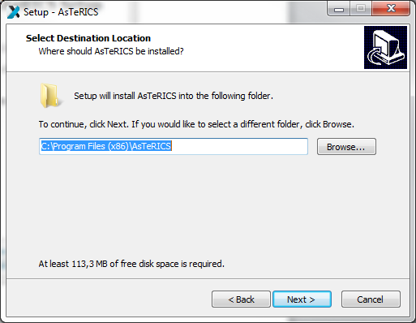

# AsTeRICS Installation

If you are new to AsTeRICS, please read the [Overview](Overview) section first to know about important terms and programs.

The AsTeRICS provides installer for [Windows](#windows), [Linux](#linux) and [Mac OSX](#mac-os-x), but only on
Windows the full AsTeRICS suite is supported. On the other platforms the installer
only contains the ARE.

## Windows

The installer for Windows (```Setup_AsTeRICS_x_y_z.exe```) contains the following programs:

* ACS
* WebACS
* ARE
* [AsTeRICS Packaging Environment (APE)](/develop/)

### Download

Please go to the [download page](https://github.com/asterics/AsTeRICS/releases/latest) and download the installer.

### Installation Steps

1. Start the setup file.
2. You should see the welcome window. It informs you which version of the software
you are installing. Click the button **Next**.


<!-- <p align="center">
  
</p> -->

#### Installation Path



In this dialogue window you can define the installation path that means you can
choose a folder, where Asterics should be installed. We suggest using the standard
installation path. Then Click the button **Next**.

#### Select Components

You can see the component selection window:


AsTeRICS needs the Java Runtime Environment (`>= Version 8`). If
you have already installed the Java Runtime Environment on your computer, please
deselect this option and install only AsTeRICS.

Then, click the button **Next**.

#### Start Menu Folder

Define Start Menu folder entry
In the next dialogue window you can define the name of the start menu entry.You
can see the following window:


Then, click the button **Next**.

#### Installation Progress

In the next dialogue window you can see the progress of the installation. It can take a
few minutes until the process is finished:


#### Installation Finished

As soon as the installation is finisehd, you can see the following window:


Finally, click the button **Finish**.

### Desktop Short Cuts

On your desktop you will find the following links (short cuts):


These short cuts can be used to start ACS and ARE. Alternaively, you can start these
programs also from the Windows start menu, where additional liks to the Debug
version of the ARE (which displays debugging information in a console window) and
the AsTeRICS unistaller have been added:

### Start Menu

Under Windows-start **All Programs** you will find the start folder **AsTeRICS** and
the start-files.


## Mac OS X

The installer for Mac OS X (```asterics-are-javaembedded-x.y.dmg```) contains the following programs:

* WebACS
* ARE

It was tested on Mac OS X 10.9.1 (Mavericks) and has Java embedded.

### Download

Please go to the [download page](https://github.com/asterics/AsTeRICS/releases/latest) and download the installer.

### Installation Steps

1. Double-click onto the `.dmg` file and follow the instructions.

## Linux

The installer for Linux (```asterics-are-x.y.deb```) contains the following programs:

* WebACS
* ARE

It is compatible with Ubuntu, Debian and ARM/Raspberry Pi.
The installer was tested on Debian 16.04 LTS and Raspberry Pi 3 with Raspbian Jessie.

### Download

Please go to the [download page](https://github.com/asterics/AsTeRICS/releases/latest) and download the installer.

### Installation Steps

#### Install Java

You need a **Java Runtime Standard Edition 8**.

##### Zulu Java

1. Download the [Zulu installer](https://www.azul.com/downloads/zulu-community/?version=java-8-lts&os=linux&package=jdk) for your your platform.
2. Install it 

```bash
sudo dpkg -i $<download_dir>/<zulu_package>.deb
```

You can also add an [APT repository](https://docs.azul.com/zulu/zuludocs/ZuluUserGuide/PrepareZuluPlatform/AttachAPTRepositoryUbuntuOrDebianSys.htm?tocpath=Zulu%20Installation%20Guide%7CPrepare%20the%20Zulu%20Installation%20Platform%7CAttach%20Azul%20Package%20Repositories%7C_____2) for it.

##### OpenJDK

```bash
sudo apt-get install openjdk-8-jre
```

##### Oracle Java

Download [Oracle Java 8](https://www.oracle.com/java/technologies/javase-jre8-downloads.html) and follow the instructions.

#### Install AsTeRICS

```
sudo dpkg -i asterics-are-<version>.deb
```

You will get an error message, if the dependencies had not been installed before:
```
dpkg: dependency problems prevent configuration of asterics-are:
 asterics-are depends on libhidapi-libusb0; however:
  Package libhidapi-libusb0 is not installed.
```

Execute the following command to install the dependencies:

`sudo apt --fix-broken install`

