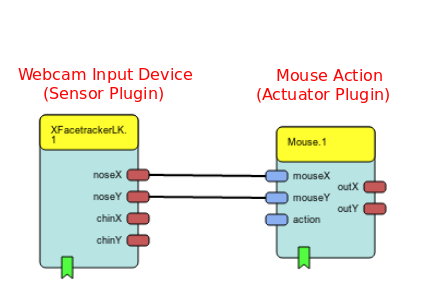
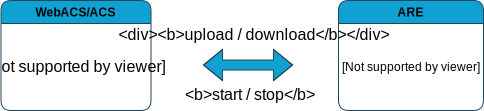
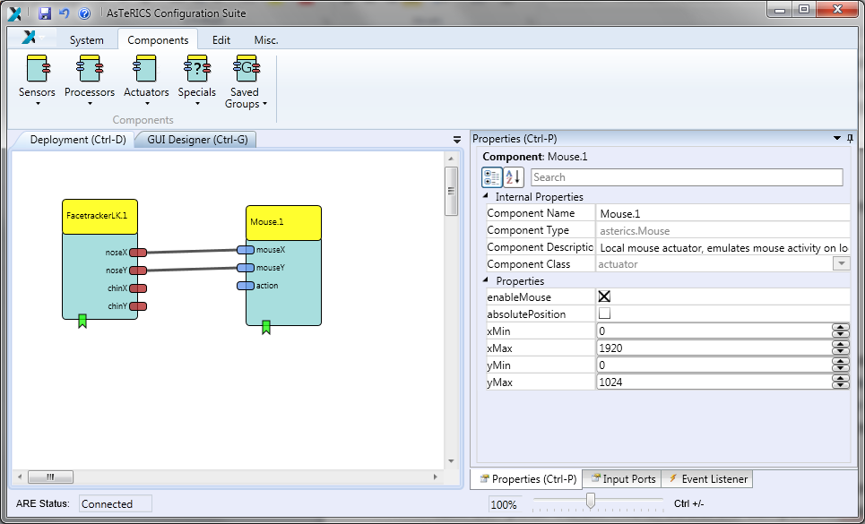
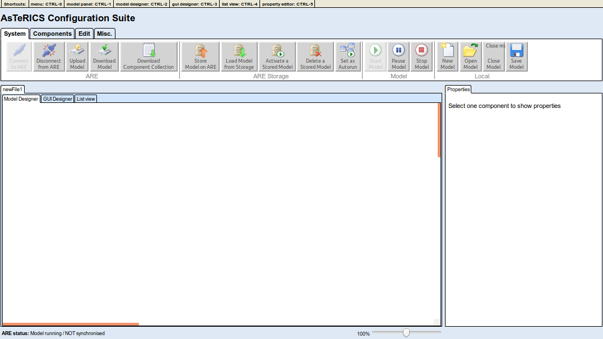
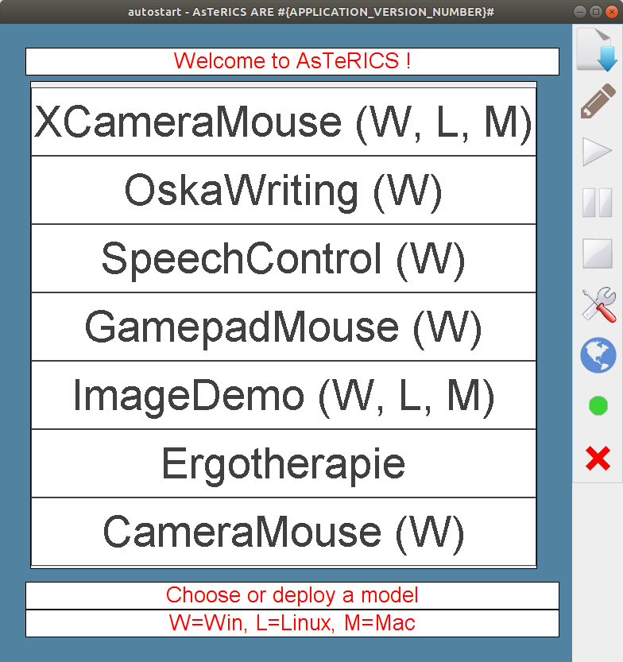

# AsTeRICS Overview

This pages explains the most important terms and elements of the AsTeRICS framework.

## Terms

The most important terms are described below.

### Solutions

The AsTeRICS framework provides some selected [solutions](/solutions/) which can be used out of the box. The solutions are grouped by **use cases** and can be directly started from the solutions page. Some solutions depend on certain [input devices](#input-device) or other hardware and software. Just click on the ```Read More``` button in a solution's tile to get a detailed step by step instruction of how to install and use it.

A solution can be categorized by the AsTeRICS technology used. It can be a [model](#model), an [AsTERICS Grid](#asterics-grid) or an [AT solution](#at-solution).

### Model

A model represents a simple Assistive Technology (AT). It is used to define **what** should be done (e.g. mouse control, switching light on/off) and **how** this can be done (e.g. button-press, head movement,...). A model uses [plugins](#plugin) to support input devices (e.g. webcam, switch,...) and required actions. On the image below you can see the XFaceTrackerLK plugin which uses the webcam to track the movements of your head. This gesture is directly translated to mouse movements by connecting the XFaceTrackerLK plugin to the Mouse plugin.



### Plugin

A plugin represents a modular component that can be used within a model.
It can be an input device (sensor), a processor (processing, modifying data) or an action (actuator).

### Input Device

AsTeRICS supports numerous input devices like a switch, a webcam or an eye-tracker. The list of supported devices can be found under [Plugins/Sensors](/plugins/).

### Action

The actions that are executed by a model are implemented using actuator plugins, which can be found under [Plugins/Actuators](/plugins/).

### AsTeRICS Grid

The AsTeRICS Grid is a web-based user interface which can be used for Augmentative and Alternative Communication (AAC). Grids can be defined in a flexible layout of cells acting as buttons. The cells show text and images/symbols and if one of them is selected a defined phrase can be spoken (text-to-speech). A grid can also be connected to a model and be used to trigger actions like switching lights on/off.


### AT Solution

An AT solution is a more complex Assistive Technology and may be comprised of several models, grids, images or web user interfaces. An AT solution can be seen as a standalone SW application, that allows easier customization and configuration for the end user.

## Programs

AsTeRICS consists of several executable programs.



### ACS

The AsTeRICS Configuration Suite (ACS) is a graphical editor for easy designing and testing model files. A model file can be saved to a file or uploaded to the [ARE](#are) to execute it. Likewise, a model can be downloaded from the ARE to be changed or customized. Furthermore, the ACS allows to remote control the ARE program and to start and stop a model. For more information about how to use the ACS, please read the [ACS user manual](/manuals/ACS/).



### WebACS

The WebACS is a new web-based version of the [ACS](#acs) program for designing and testing model files. For more information about how to use the WebACS, please read the [WebACS user manual](/manuals/WebACS/).



### ARE

The AsTeRICS Runtime Environment (ARE) executes a given model. The screenshot below shows the autostart model running after starting the ARE. You can click the ```Play```, ```Pause``` or ```Stop``` button of the control panel to start, pause or stop a model. Alternatively, you can use the respective shortcuts ```F5```,```F6```,```F7```. Furthermore, you can open a new model file by clicking on the ```Open``` button. Additionally, a model can be uploaded, if opened in the ACS/WebACS programs or directly from the [solutions](/solutions/) page. The ARE also provides a remote interface. For more information about how to use the ARE, please read the [ARE user manual](/manuals/ARE/).



## User Interfaces

AsTeRICS provides two different types of user interfaces, which can be used for a model.

### ARE GUI

The ARE provides a Graphical User Interface (GUI) desktop (see [ARE screenshot](#are)). When designing a model with the ACS or WebACS you can use plugins which provide user interface elements like a slider or a button. You can then define where the element should be shown on the ARE desktop. Furthermore you can define actions depending on user input.

### AsTeRICS Grid

The [AsTeRICS Grid](#asterics-grid) is a new way of defining a user interface for AsTeRICS.
