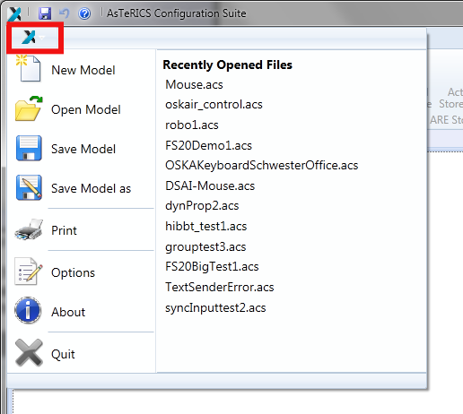

  
---
ACS Basic Functions
---

# ACS Basic Functions

The figure below shows the main panel of the AsTeRICS Configuration Suite after the application has started. The screen is divided in four main areas, the menu area (1), the _Deployment_ area (2) (where the drawing will be done), the _GUI Designer_ area (3), switchable with the _Deployment_ area and the _Properties_ area (4), where the settings of the components can be adapted.

  
ACS after Startup

Additionally, the main menu will open, if the AsTeRICS-Button is pressed in the menu bar - see figure below. All functions of the main menu are also reachable via buttons in the tabs, except the _About_ and the _Print_ dialog. This dialog shows general information about the ACS and the AsTeRICS project.

  
Menu Bar with Open Main Menu