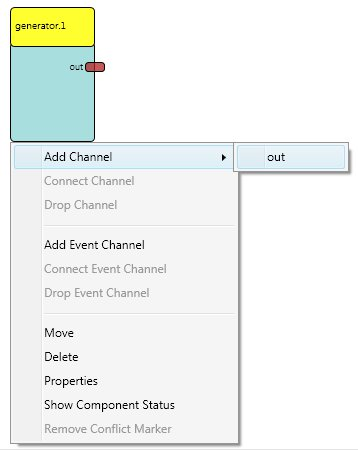

# Component Context Menu

All editing functions, which require the usage of the mouse, can also be done with the keyboard, using the context menu of the component. The context menu appears using the right mouse key, the space key or the application key.

A Component with the Opened Component Context Menu