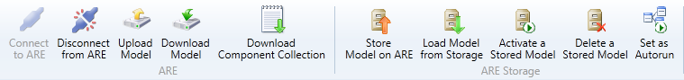
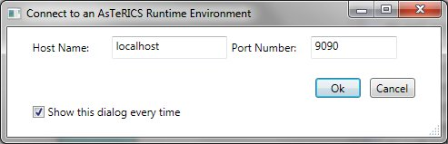
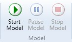

# Control the ARE

In the system-tab, the group ARE handles the functionalities for connecting to and communicating with the ARE. The connection to the ARE is handled by the AsTeRICS Application Programming Interface (ASAPI).

System Tab, ARE and ARE Storage Group

*   _Connect to ARE_ connects the ACS with the ARE. The Connect to ARE dialog appears, asking for the connection data. The host name (IP-address of the host) can be found in the ARE configuration, the default port should be 9090. Beside this connection dialog, also auto connection can be used, see the section Options / General Settings.
    
    
    
    The ARE Connection Dialog
    
    When the connection has been established, two special cases can occur:
    *   An active model (deployment) has been detected on the ARE. The user will be asked to download this model or to proceed without downloading it.
    *   An active model (deployment) has been detected and is running on the ARE. The user will be asked to download this model and switch the ACS to _Running_ mode or to proceed without downloading it.
*   _Disconnect from ARE_ closes the connection to the ARE.
*   _Upload Model_ transmits the model in the drawing from the ACS to the ARE. The model on the ARE will be overwritten. Uploading the model to the ARE does not start the model on the ARE.
*   _Download Model_ transmits the active model from the ARE to the ACS. The model on the drawing area will be overwritten.
*   _Download Bundles_ transmits the bundel description (describing the components) form the connected ARE to the ACS. These bundel descrptions will be available as components in the components-tab. Then bundles can be managed with the _Bundle Manager_.

The group ARE Storage deals with the storage on the ARE. The storage is an area within the ARE where models can be stored and also activated using the ARE interface.

*   _Store Model on ARE_ transmits the model in the drawing from the ACS to the ARE storage. A dialog appears to set the filename.
*   _Load Model from Storage_ transmits a model from the ARE storage to the ACS. The model on the ACS drawing area will be overwritten. A dialog appears to select the filename of the model.
*   _Activate a Stored Model_: A dialog appears to select the filename of a model in the storage. This model will be set active in the ARE and also will be started. Furthermore, the model on the ACS drawing area will be overwritten with the selected model and the ACS switches to run-mode.
*   _Delete a Stored Model_ deletes a model from the ARE storage using a file dialog.
*   _Set as Autorun_ sets the model as autorun model. This model will be started automatically when the ARE starts.

Starting and stopping a model can be done with the buttons in the group Model.

The Model Group in the System Tab

*   _Start Model_ starts the model on the ARE and switches the ACS into run-mode. This means that now no components, channels and event channels can be added, edited or deleted. The drawing area is greyed out.
*   _Pause Model_ pauses the model on the ARE.
*   _Stop Model_ stops the model on the ARE and ends the run-mode.