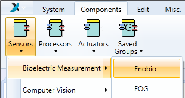
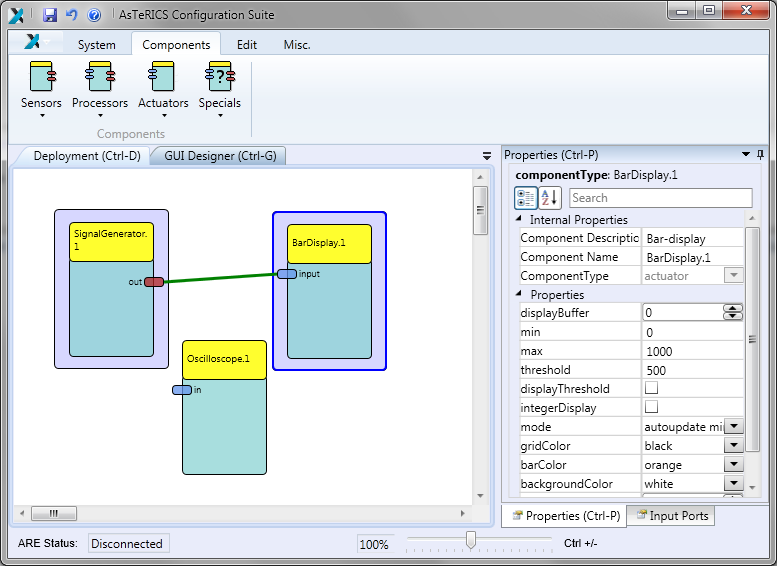
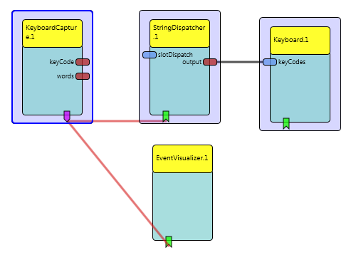

 
---
Create and Edit a Model
--- 

# Create and Edit a Model

To create a new model, add one or several components. To do so, select the tab Components, and from the sub-menu select a group of components, depending on what is supposed to be added. The three component groups are _Sensors_, _Processors_ and _Actuators_. Within these sections, the components are devided in subsections, making it easier finding one plugin out of the hugh amount of available plugins. Additionally, there is a fifth section _Saved Groups_ where saved groups can be added to the drawing.

  
The Components Tab

Now, this added component can be manipulated in the drawing area. This can be done with the functions in the Edit-tab or directly by using the mouse or the keyboard.

## Model Manipulation via Mouse

After a component has been added to the drawing field, it can be moved by using the drag and drop functionality. Several elements (components, channels, eventchannels) can be selected by drawing a selection rectangle (just press the left mouse button and move the mouse) or by pressing the _Ctrl_\-Key and clicking on each element. All the selected elements can be also moved using drag and drop. All selected components are marked with a blue rectange in the background, the component, which has the keyboard focus (and displayed in the property editor), is surrounded with a blue border. Channels can be drawn by pressing the mouse button over an output port and dragging the channel to an input port. Connecting eventchannels is similar to the channels.

  
Selection of Components

## Model Manipulation via Keyboard

All elements within the drawing area can be set on focus, using the _Tab_\-key or the arrow-keys. To select an element, the _Space_\-key has to be used, to select several elements, use _Ctrl-_ and _Space_\-Keys at the same time. By pressing the _Alt_\-Key, the ribbon menu shortcuts will appear at the menus. The _App_\-Key opens the context menu. More information about the usage of the keyboard within the ACS can be found in the section _Component Context Menu_.__

__

## Selection

It is possible to select several components, channels and event channels at the same time. The selection can be made with the mouse (by dragging a selection rectangle or by the usage of the _Ctrl_\-key, like in many standard programs) or with the keyboard using the _Space_ key. The selected components are marked with a blue frame. The figure below shows a model with several selected components.

  
Model with three selected components

__