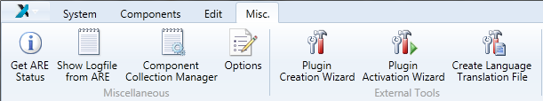
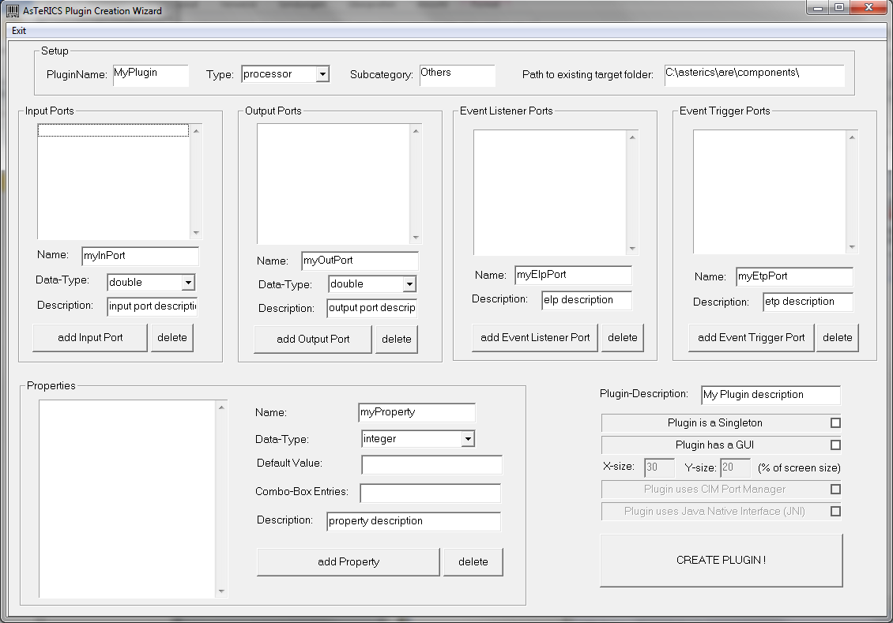
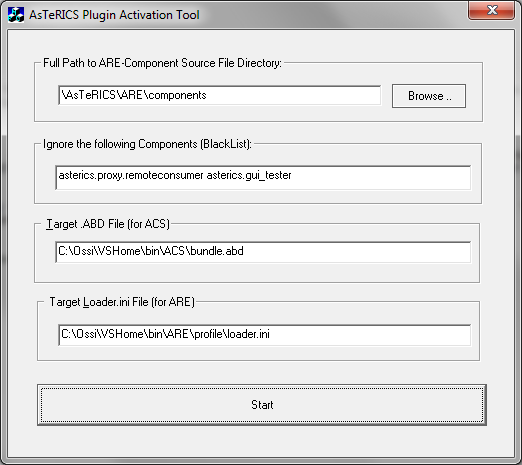
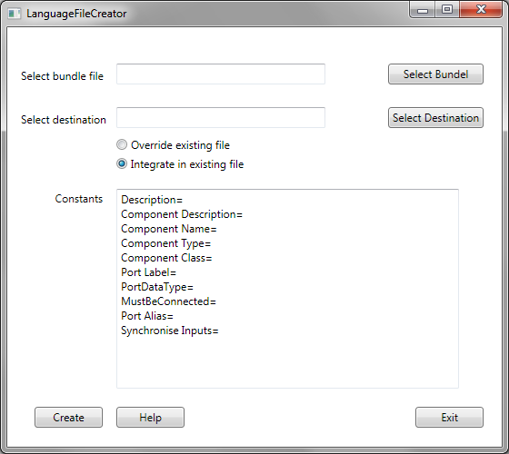

# External Tools

Within the tab _Miscellaneous_ (Misc.), external tools can be launched. The three integrated external tools are the _Plugin Creation Wizard_, the _Plugin Activation Wizard_ and the _Language Translation File Creator_.

The Miscellaneous Tab

*   The _Plugin Creation Wizard_ is an external tool to create the stub for a new plugin. All characteristics, like input and output ports, events and properties can be defined. As output, a java-class and all necessary files for an ARE plugin will be created. The figure below shows a screenshot of the tool.
    
    
    
    The Plugin Creation Wizard
    
*   The _Plugin Activation Wizard_ is an external tool to create bundle files (describing the interface of a plugin) and configuration files for the ARE. Therefore, the source code folder of the ARE will be scanned. The figure below shows a screenshot of the tool.
    
    
    
    Plugin Activation Wizard
    
*   The _Create Language Translation File_ opens another external tool for creating language translation files for the properties (as shown in the figure below). This tool scans the bundle file and lists all properties in a text file, which can be extended with the translation for any language. This text file will be loaded at startup of the ACS, so also the components now have multi language support. After selecting a bundle file, the destination file has to be set. If the destination file (a language translation file) already exists, it can be chosen, if the file should be overwritten or integrated into an existing language file. The Constants are strings, occurring in each plugin. By using the constants, they just must be translated once. All other strings must be translated in the created textfile, where all strings, ending with equal to (=) must be translated. Example:  
    Frequency=  
    Amplitude=  
    When the translation is finished, the language file must be copied to the _lang_ subfolder within the ACS folder (if the file isn't there already). The file must be named as the supported languages of the ACS. At the moment, en-GB, de-AT, es-ES and pl-PL are supported. Furthermore, the file must have the ending .txt. For the German language file, it would look like _de-AT.txt_.
    
    
    
    Language File Creator