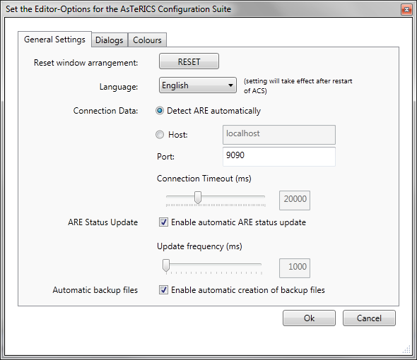

##

## General Settings

# General Settings

  
Options Dialog, General Settings

- _Reset Window Arrangement_ resets all layout settings to default values.
- _Language_ gives the possibility to select the ACS language between English, German, Spanish and Polish. The properties of the components will not be affected by this, as they are dependent on the component description. After changing the language, a restart of the ACS is required for the changes to take effect.
- _Connection Data_ is responsible for the connection of the ACS with the ARE. The Host contains the IP-address of the ARE, the Port its IP-port. Default port is 9090. If _Detect ARE automatically_ is selected, the host information will be ignored and the ACS tries to find the ARE in the network. If more then one ARE will be detected in the network, an ARE selection dialog will appear. _Connection Timeout_ sets time network timeout time (in milliseconds). If the ARE is not reacting after this time, the connection to the ARE will be closed.
- _ARE Status Update_ enables or disables an automatic update of the ARE status. This status update works while the ACS is in run-mode. The Update Frequency sets the time between two status updates (in milliseconds).
- _Automatic Backup Files_ creates a backup file during each _Save File_ process. The backup file gets the ending .backup.
