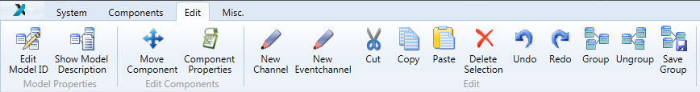

 
---
The Edit Tab 
--- 

# The Edit Tab

The edit tab is used for manipulating properties of the components and their interconnections. The list below provides a detailed description of the available operations found on the Edit Tab as shown in the figure.

  
The Edit Tab

Description of the _Model Properties_ Group:

*   _Edit Model ID_ edits the unique model ID. This ID is generated automatically and is used by the ARE to store model based informations belonging to the editing model.
*   _Show Model Description_ shows the model description dialog. Within this dialog, the model description will be shown and can be edited. The description is divided in the parts of _Short Description_, _Model Requirements_ and _Detailed Description_

Description of the _Edit Components_ Group:

*   _Move Component_ enables the move mode of a component. Now the component can be moved around the drawing board using the arrow keys. Using the enter-key or tabbing to another component ends the move mode.
*   _Component Properties_ shows the properties of the component.

Description of the _Edit_ Group:

*   _New Channel_ indicates that a channel is about to be drawn. To start drawing a channel, click on an output port or use the context menu.
*   _New Eventchannel_ indicates that an event channel is about to be drawn. To start drawing an event channel, click on an event trigger port or use the context menu.
*   _Cut_ cuts out the selected elements and store the cutted elements in the clipboard.
*   _Copy_ copies the selected elements to the clipboard.
*   _Paste_ copies the elements from the clipboard to the drawing field.
*   _Delete Selection_ deletes the selected elements. This can also be done with the delete-key.
*   _Undo_ the last editing action like move a component, add/delete a component or also the channel and event channel operations. Setting properties and events (things done in the property window) are excluded form undo.
*   _Redo_ the last editing action that has been undone with _Undo_. Setting properties and events (things done in the property window) are excluded form redo.
*   _Group_ the selected components (incl. channels and event channels) to one group. The selected components must not contain a group. All connected ports and event ports will be available as external connection points of the group. The figure above shows a very simple example, the grouping of two components to one group.
    
      
    Grouping of two components
    
*   _Ungroup_ the selected group, showing the single components of the group.
*   _Save Group_ saves a selected group, so the group can be reused in this or in other models. The saved groups are available in _Components / Saved Groups_

After at least two components have been added to the deployment, they can be connected to each other. A connection always has to start at the output port (right hand side of a component) connecting to an input port (left side of the component). One output port can be connected to several input ports, but an input port can only receive data from one output port. Additionally the data types of the ports must match in order to be able to connect them, see the section on Channels.