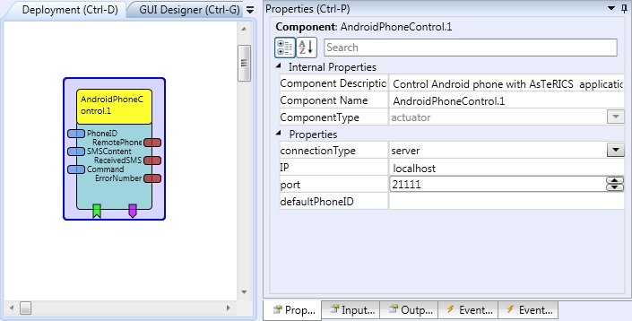

# AndroidPhoneControl

Component Type: Actuator (Subcategory: Phone Interface)

This component controls a mobile phone with Android operating system through the TCP/IP connection. Currently this component is able to perform such action as: call a remote phone, drop a phone call, send and receive SMS message.

AndroidPhoneControl plugin

## Requirements

Android phone running AsTeRICSPhoneServer application.  

## Input Port Description

*   **phoneID \[string\]:** The phone number used for outgoing SMS and make phone calls.
*   **SMSContent \[string\]:** The SMS content which will be used for the send SMS action.
*   **command \[string\]:** String command that can be sent to this component from other plugins to trigger phone actions. Currently supported commands are:
    *   @PHONE: SMS:Phone\_ID, "Message\_content"
    *   @PHONE: SMS
    *   @PHONE: CALL: Phone\_ID
    *   @PHONE: CALL
    *   @PHONE: ACCEPT
    *   @PHONE: DROP
    *   @PHONE: SET\_ID: Phone\_ID
    *   @PHONE: SET\_SMS: "Message\_content"

## Output Port Description

*   **remotePhoneID \[string\]:** This is a phone number of the caller or SMS sender.
*   **receivedSMS \[string\]:** This is the content of the incoming SMS.
*   **errorNumber \[integer\]:** The number of the error.

## Event Listener Description

*   **sendSMS:** Sends the SMS message.
*   **makePhoneCall:** Makes the phone call.
*   **acceptPhoneCall:** Accepts the incoming phone call.
*   **dropPhoneCall:** Drops the phone call.

## Event Trigger Description

*   **idleState:** Phone is in the idle state.
*   **ringState:** Phone is in the ring state.
*   **connectedState:** Phone is connected with the remote phone.
*   **newSMS:** There is a new SMS.
*   **error:** An error occurred.

## Properties

*   **connectionType \[integer\]:** Defines connection type for the plugin: client or server.
*   **IP \[string\]:** IP of the remote server used in the client mode.
*   **port \[integer\]:** TCP/IP port of the service.
*   **defaultPhoneID \[string\]:** Default phone number for outgoing SMS and phone calls.

  
[Preparation of the connection with Android Phone.][1]

[1]: Android_connection.htm