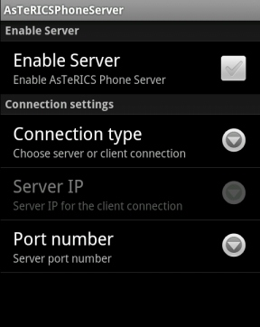

# Preparation of the connection with Android Phone

Component Type: Actuator (Subcategory: Phone Interface)

Android Server Application

This document describes how to prepare connection between the AndroidPhoneControl component and the AsTeRICSPhoneServer application:

1.  The connection between the AndroidPhoneControl component and the AsTeRICSPhoneServer application is made via TCP/IP connection. One of these components should work as a server, second as the client. The server should have the public IP or it should be in the same network where the client is.
2.  In the model, select the connection mode in the connetionType property of the AndroidPhoneControl component. If the component should work as a server, put into the port property, the port which server will be use for its service. If the component should work as a client, put into the IP property IP of the server and into the port property the server port.
3.  Run the Android Server application on the Android phone. Select the connection mode from the Connection type property. If the application should work as a server put into the port number property the port which server will be use for its service. If the application should work as a client put into the Server IP property IP of the server and into the Port Number property the server port.
4.  If the AndroidPhoneControl component is set to work as the server and Android Server application is set to work as client. First run the model, then, enable Android application using Enable server property. If Android Server application is set to work as a server and the AndroidPhoneControl component is set to work as a client first enable the Android application then run the model.