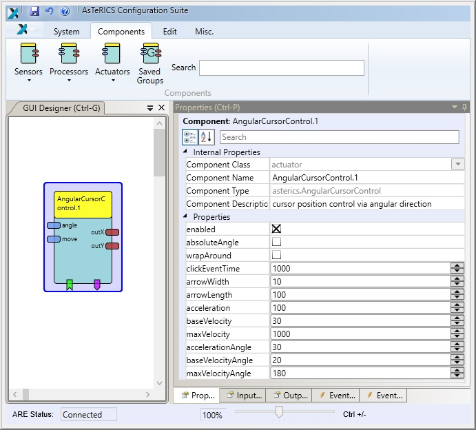
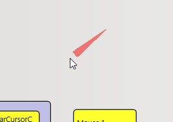

# AngularCursorControl

Component Type: Actuator (Subcategory: Input Device Emulation)

The AngularCursorControl component allows mouse cursor positioning by software emulation with a limited number of input control channels. An arrow indicator is displayed on the screen next to the mouse cursor. This arrow can be rotated 360 degrees using the angle input port.

If values are received at the move input port, the mouse cursor is moved in the direction of the arrow. Using other components, a stepwise control of angle and movement can be achieved, allowing full control of the cursor position. After a certain time of inactivity (no values received at the input ports), a click event can be created for generating different mouse clicks e.g. via a mouse element.

AngularCursorControl plugin

AngularCursorControl arrow indicator

  

**Please Note:**The mouse emulation on **Windows 7/10** does not always work as expected due to User Account Control (UAC) settings. Especially when you want to use the Windows 7 On-Screen-Keyboard dragging the keyboard does not work. To troubleshoot [turn off the User Account Control (UAC)][1] - change the level to "Never notify"

## Input Port Description

*   **angle \[double\]:** The angle (angular changes) of the mouse cursor movement (in degrees). Indicated by arrow icon next to mouse cursor
*   **move \[double\]:** The mouse cursor movement (in direction of current angle). Negative values allow backward movement.

## Output Port Description

*   **outX \[double\]:** the current absolute x-value of the center of the arrow indicator. Can be used to control the mouse cursor via the mouse plugin.
*   **outY \[double\]:** the current absolute y-value of the center of the arrow indicator. Can be used to control the mouse cursor via the mouse plugin.

## Event Listener Description

*   **enablePlugin:** Enables all functionality of this plugin.
*   **disablePlugin:** Disables all functionality of this plugin.
*   **startMoveForward:** starts automatic movement forward in direction of the arrow indicator, accelerated by propery acceleration.
*   **startMoveBackward:** starts automatic movement backward in opposite direction of the arrow indicator, accelerated by propery acceleration.
*   **startAngleLeft:** starts automatic angle rotation to the left (counterclockwise), accelerated by property accelerationAngle.
*   **startAngleRight:** starts automatic angle rotation to the right (clockwise), accelerated by property accelerationAngle.
*   **stopMoveLeft:** stops automatic movement to the left.
*   **stopMoveForward:** stops automatic movement forward.
*   **stopMoveBackward:** stops automatic movement forward.
*   **stopAngleLeft:** stops automatic angle rotation to the left (counterclockwise).
*   **stopAngleRight:** stops automatic angle rotation to the right (clockwise).
*   **stopMove:** stops all automatic movement.

## Event Trigger Description

*   **clickEvent:** This event is fired after an adjustable time of inactivity (property clickEventTime).

## Properties

*   **enabled \[boolean\]:** If false (default is true), all functionality of this plugin is disabled.
*   **absoluteAngle \[boolean\]:** If this property value is set to false (default), incoming values at the angle input port are interpreted as relative movement information (changes of the angle in degrees). If the property value is set to true, the angle input values are interpreted as absolute values (in degrees).
*   **clickEventTime \[integer\]:** The time of inactivity (in milliseconds) after which the clickEvent will be created (use zero to deactivate the clickEvent).
*   **arrowWidth \[integer\]:** The width of the arrow indicator icon
*   **arrowLength \[integer\]:** The length of the arrow indicator icon
*   **acceleration \[integer\]:** The cursor movement acceleration in px/second per second (0 to deactive acceleration). This property only applies to automatic movement generated by events, not to movement generated by input port 'move'.
*   **baseVelocity \[integer\]:** The base movement velocity in px per second, starting velocity of automatic movements forward/backward.
*   **maxVelocity \[integer\]:** The maximum mouse movement velocity in px per second. This property only applies to automatic movement generated by events, not to movement generated by input port 'move'.
*   **accelerationAngle \[integer\]:** Angle movement acceleration in degrees/second per second (0 to deactive acceleration). This property only applies to automatic movement generated by events, not to movement generated by input port 'angle'.
*   **baseVelocityAngle \[integer\]:** The base angle movement velocity in degrees per second, starting velocity of automatic movements of angle left/right.
*   **maxVelocityAngle \[integer\]:** The maximum angle movement velocity in degrees per second. This property only applies to automatic movement generated by events, not to movement generated by input port 'angle'.

[1]: http://windows.microsoft.com/en-au/windows/turn-user-account-control-on-off#1TC=windows-7