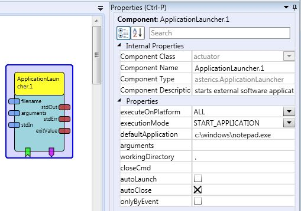

# {{$frontmatter.title}}

Component Type: Actuator (Subcategory: File System)

The ApplicationLauncher component can be used to run an external executable application or to open a URL in the platform default browser. The command and arguments values can either be set as property or dynamically configured through the respective input ports. The launch of the application or the opening of the URL can also be triggered by an incoming event (launchNow). The property executeOnPlatform selects the platforms on which the configured application or URL will be launched.

Together with the Keyboard- or RemoteKeyboard components, the ApplicationLauncher plugin can perform complex automation tasks, for example open Skype, choose a contact and make a call.

ApplicationLauncher plugin

## Input Port Description

- **filename \[string\]:** File name of executable file which shall be started without arguments. The application is started automatically, if onlyByEvent is false. See _Properties -> defaultApplication_ description for details.
- **arguments \[string\]:** Sets the arguments of the command. The application is started automatically, if onlyByEvent is false. See _Properties -> arguments_ description for details.
- **stdIn \[string\]:** Sends the incoming string to the standard input stream of the started process.

## Output Port Description

- **stdOut \[string\]:** The standard output stream of the started process.
- **stdErr \[string\]:** The standard error stream of the started process.
- **exitValue \[integer\]:** The exit value of the started process.

## Event Listener Description

- **launchNow:** An incoming event on this port will start the (default or lastest received) application
- **closeNow:** An incoming event on this port will close the current application

## Event Triggerer Description

- **startedSuccessfully:** The process started successfully.
- **startedWithError:** The process started with error.

## Properties

- **executeOnPlatform \[combobox (ALL, WINDOWS, LINUX, MACOSX)\]:** If != ALL, the application will only be launched if the ARE runs on the defined platform.
- **executionMode \[combobox (START_APPLICATION, OPEN_URL)\]:** If START_APPLICATION, the command defined in defaultApplication will be launched with the given arguments. If OPEN_URL, the URL defined in arguments will be launched with the platform default browser. The platform-specific browser launch commands are configurable in the file areProperties. For general information about platform-specific launch commands, see [open files and URLs][1]
- **defaultApplication \[string\]:** Full path and filename of the default application  
  The full path can be provided with quotes, but quotes are not mandatory. So _C:\\Program Files\\internet explorer\\iexplore.exe_ and _"C:\\Program Files\\internet explorer\\iexplore.exe"_ are equal and both working.
- **arguments \[string\]:** the commandline arguments for the application (in mode START_APPLICATION) or the URL to open (in mode OPEN_URL).  
  For Mode START_APPLICATION: Given arguments are split considering whitespaces and quotes. So e.g. the arguments property _xterm -e "sudo sh test.sh"_ will be split in 3 components _xterm_, _\-e_ and _"sudo sh test.sh"_. However quotes are removed at runtime, so _sudo sh test.sh_ without quotes will be passed to the ProcessBuilder used at Java level to start the program.  
  Hint for Windows: for cmd.exe "&" is a special character and cannot be used in an argument. If the "&" is needed, mask it with an "^", therefore using "^&" instead of "&" in the argument.  
  For Mode OPEN_URL: URLs can be passed as-is on any platform, no masking of "&" characters is needed.
- **workingDirectory \[string\]:** the working directory for the application (. is used for home directory of the application)
- **closeCmd \[string\]:**Optional close cmd, e.g. if started cmd has forked processes (e.g. OSKA) use: taskkill.exe /IM "OSKA Keyboard.exe" /T
- **autoLaunch \[boolean\]:** Defines if the default application is automatically launched at startup
- **autoClose \[boolean\]:** Defines if the current application is closed when the model is stopped
- **onlyByEvent \[boolean\]:** If this property is set to true, incoming application files names will not be started immediately (only the launchNow event will start the application)

[1]: https://dwheeler.com/essays/open-files-urls.html
