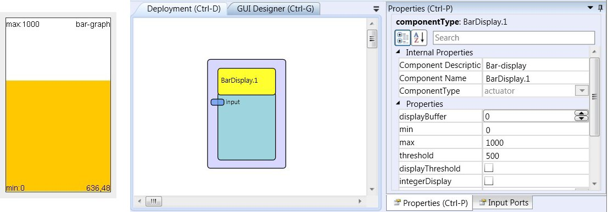

# BarDisplay

Component Type: Actuator (Subcategory: Graphical User Interface)

The Bar display generates a coloured bar graph to visualise a current signal value in the ARE environment (of course the LC - display or a computer monitor have to be connected to the platform). The Bar display features auto-scale of value range, display of a threshold value and selectable update rate and foreground / background colours.

## Requirements

Computer Monitor or LC-Display available for graphics output.

## Input Port Description

- **input \[double\]:** The input port for the signal to be displayed.

## Properties

- **displayBuffer \[integer\]:** This number specifies how often an update of the bar graph is performed. For example if the display buffer is set to 10, ten values are accumulated and the average value is displayed after the tenth incoming value.
- **min \[double\]:** The default minimum of the signal range at model start (this value is automatically updated as lower values come in).
- **max \[double\]:** The default maximum of the signal range at model start (this value is automatically updated as higher values come in).
- **threshold \[double\]:** This value will be displayed with a marker in the bar graph (if enabled).
- **displayThreshold \[boolean\]:** This property enables (true) or disables (false) the threshold marker in the bar graph.
- **integerDisplay \[boolean\]:** This property selects if double values are rounded to integral values before being displayed in the bar graph.
- **mode \[integer\]:** Via this property the way how values which exceed the current min/max range of the bar graph component are handled: "clip to min and max" crops incoming values to the min/max range, "autoupdate min and max" scales the bar graph window and updates the min/max values to cover the incoming value.
- **gridColor \[integer\]:** The colour of the bar graph grid and descriptions.
- **barColor \[integer\]:** The colour of the bar display.
- **backgroundColour \[integer\]:** The colour of the window background.
- **fontSize \[integer\]:** The font size of the display's caption.
- **caption \[string\]:** The text of the display's caption.
- **displayGUI \[boolean\]:** If selected, the GUI of this component will be displayed - if not, the GUI will be hidden and disabled.
