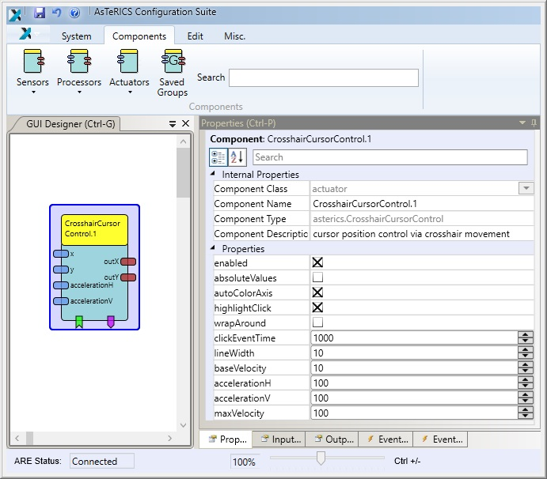

# CrosshairCursorControl

Component Type: Actuator (Subcategory: Input Device Emulation)

The CrosshairCursorControl component allows mouse cursor positioning by software emulation with a limited number of input control channels. A crosshair indicator is displayed on the screen next to the mouse cursor. This crosshair can be moved horizontally and vertically using the x and y input ports. Alternatively movement can be started or stopped by events.

Using other components, a stepswise control of x and y movement can be achieved, allowing full control of the cursor position. After a certain time of inactivity (no values received at the input ports), a click event can be created for generating different mouse clicks e.g. via a mouse element. Additionally, a number of tooltip icons can be displayed, sequentially. The currently displayed icon can be selected via an adjustable time of inactivity. The name of the selected icon is then sent to the tooltip output port.

CrosshairCursorControl plugin

CrosshairCursorControl arrow indicator

CrosshairCursorControl in combination with Tooltip plugin for double click

**Please Note:**  
The mouse emulation on **Windows 7/10** does not always work as expected due to User Account Control (UAC) settings. Especially when you want to use the Windows 7 On-Screen-Keyboard dragging the keyboard does not work. To troubleshoot [turn off the User Account Control (UAC)][1] - change the level to "Never notify"

## Input Port Description

- **x \[double\]:** The mouse cursor movement in x direction. Indicated via x-Axis crosshair.
- **y \[double\]:** The mouse cursor movement in y direction. Indicated via y-Axis crosshair.
- **accelerationH \[integer\]:** The acceleration for movement in horizontal orientation. See property _accelerationH_ for details.
- **accelerationV \[integer\]:** The acceleration for movement in vertical orientation. See property _accelerationV_ for details.

## Output Port Description

- **outX \[double\]:** the current absolute value of the X-Axis of the crosshair. Can be used to control the mouse cursor via the mouse plugin.
- **outY \[double\]:** the current absolute value of the Y-Axis of the crosshair. Can be used to control the mouse cursor via the mouse plugin.

## Event Listener Description

- **enablePlugin:** Enables all functionality of this plugin.
- **disablePlugin:** Disables all functionality of this plugin. Exceptions: the actions for the events 'toggleAxisHighlight' and 'moveToLastStable' are always executed, also if the plugin is disabled.
- **startMoveLeft:** starts automatic movement to the left.
- **startMoveRight:** starts automatic movement to the right.
- **startMoveUp:** starts automatic movement up.
- **startMoveDown:** starts automatic movement down.
- **stopMoveLeft:** stops automatic movement to the left.
- **stopMoveRight:** stops automatic movement to the right.
- **stopMoveUp:** stops automatic movement to the up.
- **stopMoveDown:** stops automatic movement to the down.
- **stopMoveAll:** stops all automatic movement.
- **moveToLastStable:** moves the cursor to last stable position (where no movement was made). Can be used in combination with 'activateTooltips', if activation is done by same means of movement in order to correct unintended movement.
- **highlightXAxis:** highlights the X-axis by coloring it red.
- **highlightYAxis:** highlights the Y-axis by coloring it red.
- **toggleAxisHighlight:** toggles the current coloring of X- and Y-axis.
- **click:** manually triggers the clickEvent and highlights the X/Y-axis if highlightClick is enabled.

## Event Trigger Description

- **clickEvent:** This event is fired after an adjustable time of inactivity (property clickEventTime).

## Properties

- **enabled \[boolean\]:** If false (default is true), all functionality of this plugin is disabled. Exceptions: the actions for the events 'toggleAxisHighlight' and 'moveToLastStable' are always executed, also if the plugin is disabled.
- **absoluteValues \[boolean\]:** If this property value is set to false (default), incoming values at the x and y input ports are interpreted as relative movement information (changes of the position). If the property value is set to true, the input values are interpreted as absolute positions.
- **autoColorAxis \[boolean\]:** If true (default), the axis are automatically highlighted (red colored) according to current movement. For horizontal movement the Y-axis is highlighted, for vertical movement the X-axis is highlighted.
- **highlightClick \[boolean\]:** If true (default), a click event is visualized by a short green flash of the X- and Y-axis.
- **wrapAround \[boolean\]:** If true (default is false), a movement exceeding the border of the screen results in continued movement on the opposite side of the screen.
- **taskbarOffset \[boolean\]:** if true (default), the size of the crosshairs (x/y) is calculated from screen size minus any taskbar sizes. Use it e.g. on ubuntu to fix too long crosshairs.
- **clickEventTime \[integer\]:** The time of inactivity (in milliseconds) after which the clickEvent will be created or the currently displayed tooltip is selected (use zero to deactivate the clickEvent).
- **lineWidth \[integer\]:** The width of the crosshair lines, use zero to deactivate the crosshair.
- **baseVelocity \[integer\]:** The starting velocity of automatic movement (triggered by events) in px per second. The baseVelocity is at the same time the minimum velocity that can be reached, if the acceleration values are negative.
- **accelerationH \[integer\]:** The acceleration of horizontal movement in px/second per second, positive or negative. This property applies to automatic movement as well as relative movement triggered by input in the x/y input ports. Use zero to deactivate movement acceleration.
- **accelerationV \[integer\]:** The acceleration of vertical movement in px/second per second, positive or negative. This property applies to automatic movement as well as relative movement triggered by input in the x/y input ports. Use zero to deactivate movement acceleration.
- **maxVelocity \[integer\]:** The maximum movement velocity in px per second. This property applies to automatic movement as well as relative movement triggered by input in the x/y input ports.

[1]: http://windows.microsoft.com/en-au/windows/turn-user-account-control-on-off#1TC=windows-7
