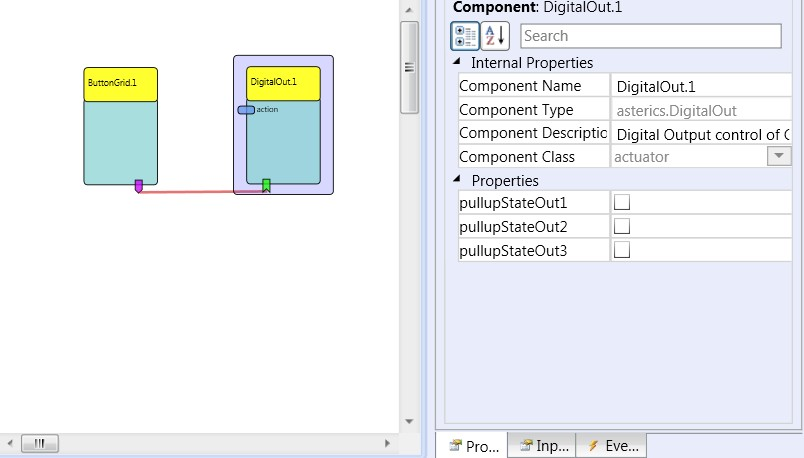

# {{$frontmatter.title}}

Component Type: Actuator (Subcategory: Generic Control Output)

The DigitalOut plugin operates the output ports of the GPIO CIM. The output ports 1-2 are relais outputs where loads can be connected via a galvanic isolation barrier. The output ports 3-5 are open-collector outputs, where a pull-up resistor can be activated or deactivated using the plugin's properties. The plugin provides event listener ports which serve the activation or deactivation of an output channel, and a command port which accepts string parameters to set, clear and toggle particular output channels.

DigitalOut plugin

## Requirements

This component requires the GPIO CIM (CIM Id: 0x0801) to be connected to an USB port.

## Input port Description

*   **action \[string\]:** The plugin reacts to incoming action strings starting with "@GPIO:" and a command. Valid commands are "set", "clear", "toggle" and "press". The command has to be followed by a comma and the port number, for example: "@GPIO:set,1" or "@GPIO:toggle,2". The "press"-command toggles the given output port two times with a delay of 500 milliseconds. The following examples illustrate the available action strings:
    *   _"@DIGITALOUT:set,1":_ Pin 1 of the GPIO CIM will be set
    *   _"@DIGITALOUT:clear,2":_Pin 2 of the GPIO CIM will be cleared
    *   _"@DIGITALOUT:toggle,1":_ Pin 1 of the GPIO CIM will be changed
    *   _"@DIGITALOUT:press,4":_ Pin 4 of the GPIO CIM will be cleared and after 500ms it will be set again

## Event Listener Description

*   **setOutput1 to setOutput5:** an incoming event on these ports will cause the corresponding output port on the CIM to go to the high level.
*   **clearOutput1 to clearOutput5:** an incoming event on these ports will cause the corresponding output port on the CIM to go to the low level.
*   **toggleOutput1 to toggleOutput5:**Toggles the state of the output port.
*   **pressOutput1 to pressOutput5:**Presses the output port: Clears the state and after 500ms sets the state to high.

## Properties

*   **pullupStateOut3 to pullupStateOut5 \[boolean\]:** These properties specify if the internal pullup resistor shall be activated on the respective open collector output channels.
*   **uniqueId:** unique number of the CIM - if more than one CIMs of the same type are used. The module flashes a LED for identification when the ID is selected. **Supports value suggestions from ARE (dynamic property)**