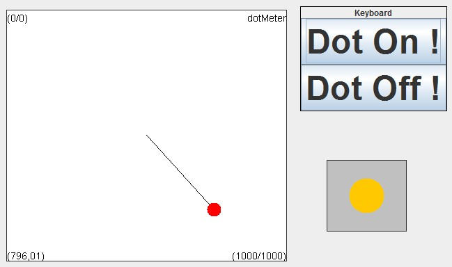

  
---
Dot Meter
---

# Dot Meter

### Component Type: Actuator (Subcategory: Graphical User Interface)

The Dot Meter generates a graphical representation of a 2-dimensional signal (for example x/y-coordinates) using a colored dot.

  
DotMeter plugin

  
DotMeter example

## Requirements

Computer Monitor or LC-Display available for graphics output.

## Input Port Description

*   **x \[double\]:** The x-input port for the signal to be displayed. **This input port supports synchronization**
*   **y \[double\]:** The y-input port for the signal to be displayed. **This input port supports synchronization**

## Event Listener Description:

*   **dotOn:** fill the dot with color.
*   **dotOff:** show only outline of the dot (can be used to create a led indicator).

## Properties

*   **xMin \[double\]:** The default x-minimum of the signal range at model start (this value is automatically updated as lower values come in).
*   **xMax \[double\]:** The default x-maximum of the signal range at model start (this value is automatically updated as higher values come in).
*   **yMin \[double\]:** The default y-minimum of the signal range at model start (this value is automatically updated as lower values come in).
*   **yMax \[double\]:** The default y-maximum of the signal range at model start (this value is automatically updated as higher values come in).
*   **mode \[integer\]:** Via this property the way how values which exceed the current min/max range of the bar graph component are handled: "clip to min and max" crops incoming values to the min/max range, "autoupdate min and max" scales the bar graph window and updates the min/max values to cover the incoming value.
*   **dotSize \[integer\]:** The radius of the dot.
*   **centerLine \[boolean\]:** defines if a line to the window center is shown or not.
*   **displayDot \[boolean\]:** defines if the dot is filled or not.
*   **displayCaptions \[boolean\]:** defines if the value / captions are shown or not.
*   **gridColor \[integer\]:** The colour of the graph grid and descriptions.
*   **dotColor \[integer\]:** The colour of the dot.
*   **backgroundColour \[integer\]:** The colour of the window background.
*   **fontSize \[integer\]:** The font size of the display's caption.
*   **caption \[string\]:** The text of the display's caption.
*   **displayGUI \[boolean\]:** if selected, the GUI of this component will be displayed - if not, the GUI will be hidden and disabled.