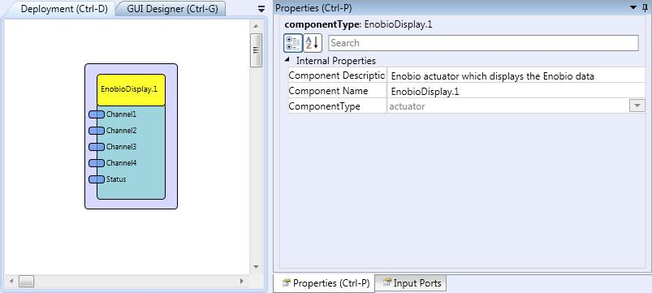

# Enobio Display

Component Type: Actuator (Subcategory: Graphical User Interface)

This component displays the electrophysiological signals recorded by the Enobio device, so a user can check that the signals are being received and are correctly calibrated. The 4 Enobio channels are plotted with three different colours. When the signal is plotted in red it means that the channel is not being calibrated due to the configuration of the Enobio component. If the signal is plotted in yellow then this signal is in process of calibration. If the signals are plotted in green it indicates that the signal is correctly calibrated.

Enobio Display plugin

## Requirements

This software component requires an Enobio receiver connected to the platform, the Enobio device switched on and the electrodes correctly placed on the user. In addition, the component expects an Enobio component connected to its inputs.

## Input Port Description

*   **Channel1 to Channel4 \[double\]:** Input ports for the corresponding output ports of the Enobio component.
*   **Status \[double\]:** Input port to be connected to the status output port of the Enobio component.