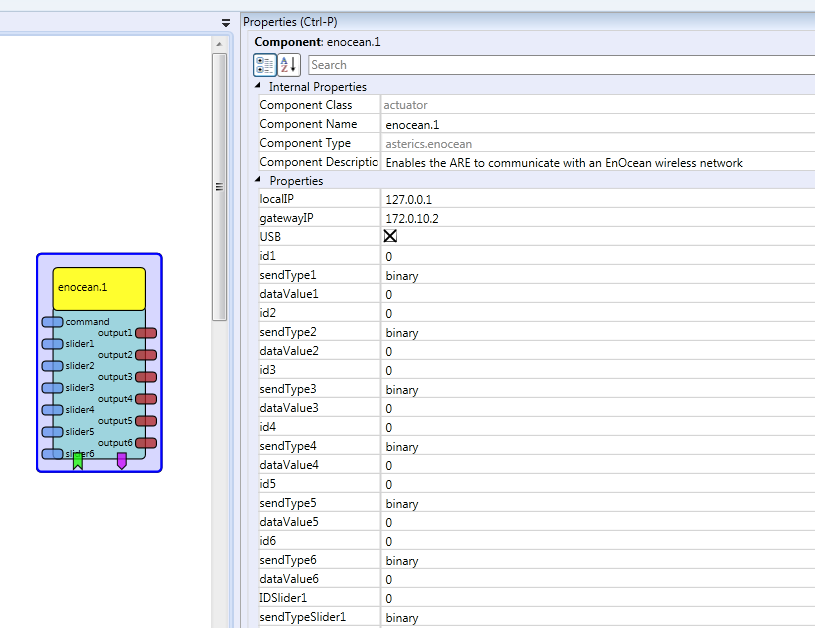

# EnOcean

### Component Type: actuator (Subcategory: Home Control)

The EnOcean plugin enables the ARE to interface to EnOcean wireless sensors. This plugin utilizes the Priscilla java library for the EnOcean implementation , it is (C)opyrighted by UAS FH Technikum Wien and released under the GNU General Public License (FSF v2). The EnOcean plugin provides an interface to the EnOcean sensors over an USB stick (EnOcean USB300) or an IP gateway. Interfacing to EnOcean devices is possible either by sending different data to actuators or receiving different types of values. This allows control of lightning, heat and ventilation devices and many more via the AsTeRICS platform.

  
EnOcean plugin

## Requirements

- An EnOcean gateway (either USB or IP)
- Basic knowledge on EnOcean device IDs

## Functional Description

By starting the model, the EnOcean plugin establishes a connection to the EnOcean gateway specified by the plugin properties (defined by gatewayIP and USB checkbox). The gatewayIP is either the IP adress of the gateway or the COM port name (e.g. COM1 or /dev/ttyUSB0). There are 3 different ways of sending data to EnOcean devices. The first one is done by the 6 input slider ports. Each of them has properties for the source device ID (range: 0-127) and a data type (binary, temperature, illumination, humidity, temperature set point and fan level). On every update of the input data, an EnOcean data frame is generated and sent. The second method is done over the event input ports. There are 3 properties to define. The device ID and the data type have equal possible values as with the slider input. The third property defines the value to be sent. The first method is the most flexible one, by sending a command string to the command input port. It expects a special formatted string and parses the dedicated keywords and format to an EnOcean command. The string can be assembled individually with other string formatting plugins. Receiving sensor data is done by combining event and output ports. There are 2 properties, one for the type of input data (the data type are the same as stated before) and one for the source device ID (this property is a hexadecimal string, containing the full 32bit ID, printed on the sensor). The event ports are triggered each time, an event with the defined type and device ID is received. If an event is raised, at the same time the corresponding data value is available at the output ports.

## Input Port Description

- **command \[string\]:** This port receives string commands for the EnOcean devices. The commands have to be in the format "@ENOCEAN:device_id#type#value". An example for a valid command is"@ENOCEAN:25#binary#true". As a valid command is received by the input port, the value and data type is broadcasted to the devices with the given device ID offset (range: 0-127)
- **slider\[1-6\] \[double\]:** Input port for a double value which is converted to an integer (or another type, depends on the datatype) and broadcasted to all EnOcean devices in range

## Properties

- **localIP \[string\]:** The local IP address of the interface which can reach the IP gateway.
- **gatewayIP \[string\]:** The destination IP address of the EnOcean gateway or the device name of the USB gateway (emulates a serial interface, e.g. COM1 or /dev/ttyUSB0)
- **USB \[boolean\]:** If checked, then the connection will be established through a serial interface, otherwise through an IP gateway
- **id\[1-6\] \[integer\]:**
  Source ID for input event\[n\]. The range is from 0 to 127.\* **sendType\[1-6\] \[string\]:**
  Send type for input event\[n\]. Following data types are allowed global (for every datatype property, port and event):

- _"binary":_ e.g. used for switching light actuators on or off.
- _"temperature":_ e.g. used to transmit a temperature value.
- _"illumination":_ e.g. used to transmit illumination values.
- _"humidity":_ e.g. used to transmit humidity values.
- _"setpoint":_ e.g. used to send set point value (+10K or -5% humidity)
- _"fan":_ e.g. used to set or simulate a defined fan level

- **dataValue\[1-6\] \[string\]:** The transmitted value for the input event \[n\] with the given id\[n\] and type (sendType\[n\])
- **IDSlider\[1-6\] \[string\]:** Source ID for slider\[n\]. The range is from 0 to 127.
- **sendTypeSlider\[1-6\] \[string\]:** The data type for sending slider\[n\] data with IDSLider\[n\]. The possible data types are stated above
- **IDTrigger\[1-6\] \[string\]:** Source ID for event trigger\[n\]. This is a full id, as printed on the device as 6 character string(e.g. FFEFA01C)
- **TypeTrigger\[1-6\] \[string\]:** The data type for the listening event\[n\]. If an incoming frame from the give ID (IDTrigger\[n\]) contains this data type, an event on event port \[n\] is raised. The possible data types are stated above

## Event Listener

- **send\[1-6\]:** Each time a event is triggered, the coresponding EnOcean frame which is specified in the plugin properties, is transmitted.

## Event Trigger

- **event_out\_\[1-6\]:** Each time a frame is received with the given parameters (from properties IDTrigger\[n\] and TypeTrigger\[n\]), this event is raised
