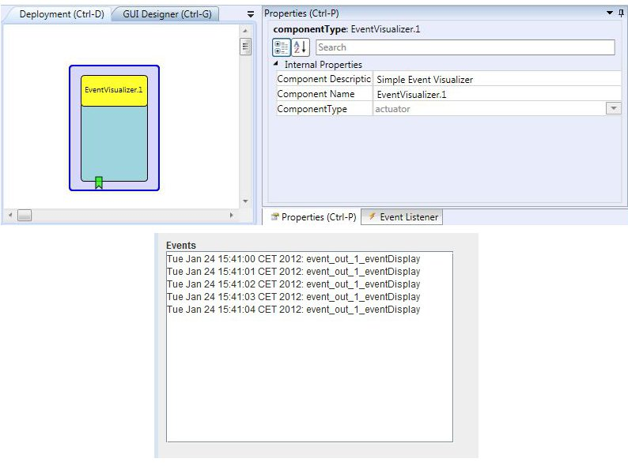

# Event Visualizer

Component Type: Actuator (Subcategory: Graphical User Interface)

This plugin provides a graphical feedback for events. It can be used to monitor event activities and is mainly targeted for testing of configurations during setup time. The plugin offers a GUI (simple window with text output) where event names are displayed.

EventVisualizer plugin

## Requirements

No special hardware or software required.

## Port Description

This plugin does not provide input or output ports.

## Event Trigger Description

*   **event\_in\_1:** incoming events will be displayed in the GUI.

## Properties

*   **displayGUI \[boolean\]:** if selected, the GUI of this component will be displayed - if not, the GUI will be hidden and disabled.