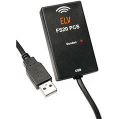

# FS20 Sender

## Component Type: Actuator (Subcategory: Home Control)

With the FS20 Sender commands for the FS20 house automation system can be sent over the PCS device sold by ELV electronics. See [the ELV FS20 homepage](http://www.elv.de/output/controller.aspx?cid=74&detail=10&detail2=29530&flv=1&bereich=&:marke=) for details.

## Requirements

The PCS sender must be attached to the system!

Picture of the PCS FS20 sender

## Supported OSes

Windows (x86,x64), Linux (x86, x64, arm(Raspberry Pi)), Mac OSX(x86, x64)

## Notes on Linux platform

If you installed AsTeRICS as package, all necessary permission already set. If you built AsTeRICS on your own, please type following command on a terminal window:

_sudo echo 'ATTRS{idProduct}=="e015", ATTRS{idVendor}=="18ef", MODE="0660", GROUP="plugdev"' > /etc/udev/rules.d/50-asterics-fs20.rules_

Onw additional command is necessary if you work on ARM based platforms (RaspberryPi, BananaPi,...):

_sudo ln -sf /lib/arm-linux-gnueabihf/libudev.so.1 /lib/arm-linux-gnueabihf/libudev.so.0_

Afterwards, unplug and plug in the FS20 device and restart AsTeRICS.

## Input Port Description

- **houseCode \[int\]:** The houseCode to which the command should be sent. Overrides the houseCode set in the properties
- **address \[int\]:** The address of the target device. Overrides the houseCode set in the properties.
- **action \[string\]:** Action input to send commands from other components which output a variable string, for example OSKA. The string format is as follows: @FS20:houseCode,address,command; e.g.@FS20:11111111,1234,18 to send the toggle command to the device with housecode 11111111 and address 1234. The delimiters ',', '\_' and ' ' are allowed. For the indices of the commands see the table below.

## Event Listener Description

See table below for a list of all commands that can be triggered

Command Mapping

Command

ID

Off

0

Level1

1

Leve2

2

Leve3

3

Leve4

4

Leve5

5

Leve6

6

Leve7

7

Leve8

8

Leve9

9

Level10

10

Level11

11

Level12

12

Level13

13

Level14

14

Level15

15

Level16

16

OnOldLevel

17

Toggle

18

Dim Up

19

Dim Down

20

Dim Up and Down

21

Program internal timer

22

Off for timer then old brightness level

24

On for timer then off

25

On old brightness level for timer then off

26

On for timer then old brightness level

30

On for old level then previous state

31

## Properties

- **houseCode \[integer\]:** The default housecode for the component if there is no on the input port.
- **address \[integer\]:** The default address for the component if there is no on the input port.
