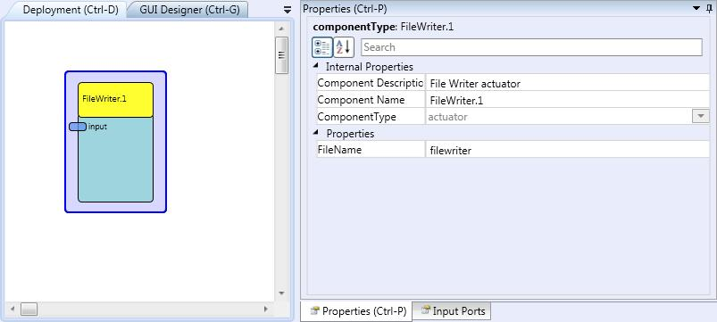

# {{$frontmatter.title}}

## Component Type: Actuator (Subcategory: File System)

This component writes the input values that are received in the input port to a text file, so these values can be analysed and processed off-line.

File Writer plugin

## Input Port Description

*   **input \[double\]:** Input port for the values to be written to the text file.

## Properties

*   **FileName \[string\]:** Defines the name for the file where the input values are written. A timestamp indicating year, month, day, hour, minute and second of when the file is created is appended to the file name in order to identify different recordings.