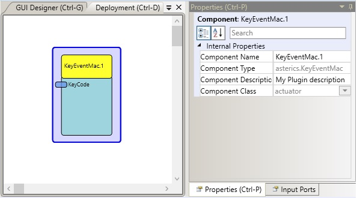

##

## GMailShortcuts

# GMailShortcuts

### Component Type: Actuator (Subcategory: Others)

The GMailShortcuts component was developed to operate the e-mail client of GMail via Keystroke combinations (Shortcuts).The component emulates local keyboard inputs that are sent to the window currently having the focus. Please ensure that the GMail tab in your webbrowser has the input focus.

  
GMailShortcuts plugin

## Requirements

Works best with the Opera internet browser (http://www.opera.com/de) and the Gmail client (https://www.google.com/intl/en/mail/help/about.html)

## Input Port Description

- **KeyCode \[string\]:** Input port for incoming strings which consists of alphanumeric characters. The keys are sequentially generated as local keystrokes as the string is received.

## Properties

- **keyCodeString \[string\]:**If the KeyCode Input recieves a Character between A-Z or 1-9 it generates the corresbonding Keystroke for A-Z or 1-9.

  To generate the required shortcuts for the Gmail client, the follwing strings are used:

  **NAVIGATION**

  - UP equals the Arrow up key
  - DOWN equals the Arrow down key
  - LEFT equals the Arrow left key
  - RIGHT equals the Arrow right key
  - ESC equals the Escape key
  - TAB equals the Tabulator key
  - ENTER equals the Enter key
  - BACKSPACE equals the Backspace key

  **SPECIAL SIGNS**

  - . equals the full stop key
  - @ equals the at sign key
  - : equals the colon key
  - ; equals the semicolon key
  - , equals the comma key
  - ! equals the exclemationmarl key
  - ? equals the questionmark key
  - \_ equals the underscore key

  **GMAIL KEYCOMBINATIONS**

  - SENDEN sends a written email if in a compose or replay window
  - CC if in a compose or reply window enters the CC area
  - NEW opens a email compose window
  - SEARCH sets the courser in the searchbar
  - INBOX swithces to the inbox window
  - REPLY enters the replay window when previously in an opened email
  - SELECT selects the email currentl marked blue
  - ENTER opens the currently marked email
  - SHIFT is the shift lock key (pressing once all chars a generated in capital letters pressing again undos the caption)
