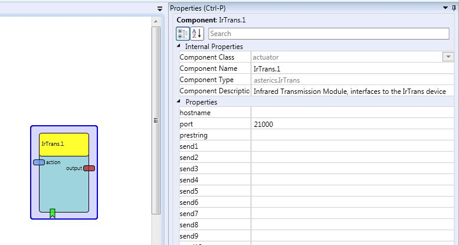

# IRTrans

## Component Type: Actuator (Subcategory: Home Control)

This component sends transmission commands to an infrared-transmitter. The different commands can be selected by the different events. The commands must be programmed into the IR-transmitter, before this component can be used. Furthermore, commands can also be sent to this component's input port ("action").

### IR command by action string

You can send an IR command by sending an _action string_ to the input port `action`. The string must start with `@IRTRANS:` and contain the remote control name and the command name. For example, if the IR-Transmitter is programmed with a database called `LG-TV` and the desired command is called `TvOn`, the action string to play the IR-code is:

`@IRTRANS: snd LG-TV,TvOn`.

### IR command by event

You can send an IR command using the event listener port of the plugin. Use the property `prestring` to set the name of the remote control device containing the IR commands you need. Then you can use the properties `send<1-n>` to set the name of the IR command.

### Example

- prestring: `snd LG-TV,`
- send1: `TvOn`

## Requirements

- [IRTrans module](http://www.irtrans.de) (USB, LAN or WiFi version).
- Install and start IRTrans SW (USB model only):
  - [IRTrans SW](http://www.irtrans.de/de/download/): Install the respective SW for your platform.
  - Start IRTrans Server
- Train the IRTrans database with IR commands, using the IRTrans Server SW or the Web-Interface of the Wifi-based IRTrans module.

## Input Port Description

- **action\[string\]:** A string, which will be sent to the IRTrans module, must start with "@IRTRANS".  
  For possible commands see [official IrTrans protocol guide](http://www.irtrans.de/download/Docs/IRTrans%20TCP%20ASCII%20Interface_EN.pdf).  
  **Note:** the action string sent to the input port must not contain the prefix "A" like described in the protocol guide. This is because of compatibility reasons with the old UDP protocol.

## Output Port Description

- **output\[string\]:** The IRTrans can also receive IR-Commands. With the IRTrans Configuration tool string commands can be defined for every received IR-Command. Received IR-commands are sent to this port, e.g. `\*\*00028 RCV\_COM test,on,0,0` (see protocol guide for format details)
- **outputResult\[string\]:** Receives the result of an action string that was previously sent to action-port.

## Event Listener Description

- **sendprop1:** sends the command, stored in the property send1 to the IRTrans (including the prestring).
- ...
- **sendprop24:** sends the command, stored in the property send24 to the IRTrans (including the prestring).

## Properties

- **hostname\[string\]:** The hostname/IP-address of the IRTrans. Use `localhost` if you have the IRTrans USB Version (IRTrans server tool must be running), or use the IP address of your IRTrans LAN or WiFi module.
- **port\[string\]:** The port of the IRTrans (default is 21000).
- **prestring\[string\]:** A string, being added before the strings of properties `send1` to `send24`. Typically `snd <remote name>,` should be used.
- **Send1\[string\]:** This string (including the prestring) will be sent, if the event EventProp1 will be triggered.
- ...
- **Send24\[string\]:** This string (including the prestring) will be sent, if the event EventProp24 will be triggered.

_Comment:_ This component is exactly tailored to the IRTrans module and needs expert knowledge to be configured.

## References

* [http://www.irtrans.de](http://www.irtrans.de)
* [http://www.irtrans.de/download/Docs/IRTrans%20TCP%20ASCII%20Interface_EN.pdf](http://www.irtrans.de/download/Docs/IRTrans%20TCP%20ASCII%20Interface_EN.pdf)
