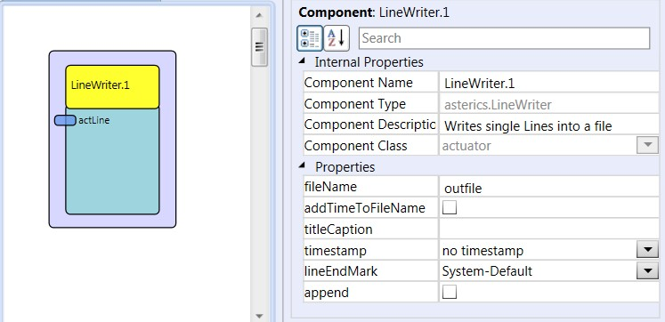

# LineWriter

Component Type: Actuator (Subcategory: File System)

This component writes lines from an input port to a text file.

ButtonGrid plugin

## Input port Description

*   **actLine (string):** an incoming string is stored into the text file.

## Properties

*   **fileName \[string\]:** The full path and file name of the text file to be written. The path can be given as absolute path or relative to the ARE executable's directory
*   **addTimeToFileName \[boolean\]:** If selected, a timestamp will be added to the filename, to avoid overwriting files
*   **titleCaption \[string\]:** if not empty, this string parameter will be used as first line in the file (e.g. to create table caption in a csv file)
*   **timestamp \[integer, combobox selection\]:** The type of timestamp which will be added befor each line (currently either "no timestamp" or "milliseconds" can be chosen).
*   **lineEndMark \[integer, combobox selection\]:** The type of line end marker which will be added to each line (currently either "systemDefault", "newline" or "carriage-return + newline" can be chosen).
*   **append \[boolean\]:** if selected, the lines will be appended to an existing file.