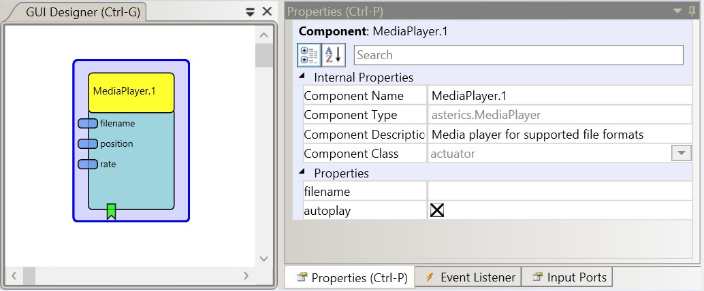

# MediaPlayer

Component Type: Actuator (Subcategory: File System)

This component allows to play media files supported by the local system. The supported file type depends on the installed media CODEC, but generally all media formats supported by the VLC player should work. Please note that the VLC player (32 bit version) should be installed in the default location: C:/Program Files/VideoLan or C:/Program Files (x86)/VideoLan

MediaPlayer plugin

## Input Port Description

- **filename \[string\]:** Input port for the mediafile name. The file must be present in the filesystem of the ARE. Sending to this port will change the media file.
- **position \[double\]:** Position in the media file (0-100%) - Sending to this port will set the position in the media file.
- **rate \[double\]:** The playback speed of the media file (0-500%) - Sending to this port will change the playback speed.

## Output Port Description

- **pos \[double\]:** The current playback position in percent.

## Event Listener Description

- **play:** Triggering this event will start (or resume) the mediafile playback.
- **pause:** Triggering this event will pause the mediafile playback.
- **stop:** Triggering this event will stop the mediafile playback.
- **reset:** Triggering this event will reset the mediafile playback to position 0.

## Properties

- **filename \[string\]:** Initial mediafile name. The file must be present in the filesystem the ARE. This is a dynamic property: a synchronized ARE can suggest available files which are located in the data/videos and data/music subfolders of the ARE.
- **autoplay \[boolean\]:** if selected, the file will play automatically.
- **displayGUI \[boolean\]:** if selected, the GUI of this component will be displayed - if not, the GUI will be hidden and disabled.
- **pathToVLC \[string\]:** path to the VLC installation (32-bit version needed).
