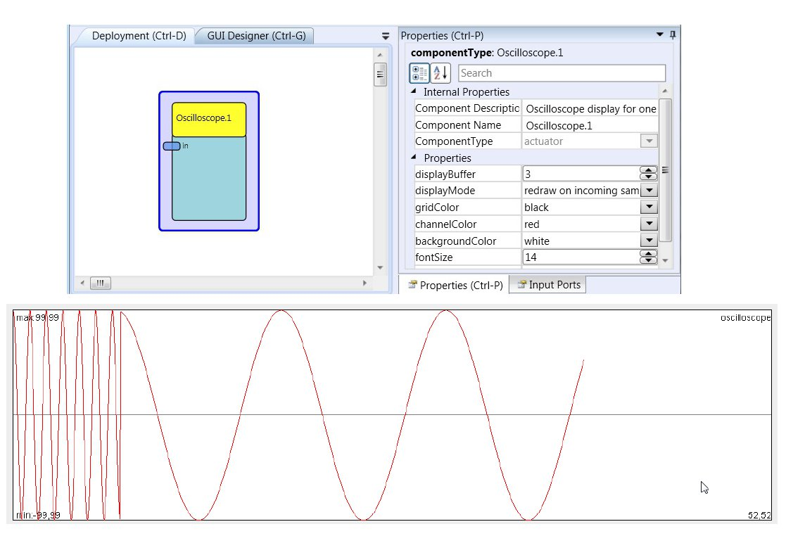

# Oscilloscope

Component Type: Actuator (Subcategory: Graphical User Interface)

The Oscilloscope provides graphical output of one or two signal values. It is a very basic implementation but useful to visualize sensor values, changes in values and value history. The trace colours and update speed can be configured via component parameters.

Oscilloscope plugin

## Input Port Description

*   **in \[double\]:** The input signal for the oscilloscope.

## Properties

*   **displayBuffer \[integer\]:** This property value specifies how often the oscilloscope window is drawn. For example if the display buffer size is 0, the oscilloscope traces are redrawn at every incoming value. If the display buffer size is set to 10, 10 values are stored in a buffer and drawn at once as the tenth value is received. This significantly reduces the computational resources spent for drawing the oscilloscope, which is useful especially at high update rates.
*   **drawingMode \[integer\]:** Declares whether the y axis is adapting to mininum and maximum values automatically or to stay in preset bounds.
*   **displayMode \[integer\]:** Affects the time when oscilloscope is redrawn. Can be set to the values "redraw on incoming samples" or "redraw periodically".
*   **drawInterval \[integer\]:** Redraw interval in milliseconds (if periodic drawing is used).
*   **min \[integer\]:** Preset minimum value for y axis of oscilloscope.
*   **max \[integer\]:** Preset maximum value for y axis of oscilloscope.
*   **gridColor \[integer\]:** The colour of the value-grid.
*   **channelColor \[integer\]:** The colour of the signal trace for the channel.
*   **backgroundColor \[integer\]:** The colour of the background of the oscilloscope window.
*   **fontSize \[integer\]:** The size of the oscilloscope's caption.
*   **caption \[string\]:** The caption to be displayed on the oscilloscope.
*   **displayGUI \[boolean\]:** If selected, the GUI of this component will be displayed - if not, the GUI will be hidden and disabled.