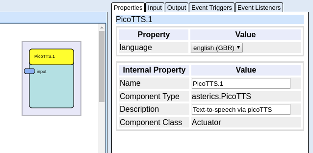

# PicoTTS (text-to-speech)

Component Type: Actuator (Subcategory: Audio and Voice)

The PicoTTS component creates speech output of given input text.

This component uses the picoTTS binary to create a temporary wavefile, which is played after creation.



picoTTS plugin

## Requirements

**Linux environment only!**  
Please install the pico2wave binary with following command (on Debian/Ubuntu based platforms):  

```bash
sudo apt install libttspico-utils
```

On Raspbian Buster (RPi4) the package is not available in the standard repository. You have to enable the non-free repository first, see explanation [here](https://bugs.launchpad.net/raspbian/+bug/1835974).

If this plugin is not working (no speech output), please ensure, that the _aplay_ command is available.

## Input Port Description

*   **input \[string\]:** The text sentence, which will be converted into speech.

## Properties

*   **language \[choice\]:** Defines the output language. Available by picoTTS: English (UK/US), German, Italian, Spanish, French