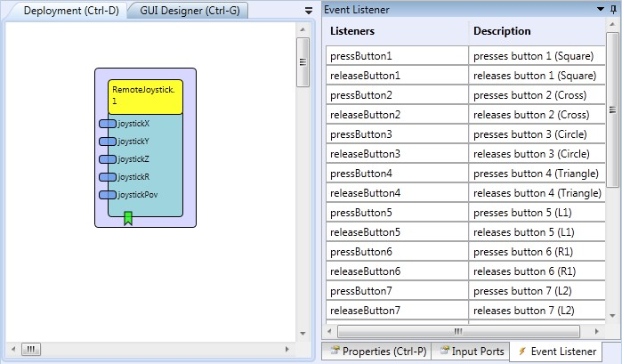

# Remote Joystick

Component Type: Actuator (Subcategory: Input Device Emulation)

The RemoteJoystick component interfaces the AsTeRICS Personal Platform to a second computer via the HID actuator CIM (USB dongle, plugged into the target computer). The HID actuator emulates a standard HID Joystick device on the target computer (no special driver software is needed). The Joystick controller is compatible to the Playstation3 SixAxis controller and can be used for PS3 game interfacing. The X/Y axis represent the left stick, the Z/R axis represent the right sick. The button numbers correspond to the PS3-controller buttons as labeled in the event port descriptions. The Joystick analog positions, the Point-Of-View angle and up to 13 Buttons can be emulated via desired input values and event triggers. Note that multiple instances of the Remote-components (RemoteJoystick, RemoteKeyboard and RemoteMouse) can be used concurrently with one HID actuator USB dongle, e.g. to provide different actions from up to three different input devices on the target computer.

RemoteJoystick plugin

## Requirements

The HID Actuator CIM (CIM ID 0x0101) has to be plugged into a free USB port of the target computer and the cable has to be connected to the AsTeRICS platform.

The HID Actuator plugs into the target computer and connects via Bluetooth wirelessly to the ARE

## Input Port Description

*   **joystickX \[integer\]:** The desired X-Position of the Joystick.
*   **joystickY \[integer\]:** The desired Y-Position of the Joystick.
*   **joystickZ \[integer\]:** The desired Z-Position of the Joystick.
*   **joystickR \[integer\]:** The desired R-Position of the Joystick.
*   **joystickPov \[integer\]:** The desired POV-angle of the Joystick.

## Event Listener Description

*   **pressButton1 - pressButton13:** An incoming event at this port causes the corresponding button of the Joystick to be pressed.
*   **releaseButton1 - releaseButton13:** An incoming event at this port causes the corresponding button of the Joystick to be released.

## Properties

*   **refreshInterval \[integer\]:** This property value sets a minimum time (in milliseconds) between two updates of the remote joystick device. If set to 0, no limit is given to the update rate - which should be okay unless very high update rates (>100 Hz) of the joystick angles are performed.
*   **uniqueId:** unique number of the CIM - if more than one CIMs of the same type are used. The module flashes a LED for identification when the ID is selected. **Supports value suggestions from ARE (dynamic property)**