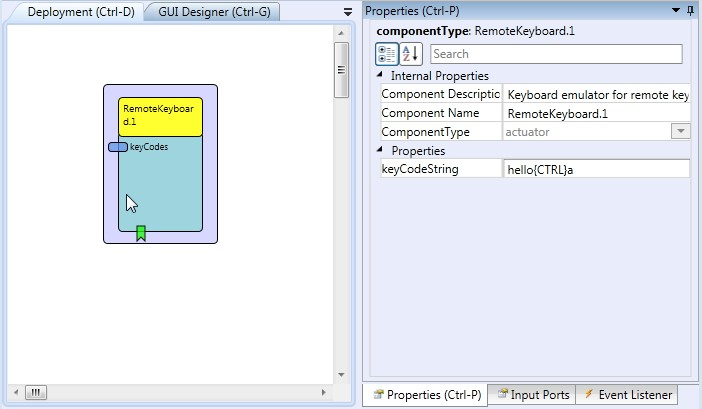
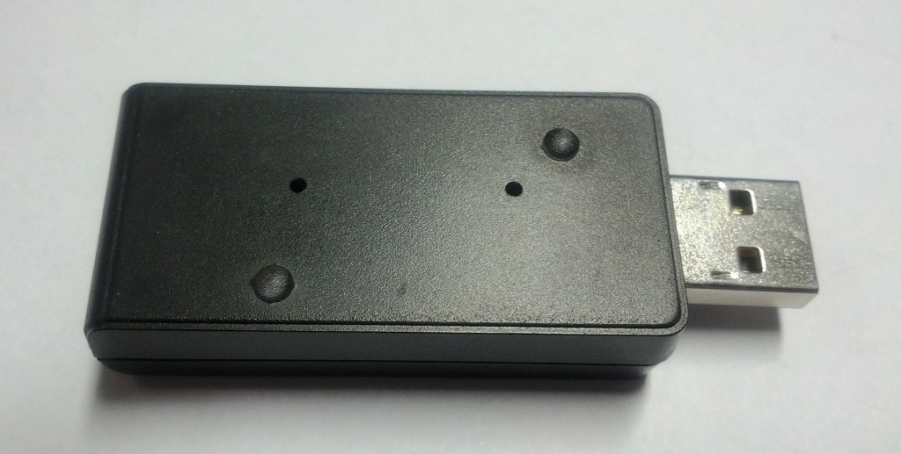

# {{$frontmatter.title}}

Component Type: Actuator (Subcategory: Input Device Emulation)

The RemoteKeyboard component interfaces the AsTeRICS Personal Platform to a second computer via the HID actuator CIM (USB dongle, plugged into the target computer). The HID actuator emulates a standard USB keyboard device on the target computer (no special driver software is needed). The component supports key press/release actions and sending key sequences and special keycodes. Note that multiple instances of the Remote-components (RemoteJoystick, RemoteKeyboard and RemoteMouse) can be used concurrently with one HID actuator USB dongle, e.g. to provide different actions for up to three different input devices on the target computer.

RemoteKeyboard plugin

## Requirements

The HID Actuator CIM (CIM ID 0x0101) has to be plugged into a free USB port of the target computer and the cable has to be connected to the AsTeRICS platform.

The HID Actuator plugs into the target computer and connects via Bluetooth wirelessly to the ARE

## Input Port Description

*   **keyCodes \[string\]:** An incoming string which consists of alphanumeric characters and special key codes. The keys are sequentially sent to the target computer via the HID actuator as the string is received and as the elp\_sendkey(s) events of the component are being triggered.

## Event Listener Description

*   **sendKeys:** An incoming event at this port sends the whole keycodes string to the target computer. The key will be released immediately after it has been pressed.
*   **pressKey:** An incoming event at this port sends the next keycode of the keycode string to the target computer. After the last character, the send position will be reset to the first character.
*   **holdKey:** An incoming event at this port holds the current key of the keycode string on the target computer (the key is pressed but not released). The holdKey function can be used together with the releaseKey function to create long key presses of single keys (e.g. of the cursor keys) to allow game control etc.
*   **releaseKey:** An incoming event at this port releases the current key of the keycode string on the target computer.

## Properties

*   **keyCodeString \[string\]:** A string containing keys and keycodes. Please note that this string will be replaced by an incoming string at the keycodes input port. The keycode-string can contain alphanumeric characters and special characters. Special characters are written in parentheses, for example {SHIFT}, {CTRL}, {ALT}, {BACKSPACE}, {ENTER} etc. Modifier keys like {SHIFT} or {ALT} are combined as they appear consecutively in the keystring, and are sent with the next a printable character. For example, the keystrings "{SHIFT}a" or "{CTRL}{ALT}{DEL}" are sent as single key-values to the target computer.
*   **uniqueId:** unique number of the CIM - if more than one CIMs of the same type are used. The module flashes a LED for identification when the ID is selected. **Supports value suggestions from ARE (dynamic property)**

## List of supported special key code identifiers:

*   {LEFTCTRL}
*   {LEFTSHIFT}
*   {ALT}, {LEFTALT}
*   {WIN}, {LEFTGUI}
*   {CTRL}, {RIGHTCTRL}
*   {SHIFT}, {RIGHTSHIFT}
*   {ALTGR}, {RIGHTALT}
*   {RIGHTGUI}
*   {F1}
*   {F2}
*   {F3}
*   {F4}
*   {F5}
*   {F6}
*   {F7}
*   {F8}
*   {F9}
*   {F10}
*   {F11}
*   {F12}
*   {RETURN}, {ENTER}
*   {ESCAPE}
*   {BACKSPACE}
*   {TAB}
*   {PRINT}, {PRINTSCREEN}
*   {PAUSE}
*   {INSERT}, {INS}
*   {HOME}, {POS1}
*   {END}
*   {DEL}, {DELETE}
*   {PAGEUP}
*   {PAGEDOWN}
*   {RIGHT}, {RIGHTARROW}
*   {LEFT}, {LEFTARROW}
*   {DOWN}, {DOWNARROW}
*   {UP}, {UPARROW}
*   {WAIT}