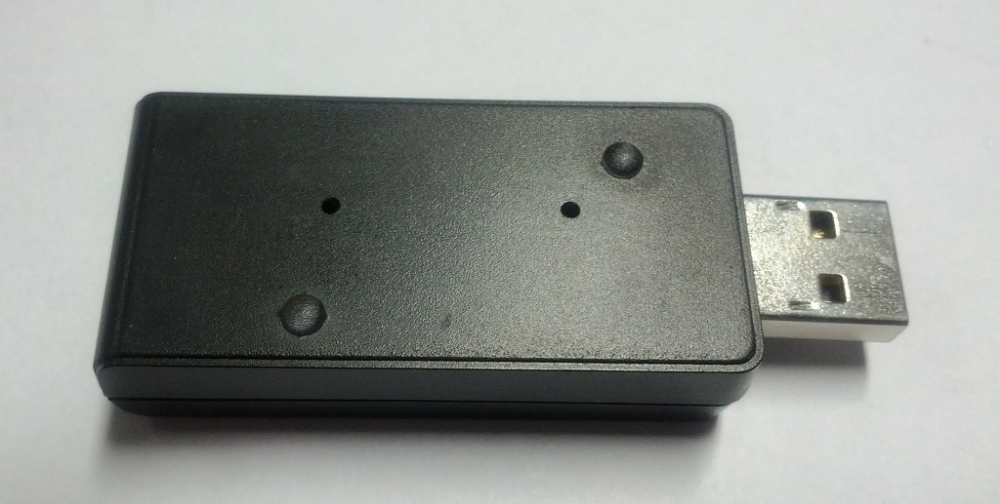

##

## RemoteTablet

# Remote Tablet

### Component Type: Actuator (Subcategory: Input Device Emulation)

The RemoteTablet component interfaces the AsTeRICS Personal Platform to a second computer via the HID actuator CIM (USB dongle, plugged into the target computer). This plugins performs similar like the RemoteMouse plugin, with the difference that the coorindates are set absolutely via the table devie, not relatively like a mouse device works. The HID actuator emulates a standard USB Tablet on the target computer (no special driver software is needed). The Tablet x-position, y-position, press/release actions of Tablet buttons and wheel movements can be controlled via desired input values and event triggers. Note that multiple instances of the Remote components (RemoteJoystick, RemoteKeyboard, RemoteMouse and RemoteTablet) can be used concurrently with one HID actuator USB dongle, e.g. to provide different key actions for up to four different input devices on the target computer.

  
RemoteTablet plugin

## Requirements

The HID Actuator CIM (CIM ID 0x0101) has to be plugged into a free USB port of the target computer and the cable has to be connected to the AsTeRICS platform.

  
the HID Actuator plugs into the target computer and connects via Bluetooth wirelessly to the ARE

## Input Port Description

- **mouseX \[integer\]:** The desired X-Position of the cursor. **This input port supports synchronization**
- **mouseY \[integer\]:** The desired Y-Position of the cursor. **This input port supports synchronization**
- **action \[string\]:** Input port for a command string. This command string allows to modify the action of the next left Tablet click �V it can be set to trigger other types of Tablet clicks. Following command strings are accepted:
  - _"@Mouse: nextclick, right":_ next left click event will create a right Mouse button click.
  - _"@Mouse: nextclick, double":_ next left click event will create a double click.
  - _"@Mouse: nextclick, middle":_ next left click event will create a middle button click.
  - _"@Mouse: nextclick, drag":_ next left click event will hold the left Mouse button.
  - _"@Mouse: nextclick, release":_ next left click event will release the left Mouse button.
  - _"@Mouse: action, enable":_ enables all Mouse actions.
  - _"@Mouse: action, disable":_ disables all Mouse actions.
  - _"@Mouse: action, toggle":_ enables / disables all Mouse actions.

## Event Listener Description

- **leftClick:** An incoming event at this port creates a Mouse button click. A left click will be generated, unless a valid "nextclick �" command has been received at the cmd input which changed the type of the click (see above).
- **middleClick:** A click with the middle Mouse button is generated.
- **rightClick:** A click with the right Mouse button is generated.
- **doubleClick:** A double click with the left Mouse button is generated.
- **dragPress:** The left Mouse button is pressed (but not released again).
- **dragRelease:** The left Mouse button is released.
- **wheelUp:** The Mouse wheel is turned one position from the user.
- **wheelDown:** The Mouse wheel is turned one position to the user.
- **nextClickRight** next left click event will create a right mouse button click.
- **nextClickDouble** next left click event will create a double click.
- **nextClickMiddle**next left click event will create a middle button click
- **nextClickDrag** next left click event will hold the left mouse button.
- **nextClickRelease** next left click event will release the left mouse button.

## Properties

- **absolutePosition \[boolean\]:** Currently not supported. All Mouse position input values are interpreted as relative changes of the position (X- and Y-movement).
- **uniqueId:** unique number of the CIM - if more than one CIMs of the same type are used. The module flashes a LED for identification when the ID is selected. **Supports value suggestions from ARE (dynamic property)**
