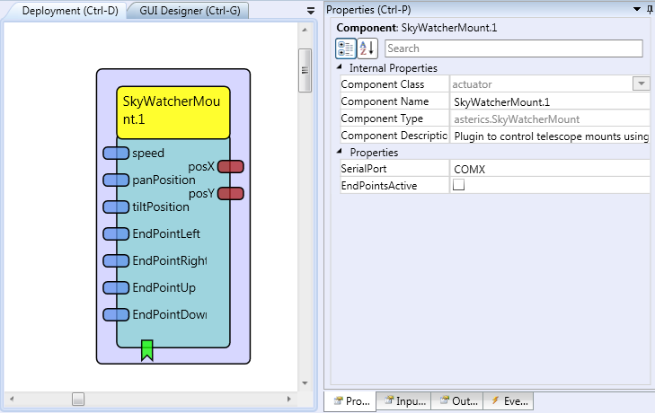

# SkyWatcherMount

Component Type: Actuator (Subcategory: Others)

The SkyWatcher plugin can be used to control telescope mounts using the Nexstar 5 protocol, e.g. Skywatcher AllView, Skywatcher Merlin via Synscan hand control.

SkyWatcherMount plugin

## Requirements

A Nexstar5 compatible telescope mount connected to the target computer via a serial connection

## Input Port Description

*   **speed \[integer\]:** defines the movement speed of the mount (range: 0-9)
*   **panPosition \[integer\]:** defines the target position in steps for the pan axis for the goto command
*   **tiltPosition \[integer\]:** defines the target position in steps for the tilt axis for the goto command
*   **endPointLeft \[integer\]:** defines the maximum position the pan axis can move to the left
*   **endPointRight \[integer\]:** defines the maximum position the pan axis can move to the right
*   **endPointUp \[integer\]:** defines the maximum position the tilt axis can move up
*   **endPointDown \[integer\]:** defines the maximum position the tilt axis can move down

## Output Port Description

*   **posX \[integer\]:** the actual position of the pan axis in steps
*   **posY \[integer\]:** the actual position of the tilt axis in steps

## Event Listener Description

*   **goLeft:** moves the mount endless to the left
*   **goRight:** moves the mount endless to the right
*   **goUp:** moves the mount endless upwards
*   **goDown:** moves the mount endless downwards
*   **stopPan:** stops the movement of the pan axis
*   **stopTilt:** stops the movement of the tilt axis
*   **stop:** stops the movement of the pan and tilt axis
*   **goToPanPosition:** move the pan axis to the step position specified by the panPosition input port
*   **goToTiltPosition:** move the tilt axis to the step position specified by the tiltPosition input port
*   **triggerOn:** if the mount has a shutter for a digital camera, the shutter is set to 1
*   **triggerOff:** if the mount has a shutter for a digital camera, the shutter is set to 0

## Properties

*   **SerialPort \[string\]:** The serial port of the mount, e.g. COM1
*   **EndPointsActive \[boolean\]:** defines if the movement boundaries set by the endpoints are active or not.