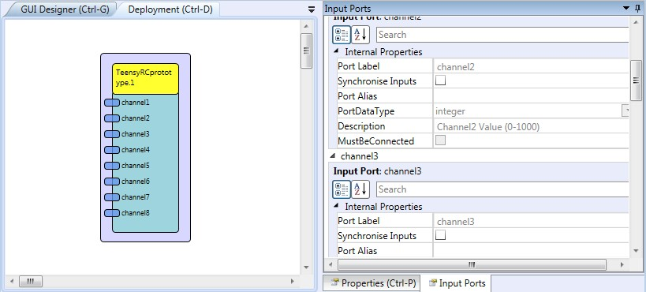

# TeensyRCprototype

Component Type: Actuator (Subcategory: Others)

The TeensyRCprototype component allows to use radio-controlled toys from within the AsTeRICS framework. As a prerequisite, the Teensy_RC_CIM.hex firmware (see /CIMS/Teensy_RC_CIM) must be installed on a teensy microcontroller (see [http://www.pjrc.com](http://www.pjrc.com)), and the teensy must be connected to a Walkera MTC-01 "MagicCube" or a similar remote control unit with PPM-signal input, which allows sending up to 8 channel values to a connected RC-receiver:

TeensyRC plugin

TeensyRC Remot control gear

## Application

The channel values which are sent into the plugin are transformed into so-called "PPM-signals" which are supported by several toy remote controls. For example to use a RC-model car, only 2 channels are needed. For more information about the firmware, the needed modules and their application, please refer to the Bachelor-thesis by Alexander Frimmel in the documentation section (/Documenation/DIYGuides/RC_ToyControl_Frimmel.pdf).

Remote control of a toy car

## Input Port Description

- **channel1 \[integer\]:** This input port accepts the level for channel1 of the RC remote control (values 0-1000 are allowed, center:500)
- **channel2 \[integer\]:** This input port accepts the level for channel2 of the RC remote control (values 0-1000 are allowed, center:500)
- **channel3 \[integer\]:** This input port accepts the level for channel3 of the RC remote control (values 0-1000 are allowed, center:500)
- **channel4 \[integer\]:** This input port accepts the level for channel4 of the RC remote control (values 0-1000 are allowed, center:500)
- **channel5 \[integer\]:** This input port accepts the level for channel5 of the RC remote control (values 0-1000 are allowed, center:500)
- **channel6 \[integer\]:** This input port accepts the level for channel6 of the RC remote control (values 0-1000 are allowed, center:500)
- **channel7 \[integer\]:** This input port accepts the level for channel7 of the RC remote control (values 0-1000 are allowed, center:500)
- **channel8 \[integer\]:** This input port accepts the level for channel8 of the RC remote control (values 0-1000 are allowed, center:500)

## Properties

Currently, this plugin does not have any properties.
