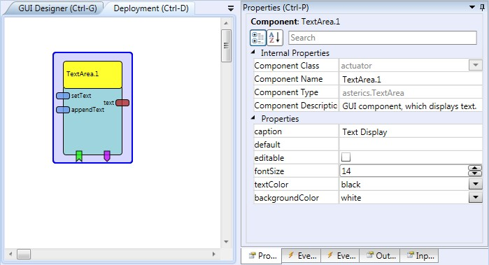

# TextArea

Component Type: Actuator (Subcategory: Graphical User Interface)

The TextArea is a GUI component which displays (optionally user-editable) text information. It features multiple rows and a scrollbar, and event for appending string text, deleting characters or sending the text content

TextArea plugin

## Input Port Description

*   **setText \[string\]:** The text which will be displayed. It replaces the prior content of the Text Area.
*   **appendText \[string\]:** This string input will be appended to te current content of the Text Area.

## Output Port Description

*   **text \[string\]:** The current content of the text area. Sent on incoming events at the "send" or "sendAndClear" event listener ports

## Event Listener Description

*   **delete:** Removes the last charater from the text area content.
*   **clear:** Clears the text area content.
*   **send:** Sends the text area content to te output port.
*   **sendAndClear:** Sends the text area content to te output port and clears the text area.

## Event Trigger Description

*   **clicked:** The event is trigger when the user click on the component.  
    

## Properties

*   **caption \[string\]:** Caption of the component.
*   **default \[string\]:** Default content of the text area.
*   **editable \[bolean\]:** Defines if the text area can be edited by the user.
*   **fontSize \[integer\]:** The font size in pixels.
*   **textColor \[integer\]:** Defines color of the text.
*   **backgroundColor \[integer\]:** Defines background color.
*   **displayGUI \[boolean\]:** If selected, the GUI of this component will be displayed - if not, the GUI will be hidden and disabled.